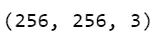
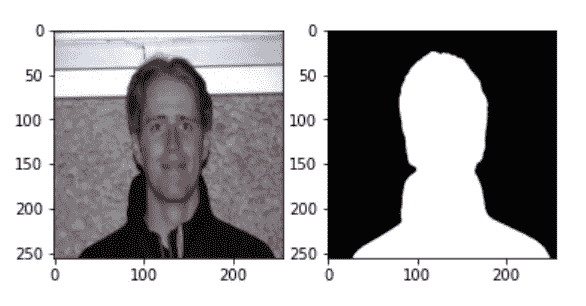
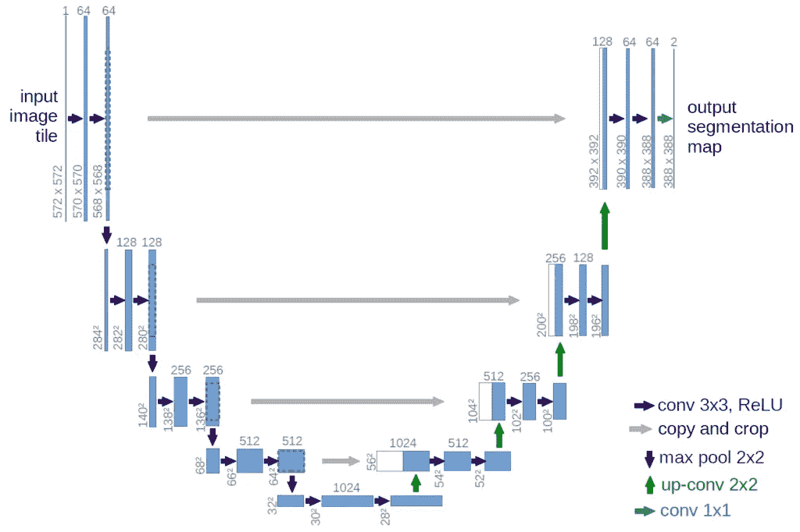
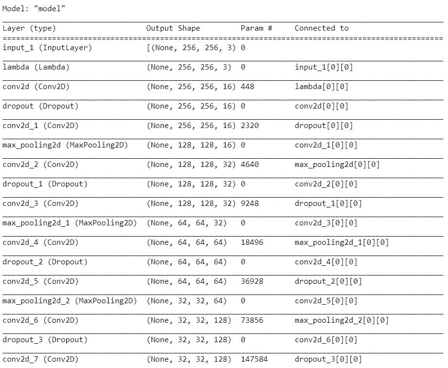
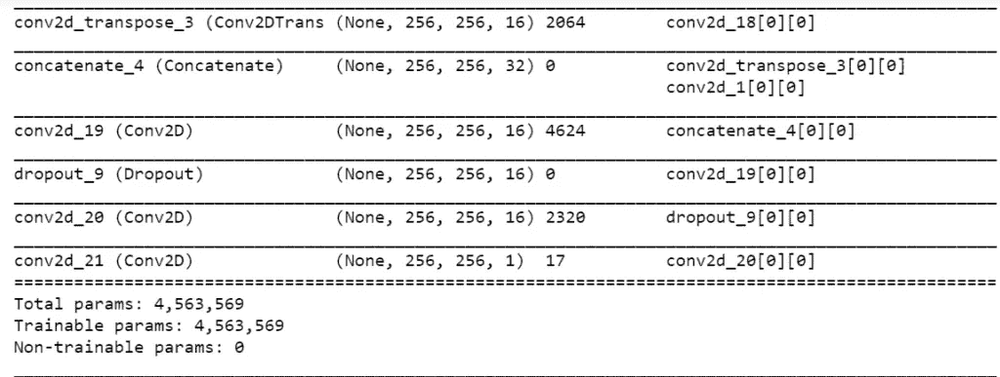
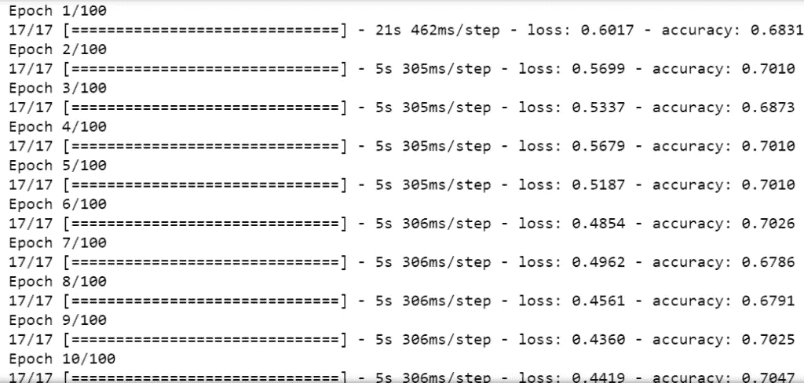
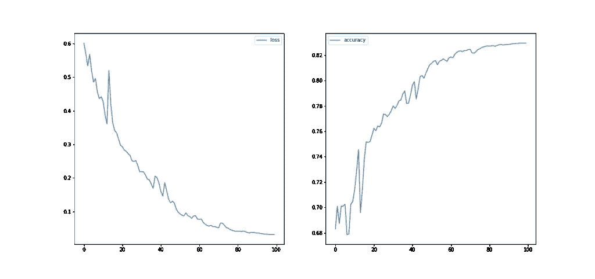
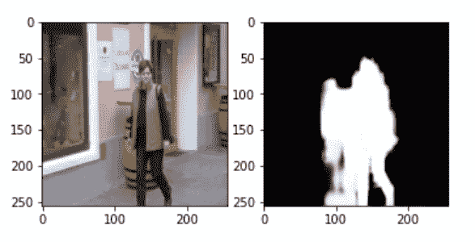

# 使用 U-Net 进行人体分割——带源代码——最简单的方法

> 原文：<https://medium.com/mlearning-ai/human-segmentation-using-u-net-with-source-code-easiest-way-f78be6e238f9?source=collection_archive---------0----------------------->

因此，在今天的博客中，我们将看到我们如何使用 [U-Net](https://arxiv.org/abs/1505.04597) 进行人体分割。 [U-Net](https://arxiv.org/abs/1505.04597) 是一个非常特殊的 CNN 架构，主要是为医疗领域的细分而专门设计的。它被称为 [U 形网](https://arxiv.org/abs/1505.04597)是因为它的特殊结构，形状像 U 形，所以没有进一步的名称。

**在这里阅读带源代码的整篇文章—**[https://machine learning projects . net/human-segmentation-using-u-net/](https://machinelearningprojects.net/human-segmentation-using-u-net/)

# 让我们开始吧…

## 步骤 1-导入所需的库。

```
import tensorflow as tf
import numpy as np
import os
from skimage.io import imread,imshow
from skimage.transform import resize
from skimage import color
from tensorflow.keras.models import load_model
import matplotlib.pyplot as plt
import cv2
from sklearn.model_selection import train_test_split
```

## 步骤 2-创建 X 和 y 数组。

```
IMG_HEIGHT = 256
IMG_WIDTH  = 256
CHANNELS = 3

training_images_names = os.listdir('data/Training_Images/')
training_masks_names = os.listdir('data/masks/')

X = np.zeros((len(training_images_names),IMG_HEIGHT,IMG_WIDTH,CHANNELS),dtype='uint8')
y = np.zeros((len(training_masks_names),IMG_HEIGHT,IMG_WIDTH,1))
```

*   这里我们只是创建用 0 初始化的 X 和 y 数组。
*   下一步，我们将填充这些数组。

## 步骤 3-填充 X 和 y 数组。

```
for i,n in enumerate(training_images_names):
    img = imread(f'data/Training_Images/{n}')
    img = resize(img,(IMG_HEIGHT,IMG_WIDTH,CHANNELS),mode='constant',preserve_range=True)
    fn = str(n.split('.')[0]) + '.png'
    mask = imread(f'data/masks/{fn}')
    mask = resize(mask,(IMG_HEIGHT,IMG_WIDTH,1),mode='constant')

    X[i] = img
    y[i] = mask

X[0].shape
```

*   在这一步，我们将填充 X 和 y 数组。
*   在 X 中，我们将填充 256*256 大小的图像。
*   在 y 中，我们将填充 256*256 个调整大小的遮罩。



## 步骤 4-随机绘制图像及其蒙版。

```
i = np.random.randint(0,len(X))
fig,(a1,a2)=plt.subplots(1,2)
a1.imshow(X[i])
a2.imshow(y[i].reshape(y[i].shape[:-1]),cmap='gray')
```

*   取一个随机索引并绘制其图像和掩码。



Human Segmentaion using UNet

## 步骤 5——建立 U-Net。

```
inputs = tf.keras.layers.Input((IMG_HEIGHT,IMG_WIDTH,CHANNELS))
s = tf.keras.layers.Lambda(lambda x:x/255)(inputs)

#contracting path
c1 = tf.keras.layers.Conv2D(16,(3,3),activation='relu',kernel_initializer='he_normal',padding='same')(s)
c1 = tf.keras.layers.Dropout(0.1)(c1)
c1 = tf.keras.layers.Conv2D(16,(3,3),activation='relu',kernel_initializer='he_normal',padding='same')(c1)
p1 = tf.keras.layers.MaxPooling2D((2,2))(c1)

c2 = tf.keras.layers.Conv2D(32,(3,3),activation='relu',kernel_initializer='he_normal',padding='same')(p1)
c2 = tf.keras.layers.Dropout(0.1)(c2)
c2 = tf.keras.layers.Conv2D(32,(3,3),activation='relu',kernel_initializer='he_normal',padding='same')(c2)
p2 = tf.keras.layers.MaxPooling2D((2,2))(c2)

c3 = tf.keras.layers.Conv2D(64,(3,3),activation='relu',kernel_initializer='he_normal',padding='same')(p2)
c3 = tf.keras.layers.Dropout(0.2)(c3)
c3 = tf.keras.layers.Conv2D(64,(3,3),activation='relu',kernel_initializer='he_normal',padding='same')(c3)
p3 = tf.keras.layers.MaxPooling2D((2,2))(c3)

c4 = tf.keras.layers.Conv2D(128,(3,3),activation='relu',kernel_initializer='he_normal',padding='same')(p3)
c4 = tf.keras.layers.Dropout(0.2)(c4)
c4 = tf.keras.layers.Conv2D(128,(3,3),activation='relu',kernel_initializer='he_normal',padding='same')(c4)
p4 = tf.keras.layers.MaxPooling2D((2,2))(c4)

c5 = tf.keras.layers.Conv2D(256,(3,3),activation='relu',kernel_initializer='he_normal',padding='same')(p4)
c5 = tf.keras.layers.Dropout(0.3)(c5)
c5_1 = tf.keras.layers.Conv2D(256,(3,3),activation='relu',kernel_initializer='he_normal',padding='same')(c5)
c5_1 = tf.keras.layers.Dropout(0.3)(c5_1)
c5_2 = tf.keras.layers.Conv2D(256,(3,3),activation='relu',kernel_initializer='he_normal',padding='same')(c5_1)
c5_3 = tf.keras.layers.Conv2D(256,(3,3),activation='relu',kernel_initializer='he_normal',padding='same',dilation_rate=2)(c5_2)
c5_4 = tf.keras.layers.Conv2D(512,(3,3),activation='relu',kernel_initializer='he_normal',padding='same',dilation_rate=2)(c5_3 )
c5_5 = tf.keras.layers.concatenate([c5_1,c5_4])

#expanding path
u4 = tf.keras.layers.Conv2DTranspose(128,(2,2),strides=(2,2),padding='same')(c5_5)
u4 = tf.keras.layers.concatenate([u4,c4])
u4 = tf.keras.layers.Conv2D(128,(3,3),activation='relu',kernel_initializer='he_normal',padding='same')(u4)
u4 = tf.keras.layers.Dropout(0.2)(u4)
u4 = tf.keras.layers.Conv2D(128,(3,3),activation='relu',kernel_initializer='he_normal',padding='same')(u4)

u3 = tf.keras.layers.Conv2DTranspose(64,(2,2),strides=(2,2),padding='same')(u4)
u3 = tf.keras.layers.concatenate([u3,c3])
u3 = tf.keras.layers.Conv2D(64,(3,3),activation='relu',kernel_initializer='he_normal',padding='same')(u3)
u3 = tf.keras.layers.Dropout(0.2)(u3)
u3 = tf.keras.layers.Conv2D(64,(3,3),activation='relu',kernel_initializer='he_normal',padding='same')(u3)

u2 = tf.keras.layers.Conv2DTranspose(32,(2,2),strides=(2,2),padding='same')(u3)
u2 = tf.keras.layers.concatenate([u2,c2])
u2 = tf.keras.layers.Conv2D(32,(3,3),activation='relu',kernel_initializer='he_normal',padding='same')(u2)
u2 = tf.keras.layers.Dropout(0.2)(u2)
u2 = tf.keras.layers.Conv2D(32,(3,3),activation='relu',kernel_initializer='he_normal',padding='same')(u2)

u1 = tf.keras.layers.Conv2DTranspose(16,(2,2),strides=(2,2),padding='same')(u2)
u1 = tf.keras.layers.concatenate([u1,c1])
u1 = tf.keras.layers.Conv2D(16,(3,3),activation='relu',kernel_initializer='he_normal',padding='same')(u1)
u1 = tf.keras.layers.Dropout(0.2)(u1)
u1 = tf.keras.layers.Conv2D(16,(3,3),activation='relu',kernel_initializer='he_normal',padding='same')(u1)

output = tf.keras.layers.Conv2D(1,(1,1),activation='sigmoid')(u1)

model = tf.keras.Model(inputs=[inputs],outputs=[output])
model.compile(optimizer='adam',loss='binary_crossentropy',metrics=['accuracy'])
model.summary()
```

*   在这里，我们只是简单地建立了 U-Net 结构。



U net



U net model

## 步骤 6-训练测试分割数据。

```
X_train, X_test, y_train, y_test = train_test_split(X,  y, test_size=0.1, random_state=42)
```

## 步骤 7-训练和保存模型。

```
results = model.fit(X_train,y_train,batch_size=16,epochs=100)
model.save('models/human_segmentation_non-aug_100_v2.h5')
```



UNet Training

## 第 8 步—绘制损耗和精度曲线。

```
fig,(a1,a2) = plt.subplots(1,2,figsize=(17,8))
a1.plot(np.arange(0,100),results.history['loss'],label = 'loss')
a2.plot(np.arange(0,100),results.history['accuracy'],label='accuracy')
a1.legend()
a2.legend()
plt.savefig('losses_and_accuracies_100_v2.png')
```



plot curves

## 步骤 9——可视化输出。

```
k=np.random.randint(0,len(X_test))
fig,(a1,a2) = plt.subplots(1,2)

a1.imshow(X_test[k])

(h,w,c) = X_test[k].shape
i = X_test[k].reshape((1,h,w,c))

pred = model.predict(i)

a2.imshow(pred.reshape(pred.shape[1:-1]),cmap='gray')
```

*   在这里，我们检查我们的模型的性能。
*   而且看它表现的很好(明显不是很好:)。



如果对牛奶产量预测有任何疑问，请通过电子邮件或 LinkedIn 联系我。你也可以在下面评论任何问题。

***探索更多机器学习、深度学习、计算机视觉、NLP、Flask 项目访问我的博客—*** [***机器学习项目***](https://machinelearningprojects.net/)

**如需进一步的代码解释和源代码，请访问此处**—[https://machine learning projects . net/human-segmentation-using-u-net/](https://machinelearningprojects.net/human-segmentation-using-u-net/)

*所以这就是我写给这个博客的所有内容，感谢你阅读它，我希望你在阅读完这篇文章后会有所收获，直到下一次……*

***阅读我以前的帖子:*** [***利用 LSTM***](https://machinelearningprojects.net/milk-production-prediction-for-next-year/) 对明年产奶量进行预测

[](/mlearning-ai/mlearning-ai-submission-suggestions-b51e2b130bfb) [## Mlearning.ai 提交建议

### 如何成为 Mlearning.ai 上的作家

medium.com](/mlearning-ai/mlearning-ai-submission-suggestions-b51e2b130bfb)