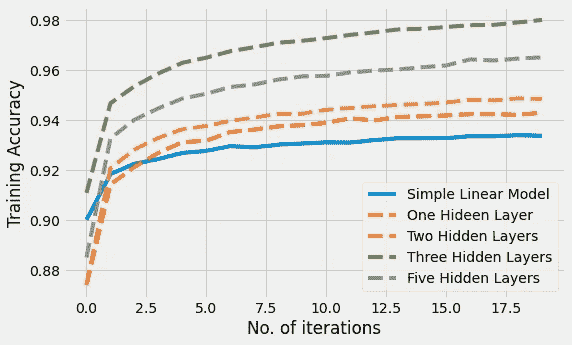
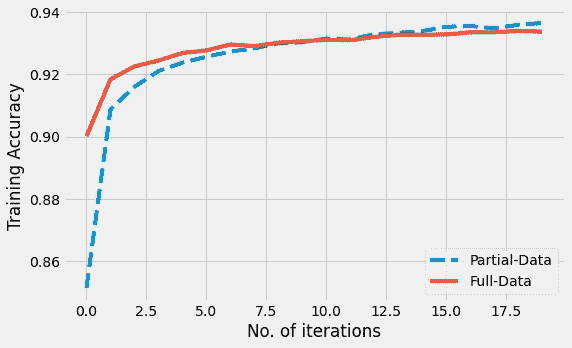
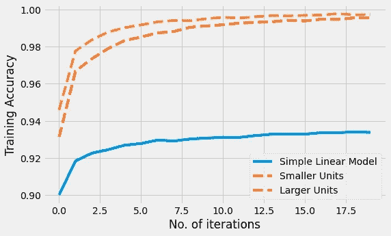
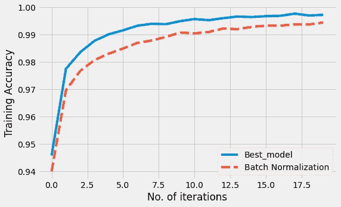
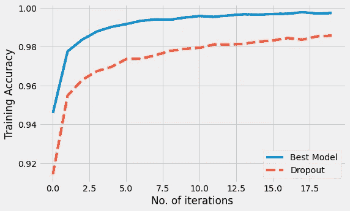

# 超参数调整:修复神经网络中的高偏差(欠拟合)

> 原文：<https://medium.com/mlearning-ai/hyperparameter-tuning-fixing-high-bias-underfitting-in-neural-networks-5184ead3cbed?source=collection_archive---------2----------------------->

> 减少神经网络中高偏差(欠拟合)问题的快速方法。



Hyper-Parameter Tuning

# 介绍

在这篇博客中，我们将通过一些方法和技术来解决神经网络中的高偏差(欠拟合)问题。高偏差是神经网络训练过程中面临的一个常见问题。当训练集和测试集的精度都不够高时，就会出现高偏差的问题。该问题通常象征着被训练的模型没有学习到输入-输出映射，并且也不能在交叉验证或测试集上正确地概括。

我们将在本博客中逐步检查各种因素对训练准确性的影响。

# 导入和预处理

我们将从导入 **TensorFlow、NumPy 和 Matplotlib** 库开始，并初始化一些超参数，如历元数、学习率和优化器

```
**import** **tensorflow** **as** **tf** 
**import** **numpy** **as** **np**
**import** **matplotlib.pyplot** **as** **plt**

tf.random.set_seed(1)
EPOCHS = 20
LR = 0.001
OPT = tf.keras.optimizers.Adam(LR)
plt.style.use('fivethirtyeight')
plt.rcParams["figure.figsize"] = (8,5)
```

我们将使用著名的 **Mnist** 数据集进行演示。Mnist 数据集包含 **60，000 张**图片，采用 **80:20** 训练测试分割。所有的图像都是灰度的，并且具有形状 **(28，28)** 。

```
(x_train , y_train) , (x_test , y_test ) = tf.keras.datasets.mnist.load_data()x_train = x_train /255 
x_test = x_test/255
```

我们可以通过 TensorFlow 库直接访问这个数据集。数据已经被分成训练和测试子集。下一步，我们将正常化我们的图像。

# **模型设计**

我们将首先建立一个简单的神经网络，没有隐藏层，只有一个输入层和一个输出层。

```
model = tf.keras.Sequential(
[tf.keras.layers.Flatten(input_shape = x_train.shape[1:]),
tf.keras.layers.Dense(10,activation = "softmax")])model.compile(optimizer=OPT,
              loss = "sparse_categorical_crossentropy",
              metrics = ["accuracy"])
```

我们将使用稀疏分类交叉熵作为损失来编译这个模型，并将度量设置为准确性。

# **增加**数据**的效果**

我们将训练上面定义的模型两次，但是使用不同的数据分布。为了证明数据对高偏差的影响，我们将定义一个新的训练数据子集，其中仅包含总训练数据的 60% 。

```
(x_train_partial , y_train_partial) =   (x_train[:30000], y_train[:30000])
```

与原始数据集中的 **50，000** 图像相比，新的(x_train_partial，y_train_partial)数据集具有 **30，000** 图像。在训练完这两个数据集后，我们现在可以绘制一个训练精度与历元数的关系图，以检查增加数据的效果。



Effect of Data

从上图可以清楚地看出，增加数据无助于解决高偏差问题。

# 增加隐藏层的效果

现在，我们将增加网络中隐藏层的数量，并验证其对模型训练准确性的影响。我们将训练四个不同的模型，其中几个隐藏层分别设置为 **1、2、3 和 5** 层**层**。所有 4 种模型的架构如下:

```
one_layer_model = tf.keras.Sequential([
tf.keras.layers.Flatten(input_shape = x_train.shape[1:]),
tf.keras.layers.Dense(10 , activation = "relu"),
tf.keras.layers.Dense(10,activation = "softmax")])two_layers_model = tf.keras.Sequential([
tf.keras.layers.Flatten(input_shape = x_train.shape[1:]),
tf.keras.layers.Dense(10 , activation = "relu"),
tf.keras.layers.Dense(20 , activation = "relu"),
tf.keras.layers.Dense(10,activation = "softmax")])three_layers_model = tf.keras.Sequential([
tf.keras.layers.Flatten(input_shape = x_train.shape[1:]),
tf.keras.layers.Dense(20 , activation = "relu"),
tf.keras.layers.Dense(40 , activation = "relu"),
tf.keras.layers.Dense(20 , activation = "relu"),
tf.keras.layers.Dense(10,activation = "softmax")])five_layers_model = tf.keras.Sequential([
tf.keras.layers.Flatten(input_shape = x_train.shape[1:]),                              tf.keras.layers.Dense(10 , activation = "relu"),                              tf.keras.layers.Dense(20 , activation = "relu"),                              tf.keras.layers.Dense(40 , activation = "relu"),                              tf.keras.layers.Dense(20 , activation = "relu"),                             tf.keras.layers.Dense(10,activation = "softmax")])
```

在对上述所有模型的 20 个时期的完整数据集进行训练后，我们得到了下面的准确性比较图:


Effect of hidden layers

可以清楚地看到，随着我们在训练过程中进一步深入，增加隐藏层的数量直接增加了准确性。对于 mnist 数据集，选择 3 个隐藏层似乎会产生最佳结果。

我们现在将使用这个 3 个隐藏层的神经网络作为我们的参考，并检查在这个体系结构的不同层中增加节点的效果。

# 隐藏层中单元(节点)数量的影响

我们现在将增加先前训练的 3 层网络的不同层中的节点数量。通常的做法是按降序设置不同层中的单元数量。在这次演示中，我们将训练两种不同的模型。第一种型号的单位数量较少，而第二种型号的单位数量较多。

```
small_units_model = tf.keras.Sequential([
tf.keras.layers.Flatten(input_shape = x_train.shape[1:]),
tf.keras.layers.Dense(80,activation = "relu"),
tf.keras.layers.Dense(40,activation = "relu"),
tf.keras.layers.Dense(20,activation = "relu"),
tf.keras.layers.Dense(10,activation = "softmax")]) large_units_model = tf.keras.Sequential([
tf.keras.layers.Flatten(input_shape = x_train.shape[1:]),                              tf.keras.layers.Dense(512,activation = "relu"),                              tf.keras.layers.Dense(128,activation = "relu"),                              tf.keras.layers.Dense(64,activation = "relu"),                             tf.keras.layers.Dense(10,activation = "softmax")])
```

我们将第二个模型中的单位设置为 2 的**次方。这被认为是在我们的神经网络中设置单元数量的最佳默认选择。**

在对上述两个模型的 20 个时期的完整数据集进行训练后，我们得到了下图以进行精确度比较:



Effect of units

单元的数量显然对训练精度有很大的影响。随着每层中单元数量的增加，精确度也会增加。在上面的例子中，随着层数的增加以及每层单元数的增加，精度从 **93%** 增加到超过 **99%** 。

# 批量标准化的效果

接下来，我们将检查添加批量归一化图层对修复高偏差的影响。我们将用之前的最佳模型作为验证批量归一化效果的参考。

```
bn_model = tf.keras.Sequential([
tf.keras.layers.Flatten(input_shape = x_train.shape[1:]),
tf.keras.layers.Dense(512,activation = "relu"),
tf.keras.layers.BatchNormalization(),
tf.keras.layers.Dense(128,activation = "relu"),
tf.keras.layers.BatchNormalization(),
tf.keras.layers.Dense(64,activation = "relu"),
tf.keras.layers.Dense(10,activation = "softmax")])
```

我们在隐藏层之间添加了一对 **BatchNormalization** 层。我们现在将训练这个模型，并将其准确性与我们以前的最佳模型进行比较。



Effect of Batch Normalization

显而易见，增加批量标准化肯定无助于提高训练精度，从而降低高偏差。批次规范化对减少高方差和解决过拟合问题有作用。

# **辍学的影响**

最后，我们将检查漏失层对解决高偏置问题的影响。我们将增加**两个漏失层**到我们之前的最佳模型。

```
dropout_model = tf.keras.Sequential([
tf.keras.layers.Flatten(input_shape = x_train.shape[1:]),
tf.keras.layers.Dense(512,activation = "relu"),
tf.keras.layers.Dropout(0.3),
tf.keras.layers.Dense(128,activation = "relu"),
tf.keras.layers.Dropout(0.2),
tf.keras.layers.Dense(64,activation = "relu"),
tf.keras.layers.Dense(10,activation = "softmax")])
```

我们在隐藏层之间添加了两个丢弃概率分别为 **0.3** 和 **0.2** 的丢弃层。我们现在将训练这个模型，并将其准确性与我们以前的最佳模型进行比较。



很明显，在我们的隐藏层之间添加漏失层无助于提高训练精度。

# 结论

在用不同的超参数对多个模型训练相同的数据后，我们可以得出结论，以下变化可以帮助我们解决高偏差问题:

*   **增加隐藏层数。**
*   **增加隐藏单位的数量。**
*   **为更多的时代而训练。**
*   **尝试更多神经网络。**

此外，以下变化对高偏差没有太大影响:

*   **增加训练数据量。**
*   **添加批量归一化**
*   **添加辍学者**

虽然神经网络中的上述更新不会对修复欠拟合问题产生巨大影响，但它们肯定有助于减少高方差(或过拟合)。

我希望你们都喜欢这个快速的小博客！！！下周我将讨论解决高方差问题的各种超参数调优方法。

本博客中所有模型和图表的代码可以在这里获得——[https://github.com/sanskar-hasija/Hyperparameter-Tuning](https://github.com/sanskar-hasija/Hyperparameter-Tuning)