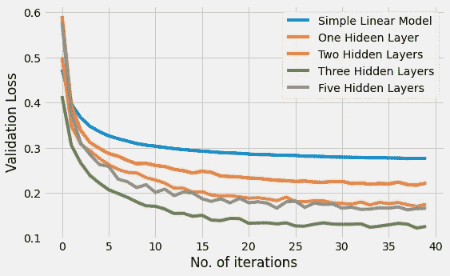
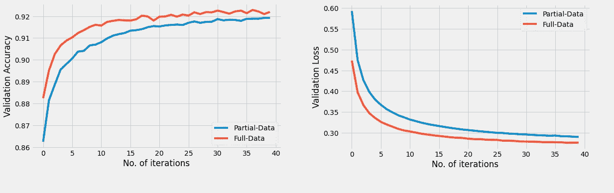
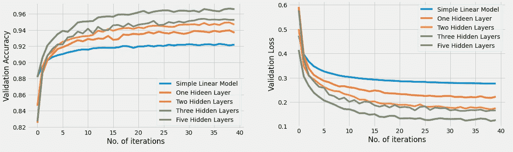
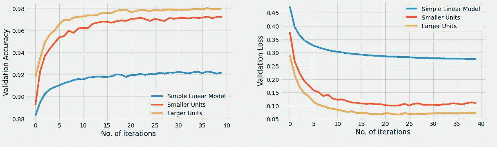
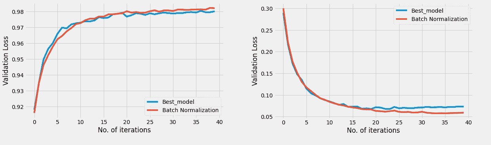
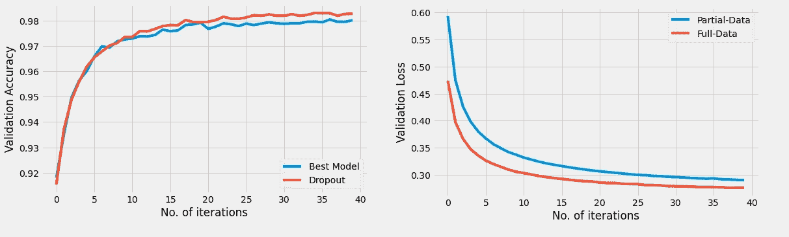

# 超参数调整:修复神经网络中的过拟合

> 原文：<https://medium.com/mlearning-ai/hyperparameter-tuning-fixing-overfitting-in-neural-networks-b983b21d60bd?source=collection_archive---------0----------------------->

> *减少神经网络中高方差(过拟合)问题的快速方法。*



Hyper-Parameter Tuning

# 介绍

> 在我上一篇[博客](/mlearning-ai/hyperparameter-tuning-fixing-high-bias-underfitting-in-neural-networks-5184ead3cbed)中，我讨论了各种参数对偏差的影响，以及我们如何解决高偏差(欠拟合问题)。

在这篇博客中，我们将通过一些方法和技术来解决神经网络中的高方差(过拟合)问题。高方差是神经网络训练过程中面临的常见问题。当模型过拟合训练数据但在验证数据上表现不佳时，会出现高方差的问题。该问题通常象征着被训练的模型已经很好地学习了输入-输出映射，但是不能在交叉验证或测试集上正确地概括。

我们将在这篇博客中一步一步地检查各种因素对验证准确性和验证损失的影响。

# 导入和预处理

我们将从导入 **TensorFlow、NumPy 和 Matplotlib** 库开始，并初始化一些超级参数，如历元数、学习率和优化器

```
import tensorflow as tf 
import numpy as np
import matplotlib.pyplot as plttf.random.set_seed(1)
EPOCHS = 40
LR = 0.0001
OPT = tf.keras.optimizers.SGD(LR , 0.99)
plt.style.use('fivethirtyeight')
plt.rcParams["figure.figsize"] = (8,5)
```

我们将使用著名的 **Mnist** 数据集进行演示。Mnist 数据集包含 **60，000 张**图像，具有 **80:20** 训练测试分割。所有的图像都是灰度的，并且具有形状 **(28，28)** 。

```
(x_train , y_train) , (x_test , y_test ) = tf.keras.datasets.mnist.load_data()x_train = x_train /255 
x_test = x_test/255
```

我们可以通过 TensorFlow 库直接访问这个数据集。数据已经被分成训练和测试子集。下一步，我们将正常化我们的图像。

# 模型设计

我们将首先建立一个简单的神经网络，没有隐藏层，只有一个输入层和一个输出层。

```
model = tf.keras.Sequential(
[tf.keras.layers.Flatten(input_shape = x_train.shape[1:]),
tf.keras.layers.Dense(10,activation = "softmax")])model.compile(optimizer=OPT,
              loss = "sparse_categorical_crossentropy",
              metrics = ["accuracy"])
```

我们将使用稀疏分类交叉熵作为损失来编译这个模型，并将度量设置为准确性。

# 数据增长的影响

我们将训练上面定义的模型两次，但是使用不同的数据分布。为了证明数据对高方差的影响，我们将定义一个新的训练数据子集，其中仅包含总训练数据的 60%**。**

```
(x_train_partial , y_train_partial) =   (x_train[:30000], y_train[:30000])
```

与原始数据集中的 **50，000 张**图像相比，新的(x_train_partial，y_train_partial)数据集具有 **30，000 张**图像。训练完这些数据集后，我们现在将绘制两个图来检查增加数据的影响。验证准确度与时期数的关系图和验证准确度与时期数的关系图。



Effect of Data

从上图中可以清楚地看到，增加数据有助于解决高方差问题。

# 增加隐藏层的效果

现在，我们将增加网络中隐藏层的数量，并验证其对模型训练准确性的影响。我们将训练四个不同的模型，其中几个隐藏层分别设置为 **1、2、3 和 5** **层**。所有 4 种模型的架构如下:

```
one_layer_model = tf.keras.Sequential([
tf.keras.layers.Flatten(input_shape = x_train.shape[1:]),
tf.keras.layers.Dense(10 , activation = "relu"),
tf.keras.layers.Dense(10,activation = "softmax")])two_layers_model = tf.keras.Sequential([
tf.keras.layers.Flatten(input_shape = x_train.shape[1:]),
tf.keras.layers.Dense(10 , activation = "relu"),
tf.keras.layers.Dense(20 , activation = "relu"),
tf.keras.layers.Dense(10,activation = "softmax")])three_layers_model = tf.keras.Sequential([
tf.keras.layers.Flatten(input_shape = x_train.shape[1:]),
tf.keras.layers.Dense(20 , activation = "relu"),
tf.keras.layers.Dense(40 , activation = "relu"),
tf.keras.layers.Dense(20 , activation = "relu"),
tf.keras.layers.Dense(10,activation = "softmax")])five_layers_model = tf.keras.Sequential([
tf.keras.layers.Flatten(input_shape = x_train.shape[1:]),                              tf.keras.layers.Dense(10 , activation = "relu"),                              tf.keras.layers.Dense(20 , activation = "relu"),                              tf.keras.layers.Dense(40 , activation = "relu"),                              tf.keras.layers.Dense(20 , activation = "relu"),                             tf.keras.layers.Dense(10,activation = "softmax")])
```

在对上述所有模型的 20 个时期的完整数据集进行训练后，我们得到了下面的验证准确性和验证损失比较图:



Effect of hidden layers

显而易见，增加隐藏层的数量可以提高验证的准确性，减少验证的损失。随着我们在培训过程中的深入。对于 mnist 数据集，选择 3 个隐藏层似乎会产生最佳结果。

我们现在将使用这个 3 个隐藏层的神经网络作为我们的参考，并检查在这个体系结构的不同层中增加节点的效果。

# 隐藏层中单元(节点)数量的影响

我们现在将增加先前训练的 3 层网络的不同层中的节点数量。通常的做法是按降序设置不同层中的单元数量。在这次演示中，我们将训练两种不同的模型。第一种型号的单位数量较少，而第二种型号的单位数量较多。

```
small_units_model = tf.keras.Sequential([
tf.keras.layers.Flatten(input_shape = x_train.shape[1:]),
tf.keras.layers.Dense(80,activation = "relu"),
tf.keras.layers.Dense(40,activation = "relu"),
tf.keras.layers.Dense(20,activation = "relu"),
tf.keras.layers.Dense(10,activation = "softmax")])large_units_model = tf.keras.Sequential([
tf.keras.layers.Flatten(input_shape = x_train.shape[1:]),                              tf.keras.layers.Dense(512,activation = "relu"),                              tf.keras.layers.Dense(128,activation = "relu"),                              tf.keras.layers.Dense(64,activation = "relu"),                             tf.keras.layers.Dense(10,activation = "softmax")])
```

我们将第二个模型中的单位设置为 2 的次方**。这被认为是在我们的神经网络中设置单元数量的最佳默认选择。**

在对上述两个模型的 20 个时期的完整数据集进行训练后，我们得到了下面的验证准确性和验证损失比较图:



Effect of units

很明显，单位数量对验证准确性和验证损失都有很大的影响。在上面的例子中，随着层数和每层单元数的增加，验证精度从 **92%** 增加到超过 **98%** 。

# 批量标准化的效果

接下来，我们将检查添加批量规范化图层对修复高方差的影响。我们将用之前的最佳模型作为验证批量归一化效果的参考。

```
bn_model = tf.keras.Sequential([
tf.keras.layers.Flatten(input_shape = x_train.shape[1:]),
tf.keras.layers.Dense(512,activation = "relu"),
tf.keras.layers.BatchNormalization(),
tf.keras.layers.Dense(128,activation = "relu"),
tf.keras.layers.BatchNormalization(),
tf.keras.layers.Dense(64,activation = "relu"),
tf.keras.layers.Dense(10,activation = "softmax")])
```

我们在隐藏层之间添加了一对 **BatchNormalization** 层。我们现在将训练该模型，并将其验证准确性和验证损失与我们以前的最佳模型进行比较。



Effect of Batch Normalization

显而易见，与没有批次归一化的模型相比，添加批次归一化无疑有助于提高验证准确度，并保持验证损失不变。

# 辍学的影响

最后，我们将检查辍学层在解决高方差问题的影响。我们将在之前的最佳模型中添加**两个下降层**。

```
dropout_model = tf.keras.Sequential([
tf.keras.layers.Flatten(input_shape = x_train.shape[1:]),
tf.keras.layers.Dense(512,activation = "relu"),
tf.keras.layers.Dropout(0.3),
tf.keras.layers.Dense(128,activation = "relu"),
tf.keras.layers.Dropout(0.2),
tf.keras.layers.Dense(64,activation = "relu"),
tf.keras.layers.Dense(10,activation = "softmax")])
```

我们在隐藏层之间添加了两个丢弃概率分别为 **0.3** 和 **0.2** 的丢弃层。我们现在将训练该模型，并将其验证准确性和验证损失与我们以前的最佳模型进行比较。



Effect of Dropout

可以清楚地看到，在我们的隐藏层之间添加丢弃层确实有助于提高验证准确性，并且与具有丢弃的普通网络相比，更平滑和更快速地减少验证损失。

# 结论

在使用不同的超参数对多个模型训练相同的数据后，我们可以得出结论，以下更改可以帮助我们解决高方差问题:

*   **增加训练数据量。**
*   **增加隐藏层数。**
*   **增加隐藏单元的数量。**
*   **添加批量归一化。**
*   **添加辍学者。**
*   **为更高数量的纪元进行训练。**
*   **尝试更多的神经网络。**

我希望你们都喜欢这个快速的小博客！！！

这个博客中所有模型和图表的代码都可以在这里获得—

[https://github.com/sanskar-hasija/Hyperparameter-Tuning](https://github.com/sanskar-hasija/Hyperparameter-Tuning)