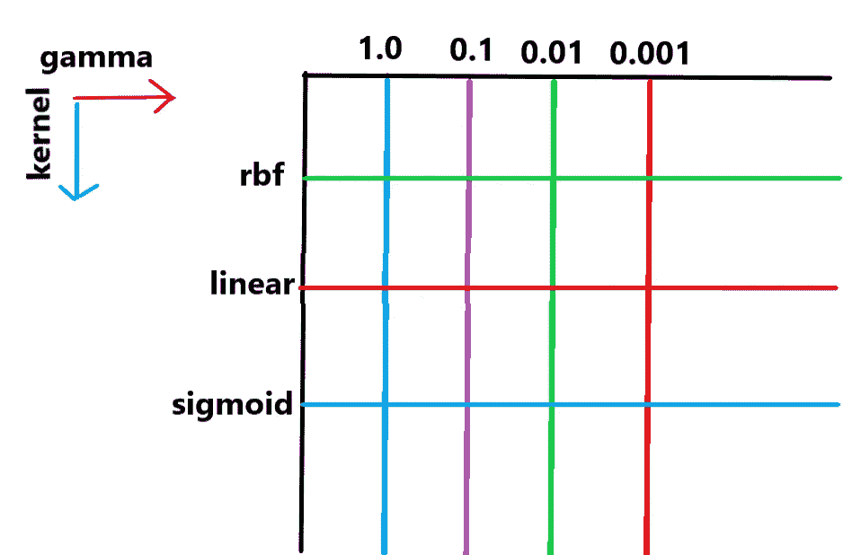

# 超参数调谐指南

> 原文：<https://medium.com/mlearning-ai/hyperparameter-tuning-guide-e8edd3e201f7?source=collection_archive---------5----------------------->

## 介绍

在机器学习中超参数优化或超参数调整是每个人都应该考虑的最重要的部分之一。它会严重影响您的模型。在这篇文章中，我们将讨论三个重要的问题。他们是..

A.什么是超参数？

B.什么是超参数调整(优化)？

C.如何优化 hyper 参数？

好了，让我们开始吧..

## **A .首先什么是超参数？**

超参数是模型本身无法估计的参数，您需要手动指定它们。对于一组特定的数据，这些参数会以多种方式影响您的模型。为了使模型表现最佳，您必须选择最佳的超参数集。例如决策树中的最大深度和深度神经网络中的学习率。这些超参数对您的模型是欠拟合还是过拟合有直接影响。偏差方差权衡严重依赖于超参数调谐。所以我们的目标是得到最优的超参数。请记住，对于不同的数据集，我们的最佳超参数会发生变化。

模型中还有其他名为模型参数的参数。但好消息是我们不必手动优化它们。模型本身可以做到这一点。模型从数据中估计这些参数。例如神经网络中的权重。优化算法，如梯度下降，亚当等。用于这类参数。

## **B .什么是超参数优化或超参数调整？**

在大多数 ML 模型中，你会有多个超参数。选择最佳组合需要理解模型参数和您试图解决的业务问题。所以在做任何事情之前，你必须知道模型的超参数和它们的重要性。

为了获得最佳超参数，遵循两步程序。

1.对于超参数的每个组合，评估模型

2.给出最佳性能模型的组合被选为最佳超参数。

因此，**简而言之，选择产生最佳模型的最佳超参数集被称为超参数调整。**

## **C .如何优化超参数？**

有两种方法可以找到最佳的超参数设置。

A.手动搜索

B.自动搜索

让我们更仔细地看看这些方法

**A .手动搜索。**

你可能猜对了。是的，手动意味着手动。也就是说，您可以试验超参数集的每种组合，并选择最佳组合。这很难，需要实验跟踪器。如果你正在研究调优，那么这很好，因为它可以让你控制这个过程。但是请记住，这对于超参数搜索来说并不是实用的方法。大量的试验非常昂贵和耗时。所以别管它了，我们不会谈这个的。

**B .自动搜索**

这就像

1.您可以指定一组超参数及其值的限制。词典被用来做这项工作。

2.自动算法可以帮助你。它运行您自己在手动搜索中会做的试验或实验，并返回给出最佳模型的最佳超参数集。

一切都结束了。

超参数参数优化方法有很多。但是在本文中，ae 将使用两种最流行的优化方法

1.网格搜索

2.随机搜索

让我们一个一个来..

**1。网格搜索**

让我们我们有两个超参数'*伽马'*'和'*内核*'。他们的价值观是

伽马':[1，0.1，0.01，0.001]

内核':['rbf '，'线性'，' sigmoid']

现在这个算法把这两个论点在一个 2D 平面上做成一个网格，就像这样

我们可以看到这里形成的网格。现在，该算法所做的是，对于每一个相交点，它运行具有超参数组合的模型。像在第一次迭代中超参数集将是['rbf '，1.0]然后在下一次迭代['rbf '，0.1]等等。

运行完所有的网格点后，它会选择性能最好的模型并返回。记住网格搜索 CV 这个名字，CV 代表交叉验证。对于每一次迭代，它执行交叉验证技术，以获得具有该迭代的超参数设置的最佳模型。我们已经发表了一篇关于交叉验证的文章。因此，请查看[这篇文章](/mlearning-ai/cross-validation-must-read-49b1b4c1154b)，以便更好地理解交叉验证。

现在用 python 实现网格搜索 CV 非常简单。简而言之，你为所有你想考虑的超参数创建了一个 python 字典。使用 Scikit Learn library 使用方法 GridSearchCV()并放入模型实例、参数网格(您刚刚构建的字典)、评估度量、交叉验证的数量。在本文中，我们不打算研究网格搜索 CV 的 python 实现。现在有许多这样文章。我把其中一些链接到这里。它们非常有助于理解这个过程。

[这个](https://www.mygreatlearning.com/blog/gridsearchcv/)，[这个](https://analyticsindiamag.com/guide-to-hyperparameters-tuning-using-gridsearchcv-and-randomizedsearchcv/#:~:text=The%20only%20difference%20between%20both,that%20increase%20the%20model%20generalizability.)，[这个](https://www.analyticsvidhya.com/blog/2021/06/tune-hyperparameters-with-gridsearchcv/)

**2。随机搜索简历**

顾名思义，我们随机选取超参数组合。这意味着与网格搜索不同，网格搜索使用了所有可能的超参数组合，我们从每个超参数的统计分布中采样值。为每个超参数定义一个抽样分布，进行随机搜索。

这样你可以控制尝试超参数组合的次数。这意味着当你们四个超级参数，每个都有 4 个不同的值可以从网格搜索中选择时，CV 将训练模型 4 ✖ 4 ✖ 4 ✖ 4 = 256 次。在某些情况下，我们可能也没有那么多的计算资源。在随机搜索中，我们可以通过 Sklearn 库方法 RandomizedSearchCV()方法中的 n_iter 参数来指定迭代次数。假设你选择 n_iter = 100。虽然你有 264 种可能组合，但这种算法只能进行 100 种随机选择的组合。所有指定的组合完成后，将返回最佳组合。你得到了最好的模型。关于随机搜索 CV 的 python 实现，请参考本页[。](https://www.section.io/engineering-education/random-search-hyperparameters/)

**注:**

当我们有少量数据和少量超参数时，网格搜索是超参数调整的首选。因为它测试每一种可能的组合并保证准确性。但是当你有大量数据时，这似乎是不可行的。用更大的维数和更多的超参数组合来搜索和训练模型。这会花很多时间。使用的计算机资源也是一个问题。

随机化搜索让您可以控制要计算的迭代次数。尽管可能不如前一种方法准确，但随着超参数值和数据量的增加，随机搜索无疑是一种更好的方法。

说到这里，我们将结束这篇文章。请纠正我们错误的地方，或者我们可以更具体的地方，或者类似的事情。评论区是让你有发言权的。

如果你喜欢这个帖子，请在[媒体](/@shubhendu-ghosh)上关注我

或者这些替代品

[Twitter](https://twitter.com/shubhendubro) ， [Github](https://github.com/shubhendu-ghosh-DS) ， [LinkedIN](https://www.linkedin.com/in/shubhendu-ghosh-423092205/)

谢谢大家

**参考:**

[https://Neptune . ai/blog/hyperparameter-tuning-in-python-complete-guide](https://neptune.ai/blog/hyperparameter-tuning-in-python-complete-guide)

 [## 随机搜索和网格搜索的超参数优化-机器学习掌握

### 机器学习模型具有超参数，您必须设置这些超参数，以便根据您的数据集定制模型。经常…

machinelearningmastery.com](https://machinelearningmastery.com/hyperparameter-optimization-with-random-search-and-grid-search/)  [## 超参数调整|使用超参数调整评估 ML 模型

### 学习过程开始了。机器学习算法的关键是超参数调整。K-NN 正规化中的 K…

www.analyticsvidhya.com](https://www.analyticsvidhya.com/blog/2021/04/evaluating-machine-learning-models-hyperparameter-tuning/)  [## 机器学习:GridSearchCV & RandomizedSearchCV

### 使用 GridSearchCV 和 RandomizedSearchCV 进行超参数调整

towardsdatascience.com](https://towardsdatascience.com/machine-learning-gridsearchcv-randomizedsearchcv-d36b89231b10)  [## Mlearning.ai 提交建议

### 如何成为 Mlearning.ai 上的作家

medium.com](/mlearning-ai/mlearning-ai-submission-suggestions-b51e2b130bfb)