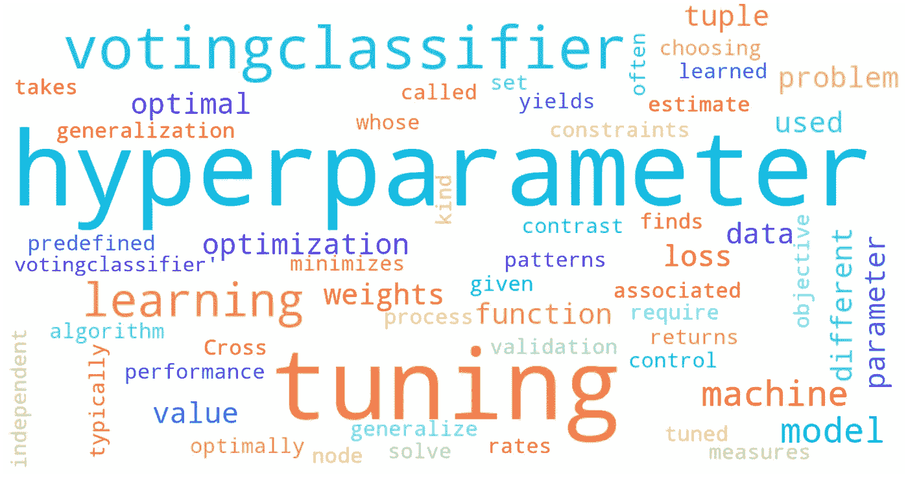

# Python 中加权平均系综的超参数调整

> 原文：<https://medium.com/mlearning-ai/hyperparameter-tuning-the-weighted-average-ensemble-in-python-cff2100f0832?source=collection_archive---------0----------------------->

# 介绍

在之前的博客“ ***简单加权平均集成|机器学习*** ”中，我谈到了如何从多个分类器中实现加权平均集成，以捕捉数据的不同信息，从而提高模型性能。在这篇博客中，我将进一步演示如何在 python 中对系综进行超参数调优。

# 数据和模型

数据，你可以在这里找到:【https://www.kaggle.com/c/homesite-quote-conversion/data 

实现集成的代码，你可以在这里找到:[https://medium . com/analytics-vid hya/simple-weighted-average-ensemble-machine-learning-777824852426](/analytics-vidhya/simple-weighted-average-ensemble-machine-learning-777824852426)

我们将使用 sklearn 库中的***voting classifier***来进行超参数调优。你可以在这里找到一切:[https://sci kit-learn . org/stable/modules/generated/sk learn . ensemble . voting classifier . html](https://scikit-learn.org/stable/modules/generated/sklearn.ensemble.VotingClassifier.html)

# 密码

## 第一步

首先，让我们从 sklearn 加载 VotingClassifier，然后我们用预训练的分类器拟合模型:决策树、K-最近邻、多层感知器、随机森林和 XGBoost。我们忽略参数“权重”来获得基本分数。

Step 1

*平均基础交叉验证得分为* 0.9048 (+- 0.0487)

## 第二步

让我们使用 GridSearchCV 来寻找最佳参数和最佳分数。根据 sklearn 文档:如果投票设置为“硬”，将使用多数投票规则。如果我们将投票设置为“软”，将使用预测概率之和的 argmax，并且建议将该方法用于良好校准的分类器的集成。

Step 2

*最佳参数为:{'voting': 'soft '，' weights': (1，1，1，2，2)}*

*平均调优交叉验证分数为* 0.9188 (+- 0.0341)

# 结论

这篇博客讨论了如何在 python 中优化你的系综。VotingCLassifier 为您的系综简化了超参数调整过程。平均调整的交叉验证显示了更高的平均分数和更小的标准偏差，这意味着集成表现得更好和更稳定。在 sklearn 中还有另一个类似的方法用于线性回归建模，它被称为“VotingRegressor”。详细内容可以在这里找到[。](https://scikit-learn.org/stable/modules/generated/sklearn.ensemble.VotingRegressor.html)

***请随时与我联系***[***LinkedIn***](https://www.linkedin.com/in/jinhangjiang/)***。***

# 相关阅读

[简单加权平均集成|机器学习](/analytics-vidhya/simple-weighted-average-ensemble-machine-learning-777824852426)

 [## Mlearning.ai 提交建议

### 如何成为 Mlearning.ai 上的作家

medium.com](/mlearning-ai/mlearning-ai-submission-suggestions-b51e2b130bfb)