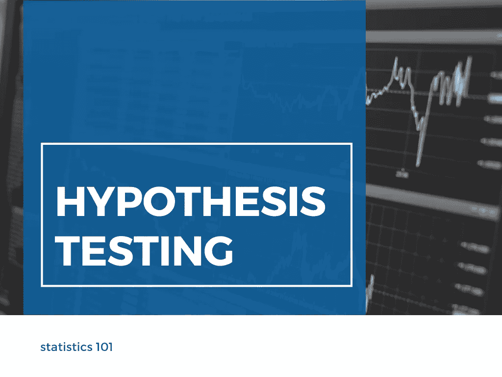
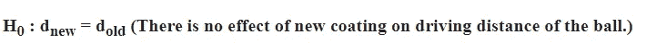
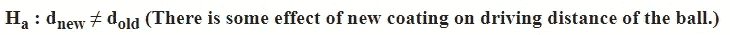
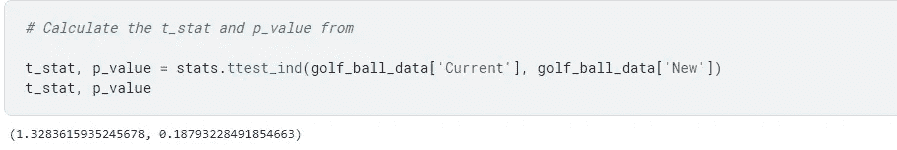

# 假设检验

> 原文：<https://medium.com/mlearning-ai/hypothesis-testing-2b9a99780795?source=collection_archive---------4----------------------->

在统计学中，**假设检验**是一种利用数据得出关于总体的某些结论的推断形式。首先，我们对总体做一个假设，称为零假设。它由 **H₀.表示**然后我们定义另一个假设，它与原假设相反，用 **Hₐ** 表示。在定义了原假设和替代假设之后，我们进行所谓的假设检验来接受或拒绝原假设。如果从数据或任何事件中获得的样本的发生概率小于预先定义的概率，即**显著性水平(用α表示)**，那么我们拒绝零假设，即样本或事件不是偶然发生的，而是具有统计显著性。

让我们用一个真实世界的例子来理解这一点，让我们以一场法庭之战为例，被告被带到法官面前接受审判。这里，最初的假设是被告是无辜的(因为法律书籍规定被告在被证明有罪之前是无辜的)。所以，这里我们的无效假设变成了被告是无辜的。接下来，我们定义另一个假设是…，是的！你猜对了。被告有罪或无罪。接下来，律师开始收集证据证明被告有罪。如果法官发现不利于被告的证据是重要的，那么被告被宣布有罪，或者用其他统计学术语来说，我们可以说无效假设被拒绝。

假设检验有三种主要类型:

1.  均值比较
2.  比例比较
3.  独立性测试。

在本文中，我将尝试首先从理论上介绍均值的**比较，然后在[高尔夫球数据集](https://www.kaggle.com/ipravin/golf-ball-testing-data-set-from-par-inc)上实现相同的比较。但是首先，让我们记下假设检验和统计推断的步骤。**

1.  陈述无效假设。
2.  陈述另一个假设。
3.  定义重要性级别。
4.  计算检验统计量和相应的 p 值。
5.  从试验中得出结论。

下面，我将借助一个真实的用例来解释所有这些步骤。你可以在这里找到数据集。

所以，这里的**问题陈述**是，

> Par Inc .是一家主要的高尔夫设备制造商。管理层认为，Par 的市场份额可能会随着耐切割、更耐用的高尔夫球的推出而增加。因此，Par 的研究小组一直在研究一种新的高尔夫球涂层，旨在抵抗切割并提供更耐用的球。对这种涂层的测试很有希望。一名研究人员对新涂层对驾驶距离的影响表示担忧。Par 希望新的耐切割球能够提供与当前型号高尔夫球相当的驾驶距离。为了比较这两种球的驱动距离，对新型号和当前型号的 40 个球进行了距离测试。用机械打击机进行测试，因此两个模型的平均距离之间的任何差异都可以归因于设计上的差异。 [*来源*](https://www.kaggle.com/ipravin/golf-ball-testing-data-set-from-par-inc)
> 
> *根据上面给出的信息和* ***数据集*** *我们必须回答以下问题:*
> 
> *1。阐述并展示一个* ***假设检验*** *的基本原理，标准杆
> 可以用它来比较当前和新的
> 高尔夫球*的击球距离
> 
> *2。分析数据提供* ***假设检验结论。*** *什么是* ***p 值*** *供你测试？你的* ***推荐*** *为 Par
> Inc？*

第一步包括陈述零假设。在上面的用例中，零假设是“新涂层对球的击球距离没有影响。”

第二步是陈述另一个假设。上述用例中的另一个假设是“新涂层对球的击球距离有一些影响。”

第三步是定义重要性值。显著性水平，也称为α或α，是对样本中必须存在的证据强度的一种衡量，在此基础上，您将拒绝零假设，并得出结论认为该效应具有统计学显著性。计算方法为**1-置信度** **系数**(置信度为置信度除以 100)。因此，如果我们认为**置信水平为 95%** ，那么显著性值将为 **0.05** 。

第四步是计算检验统计量和相应的 p 值。检验统计量是使用统计检验计算的值，我们可以通过它获得 p 值，p 值是获得至少与统计假设检验的观察结果一样极端的结果的概率，假设零假设是正确的。有关 p 值的更多信息，请参考第[页](https://www.investopedia.com/terms/p/p-value.asp)。以下代码片段演示了 python 中 t-test 的实现。

要深入了解 t 检验，请参考下面的[文章](https://towardsdatascience.com/the-statistical-analysis-t-test-explained-for-beginners-and-experts-fd0e358bbb62)。

第五步是从检验统计量和 p 值中进行推断。**测试得到的 p 值为 0.1879，大于 0.05。因此，我们不能拒绝零假设。**

关于完整的分析和代码，请参考我的关于高尔夫球数据集的 [Kaggle 笔记本](https://www.kaggle.com/chitwanmanchanda/statistics-is-all-you-need-4)。

# 参考

1.  [https://statisticsbyjim.com/glossary/significance-level/](https://statisticsbyjim.com/glossary/significance-level/)
2.  [https://www.statisticshowto.com/confidence-level/](https://www.statisticshowto.com/confidence-level/)
3.  [https://towards data science . com/the-statistical-analysis-t-test-explained-for-初学者和专家-fd0e358bbb62](https://towardsdatascience.com/the-statistical-analysis-t-test-explained-for-beginners-and-experts-fd0e358bbb62)
4.  [https://www.investopedia.com/terms/p/p-value.asp](https://www.investopedia.com/terms/p/p-value.asp)

 [## Mlearning.ai 提交建议

### 如何成为 Mlearning.ai 上的作家

medium.com](/mlearning-ai/mlearning-ai-submission-suggestions-b51e2b130bfb)