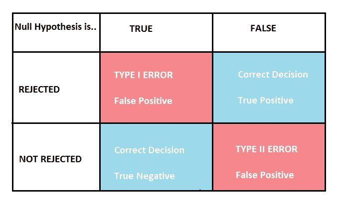

# 假设检验

> 原文：<https://medium.com/mlearning-ai/hypothesis-testing-977e30025b10?source=collection_archive---------9----------------------->

数据科学是一个不断发展的领域，近年来越来越受欢迎。数据科学的一个重要组成部分是假设检验的使用，假设检验可用于从数据中得出结论并做出明智的决策。

## 什么是假设检验？

假设检验是数据科学中评估总体参数假设有效性的常用方法。它用于确定数据是否支持假设，或者是否有足够的证据来拒绝假设。

## 假设检验的重要参数

**1:零假设(H0):** 零假设，用 H0 表示，表示被研究变量之间没有关系的陈述。
默认情况下，零假设永远是真的。
例如，一家公司每天生产 50 件。

**2:替代假设(H1):** 替代假设，H1 表示，是与原假设相反的陈述。
例如，一家公司每天不会生产 50 件产品。

**3:显著性水平:**显著性水平是用于接受或拒绝零假设的概率极限或阈值。显著性水平通常选择为 5%。

**4: P 值:**P 值是零假设为真时，获得观测结果的概率。如果 p 值小于显著性水平，我们拒绝零假设。

## 制定假设并计算检验统计量

为了进行假设检验，我们首先制定一个零假设和一个替代假设。在此之后，我们从总体中收集数据样本，并使用它来计算检验统计量。

## 解释结果

基于计算出的检验统计量，我们然后计算 p 值。如果 p 值小于显著性水平(通常为 5%)，我们拒绝零假设，否则我们无法拒绝零假设或接受零假设。

## 假设检验中的错误

**1:第一类错误:**当我们拒绝零假设，但它实际上是真的时，就发生了第一类错误。

**2:第二类错误:**第二类错误发生在我们接受原假设但它是假的时候。这也被称为假阴性。

Type I and Type II Error

## 假设检验的类型

假设检验有许多不同的类型，包括 t 检验、卡方检验和 f 检验，每一种都用于检验不同类型的假设。例如，卡方检验用于检验分类变量，而 t 检验用于找出两个类别平均值的差异。

## 结论

总之，假设检验是数据科学中评估总体参数假设有效性的重要工具。通过精心设计实验和解释结果，我们可以使用假设检验来得出结论，并根据数据做出决定。

 [## Mlearning.ai 提交建议

### 如何成为 Mlearning.ai 上的作家

medium.com](/mlearning-ai/mlearning-ai-submission-suggestions-b51e2b130bfb)