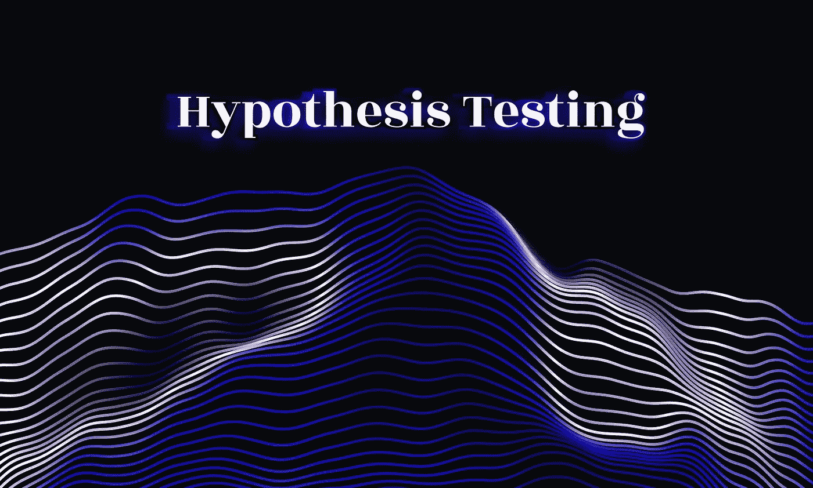
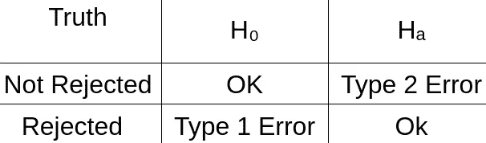
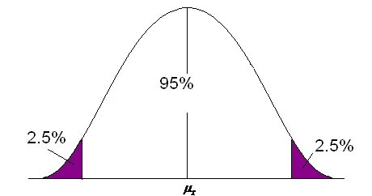

# 假设检验

> 原文：<https://medium.com/mlearning-ai/hypothesis-testing-e40627a86a84?source=collection_archive---------4----------------------->



Image: [Umang Bhalla](https://twitter.com/umgbhalla)

这将涵盖与假设检验相关的主题，包括假设检验、1 型和 2 型误差以及 P 值。

假设检验在机器学习的分类问题中非常重要。

先来讨论一下**什么是假说？**

假设是对你周围的世界的一种**式的猜测。这可以是任何你认为会很受欢迎的电影，或者更好的考试方式是在线等。**

只要你能检验它，它真的可以是*任何事情*

# 什么是假设检验？

统计学中的假设检验是你检验实验结果的一种方法，看看你是否有有意义的结果。所以，基本上，它是通过计算你的结果偶然发生的几率来测试你的结果是否有效。

从广义上讲，假设检验的过程可以分为 3 个步骤:

1.  找出零假设是什么
2.  陈述无效假设
3.  使用各种测试支持或拒绝零假设。

现在问题来了

# 什么是零假设？

一般来说，零假设是一个公认的事实(大家都知道是真的)。比如地球是圆的(忽略地球是平的)或者吸毒有害健康(否则每个人都会这么做)。

现在我们已经知道了我们的零假设是什么，是时候进入下一步了，即陈述假设。

# 我如何陈述零假设？

零假设表明总体参数(如平均值、标准差等)等于假设值。

这个班的平均分数是 60%

与原假设相反的是**替代假设**小于、大于或不等于原假设。

例如:班级的平均分数低于 60%

```
μ=60 is Null Hypothesis 
μ<60 is Alternate Hypothesis
```

## 有两种类型的假设:

**双边:**这里的替代假设是无方向性的，即它可以小于或大于零假设。

```
μ=60 is Null Hypothesisμ≠60 is Alternate Hypothesis
```

**单侧:**这里的替代假设是定向的，即与原假设相比，它特定于大于或小于(仅一侧)。

单侧检验比双侧检验有更大的功效，但是它不能检测总体参数是否在相反的方向上不同。

```
μ=60 is Null Hypothesis
μ<60 is Alternate Hypothesis
```

从现在开始，我将把 H₀作为无效假设，Hₐ作为替代假设。

# 第一类和第二类错误

为了测试我们的假设，我们采用**样本数据**，这些数据可能提供也可能不提供足够的数据来确定零假设是否成立。在这种情况下，我们默认另一个假设是正确的。

**让我们举一个例子，一个人没有 COVID**

H₀=人没有 COVID

Hₐ=人有 COVID

**案例 1:**

测试证明此人没有 COVID。

所以，零假设被接受，也是真的

这是**完美的理想情况。**

**案例二:**

检测证明此人可能患有 COVID。

在这种情况下，另一个假设被认为是正确的，但事实并非如此。因此，这种情况成为**类型 1 错误**，也称为**假阳性。**

**现在情况发生了变化，这个人实际上拥有 COVID**

**案例三:**

测试证明此人没有 COVID。

这里零假设应该被拒绝，但没有。因此，这种情况成为**类型 2 错误**，也称为**假阴性。**

**案例 4:**

检测证明此人可能患有 COVID。

在这种情况下，我们拒绝零假设，它是正确的。所以交替假设为真，这也是一个**理想情况。**

对于所有这些情况，我们可以制作一个混淆矩阵



Confusion Matrix showing all Cases

注:被拒绝和未被拒绝仅指 H₀。

H₀是真的，没有拒绝:好吧

H₀为真，但被拒绝:类型 1 错误

Hₐ是正确的，但 H₀没有被拒绝:类型 2 错误

Hₐ为真，H₀被拒绝:好

# p 值

在零假设显著性检验中，p 值是在假设零假设是正确的情况下，获得至少与实际观察到的结果一样极端的检验结果的概率。这个举个例子可以更好理解。

举个例子:我们拿一枚硬币，扔 100 次。

H₀=这枚硬币是公平的

Hₐ=这枚硬币不公平

H₀是真实的，完美的理想状态是 50 个正面和 50 个反面。

这使我们得出平均值(μ)为 50。

现实世界远非理想。



Y-Axis= Probability Density X-Axis= Number of Heads

所以当我们做这个实验时，这样的曲线显示了概率密度。μ这里是 50。

现在，如果我的实验显示值在 95%的区域，那么零假设将被接受，如果它在 5%的区域(两边各有 2.5%)，它将被拒绝

这里的 p 值是 0.05 (5%)。这也称为显著性值(α)

**所以，如果 P(Heads= X) < p-value 那么也只有那时才会拒绝零假设。*【P 为概率，X 为任意随机变量】***

这些值是使用我们在以前的文章中学到的各种类型的概率得到的。

写概率依赖于条件情况，即给定零假设的情况概率为真，给定替代假设的情况概率为真。

根据不同的情况，有不同的测试可以用来确定图形的哪个区域被拒绝。这些被称为 z 检验、f 检验、t 检验和卡方检验。

更多内容敬请关注

[](/mlearning-ai/mlearning-ai-submission-suggestions-b51e2b130bfb) [## Mlearning.ai 提交建议

### 如何成为 Mlearning.ai 上的作家

medium.com](/mlearning-ai/mlearning-ai-submission-suggestions-b51e2b130bfb) 

🔵 [**成为作家**](/mlearning-ai/mlearning-ai-submission-suggestions-b51e2b130bfb)