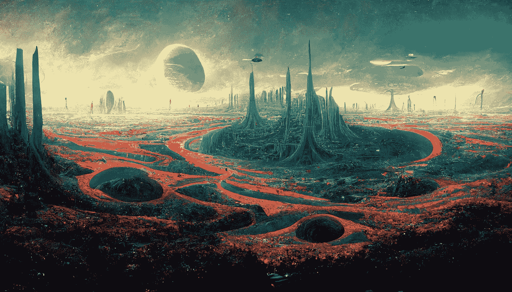

# 我用人工智能创造了一个外星世界

> 原文：<https://medium.com/mlearning-ai/i-created-an-alien-world-using-ai-8b27c6407de2?source=collection_archive---------3----------------------->

## 我不到一小时就完成了

Looks like these aliens have vertical cities of natural-looking buildings like in Avatar.

几周前，我注册了一个[midway membership](https://www.midjourney.com/)来创建人工智能艺术。你所要做的就是输入一个书面提示，如果你愿意，添加一些参数(例如图像的尺寸)，然后嘣！你得到了独一无二的艺术品！