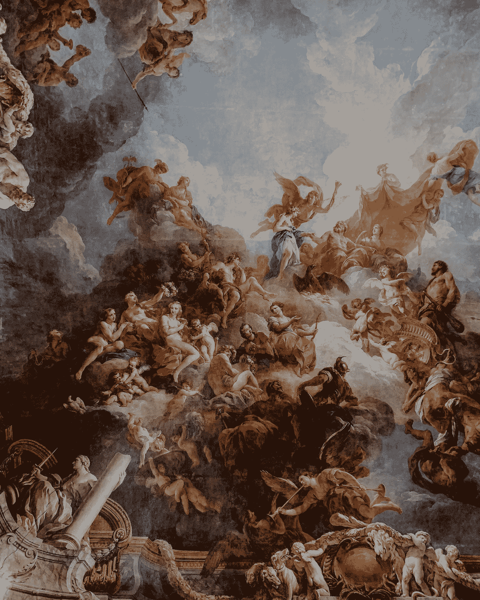
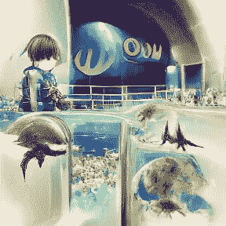
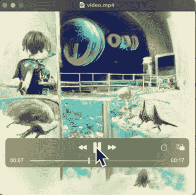

# 我刚刚创造了我的第一个 A。我艺术，我很高兴！

> 原文：<https://medium.com/mlearning-ai/i-just-created-my-first-a-i-art-and-i-am-very-happy-1a5c57b495b8?source=collection_archive---------6----------------------->

Photo by [adrianna geo](https://unsplash.com/@adrigeo_?utm_source=medium&utm_medium=referral) on [Unsplash](https://unsplash.com?utm_source=medium&utm_medium=referral)

当电脑屏幕显示成品时，我简直不敢相信自己的眼睛。我美丽的艺术品，由机器创造的！我很惊讶，也为自己感到骄傲。我使用了一张非常具体的图片作为输入，这张图片对我来说有很多个人意义。就像机器带走了我的思想和感情，把它们变成了真正神奇的东西。

变压器一打开，它产生的图像就令人震惊。第一张是一个穿着飘逸的白色长袍的美丽女人。她有一头长长的黑发和一双锐利的绿眼睛。接下来是一幅雄伟城堡的图片，坐落在高高的悬崖上俯瞰大海。然后就出现了野生动物在郁郁葱葱的森林中嬉戏的场景。最后，出现了一幅飞船在星空中翱翔的图像。

变形金刚连续几个小时施展魔法，创造出越来越美丽迷人的图像。一些人聚集在周围敬畏地观看，而另一些人则如此着迷，以至于他们忘记了移动或说话。这就像看着一个童话故事在他们眼前展开。

当你坐在电脑前，急切地等待着项目最终生成的图像时，你会情不自禁地感觉到空气中弥漫着一种魔力。你已经走了这么远，离看到最终结果又这么近。

你看着视频慢慢生成，每一帧都比上一帧更完美。最后生成最后一帧，你松了一口气。

但是接下来……神奇的事情发生了。视频开始自动回放，随着每一个进度图像，最终的图像会变得越来越清晰。就像在看自己项目的电影预告片一样！

那一刻到来时，你简直不敢相信自己的眼睛！

My first A.I art.

作为以下视频的创作者，我可以证明这是一次神奇的经历。这就像创造一件没有规则的艺术作品——让你的想象力自由驰骋。

看到人工智能自己创造东西是如此迷人。视频说明了一切，我鼓励每个人自己去尝试，看看他们能想出什么惊人的东西。

ML in action creating something new.

感谢阅读，

直到下一次…

 [## Mlearning.ai 提交建议

### 如何成为 Mlearning.ai 上的作家

medium.com](/mlearning-ai/mlearning-ai-submission-suggestions-b51e2b130bfb)