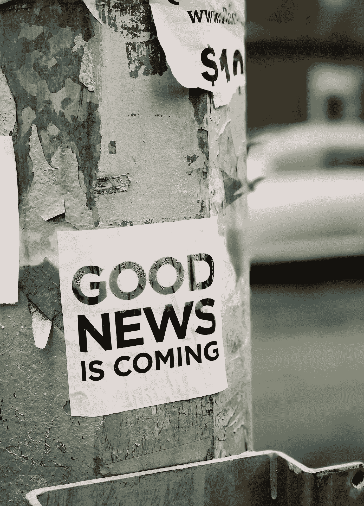

# 我在 Substack 上开始了我的时事通讯:原因如下

> 原文：<https://medium.com/mlearning-ai/i-started-my-newsletter-on-substack-heres-why-29499ec80b11?source=collection_archive---------5----------------------->

如果你爱人工智能，你一定要参与其中！

Photo by [Jon Tyson](https://unsplash.com/@jontyson?utm_source=unsplash&utm_medium=referral&utm_content=creditCopyText) on [Unsplash](https://unsplash.com/s/photos/newsletter?utm_source=unsplash&utm_medium=referral&utm_content=creditCopyText)

我不得不承认我有一个瘾:我真的很喜欢阅读和写作。我相信好的作家是贪得无厌的读者；我不知道我有多擅长写作(你可以告诉我)，但我确实是一个贪得无厌的读者；另外，我对人工智能这个话题非常好奇和热情，这让我读了很多东西。