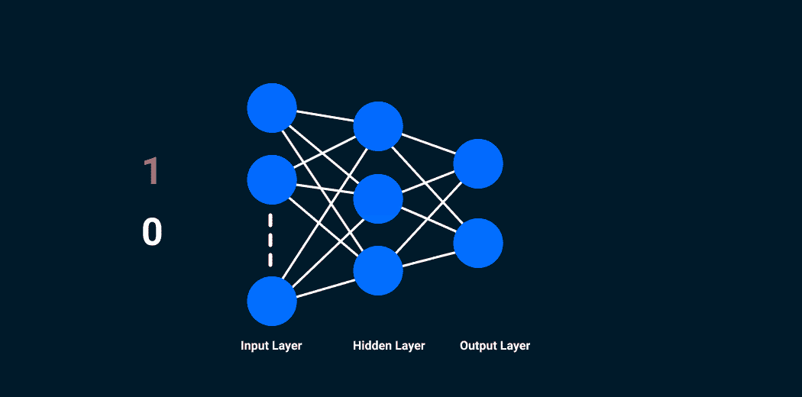
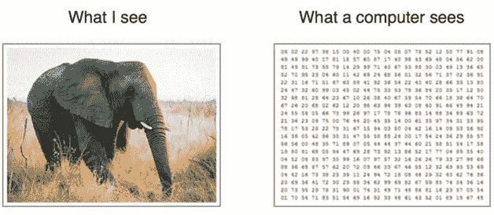
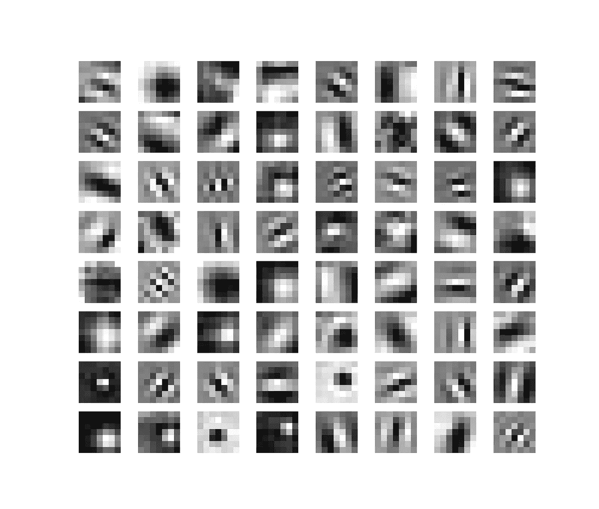
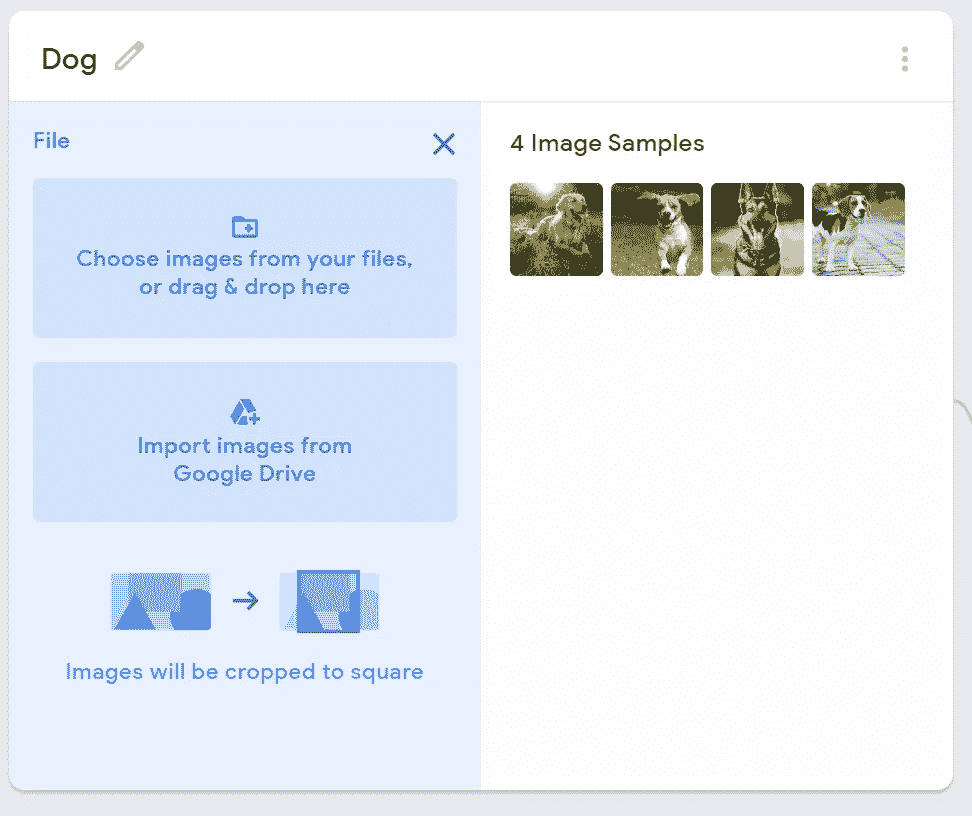
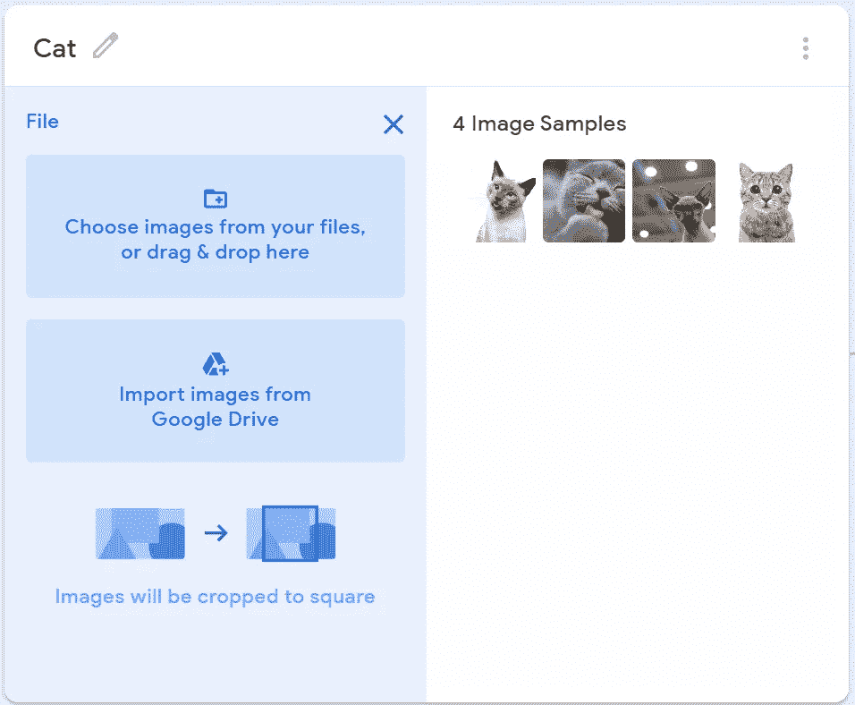
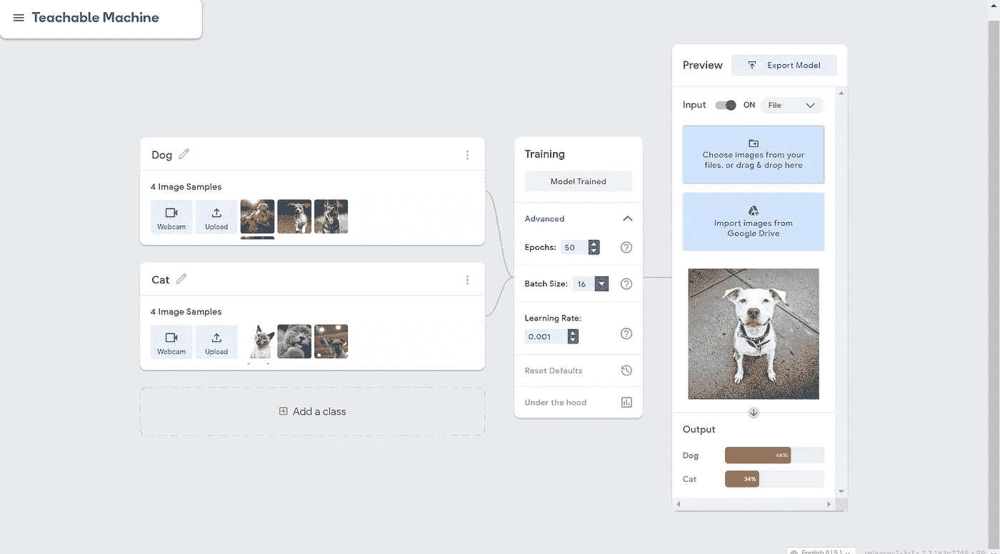
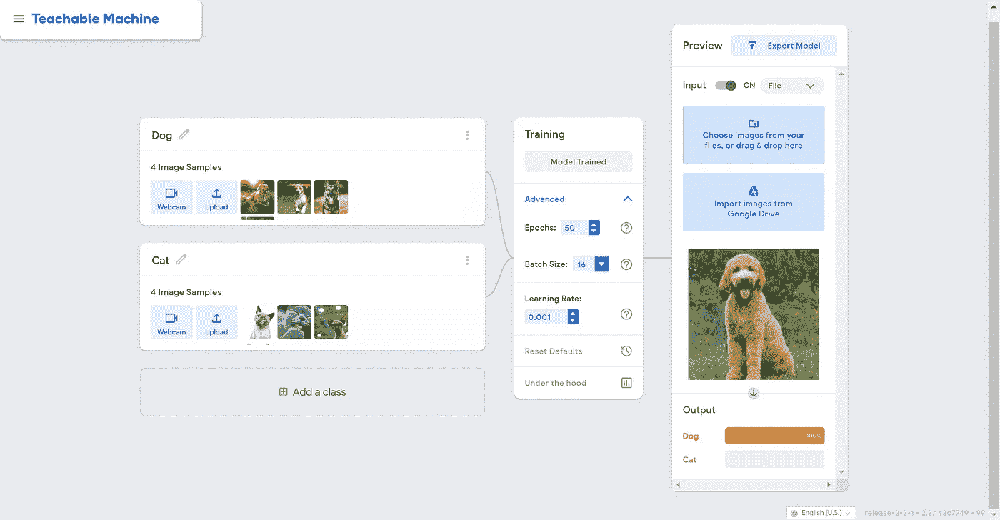

# 使用卷积神经网络训练计算机对不同的图像进行分类

> 原文：<https://medium.com/mlearning-ai/i-taught-my-computer-to-recognise-between-a-dog-and-a-cat-79c0cd529847?source=collection_archive---------2----------------------->

我教我的计算机使用卷积神经网络区分狗和猫，结果不是我所期望的。所以，让我们往回走一点。



[https://www.analyticsvidhya.com/blog/2020/02/mathematics-behind-convolutional-neural-network/](https://www.analyticsvidhya.com/blog/2020/02/mathematics-behind-convolutional-neural-network/)

我相信我们都知道，在过去的几年里，人工智能 已经在我们的日常生活中普遍存在。但是最常见的一种应用 [*机器学习*](https://www.sas.com/en_ca/insights/analytics/machine-learning.html#:~:text=Machine%20learning%20is%20a%20method,decisions%20with%20minimal%20human%20intervention.) 的方式是通过 [**卷积神经网络**](https://towardsdatascience.com/a-comprehensive-guide-to-convolutional-neural-networks-the-eli5-way-3bd2b1164a53) **(图像分类)。**



[https://deepnote.com/@donatien-subts/Untitled-Python-Project-IcLtjwWZQSi3aDNHWBtKdA](https://deepnote.com/@donatien-subts/Untitled-Python-Project-IcLtjwWZQSi3aDNHWBtKdA)

那么，现在来了解一下 CNN 的背景。CNN 有很多方面:

*   卷积层(添加时，您必须选择滤波器的数量和大小)
*   每层各自的文件
*   过滤器包括:角、边、角度、图像和形状
*   不同类型的图像，这样电脑就可以区分

每个过滤器关注图片的一个特征，所以它最终可以对其进行排序。

不同过滤器示例:



[https://debuggercafe.com/visualizing-filters-and-feature-maps-in-convolutional-neural-networks-using-pytorch/](https://debuggercafe.com/visualizing-filters-and-feature-maps-in-convolutional-neural-networks-using-pytorch/)

CNN 也有不同的层次，每一层最终都在产品中扮演着重要的角色。还有就是(我之前说过的) [*卷积层*](https://databricks.com/glossary/convolutional-layer)*[](https://www.geeksforgeeks.org/cnn-introduction-to-pooling-layer/#:~:text=Pooling%20layers%20are%20used%20to,generated%20by%20a%20convolution%20layer.)**然后最后是 [*【全连通】层*](https://towardsdatascience.com/convolutional-neural-network-17fb77e76c05) *。****

****

**[https://www.researchgate.net/figure/Schematic-diagram-of-a-basic-convolutional-neural-network-CNN-architecture-26_fig1_336805909](https://www.researchgate.net/figure/Schematic-diagram-of-a-basic-convolutional-neural-network-CNN-architecture-26_fig1_336805909)**

****卷积层:**这个层(小的来说)基本上是从一个输入图像中提取特征。并且，通过使用输入数据的小方块学习图像特征来保存像素之间的关系。这是一个数学任务，需要两个输入:一个图像矩阵和一个过滤器或内核。图像与不同过滤器的卷积可以通过应用过滤器来做诸如边缘检测、模糊和锐化之类的事情。**

****汇集层:**当图像过大时，汇集层部分会减少参数的数量。空间池也称为*子采样*或*下采样*，它减少了每个地图的维度，但保留了重要信息。空间池有三种重要的不同类型:**

*   **最大池化**
*   **平均池**
*   **总和池**

****全连接层:**这一层是来自一层的所有输入连接到下一层的每个激活单元的地方。**

**有关不同层的更多信息，请查看:[https://medium . com/@ RaghavPrabhu/understanding-of-convolutionary-neural-network-CNN-deep-learning-99760835 f148](/@RaghavPrabhu/understanding-of-convolutional-neural-network-cnn-deep-learning-99760835f148)**

****

**[https://support-blog.journiapp.com/en-us/article/207-how-to-make-a-journi-photo-book-with-face-recognition](https://support-blog.journiapp.com/en-us/article/207-how-to-make-a-journi-photo-book-with-face-recognition)**

**继续，CNN(卷积神经网络)在我们的日常设备中非常普遍。一个图像分类的例子其实很让人吃惊。**

**我们的一些 Iphones 使用 [*面部识别*](https://www.thalesgroup.com/en/markets/digital-identity-and-security/government/biometrics/facial-recognition) ，这是一种图像分类，将不同人的图像分类到他们各自的文件夹中。**

**计算机必须经过充分的训练才能正确地对照片进行分类，但是在放有你妻子照片的文件夹中看到你姐姐的照片并不罕见。那是因为在这张特定的照片中，你的妹妹和妻子看起来一定非常相似。这极大地混淆了计算机，因为根据代码，这两个女人看起来是一样的。**

**既然我们已经写下了所有的基础知识，让我们进入主要部分，教计算机识别一只狗和一只猫。 所以，首先，我使用了一个名为 [**的网站的可教模型**](https://teachablemachine.withgoogle.com/train/image) ，然后在我找到了一些这两种动物的图片并把它们添加到各自的类中后，我把这两个类分别重命名为“狗”和“猫”。**

****

**Dog**

****

**Cat**

**然后，我按下“训练模型”,在训练完成后，我会选择一张狗或猫的图片，然后等着看结果。我不骗你，头几次它做错了。**

****

**In this picture, it says the photo is 67% dog and only 33% cat. But, in reality, it is supposed to be 100% cat.**

****

**In this picture, it says the photo is 66% dog and only 34% cat. But, in reality, it is supposed to be 100% dog.**

**所以，我不得不多运行几次...而且成功了！两只动物都得了 100 分**

****

**Right result!**

****

**Correct!**

**现在，关于代码…这是我解释它的视频:[https://youtu.be/iNy7EsIzrK0](https://youtu.be/iNy7EsIzrK0)**

```
**import tensorflow.keras
from PIL import Image, ImageOps
import numpy as np# Disable scientific notation for clarity
np.set_printoptions(suppress=True)# Load the model
model = tensorflow.keras.models.load_model(‘keras_model.h5’)# Create the array of the right shape to feed into the keras model
# The ‘length’ or number of images you can put into the array is
# determined by the first position in the shape tuple, in this case 1.
data = np.ndarray(shape=(1, 224, 224, 3), dtype=np.float32)# Replace this with the path to your image
image = Image.open(‘test_photo.jpg’)#resize the image to a 224x224 with the same strategy as in TM2:
#resizing the image to be at least 224x224 and then cropping from the center
size = (224, 224)
image = ImageOps.fit(image, size, Image.ANTIALIAS)#turn the image into a numpy array
image_array = np.asarray(image)# display the resized image
image.show()# Normalize the image
normalized_image_array = (image_array.astype(np.float32) / 127.0) — 1# Load the image into the array
data[0] = normalized_image_array# run the inference
prediction = model.predict(data)
print(prediction)**
```

****

**[https://analyticsindiamag.com/how-to-create-your-first-artificial-neural-network-in-python/](https://analyticsindiamag.com/how-to-create-your-first-artificial-neural-network-in-python/)**

> **电脑会比美国人更早理解讽刺。***——杰弗里·辛顿*****

**纵观 CNN 所能做的一切，计算机也能在我们之前发现讽刺就不足为奇了。这恰恰说明了人工智能已经变得多么先进。并且希望在未来将继续改变和发展为最好的而不是最差的。**

****TL；DR:** 所以如你所见，制作 CNN 只是使用不同的形状、大小、线条和角度来确定哪张图片与哪张相关。**

**_________________________________________________________________**

**这里有一个视频进一步阐述了什么是卷积神经网络:【https://youtu.be/YRhxdVk_sIs**

**在下面评论你最喜欢的动物是什么🐶或者一个🐱？**