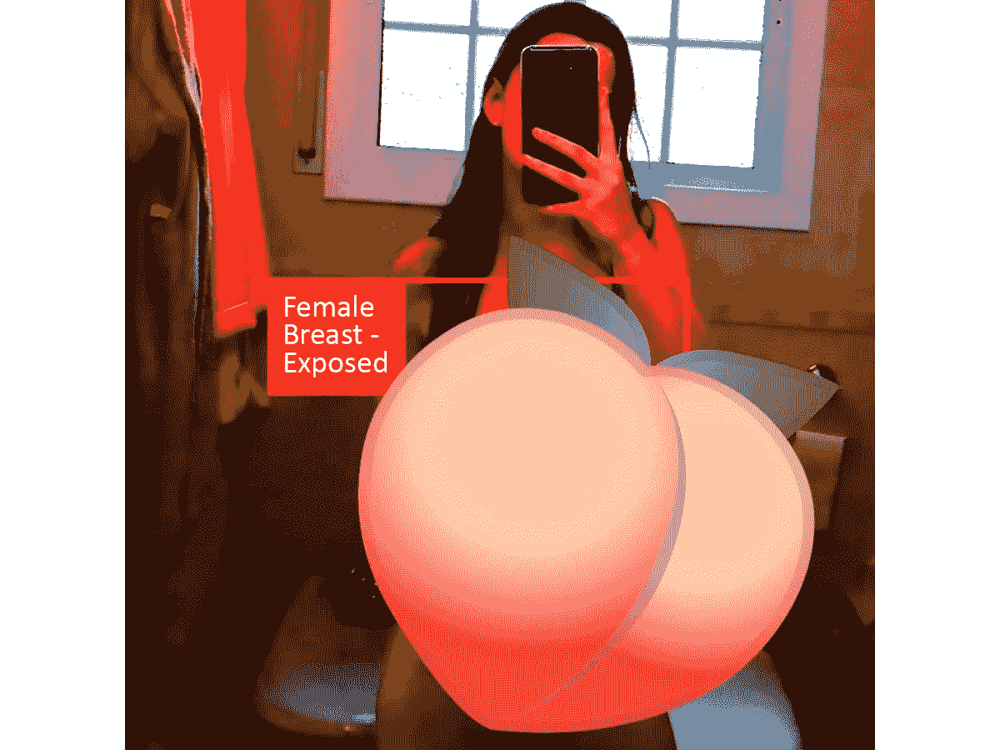

# 我用我的照片尝试了 Python 裸体探测器

> 原文：<https://medium.com/mlearning-ai/i-tried-a-python-nude-detector-with-my-photo-446dba1bbfc8?source=collection_archive---------0----------------------->

## 我没有希望，直到我尝试了一张海滩后的照片。…

Me after all day at the beach: burnt

当我从海滩走回我的房子时，我并不太担心我会被严重烧伤。毕竟，我一整天都在外面晒太阳，出门前还涂了防晒霜，所以一切都应该没问题，对吧？当我回到家，我决定给 T1 拍几张照片