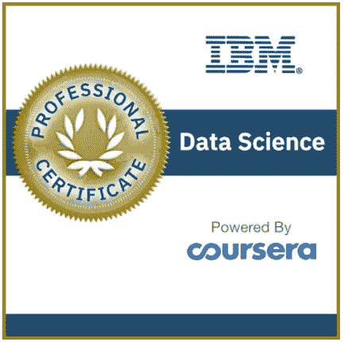
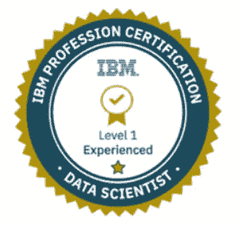

# IBM 数据科学专业证书课程回顾

> 原文：<https://medium.com/mlearning-ai/ibm-data-science-professional-certificate-program-review-31554f5768e?source=collection_archive---------4----------------------->

Photo by [Benjamin Voros](https://unsplash.com/@vorosbenisop?utm_source=medium&utm_medium=referral) on [Unsplash](https://unsplash.com?utm_source=medium&utm_medium=referral)

## 我对 10 门长期专业课程的印象和体验

养成分析的习惯——分析最终会让综合成为你的思维习惯

**弗兰克·劳埃德·赖特**

IBM Data Science Certificate

[IBM 数据科学专业证书项目](https://www.coursera.org/professional-certificates/ibm-data-science?utm_source=gg&utm_medium=sem&campaignid=2087860785&utm_campaign=10-IBM-Data-Science-ROW&utm_content=B2C&adgroupid=79675709271&device=c&keyword=ibm%20data%20science&matchtype=b&network=g&devicemodel=&adpostion=&creativeid=489197596485&hide_mobile_promo&gclid=EAIaIQobChMI6c-y3taz9QIVDKh3Ch36egepEAAYAiAAEgKKqPD_BwE)是开始您的数据科学之旅或者更新您在该领域知识的绝佳起点。我认为自己很幸运，因为通过专业组织课程，我对数据科学有了广泛的理解。虽然距离我完成它已经过去了很长时间，但我仍然有时会回去看看我在那个程序中的笔记，以刷新数据科学中的一些重要观点。因此，我觉得有责任分享我的经验，因此我准备了一个简短的计划总结，一些有用的信息，如果你想学习，并提高你的数据科学技能。这个项目包括 10 门独立的课程。

任何决定进行职业转型的人都可以从这个项目开始。对于绝对的初学者来说，这是一个精心制作的设计。

为了获得证书，你需要完成以下 10 门课程。

**1。** **什么是数据科学**

这是一个流畅的数据科学入门。您将了解一些理论信息、数据科学的定义和数据科学家的工作、数据科学主题以及数据科学在商业中的使用案例。完成大约需要 5-6 个小时。它有部分测验和一个由同学评分的作业。

**2。** **数据科学工具**

在本课程中，您将熟悉数据科学中使用的工具。尤其是 Python、Jupiter notebooks、anaconda environment、RStudio IDE、Git、GitHub 和 IBM Watson Studio，它们将对您的数据科学之旅有所帮助。大约需要 6-7 个小时来完成，包括部分测验和一个由同学评分的作业。

**3。** **数据科学方法论**

一旦你进入一门学科，遵循方法论是非常重要的。我发现这一点很重要，因为在你的数据科学职业生涯中，你需要时刻牢记这一点。您将了解处理数据科学问题的主要步骤，从业务问题、数据收集到模型部署，以及交流结果。这需要 2-3 个小时才能完成。

**4。** **Python 为数据科学，AI &开发**

在本模块中，您将使用神奇的工具 Python 开始动手练习。它对 Python 有一个初学者友好的介绍。你甚至不需要有编程经验。完成本课程需要 5-6 个小时，包括部分测验和一个由同学评分的作业。

**5。** **面向数据科学的 Python 项目**

这个新的迷你课程为您提供了在总共 5-6 个小时的时间里演示使用数据的基本 Python 技能的机会。

**6。** **使用 Python 的数据科学数据库和 SQL**

本课程打开了关系数据库概念的大门，并教你 SQL 语言的基础知识。您将通过动手实验练习、构建和运行 SQL 查询来学习。此外，您将通过使用 SQL 和 Python 从 Jupyter 笔记本访问数据库。该课程将需要大约 12-14 个小时来完成，包括部分测验和一个由同学评分的作业。

**7。用 Python 进行数据分析**

在本课程中，您将执行导入数据集、清理和操作数据、构建机器学习回归模型和数据管道。您将学习如何使用 Python 库，如 Pandas、Numpy、Scipy、Scikit-learn 等等。这个相对宽泛的课程大约需要 12-14 个小时才能完成。它有部分测验，和一个由同学评分的作业。

**8。** **用 Python 实现数据可视化**

数据可视化部分在数据科学中非常重要，因为您希望通过向利益相关者或决策者展示您的洞察力来产生影响。您将学习如何使用可视化库，如 Matplotlib、Seaborn 和 Folium。大约需要 7-8 个小时来完成，部分测验，和一个同侪评阅的作业。

**9。** **用 Python 学习机器**

数据科学最吸引人的部分，机器学习。您将开始使用现实世界数据的回归、分类、聚类和推荐模型。该课程将需要大约 15-16 个小时完成，同样，它有部分测验，和一个同侪评分的作业。

10。 **应用数据科学顶点项目**

我总是重视学习项目/学术研究中的论文、学位论文或研究任务。这是最有用、最有成果的部分，因为你学习和巩固，靠自己奋斗，获得知识。我可以说顶点工程是项目中最有用的部分之一。当你尝试在不同的平台上寻找解决方案时，你会学到很多东西。遇到卡壳的时候可以随时参考，参与论坛。

IBM Data Science Badge

**成本**

该课程通过课程在线学习平台进行访问。你需要支付每月 39 美元的费用。如果你每周只花 3 个小时，完成整个项目需要 11 个月。总共大约要花费 429 美元。然而，如果你能每天花几个小时，你可以在 2 个月或最多 3 个月内完成。这样你需要支付大约 80-120 美元。

**分级系统**

作业采用同伴评分系统，多项选择测验采用自动评分系统。

**替代品**

还有其他真正成功的课程可以让你学习数据科学。[约翰·霍普斯金大学](https://www.coursera.org/specializations/jhu-data-science)提供 10 门课程的专业化项目。他们用 R 编程代替 Python。[密歇根大学有应用数据科学专业](https://www.coursera.org/specializations/data-science-python?utm_source=gg&utm_medium=sem&utm_campaign=29-AppliedDataSciencePython-ROW&utm_content=B2C&campaignid=13259947800&adgroupid=117959621170&device=c&keyword=coursera%20python%20data%20science&matchtype=b&network=g&devicemodel=&adpostion=&creativeid=524072187247&hide_mobile_promo&gclid=EAIaIQobChMIn7OAhcu09QIVxMPVCh06dgfOEAAYASAAEgImMvD_BwE)项目，是中级水平。那可能不适合绝对的初学者。那些类似的每月费用约为 40 美元。

**结论**

总之，我强烈推荐希望开始学习和更新数据科学知识的人学习本课程。这个项目当然值得你的投入、时间和成本。

在 Coursera 上，提到如果你遵循 3 **小时/周**的速度，你将在 **11 个月**左右完成这个项目。我花了两个月的时间完成了整个程序。我没有把我所有的日子、周末和晚上都奉献出来。但是我白天工作。所以，如果你全力以赴，你甚至可以在不到两个月的时间内完成。

我希望这篇文章对您的数据科学之旅有所帮助。

你可以在 LinkedIn 上找到我

 [## Mlearning.ai 提交建议

### 如何成为 Mlearning.ai 上的作家

medium.com](/mlearning-ai/mlearning-ai-submission-suggestions-b51e2b130bfb)