# 使用“叶子”和“Pycaret”来确定在伦敦开一家巴西外卖餐馆的地点

> 原文：<https://medium.com/mlearning-ai/identify-a-location-using-folium-and-pycaret-to-open-a-brazilian-take-away-restaurant-in-london-7295261ac74d?source=collection_archive---------6----------------------->

## 应用地理聚类分割伦敦地区。

你可以在这里得到 github 回购协议

Photo by [Pablo Merchán Montes](https://unsplash.com/@pablomerchanm?utm_source=medium&utm_medium=referral) on [Unsplash](https://unsplash.com?utm_source=medium&utm_medium=referral)

## 1.介绍

> 1.1 背景

建立一家新餐馆的成功取决于几个因素:需求、品牌忠诚度、食物质量、竞争等等。在大多数情况下，一家餐馆的地理位置是其成功的决定性因素。因此，为了最大化商业利润，确定最具战略意义的建立地点是有利的，也是最重要的。

无论你是在开第一家提供全方位服务的餐厅，了解在选择新的餐厅位置时要注意什么是很重要的。对于经验丰富的餐馆老板来说，你可能有一个成功的位置，但有多少成功是无意中偶然或有意选择的餐馆位置？答案可能是一切都与它有关。

1.2 问题陈述

*   一个巴西厨师家族想在伦敦**开一家巴西外卖**餐馆，出售巴西传统食物，如意大利比萨饼、意大利粉饼、picanha **。**
*   目标是**确定最佳的社区开业地点。要考虑的关键因素是:伦敦人口的消费能力，巴西餐馆的分布，到公共交通站的距离。**
*   **为了确定理想的伦敦邻里群集组，我们将使用 Foursquare API、data scraping、geopy、pycaret** 构建群集模型，并使用 matplotlib/seaborn 在 EDA(探索性数据分析)期间可视化数据。

1.3 关键客户

巴西厨师家族，在中小型餐厅烹饪方面经验丰富。

## 2.数据采集、争论和清理

2.1 数据来源

各个街区及其各自的邮政编码、行政区和地理坐标，每个街区的人口和收入都将从这里刮出:[https://www.doogal.co.uk/UKPostcodesCSV.ashx?area=London0](https://www.doogal.co.uk/UKPostcodesCSV.ashx?area=London0)。

为了返回每个街区附近巴西餐馆的数量，我们将使用 Foursquare API，更具体地说，它的 explore 函数。

**清理后，应用探索性分析，我们将通过 leav 创建一张伦敦地图，其中包含每个街区的位置概览。**

在这里，我们将实现一些预处理步骤，为聚类 KMeans 模型准备数据，以识别更有潜力开设巴西餐馆的邻近聚类。

2.2 数据清理

在导入包含邮政编码和地理空间数据的文件后，我们可以看到数据集包含其他对我们的分析有用的数据。这很好，因为我们没有刮其他数据。

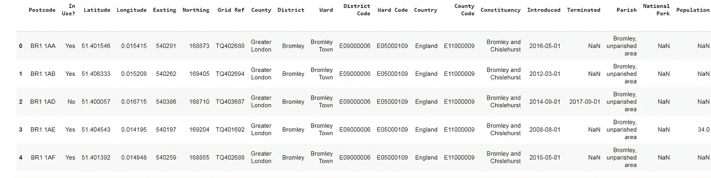

Figure 1: Data with postcodes, neighbourhood and geospatial data.

该数据集包含 30 多个邻域的数据，这些数据在数据集中被称为区。

数据清理的下一步摘要:

*   首先，删除了不包含对 EDA(探索性数据分析)和聚类模型构建有用的信息的列。
*   第二，删除了具有空值或不存在值的行
*   第三，最终的数据帧已经被简化，从超过 140000 行采样到 100 行，因为由于数据集消耗了相当多的内存，follow 库和 colab 平台已经崩溃了几次。

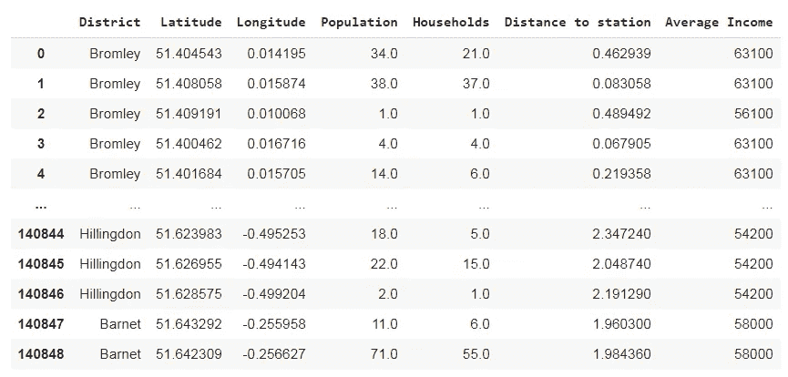

Figure 2: Final Dataframe after data cleaning

**3。探索性数据分析**

3.1 叶片测绘

“叶子图书馆”被用来从地理上帮助可视化伦敦每个街区的位置。

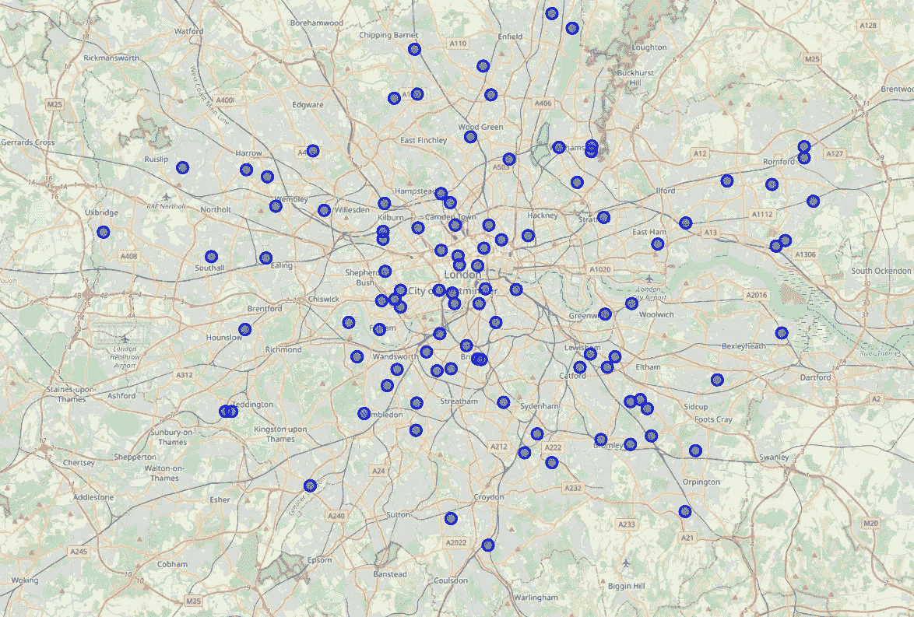

Figure 3: London map with each neighbourhood

在绘制了地图和每个街区之后，已经对 3 个因素进行了统计分析和概述，这 3 个因素有助于最终决定或建议在哪里更适合开设餐馆:巴西餐馆的分布、每个街区的中值收入和距离车站最近的街区。

3.2 巴西餐馆的频率分布

使用 Foursquare API 的 explore 函数，我们可以返回位于每个街区的巴西餐馆的数量。通过分别计算平均值，可以让我们更好地了解每个邻域的出现频率。

使用巴西餐馆频率的论点是基于巴西餐馆数量和竞争之间存在相关性的假设。**一个街区的巴西餐馆数量越多，竞争就越激烈。**

**该分析的假设是，在竞争激烈的市场建立新餐厅的进入壁垒很高，因为现有的巴西餐厅可能具有品牌忠诚度的竞争优势。**

然而，与直觉相反，巴西餐馆的出现甚至可能是巴西美食需求的一个指标。竞争的存在甚至可能激励创新以降低成本和提高生产率。

因此，在一个由大约中等价值的餐馆组成的社区建立商业运营是合理的。

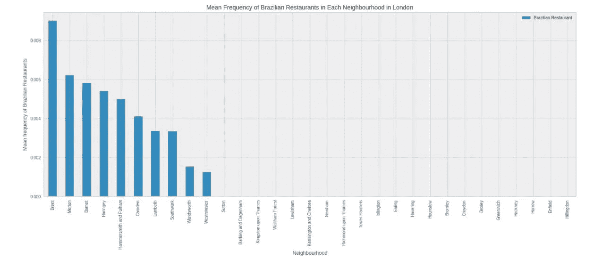

Figure 4: Neighbourhood with average frequency of Brazilian Restaurants

从上面的图表中，我们可以推断出布伦特是巴西餐馆平均频率最高的社区，因此建议不要在该地区开设巴西餐馆。

3.3 家庭收入中位数的分布

由于巴西餐厅可以被归类为休闲餐饮，目标受众更倾向于中产阶级/高阶层。从下面的柱状图可以推断，分布在平均水平附近的社区可以很容易地负担得起并享受上述巴西美食。

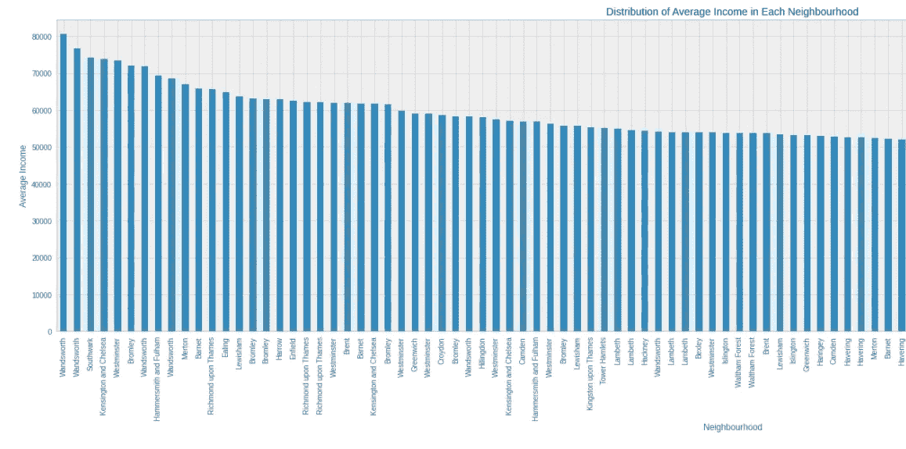

Figure 5: Distribution of Average Income in Each Neighbourhood

从到最近车站的距离来看，巴金和达格南、希灵顿和伊林位居前三。

## 4.聚类建模

4.1 数据预处理

**选择的聚类模型是 kMeans 聚类模型。**

构建模型使用的机器学习库是 Pycaret。

PyCaret 是 Python 中的开源低代码机器学习库，旨在减少 ML 实验中从假设到洞察的周期时间。它使数据科学家能够快速高效地执行端到端的实验(来源:【https://pycaret.org】[)。](https://pycaret.org)

这个库允许用几行代码实现一个简单的预处理。

所使用的缩放方法是 z 分数，全部使用 pycaret 函数实现，以构建名为 setup 的预处理管道:

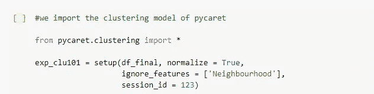

Figure 7: Pre-processing the model with Pycaret.

4.2 k 均值聚类模型

为了实现 k-means 模型，通常重要的是分配算法应该标记的多个聚类。

**为了确定要使用的最佳集群数量，您首先使用 Pycaret 将标准集群数量 4 拟合到模型中，然后使用 plot_model 函数并选择 elbow 方法**，Pycaret 突出显示了使用平方误差计算的合适集群数量作为性能指标。

簇的合适数量是 5:

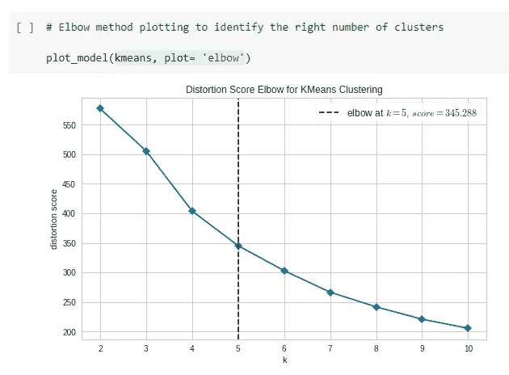

Figure 8: Elbow method chart with suitable number of k (clusters).

在确定了聚类的数量之后，我们将把标准化的特征值放进我们的 k-Means 算法中。结果将是相似特征的邻域聚类。

4.2.1 集群标签

下面是包含邻域和聚类的最终数据框(从 0 到 4，因为在 Python 中计数是从 0 开始的，所以有 5 个聚类:0，1，2，3，4)。

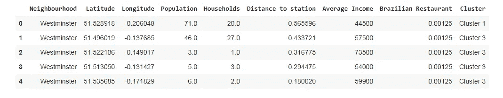

Figure 9: Dataframe with cluster labels.

此外，在下面，伦敦地图中的聚类表示使用了薄层:

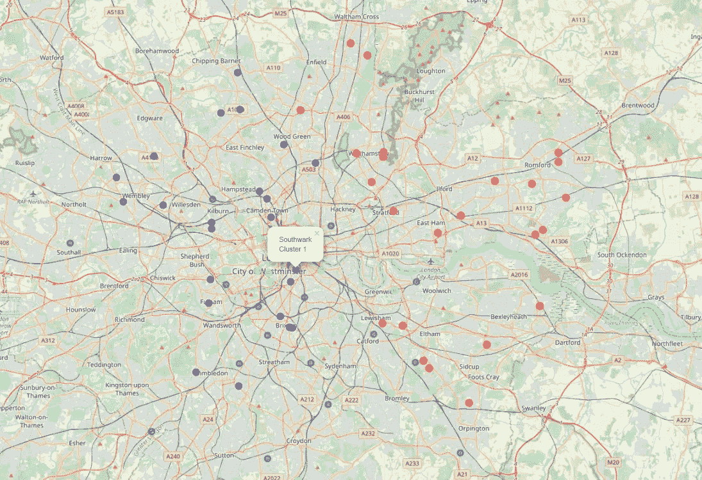

Figure 10: Plot of the 5 clusters on the London map.

**集群 0:**

*   低消费能力
*   没有竞争
*   到车站的中/高距离

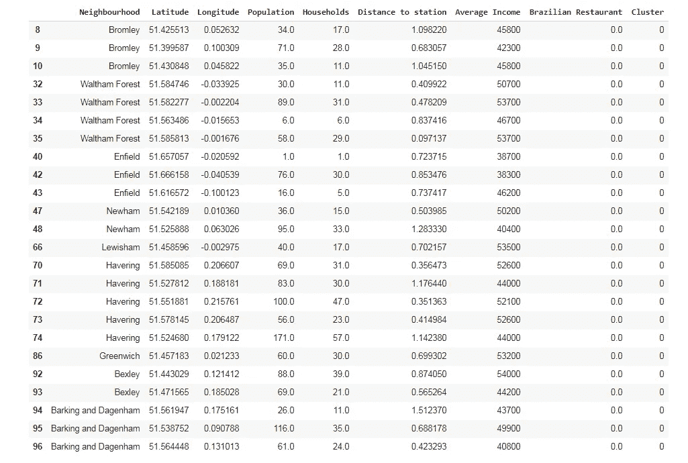

Figure 11: Cluster 0.

**集群 1:**

*   中等消费能力
*   中度/高度竞争
*   到车站的距离适中

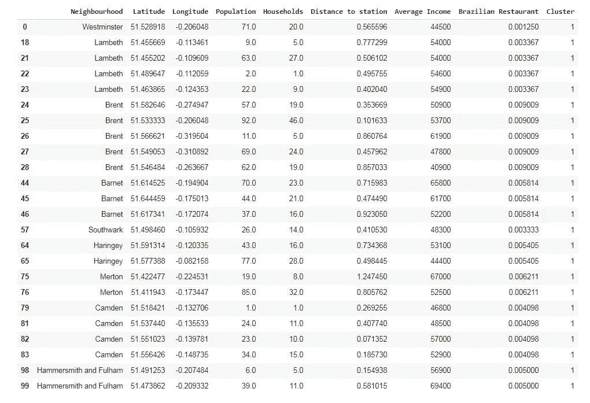

Figure 12: Cluster 1

**集群 2:**

*   中等消费能力
*   竞争程度低
*   到车站的中/高距离

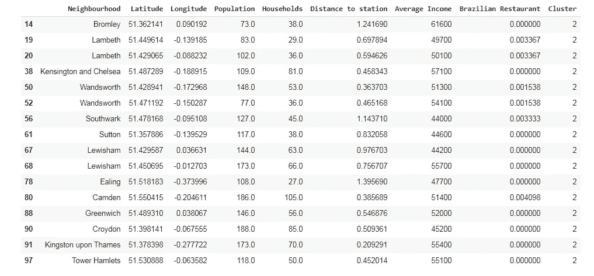

Figure 13: Cluster 2

**集群 3:**

*   中/高消费能力
*   竞争程度低
*   到车站的距离适中

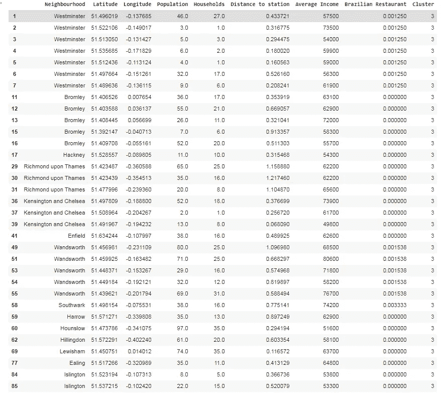

Figure 14: Cluster 3

**集群 4:**

*   低消费能力
*   没有竞争
*   到车站的最高距离

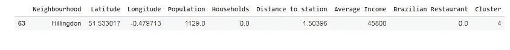

Figure 14: Cluster 3

## 5.结论

在这项研究中，我根据社区的特征(消费能力、巴西餐馆(竞争对手)的百分比以及距离车站最近的社区)对其进行了标记。

**最有希望开设巴西餐馆的社区群体**，**在巴西美食方面有一席之地，似乎是“集群标签 3”。**

该集群中社区的中高消费能力使他们能够轻松负担客户巴西餐厅菜单的小幅上调价格。

竞争对手的数量很少，这肯定有助于在该地区建立一个品牌，让好奇的人尝试巴西美食。

**我们的客户可以更具体地考虑里士满以及肯辛顿和切尔西的一些地区，作为以中高平均支出为特征的最佳结果的建立地点。**

然而，集群 3 显示了到车站的中等距离，这可能被认为是激活对当地人的可靠促销的洞察力，以确保有重要的和有利可图的客户群来限制伦敦其他地区的人不太容易到达餐馆的任何潜在问题。

**总之，以上广泛的分析将大大增加餐馆成功的可能性。**同样，我们可以用这个项目来分析可互换的场景，比如开一家不同菜系的餐厅。

# 作者:

我写关于数据科学、python 编码项目和数据驱动营销的文章。我还为数据新手或数据入门者提供数据和业务指导。

你可以在[媒体](/@Marcello_Dichiera)和[推特](https://twitter.com/ItalyMarcello)上关注我，或者访问我的[网站](https://marcello-personal-website.netlify.app/)和 [Github 页面](https://github.com/marcello-calabrese)。

 [## Mlearning.ai 提交建议

### 如何成为 Mlearning.ai 上的作家

medium.com](/mlearning-ai/mlearning-ai-submission-suggestions-b51e2b130bfb)