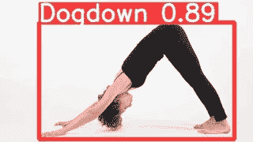
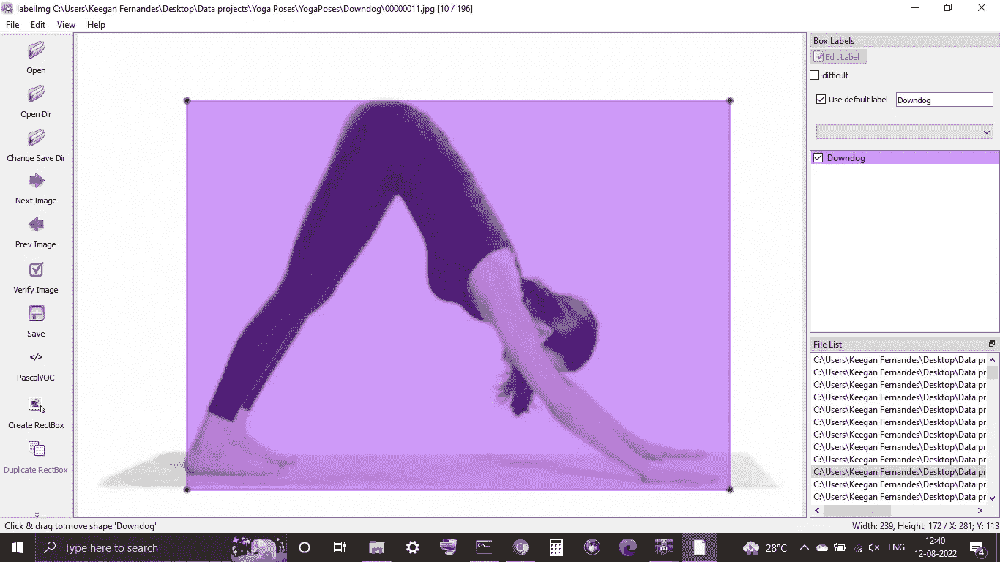
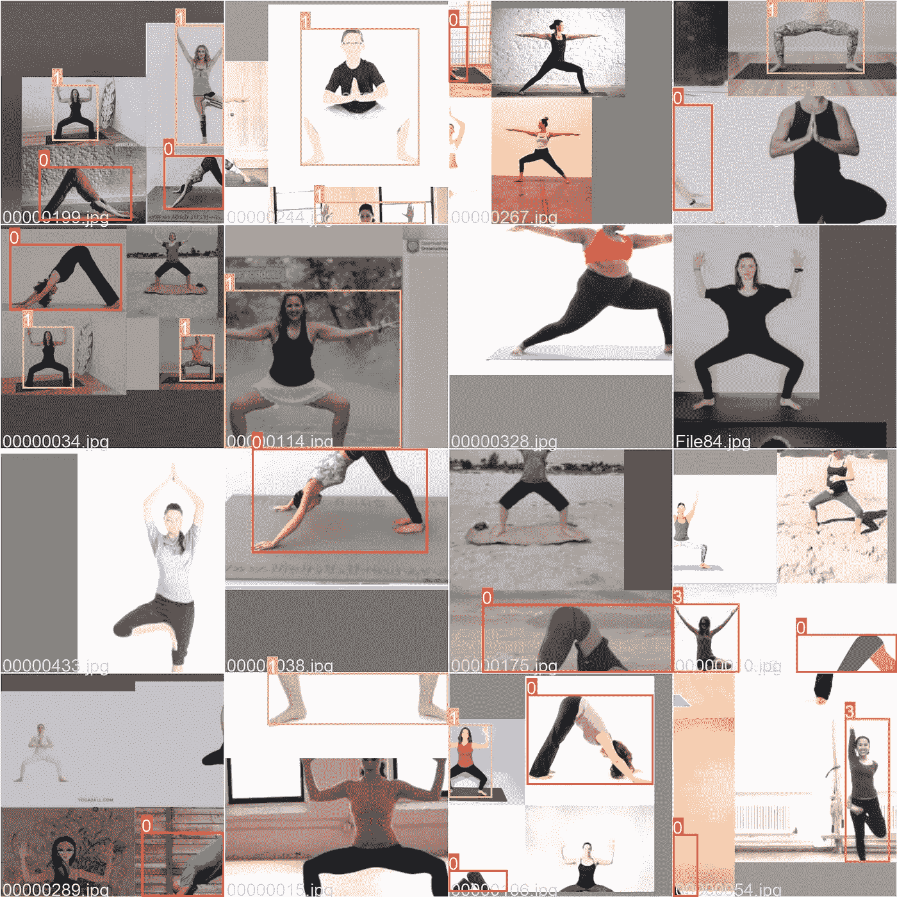
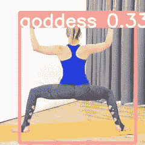
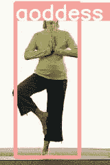
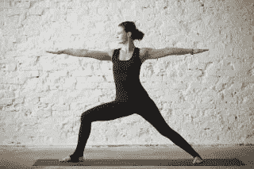
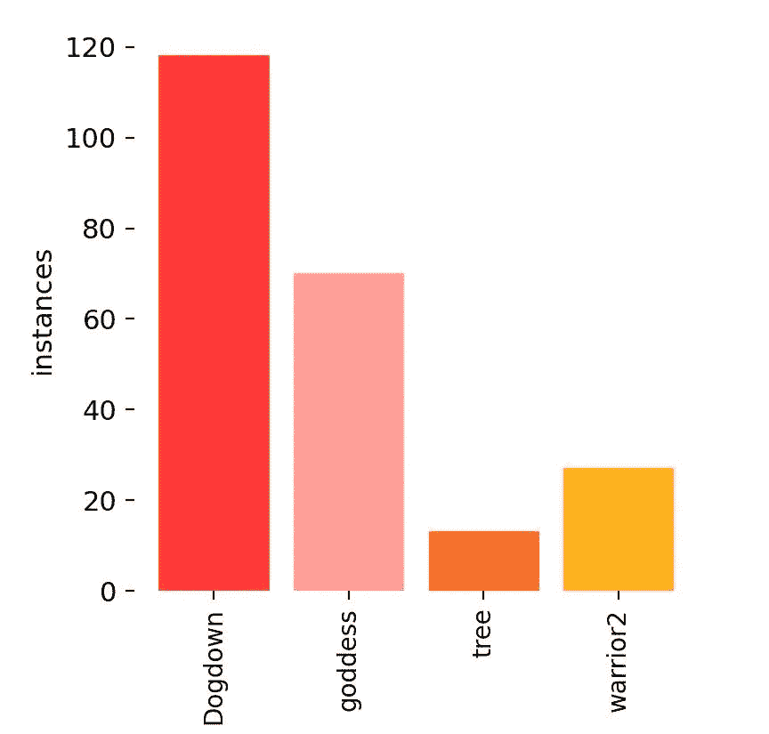

# 使用对象检测识别瑜伽姿势

> 原文：<https://medium.com/mlearning-ai/identify-yoga-poses-using-object-detection-ff11f66d528c?source=collection_archive---------9----------------------->

在本教程中，我将使用 YOLO v5 来检测各种瑜伽姿势。

## 介绍

使用 YOLO(你只看一次)我们将制作一个物体检测器来检测瑜伽姿势我们将使用我用 [*标签制作的数据集*](https://github.com/heartexlabs/labelImg) 标签数据集可以在 [*Kaggle*](https://www.kaggle.com/datasets/aristotle609/yoga-poses-annotations) 上找到。数据集以及笔记本都可以在 [*Github*](https://github.com/KeeganFernandesWork/YoloV5_Yoga_Poses) 上找到。

## 制作数据集

我使用了在 Kaggle 上找到的现有数据集。然后使用 [*labelimg*](https://github.com/heartexlabs/labelImg) 用边界框给数据加标签。如果您喜欢我制作的数据集，请给我从中获取数据的 [*原始数据集*](https://www.kaggle.com/datasets/aristotle609/yoga-poses-annotations) 投上一票。这很耗时，而且我无法获得所有课程的足够数据。如果有人准备合作完成这个项目，请通过 [*LinkedIn*](https://www.linkedin.com/in/keegan-fernandes-7b703517a/) 联系我。

A screenshot me Labelling the images using Labelimg

## 训练模型

因为建议使用预训练网络，所以我使用了 YOLO 第 5 版预训练模型。我建议使用 GPU 或 Kaggle 或 collab 等在线笔记本来运行它。我们命令数据集由模型训练。我使用小型 S 模型在我的本地机器上运行，使用他们的 GPU 在 Kaggle 上运行较大的 X 模型。这两个模型分别在 CPU 和 GPU 上运行了大约五到十分钟。要了解更多关于该型号的信息，请访问 YOLO GitHub 官方网站。

## 结果

这些是我从数据中得到的结果。

## 结论

如你所见，结果能够正确地识别某些类，而不是其他类。这是因为阶级不平衡。下图显示了这些类别及其相对发生率

正如你所看到的，Downdog 和女神 pose 类在数据集中有更多的实例。由于时间的限制，我无法给每个类别的图片贴上足够的标签。五节课每节课的推荐金额为 100–200 英镑。希望与我合作完成这个项目的人可以通过[*LinkedIn*联系我](https://www.linkedin.com/in/keegan-fernandes-7b703517a/)

 [## Mlearning.ai 提交建议

### 如何成为 Mlearning.ai 上的作家

medium.com](/mlearning-ai/mlearning-ai-submission-suggestions-b51e2b130bfb)