# 从音频中识别尼泊尔政治家

> 原文：<https://medium.com/mlearning-ai/identifying-nepali-politician-from-audio-c0365f74f8ef?source=collection_archive---------6----------------------->

# **简介**

根据音频识别人是一个有趣的话题。每个人的声音都是独特的；随着人们年龄的增长，他们的声音会发生变化，在不同的环境中听起来也不同，从而相应地改变了问题的面貌。说话人识别涉及基于一个人的口头音频来识别该人。传统上，语音处理模型被广泛认可，但卷积神经网络最近证明，它们也可能产生令人震惊的结果。

**数据描述**

我一直有兴趣用我的语言训练一个模特。因此，我从 youtube 上收集了正好 34 位政治家在不同场合发表讲话的尼泊尔音频，适当注意不要在音频中包含噪音，平均音频长度约为 5 分钟。数据集在[这里](https://drive.google.com/file/d/11s4vXYbSpFh-G5RdQzIS4oYl_MZC78XA/view?usp=sharing)可用

# **转化为深度学习问题**

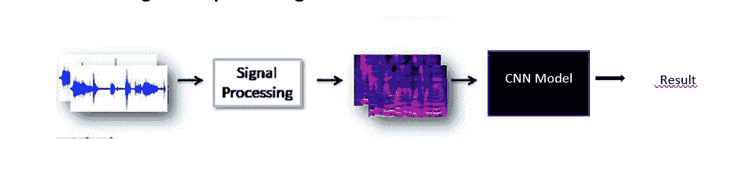

Showing the formulation of deep learning problem

必要的预处理取决于我们所拥有的音频，它可能包括去除音频的某些部分、去除静音等。由于 CNN 只能在图像上工作(1d CNN 可以在文本上工作，但这里不考虑)，所以从预处理的音频中创建频谱图图像，并将其作为输入提供给模型，该模型将执行训练以产生结果。基本上有四个步骤:

1.阅读音频

2.执行必要的预处理

3.选择模型

4.为模型准备数据

5.模型架构

## 1.阅读音频

这个多步骤过程的第一步是读取音频，音频可以是多种格式。wav、. mp3 等。这可以通过使用信号处理库 Librosa 来完成。

```
# Reading the audio
import librosa
path= 'path to audio'sample_rate= 22050
arr_audio,_=librosa.load(path,sr= sample_rate) #arr_audio is an array of amplitudes if the audio is 2sec in length
#it will be (2,2*22050)= (2,44100), where 2 in the array is due to #dual channel of audio
```

音频只不过是一种信号，x 轴表示时间，y 轴表示幅度，因为它是一种连续信号，我们希望将其转换为离散形式，以便从中提取特征。通过以特定的速率对信号进行采样，我们可以做到这一点，这意味着我们可以从某些时刻获得幅度值。这里的采样率是 22050，这意味着在一秒钟的音频中，我们将提取幅度 22050。

## **2。预处理**

**2.1 转换为单声道**

由于音频数据来自 youtube，对于特定的时间实例，这是一个双通道，有两个振幅值，一个用于左耳机，一个用于右耳机。但是我们在任何情况下都需要单一的振幅值。因此，只需取双通道幅度阵列的平均值，我们就可以将其转换为单声道。

```
arr_audio= arr_audio.sum(0)/2
```

**2.2 去除噪声**

在每个音频中，前 1 分钟是广告或其他一些不想要的音频片段。因此，我们将删除每个音频的第一分钟和最后一分钟。

```
arr_audio= arr_audio[sample_rate*60:arr_audio.shape[0]-sample_rate*60]
```

**2.3 消除沉默**

在说话时，他们可能会在我们之间短暂停顿，我们希望我们的模型能够学习个人音频的特征，它将从沉默中一无所获。所以沉默需要被消除。

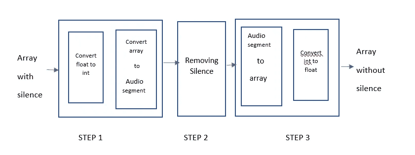

Steps to remove silence

```
from pydub import AudioSegment
from pydub.silence import split_on_silencedef float_to_int(array, type=np.int16):
  if array.dtype == type:
        return array if array.dtype not in [np.int16, np.int32, np.int64]:
        if np.max(np.abs(array)) == 0:
            array[:] = 0
            array = type(array * np.iinfo(type).max)
        else:
            array = type(array / np.max(np.abs(array)) *     np.iinfo(type).max)
   return arraydef int_to_float(array, type=np.float32):
  if array.dtype == type:
            return array if array.dtype not in [np.float16, np.float32, np.float64]:
            if np.max(np.abs(array)) == 0:
                array = array.astype(np.float32)
                array[:] = 0
            else:
                array = array.astype(np.float32) / np.max(np.abs(array))
   return array#Step1:Create an convert to int and create audio_segment#Convert to float
feature= float_to_int(arr_audio)#Create audio segment
audio = AudioSegment(feature.tobytes(),frame_rate = self.sample_rate,sample_width = feature.dtype.itemsize\
                             ,channels = 1) #Step2:removing the silence from the audio segment
audio_chunks= split_on_silence(audio,min_silence_len=min_silence,silence_thresh= -30,keep_silence= 100) #Step3:converting it back to the array
#Convert audio segment to array
arr_audio= sum(audio_chunks)
arr_audio= np.array(arr_audio.get_array_of_samples())#Convert back to int
arr_audio= self.int_to_float(arr_audio) 
```

完成所有预处理后，数据如下所示:

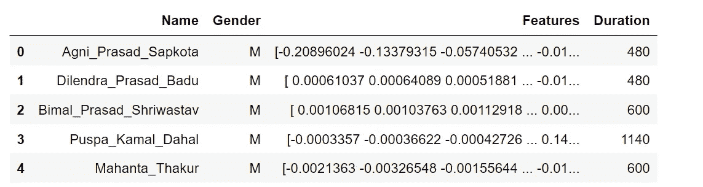

单个数据点包含说话者的姓名、性别、持续时间(以秒为单位表示的音频长度),最后是包含以特定采样率采样的音频幅度的特征。

# **3。选择型号**

有 34 个演讲者，如果我们把每个演讲者看作一个单独的类，那么将有 34 个类。随着发言者的增加，班级也将增加，这不是一个理想的情况。为了识别单个类别假设 k1，模型需要学习将它与其他(K-k1)类别明确区分的特征，这将需要大量数据，即增加单个说话者的音频长度。我不认为一个用户想花时间记录它的音频，他/她愿意记录 5-30 秒，然后完成它。所以，使用这种策略不是一种选择。

暹罗网络是包含两个相同子网的网络'*'相同'*这里的意思是，它们具有相同的配置，具有相同的参数和权重。参数更新在两个子网络上都是镜像的。它通过比较输入的特征向量来发现输入的相似性，因此这些网络被用于许多应用中。

如果我们想在这里添加一个新的扬声器，我们可以更新神经网络，并在整个数据集上重新训练它，这在传统架构中是不可能的。另一方面，SNNs 学习相似性函数。因此，我们可以训练它来看看这两个图像是否相同(我们将在这里这样做)。这使得我们能够对新说话者进行分类，而无需再次训练网络。

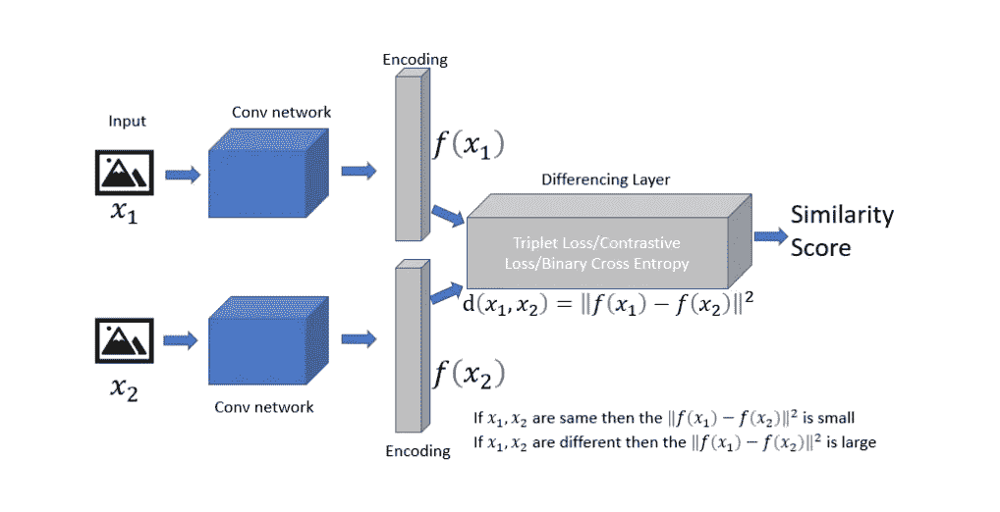

Siamese Network.([https://medium.com/swlh/one-shot-learning-with-siamese-network-1c7404c35fda](/swlh/one-shot-learning-with-siamese-network-1c7404c35fda))

暹罗网络接受两个输入 x1 和 x2。对于我们的情况，它或者是来自同一用户或者来自不同用户的两个频谱图图像。来自同一用户的图像被标记为 1，来自不同用户的图像被标记为 0。这些图像通过相同的网络发送，并生成特征向量 f(x1)和 f(x2)。使用一个函数来计算这两个特征向量之间的差。同一用户的特征向量之间的差异分数将很小，因为它们将位于该维度空间中的相同邻域中，而对于不同用户，特征向量差异将很大。

让我们以两个特征向量(0.5，0.7)和(1，0.7)为例

不同用户:

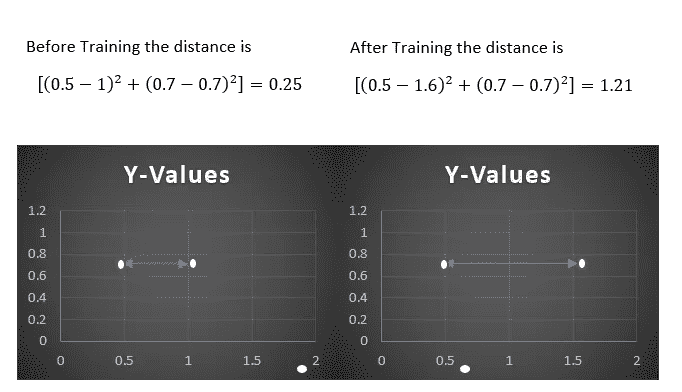

正如我们可以看到的，如果特征向量来自不同的用户，该模型试图增加特征向量之间的距离。

来自同一用户:

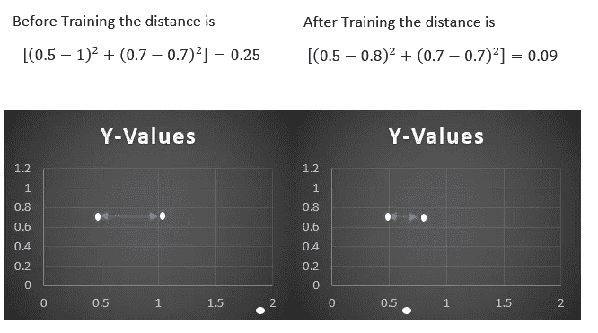

类似地，如果特征向量在每次迭代后来自同一用户，则模型减小两者之间的距离，使它们在向量空间中更接近。

# **4。为暹罗网络准备数据**

假设有一个来自扬声器 Hari 的 0.3 毫秒的音频，通过使用采样率= 22050，我们可以计算 8 个实例的幅度，即(0.3*1000 秒)/22050~10。因此，这个音频片段的特征向量看起来像这样:

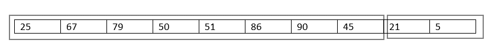

## **1。列车测试拆分**

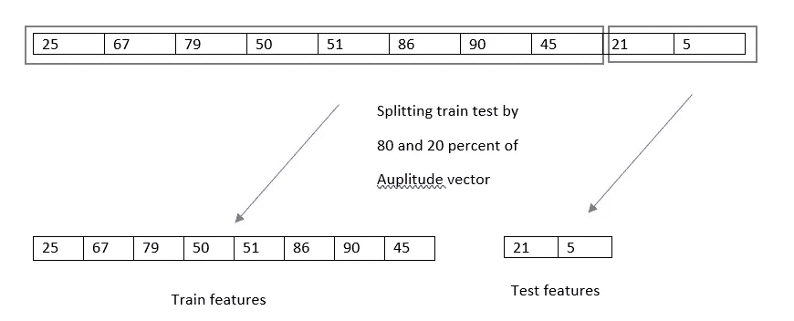

音频段的前 80%用于生成训练集，而剩余的 20%用于创建测试集。

## **2 从扬声器音频中获得相似和不相似的频谱对**

**2.1 相似对:**

从特定用户音频创建的一对声谱图图像将创建一个数据点，并且该数据点的标签将是 1，指示这对声谱图图像属于单独的音频。

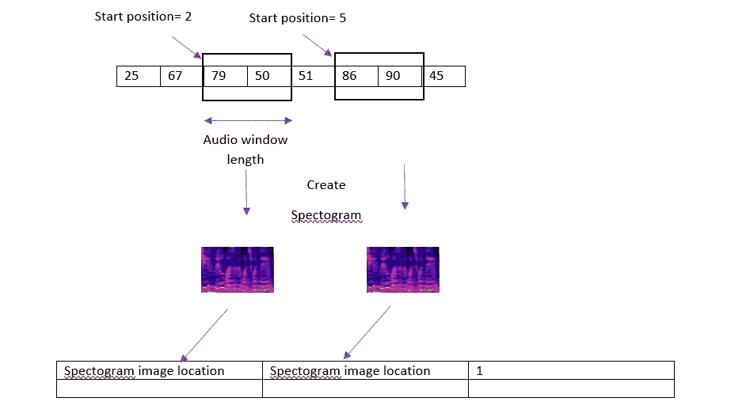

创建声谱图时最重要的参数是音频窗口长度，它定义了用于创建单个声谱图图像的音频段的长度。类似地，这两个窗口的起始位置将被随机选择。对于我的实现，我为单个用户选择了 100 对数据点，因此标签为 1 的数据点总数为 34*100= 3400。

**2.2 相异线对:**

单个数据点包含来自一个用户的一个频谱图和来自另一个用户的另一个频谱图，标签 0 表示频谱图属于单独的用户。因此，我们将每个用户与其他每个用户配对，并从不同的用户构建所有可能的配对组合。

我们选择了 25 对声谱图照片，分别来自两个不同的人。因此，我们将为每个用户生成 25 对光谱图(在我们的情况下是 33 对)，总共 33*25= 825 对图像。类似地，34 个人的不相似谱图对的总数是 34*825=28050，并且这些对被标记为 0，指示该对中的谱图图像来自不同的人。

执行完所有这些任务后，数据集如下所示:

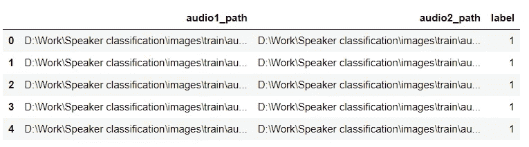

# 4 模型架构

因为图像编号刚好是 31000，所以迁移学习是唯一的选择。因此，这里采用了已经在“imagenet”上训练过的 DenseNet121。我们必须利用我们在初始化该网络时创建的谱图高度和宽度。

```
subnetwork=    tf.keras.applications.densenet.DenseNet121(include_top=False, weights='imagenet', ,input_tensor=None,input_shape=(height,width,3), pooling=None)
```

类似地，我们需要一个距离函数来计算 DenseNet 产生的两个特征向量之间的距离。为此，我们将使用欧几里德距离:

```
def euclidean_distance(self,inp): x,y= inp
  sum_square = tf.math.reduce_sum(tf.math.square(x -     y),axis=1,keepdims=True)
  return tf.math.sqrt(tf.math.maximum(sum_square,1e-07))
```

最后，让我们把所有的部分放在一起，创建一个完整的模型。

```
def create_siamese_network(height,width):
        #Inputs for two spectrogram images
        image1= Input(shape=(height,width,3))
        image2= Input(shape=(height,width,3)) #sending the images through the DenseNet
        output1= Flatten()(subnetwork(image1))
        output2= Flatten()(subnetwork(image2)) #Calculating the distance between the feature vector
        output = layers.Lambda(euclidean_distance)([output1, output2])

        model= Model(inputs=[image1,image2],outputs=output)
        return model
```

DenseNet 将生成具有多个通道的特征矩阵；为了从中获得一个向量，我们展平输出矩阵并计算通道之间的距离。

# 5.训练模型

## 5.1 收缩损失

我们需要一个损失函数来最小化同一个人的光谱图之间的距离，并最大化不同个人的光谱图之间的距离。收缩损失的工作方式与此完全相同，我们将在这里使用它来训练模型。

```
margin= 3.0
def contractive_loss(label,distance):

    difference= margin-distance
    temp= tf.where(tf.less(difference,[0.0]),[0.0],difference)   
    loss= tf.math.reduce_mean(tf.cast(label,dtype=tf.float32)*tf.math.square(distance)+(1-tf.cast(label,dtype=tf.float32))*tf.math.square(temp))

    return loss
```

边际价值是收缩损失中最关键的参数。这个数字告诉模型不同人的特征向量之间的最小距离应该是多少，在我们的实现中，我们将 margin 值设置为 3。类似地，该模型试图将同一图像的光谱图之间的距离减少到 0。

## 5.2 评估

相似距离=从同一个人生成的两个声谱图图像的特征向量之间的距离。

相异距离=从不同的人生成的两个频谱图图像的特征向量之间的距离。

起初，相似和不相似的距离几乎相同，但是随着模型的训练，它们开始发散，并且在 30 个时期之后，训练和测试之间的距离看起来像这样:

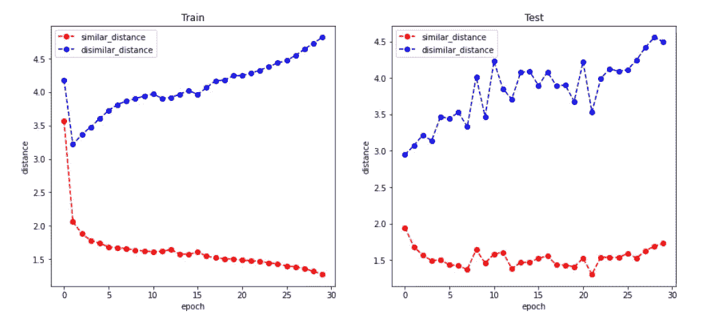

Epoch vs Distance

对于训练集，同一个人的光谱图之间的平均距离是 1.4，而不同人的光谱图之间的距离是 4.7。类似地，对于测试集，平均相似距离是 1.8，平均不相似距离是 4.4。

因为模型只是输出配对之间的距离值，所以我们可以得出结论，如果配对之间的距离小于 1.8，我们就将其标记为 1，否则将标记为 0。

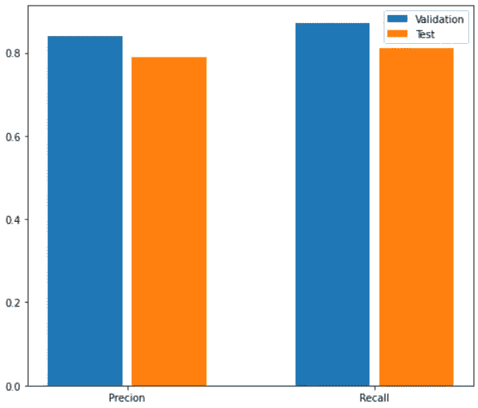

训练集的精度和召回值分别被确定为 0.87 和 0.84，而测试集的精度和召回值接近 0.8。

# 6.训练参数

该模型以 1e-4 的学习率被训练 30 个时期。采用 Adam 优化器，多项式学习率衰减，模型的前 100 步作为 warn 步骤。

[](/mlearning-ai/mlearning-ai-submission-suggestions-b51e2b130bfb) [## Mlearning.ai 提交建议

### 如何成为 Mlearning.ai 上的作家

medium.com](/mlearning-ai/mlearning-ai-submission-suggestions-b51e2b130bfb)