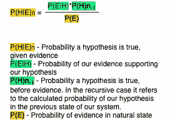
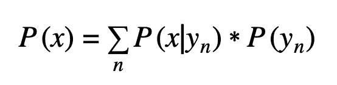
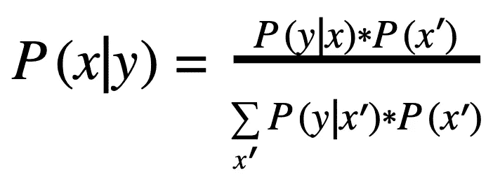
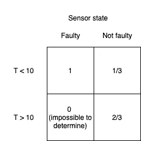
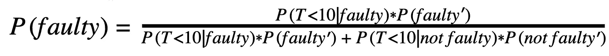
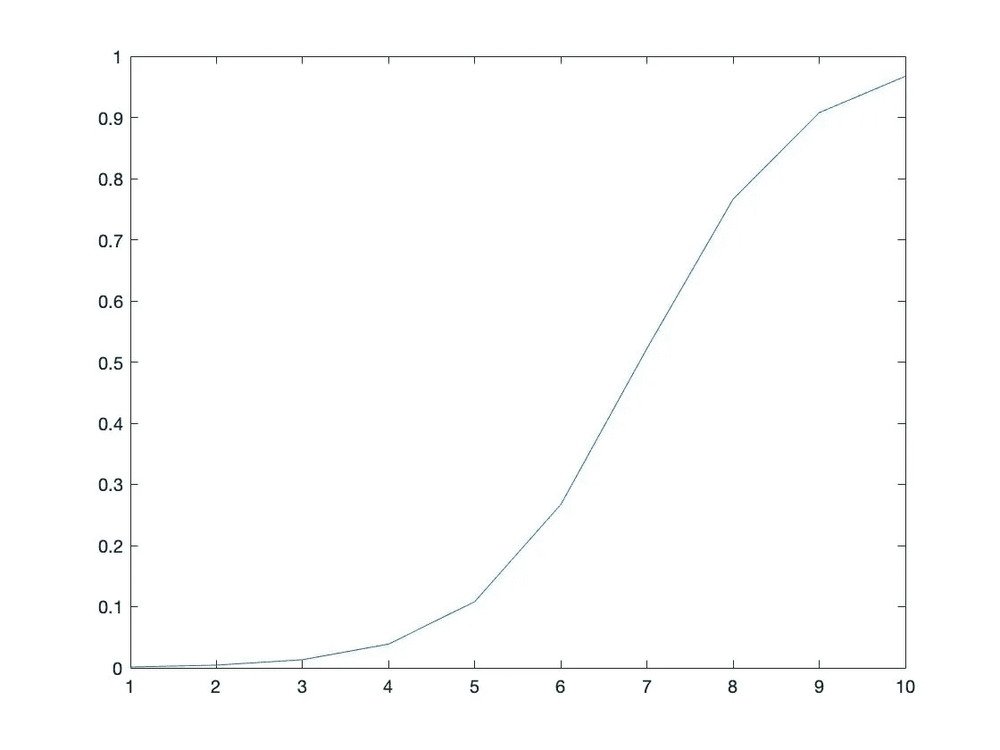
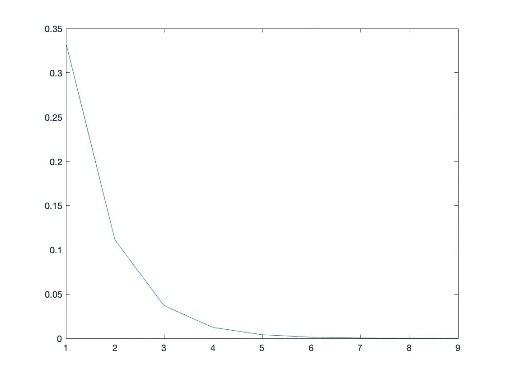
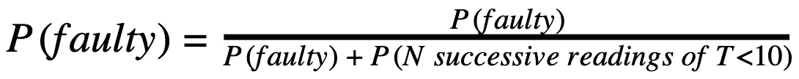

# 利用贝叶斯定理识别系统故障

> 原文：<https://medium.com/mlearning-ai/identifying-system-malfunctions-using-bayes-theorem-9a81a87eb8d0?source=collection_archive---------4----------------------->

概率机器人学导论

现代机器人工程师对制造完全自主的系统越来越感兴趣。自动驾驶汽车、无人机、工业机器人或类似系统等技术都需要读取周围环境并做出相应的响应。为了了解他们工作的高度可变的环境，这些系统利用了现代概念，如神经网络、传感器融合和概率机器人。为了理解自治系统的决策过程是如何工作的，工程师必须熟悉概率论和统计学中的一些概念。这篇文章给出了 Baye 定理的一个基本概述，一个概率的标准，和一个真实世界的应用来帮助理解。

## 概率论语法

在概率论中，你会经常看到这种格式。类似于微积分中的函数语法，`P(x)`表示变量`A`等于`x`的概率。如果你想表示一个值等于 n 的概率，你可以写`P(n)`。

`P(x,y)` —代表两个变量的状态。这与布尔属性`AND`相同。为了表示`A = n`和`B = x`的概率，你应该写`P(n,x)`。

`P(x|y)` —这个符号是贝叶定理的基础。这就是所谓的条件概率。常被解读为“给定 y，x 的概率”。这与`P(x,y)`明显不同。

## 我们的系统来解决

在这个例子中，我们将想象一个理论上的机器人系统。为了简单起见，我们只有一个变量，当然在现实世界中会有不止一个变量。让我们想象一个机器人上的传感器正在试图读取其工作温度(摄氏度),以确定是否应该激活其冷却循环。为了进一步简化系统，让我们假设温度在 0–30 之间呈均匀分布。这意味着你的体温可能是 3 度，也可能是 29 度。虽然这并不代表真实的分布，但它将帮助我们更好地理解该定理。

然而，制造商已经警告我们，我们的传感器有可能出现故障，因为他们最近在工厂的 QA 确定，他们的传感器只有一小部分返回 0 到 10 之间的温度。

在他们的测试中，他们估计大约 0.05%的传感器有这种故障，并建议测试传感器。为了测试我们的传感器，我们决定每小时从传感器收集一次数据。每次我们读取数据时，我们得到的读数都在 0 到 10 之间，但是，我们的经理告诉我们，如果我们 95%确定传感器有故障，我们应该联系传感器制造商，因为更换系统上的传感器是一笔巨大的费用。我们需要读取多少次温度，才能 95%确定传感器坏了？

## 贝耶定理

这是贝叶定理何时派上用场的一个例子。通过递归运行这个等式 N 次，我们可以找出在我们 95%确定传感器损坏之前我们需要获取多少读数。



Baye’s Theorem in discrete case

Baye 定理用于讨论在给定具体证据的情况下，某一事件发生的概率。网上有许多[公式](https://brilliant.org/wiki/bayes-theorem/#:~:text=Bayes%27%20theorem%20is%20a%20formula%20that%20describes%20how,a%20wide%20range%20of%20problems%20involving%20belief%20updates.)和[证明](http://www.hep.upenn.edu/~johnda/Papers/Bayes.pdf#:~:text=Proof%20of%20Bayes%20Theorem.%20The%20probability%20of%20two,of%20B%20given%20that%20A%20has%20occurred%2C%20P%28B%7CA%29.)，如果你想了解定理应用之外的更多信息。在本文后面的结论部分，我将回到贝耶定理所代表的内容。

为了准确地使用贝耶定理，我们需要三样东西:假设、证据和证据出现的概率。在这种情况下，我们的假设是传感器坏了的概率，我们的证据是温度读数在 10 以下，温度读数在 10 以下的概率是 1/3，大约是 33.3%。

以下是一些你在阅读或解决统计推论时会遇到的术语:

先前— `P(H)`

这是我们对一个值的概率的假设，在系统运行之前。在上式中，这由 P(H)表示，是我们对传感器出厂故障频率的假设。

观察— `E`

这是我们估计的真实世界表示。在这个系统中，它代表现实世界中的实际温度。所以`P(E)`代表温度`E`的频率。

后— `P(H|E)`

这是我们正在求解的值，它是给定真实世界的观察，我们的假设为真的概率(或在某些情况下概率的分布)。

生成模型— `P(E|H)`

在这种情况下，给定假设，我们的生成模型是我们观察的概率。

这里我们还会用到另一个重要的定理，这就是全概率定理。这说明了以下情况:



theorem of total probability in the discrete case

这是基于条件概率的定义。这个定理表明，可以使用 y 的条件概率来知道 x 的概率，每个条件概率本身都是已知的。网上也有这个定理[的公式](https://byjus.com/maths/total-probability-theorem/)。

用这个来代替贝耶定理中的`P(E)`，并且把易于理解的`E`和`I` 换成更专业的`x`和`y`，我们将得到下面的方程，我们将在初始条件下使用它:



Discrete Baye’s theorem with theorem of total probability

## 输入条件

我们对于这个系统的初始条件非常重要。这些是我们将代入贝耶定理的数字。我们有以下变量:

`A` —我们的系统是否有故障，所以`P(faulty)`代表我们的系统有故障的概率。

`T` —观察到的温度。由于我们不知道真实世界的温度，我们将只使用观察到的温度来解决这个系统。

`B` —在我们的观察中，温度是否在 0–10 之间。所以`P(T<10)`代表我们观察到温度低于 10 的概率。

为了便于阅读和数学，我将使用小数，而不是百分比。换句话说:

```
∑P(A) = 1 or ∫P(A)dA = 1 in a continuous system
```

以下是观察模型中表示的初始条件:



Initial conditions

列表示给定`A`传感器状态的概率集合，行表示给定`B`的概率集合，温度状态低于或高于 10 度。每个单元格分别代表`B` 发生的概率。左下角单元格的文本表示如下:`P(T<10|not faulty) = .6667 (rounded to 4 significant figures`。因此，这个方块中的单元格代表我们需要插入贝耶定理的`P(y|x)`。

我们的其他初始条件如下:

`P(faulty)= 0.0005` —这些是制造商对给定传感器故障可能性的估计。这个值给了我们初始状态的`P(x)`。但是在每一次迭代中，我们会用贝耶定理在前一次迭代中给出的东西来代替它。

`P(not faulty) = 0.9995` —这只是`1 - P(faulty)`，将用于我们等式的分母。

将我们的变量代入 Baye 定理，我们得到需要递归求解的方程:



Probability that our sensor is faulty

## 迭代条件

为了解决这个问题，我将这个等式输入 Matlab:

```
solutions = [];
step = 1;Pfaulty = 0.0005;
Pnotfaulty = 0.0005;
PTl10faulty = 1;
PTl10notfaulty = 1/3;while Pfaulty < 0.95 || step == 100
   Pfaulty = (PTl10faulty * Pfaulty) ...
      / ((PTl10faulty * Pfaulty) + (PTl10notfaulty * (1 - Pfaulty))); solutions(step) = Pfaulty;
   step = step + 1;
endplot(solutions);
```

这段代码将允许我们对之前提出的算法进行 N 次迭代。当循环停止时，我们将得到我们的结果，并且`step`将等于 N，或者我们经历了多少次迭代来找到答案。我们还绘制了`P(faulty)`数据的曲线图。在我们运行这个之后，我们看到在 10 次迭代之后，我们有 96.73%的把握传感器有故障。



Our certainty after each iteration

如果我们让这个过程继续，它将继续接近 1，但在这里，我们可以 95%确定，这应该足以交换传感器。

## 结论

现在我们可以完全理解为什么贝叶定理是有用的了。大多数人解决这个问题的自然反应是找出连续 N 次收到`T<10`读数的可能性，并从 1 中减去解决方案。这做对了一件事，当你连续 N 次收到`T<10`的几率达到 5%时，它会告诉你，这对于指示可能有问题是有用的。但是，使用这种方法，您将会丢失一个关键变量；传感器损坏的可能性仍然低于接收这些读数的可能性。

这是我在 Matlab 中使用二项式分布函数制作的图表，它显示了连续 N 次获得`T<10`读数的可能性:



Likelihood of reading T<10 N times in a row, plotted over N

你可以看到，在 3 次滚动后，我们有低于 5%的可能性，如果我们遵循二项式分布方法，我们会说传感器有故障，而实际上只有 1.33%的机会传感器有故障，使用 Baye 定理。那么，为什么我们如此不确定传感器是错误的，即使有 95%的可能性我们不会**接收到**连续 3 次的`T<10`读数。

这是我们忘记的关键因素，即传感器故障的绝对可能性为 0.05%，这仍然远远低于 5%的连续读数概率。虽然我们处于一种不太可能的状态，但传感器损坏的可能性更大。事实上，这就是贝叶定理所衡量的，它本质上是比较这两个数字，并告诉我们应该更相信哪个。

当我们在 7 次迭代后比较两次测量的概率时，我们可以看到这一点的确凿证据。传感器坏了的绝对概率还是. 05%，`T<10`连续 7 次读数的概率是. 0457%。这是两者概率相差无几的关键时刻，而贝叶定理给了我们什么？50%左右。

所以现在我们可以看到什么是贝叶定理*真正的*测量，它只是:



The true measurement of Baye’s theorem revealed

这就说明了为什么贝叶定理如此奇妙，它可以揭示统计学的许多错误观念，让我们可以比较两个概率，而不是在一个单一的概率上下结论。

## 其他应用

这个定理还有许多其他的应用，如果你选择学习概率论，你会看到它被广泛使用。你会在医学中经常看到这种情况，比如“病人患风湿性关节炎的百分比”。在这个例子中，我们将比较一个实际上没有患病但有类风湿性关节炎症状的患者的概率，与患有该疾病的概率。它也被用于[公司财务](https://corporatefinanceinstitute.com/resources/knowledge/other/bayes-theorem/#:~:text=Example%20of%20Bayes%E2%80%99%20Theorem%201%20P%20%28A%29%20%E2%80%93,given%20the%20stock%20price%20has%20increased%20by%205%25.)。如果你对这个定理的更多应用感兴趣，我推荐你在网上搜索，有很多视频和文章展示了这个定理的进一步应用。