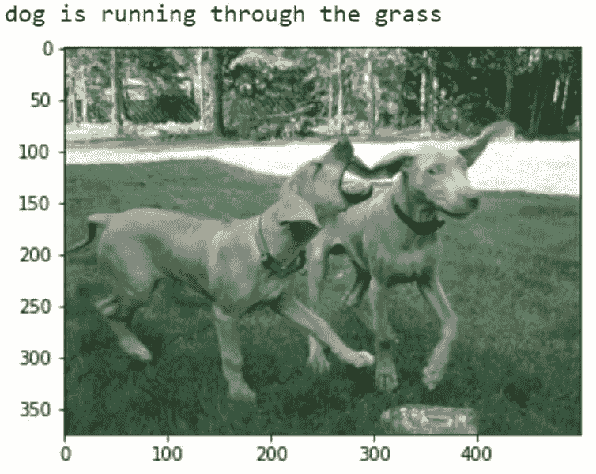
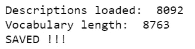
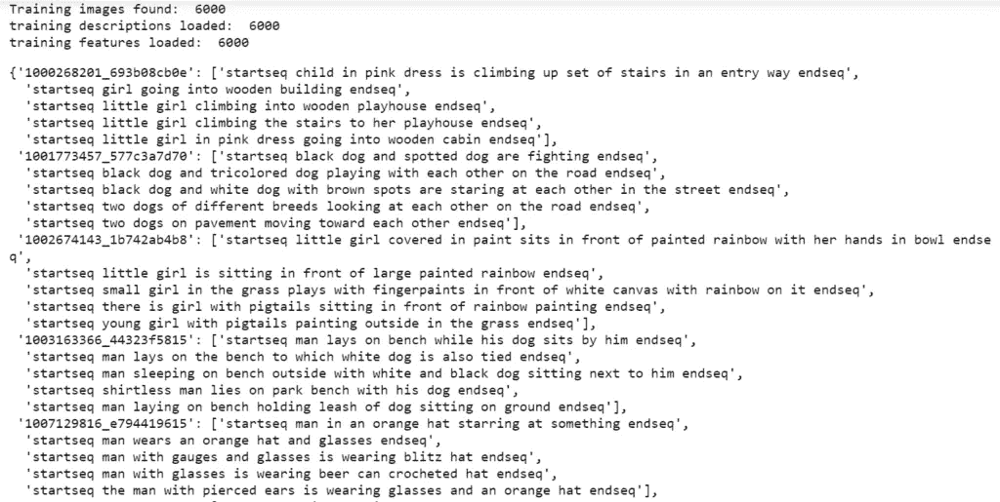
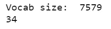
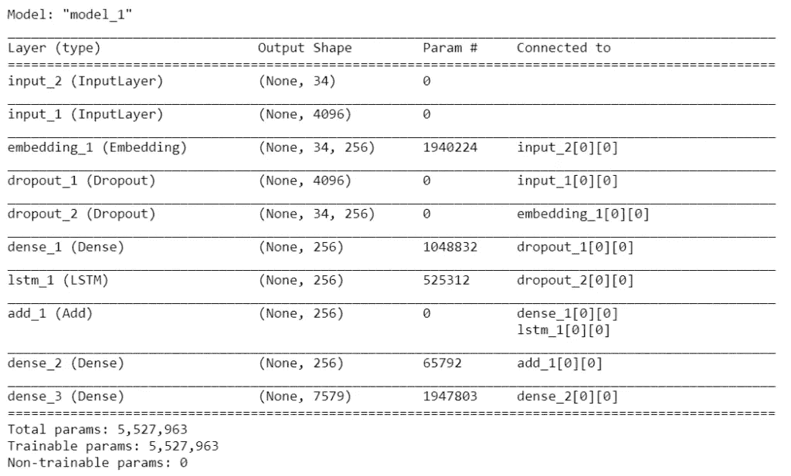
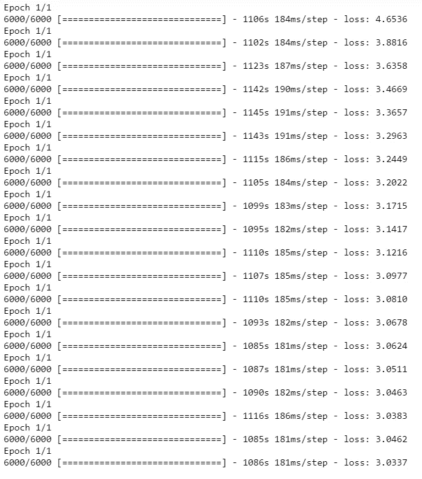
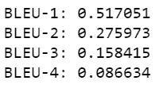

# 使用深度学习的图像字幕-带源代码-易于实施

> 原文：<https://medium.com/mlearning-ai/image-captioning-using-deep-learning-with-source-code-easy-explanation-3f2021a63f14?source=collection_archive---------0----------------------->

所以在今天的博客中，我们将实施图像字幕项目，这是一个非常先进的项目。对于这个用例，我们将结合使用 LSTMs 和 CNN。所以没有任何进一步的原因。

**点击此处阅读带源代码的整篇文章—**【https://machinelearningprojects.net/image-captioning/ 



Image Captioning

# 让我们开始吧…

## 步骤 1-导入图像字幕所需的库。

```
import os
import pickle
import string
import tensorflow
import numpy as np
import matplotlib.pyplot as plt
from keras.layers.merge import add
from keras.models import Model,load_model
from keras.callbacks import ModelCheckpoint
from keras.preprocessing.text import Tokenizer
from keras.utils import to_categorical,plot_model
from keras.preprocessing.sequence import pad_sequences
from keras.applications.vgg16 import VGG16,preprocess_input
from keras.layers import Input,Dense,LSTM,Embedding,Dropout
from keras.preprocessing.image import img_to_array,load_img
from nltk.translate.bleu_score import sentence_bleu,corpus_bleu
%matplotlib inline
```

## 第二步——使用 [VGG-16](https://neurohive.io/en/popular-networks/vgg16/#:~:text=VGG16%20is%20a%20convolutional%20neural%20network%20model%20proposed%20by%20K.&text=Zisserman%20from%20the%20University%20of,images%20belonging%20to%201000%20classes.) 从图像中提取特征。

```
def extract_features(directory):
  model = VGG16()
  model.layers.pop()
  model = Model(inputs=model.inputs,outputs=model.layers[-1].output)
  print(model.summary())
  features = {}
  i=0
  for name in os.listdir(directory):
    print(i)
    img = load_img(directory+'/'+name,target_size=(224,224))
    img = img_to_array(img)
    img = img.reshape((1,img.shape[0],img.shape[1],img.shape[2]))
    img = preprocess_input(img)
    feature = model.predict(img,verbose=0)
    img_id = name.split('.')[0]
    features[img_id] = feature
    i+=1
  return features

directory ='drive/My Drive/image_captioning/Flicker8k/Flicker8k_Dataset'
features = extract_features(directory)
```

## 步骤 3-加载、清理和保存图像描述。

```
def load_description(filename):
  mappings = {}
  file = open(filename,'r')
  content = file.readlines()
  file.close()
  for lines in content:
    tokens = lines.split()
    if len(lines)<2:
      continue
    image_id,image_desc = tokens[0].split('.')[0],tokens[1:]
    image_desc = ' '.join(image_desc)
    if image_id not in mappings:
      mappings[image_id] = []
    mappings[image_id].append(image_desc)
  return mappings

def clean_description(descriptions):
  table = str.maketrans('','',string.punctuation)
  for k,image_descriptions in descriptions.items():
    for i in range(len(image_descriptions)):
      desc = image_descriptions[i]
      desc = desc.split()
      desc = [x.lower() for x in desc]
      desc = [w.translate(table) for w in desc]
      desc = [x for x in desc if len(x)>1]
      desc = [x for x in desc if x.isalpha()]
      image_descriptions[i] = ' '.join(desc)

def create_corpus(descriptions):
  corpus = set()
  for k in descriptions.keys():
    [corpus.update(x.split()) for x in descriptions[k]]
  return corpus

def save_descriptions(desc,filename):
  lines = []
  for k,v in desc.items():
    for description in v:
      lines.append(k+' '+description)
  data = '\n'.join(lines)
  file = open(filename,'w')
  file.write(data)
  file.close()

# load all descriptions
filename = 'drive/My Drive/image_captioning/Flicker8k/Flickr8k.token.txt'
descriptions = load_description(filename)
print('Descriptions loaded: ',len(descriptions))

# clean the loaded descriptions
clean_description(descriptions)

# check the vocabulary length
vocabulary = create_corpus(descriptions)
print('Vocabulary length: ',len(vocabulary))
save_descriptions(descriptions,'drive/My Drive/image_captioning/descriptions.txt')

print('SAVED !!!')
```



## 步骤 4-加载训练并测试图像特征和描述。

```
def load_set_of_image_ids(filename):
  file = open(filename,'r')
  lines = file.readlines()
  file.close()
  image_ids = set()
  for line in lines:
    if len(line)<1:
      continue
    image_ids.add(line.split('.')[0])
  return image_ids

def load_clean_descriptions(all_desc,train_desc_names):
  file = open(all_desc,'r')
  lines = file.readlines()
  descriptions = {}
  for line in lines:
    tokens = line.split()
    image_id,image_desc = tokens[0].split('.')[0],tokens[1:]
    if image_id in train_desc_names:
      if image_id not in descriptions:
        descriptions[image_id] = []
      desc = 'startseq ' + ' '.join(image_desc) + ' endseq'
      descriptions[image_id].append(desc)
  return descriptions

def load_image_features(filename,dataset):
  all_features = pickle.load(open(filename,'rb'))
  features = {k:all_features[k] for k in dataset}
  return features

# load train image ids
train = 'drive/My Drive/image_captioning/Flicker8k/Flickr_8k.trainImages.txt'
train_image_ids = load_set_of_image_ids(train)
print('Training images found: ',len(train_image_ids))

# load training descriptions
train_descriptions = load_clean_descriptions('drive/My Drive/image_captioning/descriptions.txt',train_image_ids)
print('training descriptions loaded: ',len(train_descriptions))

# load training image features
train_features = load_image_features('drive/My Drive/image_captioning/Flicker_dataset_image_features.pkl',train_image_ids)
print('training features loaded: ',len(train_features))

train_descriptions
```



## 第 5 步——获得形状描述。

```
def to_list(descriptions):
  all_desc_list = []
  for k,v in descriptions.items():
    for desc in v:
      all_desc_list.append(desc)
  return all_desc_list

def tokenization(descriptions):
  # list of all the descriptions
  all_desc_list = to_list(descriptions)  
  tokenizer = Tokenizer()
  tokenizer.fit_on_texts(all_desc_list)
  return tokenizer

# create tokenizer
tokenizer = tokenization(train_descriptions)

# word index is the dictionary /mappings of word-->integer
vocab_size = len(tokenizer.word_index)+1
print('Vocab size: ',vocab_size)

def max_length(descriptions):
  all_desc_list = to_list(descriptions)
  return (max(len(x.split()) for x in all_desc_list))

def create_sequences(tokenizer,desc_list,max_len,photo):
  X1,X2,y = [],[],[]
  # X1 will contain photo
  # X2 will contain current sequence
  # y will contain one hot encoded next word

  for desc in desc_list:
    # tokenize descriptions
    seq = tokenizer.texts_to_sequences([desc])[0]
    for i in range(1,len(seq)):
      # out seq is basically the next word in the sentence
      in_seq,out_seq = seq[:i],seq[i]
      # pad input sequence
      in_seq = pad_sequences([in_seq],maxlen=max_len)[0]
      # one hot encode output sequence
      out_seq = to_categorical([out_seq],num_classes=vocab_size)[0]
      X1.append(photo)
      X2.append(in_seq)
      y.append(out_seq)
  return np.array(X1),np.array(X2),np.array(y)

# maximum length that a description can have OR the biggest description we are having
max_len = max_length(train_descriptions)
print(max_len)
```



## 步骤 6-生成数据和创建模型的功能。

```
def data_generator(descriptions,photos,tokenizer,max_len):
  while 1:
    for k,desc_list in descriptions.items():
      photo = photos[k][0]
      in_img,in_seq,out_seq = create_sequences(tokenizer,desc_list,max_len,photo)
      yield[[in_img,in_seq],out_seq]

def define_model(vocab_size, max_length):
    # image features extractor model
    inputs1 = Input(shape=(4096,))
    fe1 = Dropout(0.5)(inputs1)
    fe2 = Dense(256, activation='relu')(fe1)

    # input sequence model
    inputs2 = Input(shape=(max_length,))
     # embedding(input_dimension,output_dimension,)
     # input dim is always the vocabulary size 
    # output dimension tells the size of vector space in which the words will be embedded
    # mask zero is used when the input itself is 0 then to not confuse it with padded zeros it is used as True
    se1 = Embedding(vocab_size, 256, mask_zero=True)(inputs2)
    se2 = Dropout(0.5)(se1)
    se3 = LSTM(256)(se2)

    # decoder model OR output word model
    decoder1 = add([fe2, se3])
    decoder2 = Dense(256, activation='relu')(decoder1)
    outputs = Dense(vocab_size, activation='softmax')(decoder2)

    # tie it together [image, seq] [word]
    model = Model(inputs=[inputs1, inputs2], outputs=outputs)
    model.compile(loss='categorical_crossentropy', optimizer='adam')

    # summarize model
    print(model.summary())
    return model
```

## 步骤 7-创建和训练图像字幕模型。

```
model = define_model(vocab_size,max_len)
epochs = 20
steps = len(train_descriptions)
for i in range(epochs):
  generator = data_generator(train_descriptions,train_features,tokenizer,max_len)
  model.fit_generator(generator,epochs=1,steps_per_epoch=steps,verbose=1)
  model.save('drive/My Drive/image_captioning/model_'+str(i)+'.h5')
```



## 步骤 8-图像字幕模型的预测和评估函数。

```
def int2word(tokenizer,integer):
  for word,index in tokenizer.word_index.items():
    if index==integer:
      return word
  return None

def predict_desc(model,tokenizer,photo,max_len):
  in_seq = 'startseq'
  for i in range(max_len):
    seq = tokenizer.texts_to_sequences([in_seq])[0]
    seq = pad_sequences([seq],maxlen=max_len)
    y_hat = model.predict([photo,seq],verbose=0)
    y_hat = np.argmax(y_hat)
    word = int2word(tokenizer,y_hat)
    if word==None:
      break
    in_seq = in_seq+' '+word
    if word=='endseq':
      break
  return in_seq

def evaluate_model(model,descriptions,photos,tokenizer,max_len):
  actual,predicted = [],[]
  for key,desc in descriptions.items():
    y_hat = predict_desc(model,tokenizer,photos[key],max_len)
    references = [d.split() for d in desc]
    actual.append(references)
    predicted.append(y_hat.split())
  print('BLEU-1: %f' %corpus_bleu(actual,predicted,weights=(1.0,0,0,0)))
  print('BLEU-2: %f' %corpus_bleu(actual,predicted,weights=(0.5,0.5,0,0)))
  print('BLEU-3: %f' %corpus_bleu(actual,predicted,weights=(0.33,0.33,0.33,0)))
  print('BLEU-4: %f' %corpus_bleu(actual,predicted,weights=(0.25,0.25,0.25,0.25)))
```

## 步骤 9-评估图像字幕模型。

```
####################  load training data (6k)  ##########################
train = 'drive/My Drive/image_captioning/Flicker8k/Flickr_8k.trainImages.txt'
train_image_ids = load_set_of_image_ids(train)
print('Training images found: ',len(train_image_ids))

# load training descriptions
train_descriptions = load_clean_descriptions('drive/My Drive/image_captioning/descriptions.txt',train_image_ids)
print('training descriptions loaded: ',len(train_descriptions))

tokenizer = tokenization(train_descriptions)
max_len = max_length(train_descriptions)

####################  load test data  ##########################
test = 'drive/My Drive/image_captioning/Flicker8k/Flickr_8k.testImages.txt'
test_image_ids = load_set_of_image_ids(test)
print('Test images found: ',len(test_image_ids))

# load test descriptions
test_descriptions = load_clean_descriptions('drive/My Drive/image_captioning/descriptions.txt',test_image_ids)
print('test descriptions loaded: ',len(test_descriptions))

# load test image features
test_features = load_image_features('drive/My Drive/image_captioning/Flicker_dataset_image_features.pkl',test_image_ids)
print('training features loaded: ',len(test_features))
#################################################################
filename = 'drive/My Drive/image_captioning/model_18.h5'
model = load_model(filename)
evaluate_model(model,test_descriptions,test_features,tokenizer,max_len)
```



## 步骤 10 —实时图像字幕。

```
img_to_test = 'drive/My Drive/image_captioning/983801190.jpg'
img = plt.imread(img_to_test)
plt.imshow(img)

def extract_features(filename):
    # load the model
    model = VGG16()
    # re-structure the model
    model.layers.pop()
    model = Model(inputs=model.inputs, outputs=model.layers[-1].output)
    # load the photo
    image = load_img(filename, target_size=(224, 224))
    # convert the image pixels to a numpy array
    image = img_to_array(image)
    # reshape data for the model
    image = image.reshape((1, image.shape[0], image.shape[1], image.shape[2]))
    # prepare the image for the VGG model
    image = preprocess_input(image)
    # get features
    feature = model.predict(image, verbose=0)
    return feature

# pre-define the max sequence length (from training)
max_length = 34
# load the model
model = load_model('drive/My Drive/image_captioning/model_18.h5')
# load and prepare the photograph
photo = extract_features(img_to_test)
# generate description
description = predict_desc(model, tokenizer, photo, max_length)

description = ' '.join(description.split()[1:-1])
print()
print(description)
```


Image Captioning

如果对图片说明有任何疑问，请通过电子邮件或 LinkedIn 联系我。

*这就是我写给这个博客的全部内容，感谢你的阅读，我希望你在阅读完这篇文章后，能有所收获，直到下一次👋…*

**还做检查我的其他** [**机器学习项目**](https://machinelearningprojects.net/machine-learning-projects/)**[**深度学习项目**](https://machinelearningprojects.net/deep-learning-projects/)**[**计算机视觉项目**](https://machinelearningprojects.net/opencv-projects/)**[**烧瓶项目**](https://machinelearningprojects.net/flask-projects/)**[**NLP 项目**](https://machinelearningprojects.net/nlp-projects/)********

********如需进一步的代码解释和源代码，请访问此处**——【https://machinelearningprojects.net/image-captioning/ ******

*******看我之前的帖子:*** [***利用深度卷积生成对抗网络(DCGAN)生成 CIFAR-10 伪图像***](https://machinelearningprojects.net/deep-convolutional-generative-adversarial-networks/)****

****[](/mlearning-ai/mlearning-ai-submission-suggestions-b51e2b130bfb) [## Mlearning.ai 提交建议

### 如何成为 Mlearning.ai 上的作家

medium.com](/mlearning-ai/mlearning-ai-submission-suggestions-b51e2b130bfb)****