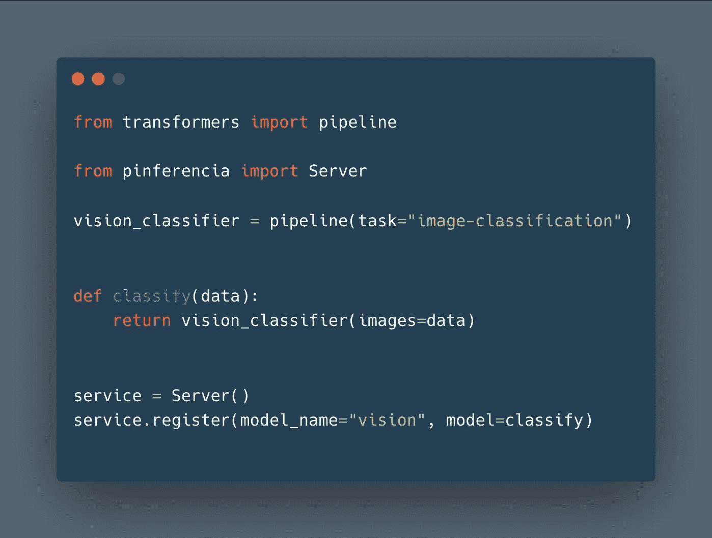
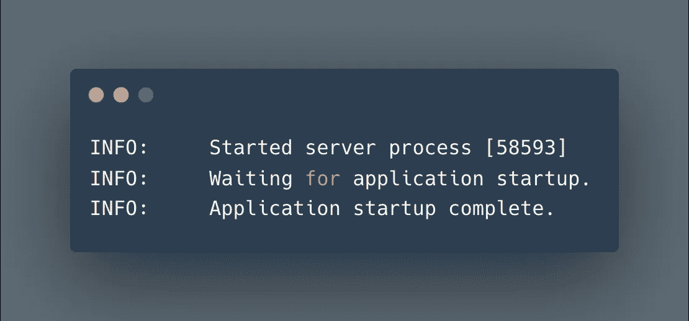
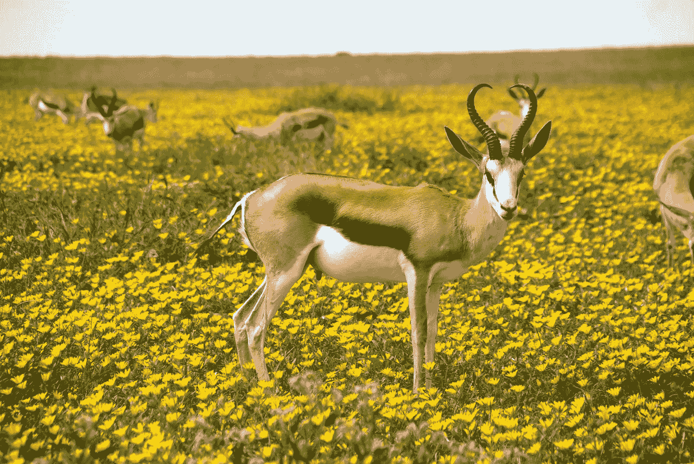
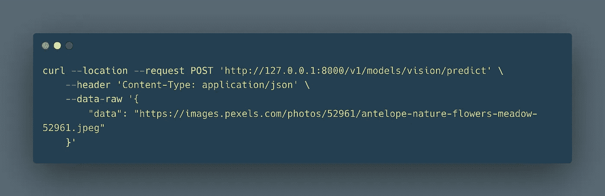
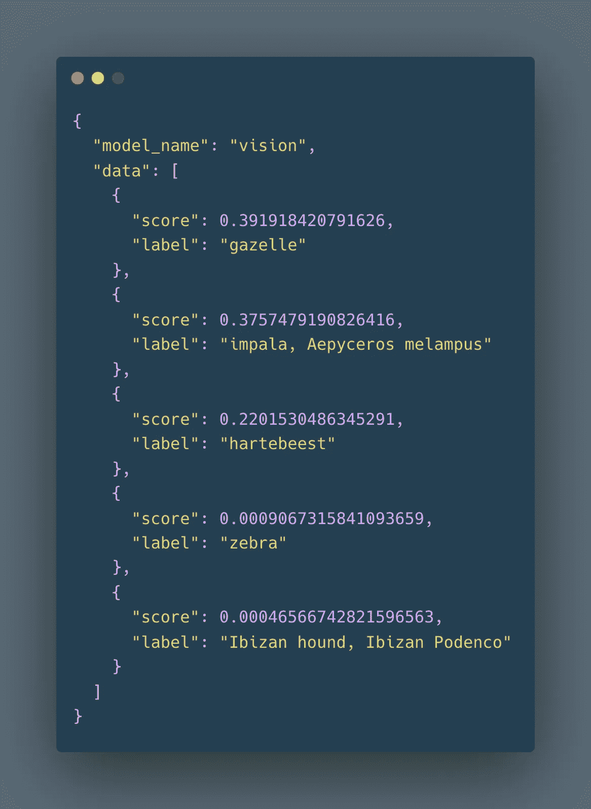
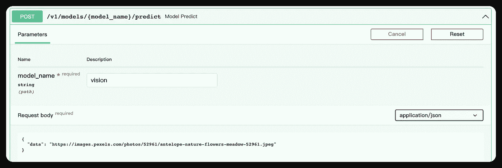
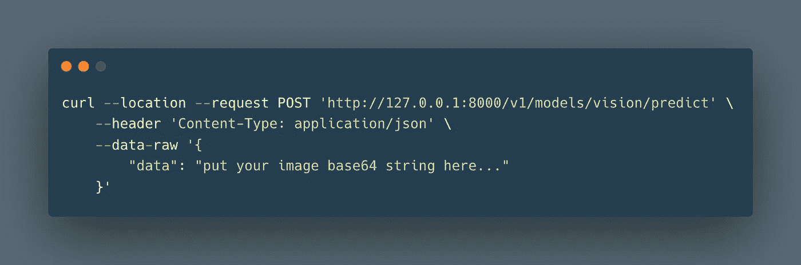

# 图像分类 101 与拥抱脸和 Pinferencia

> 原文：<https://medium.com/mlearning-ai/image-classification-101-huggingface-and-pinferencia-7881d34fd914?source=collection_archive---------4----------------------->

图像分类使**简单了**。借助 HuggingFace 和 P [推理](https://github.com/underneathall/pinferencia)的力量，你可以在 5 分钟内部署一个图像分类。


在本教程中，我们将使用 [HuggingFace](https://huggingface.co/) 和 [Pinferencia](https://github.com/underneathall/pinferencia) 来部署模型，以使用图像的 URL 对图像进行分类。

为了更加实用，我们通过使用图像的 Base64 编码字符串对图像进行分类来改进服务。



[**Pinferencia**](https://github.com/underneathall/pinferencia) 只需三条额外线路，就能轻松为任何模特提供服务。
[**拥抱脸**](https://huggingface.co/) 只需几行就能轻松使用预训练模型。

# 安装依赖项

## 拥抱脸

`pip install "transformers[pytorch]"`

如果不起作用，请访问[安装(huggingface.co)](https://huggingface.co/docs/transformers/installation)并检查他们的官方文件。

## 平费伦西亚

`pip install "pinferencia[uvicorn]"`

如果不行，请访问[https://pinferencia . under neat hall . app](https://pinferencia.underneathall.app/)查看他们的官方文档。

# 定义服务

将以下代码保存到`app.py`:

## 代码解释:

**第 1–3 行**:导入依赖关系。
**第 5 行**:下载并初始化 huggingface 模型。
**第 8–9 行**:定义一个函数来运行预测。
**第 12–13 行**:初始化服务器，注册模型。

现在让我们运行服务

# 启动服务

运行:

```
uvicorn app:service --reload
```

等待模型被下载。完成后，您会看到:



# 呼叫服务

你可以使用比利时的`curl`或`interactive api page`。

让我们使用一个免费的图像:

[https://images . pexels . com/photos/52961/羚羊-自然-花朵-草地-52961.jpeg](https://images.pexels.com/photos/52961/antelope-nature-flowers-meadow-52961.jpeg)



## 卷曲



结果:



得分最高的一句话是:企鹅不会飞。有道理，对吧？

除了 Curl，你还可以访问 http://127.0.0.1 使用 [Pinferencia 的](https://github.com/underneathall/pinferencia):

# 交互式 API 页面



# 提高发球质量

但是，使用图像的 url 来预测有时并不合适。

让我们创建一个文件`base64_app.py`，稍微修改一下，接受 **Base64 编码的字符串**作为输入。

您可以使用 [Image to Base64 converter 将图像转换为 Base64 字符串。(codebeautify.org)](https://codebeautify.org/image-to-base64-converter)找出图像的 Base64 编码字符串。

让我们再次卷曲:



不出意外，同样的结果:


如果你喜欢我的文章，点击你右边的关注按钮。

感谢 [HuggingFace](https://huggingface.co/) 和 [Pinferencia](https://github.com/underneathall/pinferencia) 提供了很棒的库。

[](/mlearning-ai/mlearning-ai-submission-suggestions-b51e2b130bfb) [## Mlearning.ai 提交建议

### 如何成为 Mlearning.ai 上的作家

medium.com](/mlearning-ai/mlearning-ai-submission-suggestions-b51e2b130bfb)