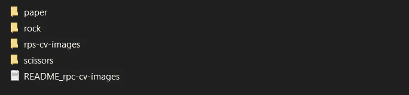
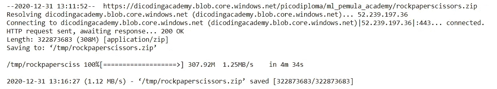
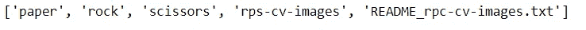
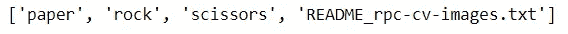
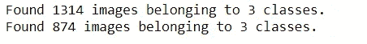
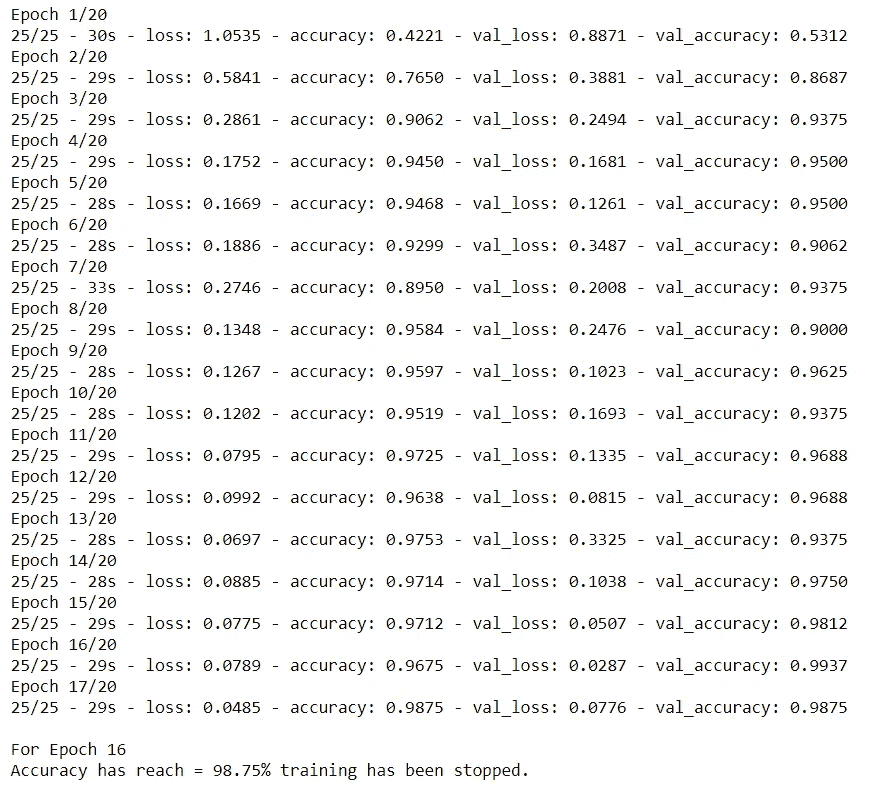
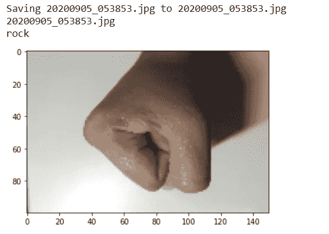

# 基于卷积神经网络的石头剪子布图像分类

> 原文：<https://medium.com/mlearning-ai/image-classification-of-rock-paper-scissors-pictures-using-convolutional-neural-network-cnn-c3d2db127cdb?source=collection_archive---------1----------------------->

Photo by [Fadilah N. Imani](https://unsplash.com/@imanitor?utm_source=medium&utm_medium=referral) on [Unsplash](https://unsplash.com?utm_source=medium&utm_medium=referral)

这个项目是我提交给 Dicoding Academy — [初级班](https://www.dicoding.com/academies/184)的机器学习。该项目将讲述使用**卷积神经网络**对石头剪刀布图像进行**图像分类。为了构建模型，我们将在 Tensorflow 和 Keras 包的帮助下使用 Python。请参考[这里的](https://github.com/imfdlh/dicoding/blob/master/CNN-rockpaperscissors/fadilahnurimani_submission.ipynb)获取完整的笔记本。请注意，一些包可能无法在 Jupyter Notebook 中工作，因为我使用了 Colab Notebook(例如:从 google.colab 导入文件)。**

***卷积神经网络(CNN )*** *是一种深度学习算法，是为计算机视觉设计的，比如图像和视频数据。*

# 数据集石头剪子布

这是我们将在这个项目中使用的一个名为“rockpaperscissors.zip”的目录文件的结构的一瞥。你可以在 kaggle 上的这里找到数据集[。](https://www.kaggle.com/drgfreeman/rockpaperscissors)

# 导入包/库

我们将使用的包是 TensorFlow 2 和 Keras。在 Tensorflow 2 中，Keras 包与 Tensorflow 集成在一起，这意味着一旦导入了 Tensorflow，就可以使用 Keras。

至于 ImageDataGenerator，我们将在图像增强阶段使用它进行图像预处理。

# 下载并提取数据集

使用`wget` 命令从链接下载数据集。

Download and extract dataset

为了能够使用数据集，我们需要首先使用`zipfile` 库提取它们。

# 检查目录

我们用`listdir` 从`os`库中读取“石头剪刀布”目录的内容。

read the content of “rockpaperscissors”

同样的代码也适用于“rock paper scissors/RPS-cv-images”目录。这是将用于**基本目录**的目录。

read the content of “rockpaperscissors/rps-cv-images”

# 图像增强的数据预处理

图像增强是数据预处理阶段的一部分。图像增强用于从现有数据集生成新版本的训练图像。图像放大的一些例子是水平或垂直翻转图像、旋转、缩放等等。有了 Keras，我们可以使用`ImageDataGenerator`功能来创建图像增强。

在这个项目中，我们将在 ImageDataGenerator 中使用 6 个参数，如下 3–8 行所示:

*   `rescale` **= 1。/255** :重新缩放像素值 1。/255 从 0–255 范围到 0–1 范围。
*   `rotation_range` **= 20** :在 0-20 度范围内旋转图像。
*   `horizontal_flip` **= True** :水平旋转图像。
*   `shear_range`**= 0.2**:0.2 度范围内逆时针方向的剪切角度。
*   `fill_mode` **= 'wrap'** :用 wrap (abcdabcd|abcd|abcdabcd)模式填充外部边界点。
*   `validation_split` **= 0.4** :按验证步骤总数据集的 40%分割图像。

图像数据生成器还可以帮助我们根据目录自动标记图片，这样我们就不必输入每张图片及其标签。

关于每个参数的更多解释，你可以在这里阅读文档[。](https://keras.io/api/preprocessing/image/)

# 为模型准备数据

在进入数据建模步骤之前，我们将采用当前路径到一个目标目录，并生成批量的扩充数据。我们使用`subset`参数，因为我们已经在前一步中设置了训练和验证阶段的数据百分比(`validation_split`参数)。

1314 images for training and 874 images for validation

*   **base_dir** :目标目录的路径(base_dir)。
*   `target_size` **= (100，150)** :所有找到的图像将被调整到 100 像素 x 150 像素。
*   `class_mode`**=‘分类’**:确定返回的标签数组的类型，我们使用‘分类’，因为我们有 3 类图像。
*   `subset` :如果在`ImageDataGenerator`中设置了`validation_split`，则为数据‘训练’或‘验证’的子集。

# 构建 CNN 架构

因为我们要建立一个模型来对图片进行分类，所以我们要创建一个二维(2D) CNN 架构。基本上，2D CNN 由输入层、卷积层、最大池层、用于平坦化 2D 阵列的层以及最后的输出层构成。在这个项目中，我们将建立一个使用 4 层卷积和最大池的模型。

卷积层用于提取图片的属性，而最大池层将有助于从卷积过程中减少每个图片的大小，从而训练的速度将更快。

第一层是用`input_shape` = (100，150，3)表示的 100 x 150 RGB 图片数组形状的输入层。在同一行代码(第二行)中，我们有第一个 32 节点的 2D 卷积层，3×3 滤波器，和 ReLU(校正线性单元)激活函数。ReLU 的使用是为了增加模型的非线性，因为图像自然是非线性的。这里可以阅读更多[关于 ReLU 激活函数在卷积层的作用。](https://www.superdatascience.com/blogs/convolutional-neural-networks-cnn-step-1b-relu-layer/)

在下一行代码中，我们有一个大小为 2 x 2 的 2D 最大池层。最大池通过选择具有最大值的像素来工作，并将产生与最大池层相同大小的新图片(2 x 2)。

在最大池层中处理图像之后，图像将再次处理到下一个卷积层，然后是最大池层，等等。在最后一个 max-pooling 层之后，图片数组将被展平为一维数组，并在隐藏层中再次处理。

之后，已经处于 1 维形式的图片阵列被移动到输出层，并再次使用激活函数进行处理。这次，我们将使用 softmax 函数，而不是 ReLU。当案例为多类别分类时，使用 Softmax 激活功能。因为我们有 3 个类，所以输出节点的数量将是 3。

# 编译模型:确定损失函数和优化器

在我们完成架构的构建之后，我们接着编译预构建的模型，并指定损失函数、优化器和评估指标。由于这个项目是一个多类分类案例，我们将使用分类交叉熵损失函数。至于优化器，我们将使用 adam 优化器，因为这种自适应优化器在大多数情况下工作良好。最后，为了监控模型性能，我们将使用准确性指标对它们进行评估。

# 使用回调提前停止

为了加快训练速度，我们将使用回调函数在模型达到精度阈值时提前停止。早期停止有助于减少模型过度拟合的趋势。对于这个项目，我们将声明准确率阈值为 98%。

# 训练模型

所以我们终于到了构建图像分类器的最后阶段。在此阶段，我们将使用已经在`train_generator`准备好的训练数据集在总共 20 个时期内训练预建模型，并使用在`validation_generator`准备好的验证数据集评估模型。

在这个训练过程中，我们将训练样本分为 25 个批次，验证样本分为 5 个批次。我们还将 verbose 值声明为 2，以使训练过程在输出单元格中可用。然后，由于我们实现了早期停止方法，训练过程将在达到最低 98%的准确率时停止。

data training result

# 预测图像以检查模型

耶，终于可以使用图像分类器模型了！

为了能够对新数据进行分类，我们构建了一个脚本来上传新图片，然后通过`model.predict`函数将它们加载到模型中。

image classifier output example

预测新数据时，可能会有一些不正确的预测。这是因为我们之前使用的训练数据集。在训练数据集中，所有图片都使用绿色背景，因此如果我们不使用相似的背景，模型可能会错误地预测结果。

上面的例子似乎没有显示出错误，但在一些试错过程后，我发现大多数时候，模型会对没有使用绿色背景的图片进行错误分类。

> 读者你好，
> 
> 谢谢你读到这里，非常感谢！
> 
> 此外，如果你认为这个帖子有用，请不要犹豫，在评论区或鼓掌区留下你的痕迹，这对我意义重大！:)

无论如何，你也可以访问[这里](https://www.tensorflow.org/tutorials/images/cnn)看 TensorFlow 官方网站的 CNN 教程。