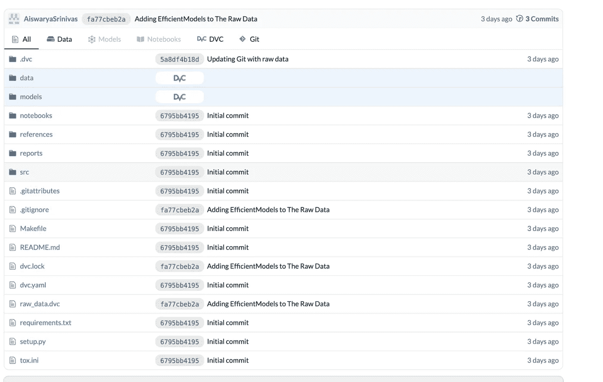
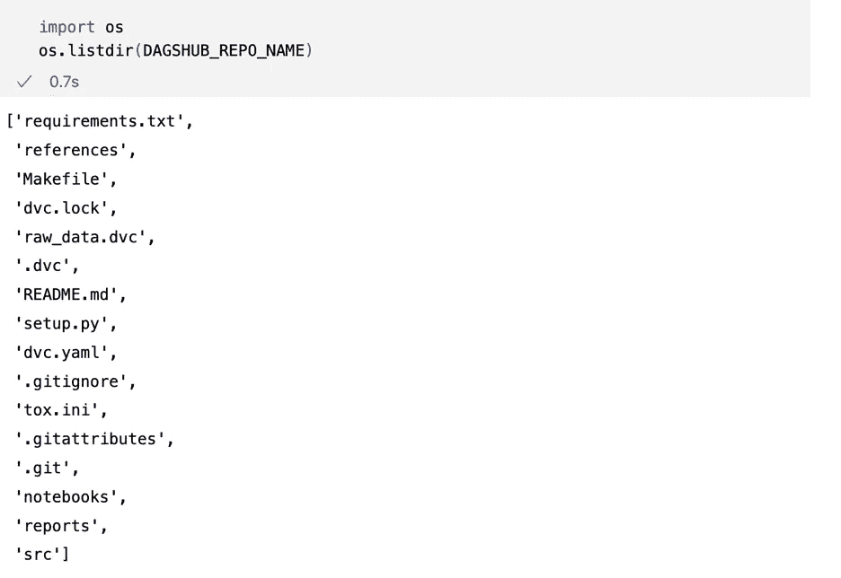
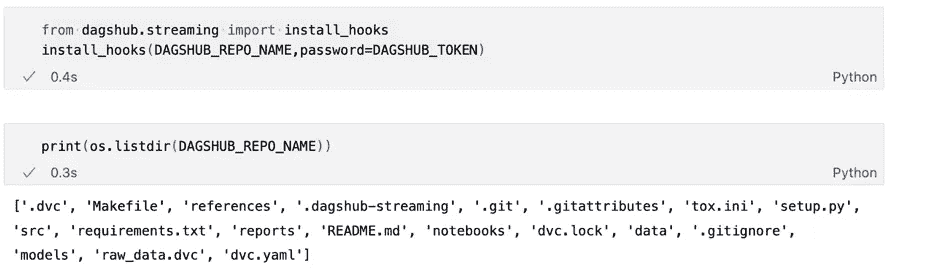
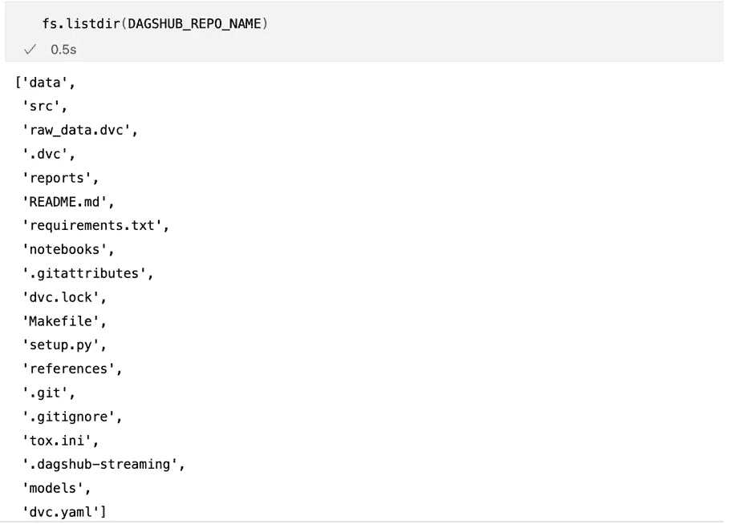
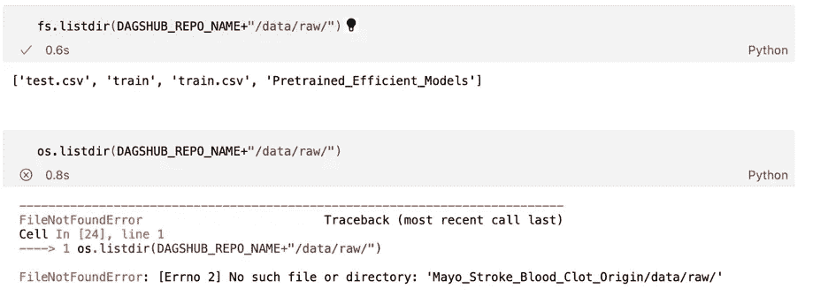
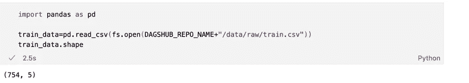
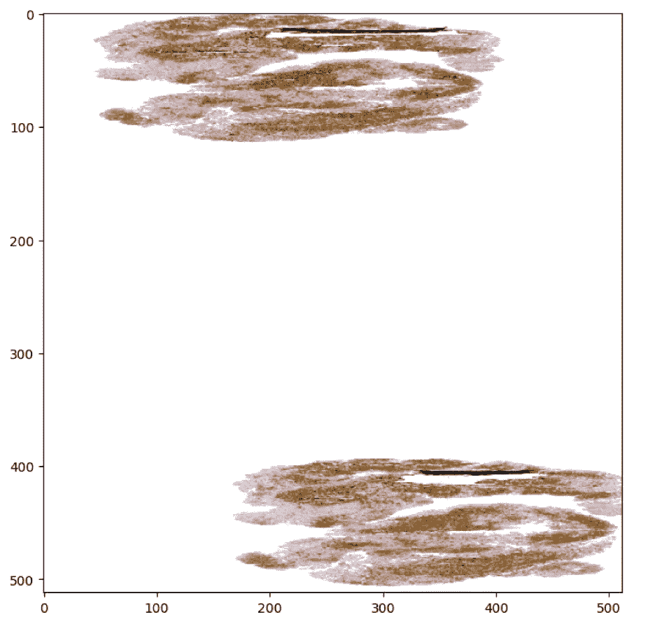
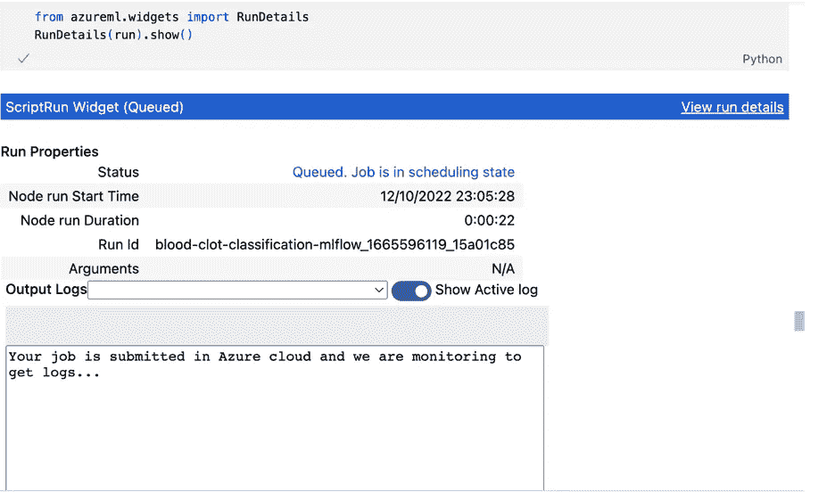
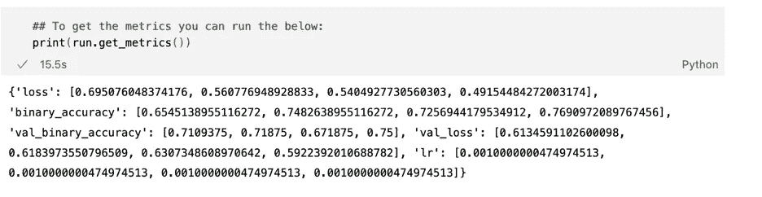

# 基于 Dagshub 直接数据访问的 Azure 图像分类

> 原文：<https://medium.com/mlearning-ai/image-classification-on-azure-with-dagshub-direct-data-access-e67f3b1d597e?source=collection_archive---------8----------------------->

使用 Dagshub 直接数据访问和 Azure ML SDK 在 Azure 上训练图像分类模型，而不在本地存储数据


# **简介**

机器学习和人工智能已经变得无处不在，数据科学家的关键技能之一是能够建立可扩展的模型，处理敏感数据，并建立可靠的数据和模型管道，这些数据和模型管道是可重复的。虽然云技术允许我们建立可扩展的管道，但我们需要将所有文件存储在我们的云上，然后才能将它们用于训练模型，这会导致 GPU 成本和时间来提取数据。

在本文中，我们将使用 Dagshub Repo 上存储的数据在 Azure 上训练一个模型，使用 Dagshub 的[直接数据访问](https://dagshub.com/blog/launching-data-streaming-and-upload/?utm_source=dagshub_homepage&utm_medium=banner&utm_campaign=DDA&utm_id=DDA) (DDA)功能，该功能允许我们在需要时批量提取数据——减少在 Azure 上提取和存储数据所需的时间，从而降低 GPU 成本。

我们将使用 Azure ML SDK 从本地机器创建培训作业，并将其推送到 Azure。我们还将看到如何从我们的 jupyter-notebook 上监控作业。

我们将使用来自 Kaggle，Mayo Clinic-STRIP AI challenge 的数据，其中重点是区分两种主要的急性缺血性中风(AIS)病因亚型:心脏动脉粥样硬化和大动脉粥样硬化。检测中风的病因可以帮助医生减少中风的复发。

本分析中使用的代码和数据可在[这里](https://dagshub.com/AiswaryaSrinivas/Mayo_Stroke_Blood_Clot_Origin)找到。

[](https://dagshub.com/AiswaryaSrinivas/Mayo_Stroke_Blood_Clot_Origin) [## AiswaryaSrinivas/Mayo _ 中风 _ 血块 _ 来源

### 这个项目的目标是对缺血性卒中的血凝块来源进行分类。使用全切片数字病理学…

dagshub.com](https://dagshub.com/AiswaryaSrinivas/Mayo_Stroke_Blood_Clot_Origin) 

# **关于数据**

最初为挑战赛提供的数据是 tiff 格式，大小为 356GB。为了便于分析，我们缩小了图像的尺寸，并将其存储为 png 格式。数据缩减的代码可以在[这里](https://www.kaggle.com/code/dschettler8845/mcsai-how-to-interact-with-large-tif-files)找到。缩小的图像可以在[这里](https://www.kaggle.com/datasets/robertlangdonvinci/mcsaidownscaledimages)找到。为了将图像映射到它们所属的类，竞赛数据为我们提供了一个包含数据信息的 CSV 文件。这些数据可以在[这里](https://www.kaggle.com/competitions/mayo-clinic-strip-ai/data)找到。

训练数据集中的“标签”列由图像所属的类组成。训练数据文件夹包括 754 幅图像，其中 547 幅属于 CE 类(心脏), 207 幅属于 LAA 类(大动脉粥样硬化)。在我们的分析中，我们创建了一个名为“int_labels”的列，如果图像属于“LAA”类，则该列的值为 1，否则该列的值为 0。

# **接近**

为了使用 Azure 来训练我们的模型，我们将使用 Azure ML SDK 并在 Azure 上运行我们的代码。这将需要我们在 Azure 上创建一个 ML 工作空间和一个 GPU 计算。一般来说，我们将数据上传到 Azure 存储上，并创建数据存储以允许 ML Workspace 访问我们的数据。我们不打算将数据存储在 Azure 上，而是从 Dagshub 存储库中流式传输数据。

要设置 Azure Workspace 并使用 Azure ML SDK 创建一台计算机，请参考此处的。

Dagshub 被称为“Github for ML ”,因为它不仅允许我们维护我们的代码，还允许对我们的数据进行版本控制。

数据版本控制(DVC)允许我们跟踪大型数据文件中的变化，类似于 Git 帮助我们跟踪代码中的变化。为了支持 DVC，我们可以使用任何云存储，如 AWS、GCP 和 Azure，这些都很昂贵。类似于我们通过 git pull 从 git 获取最新代码，我们通过 dvc pull 获取使用 dvc 进行版本控制的数据。与 Git 命令类似，我们也有 dvc push、pull 和 commit 命令

为了这个项目，我在 Dagshub 上创建了一个 Repo，并上传了我所有的数据文件和代码。所有使用 DVC 的文件和文件夹在回购中被标记为 DVC。



Repository for Blood Clot Prediction. The folder data and models are marked DVC since they are data folders.

一旦我们将数据推送到 Dagshub，我们将创建脚本，这些脚本将使用 DDA 的流功能从存储库中获取数据，而不必执行可能需要更长时间的 **dvc 拉取**。

# **使用 Daghub 直接数据访问的数据流**

传统上，如果我们想要构建一个模型或读取任何数据版本控制系统中存在的数据，我们需要提取所有存在的数据文件。但是，很多时候我们并不需要现有的所有文件，提取大文件会非常耗时，也会占用 CPU/GPU 时间。为了避免这种情况，Dagshub 引入了流式 API，这是 Dagshub 的直接数据访问(DDA)特性的一部分。让我们看看如何在本地系统上访问流式 API。

使用以下命令安装流式 API:

```
pip install dagshub
```

然后我们使用 Gitpython 库克隆 DagshubRepo。

Cloning a Repo Using GitPython

克隆该存储库后，您可以在本地系统中看到该存储库，但是您将不会在该存储库中找到使用 DVC(数据和模型文件夹)进行版本控制的文件夹。



List of Files and Directories in the Repo after cloning

使用串流客户端有两种方式。

**Python 专用的“Lite”钩子**可以自动检测对 Python 内置文件操作的调用，如 open()、listdir()等，并兼容大多数 python ML 库。使用 install_hooks()，可以简单地访问该文件，就好像它存储在本地机器上一样。

Reading the csv file on Dagshub Repo using Python Lite Hooks

使用这种方法，当我们使用 os.listdir()时，我们可以看到数据和模型文件夹，它们也是 DVC 版本。



On calling install_hooks() we can see that “data” and “models” folders are visible using os.listdir()

这种方法可能不适用于 Tensorflow 和 OpenCV——因为它们的输入/输出框架是用 C/C++等低级语言编写的，与 Pytorch 等库相比，需要以不同的方式处理。在这种情况下，您可以通过加载 Dagshub 文件系统来使用文件流。

使用 DDA 的文件流就像加载 **Dagshub 文件系统一样简单。**

Creating Dagshub Streaming Client

然后，我们可以分别用 fs.open()、fs.stat()、fs.listdir()和 fs.scandir()替换 open()、os.stat()、os.listdir()和 os.scandir()的任何用法。使用 fs.listdir()我们现在可以看到 data 和 models 文件夹存在，即使它们不在我们的机器上。



Listing the Directories present in Dagshub Repo using Streaming Client

作为检查，让我们使用 fs 和 os 来列出目录中的文件。如下所示，使用操作系统时，我们无法访问数据文件夹，这意味着我们正在使用流功能访问 Dagshub Repo 上的文件



Listing Directories using os and fs (Dagshub Streaming Client)

要读取 data/raw/文件夹中的 train.csv 文件，我们可以使用 open 函数



Reading a File using Dagshub Streaming Client

一旦你打开了一个文件，这个文件就被存储在你本地机器的缓存中，因此当你使用 os.listdir()函数时，这个文件是可见的。

打开的 train.csv 文件存储在缓存中，并在本地系统的 Repo 中可见

使用流式传输功能的主要优势在于，您不必一次下载所有文件，而是只访问您需要的文件。这意味着我们不必等到所有文件下载完毕后再开始训练我们的模型，从而节省了 GPU 的成本和时间。

# **使用 DDA 可视化图像**

我们创建了一个 show_image 函数，它将图像和流媒体客户端作为输入，读取图像，将它们转换为(512，512)图像，并水平翻转它们。这里，我们使用 fs.open()将文件缓存到本地系统上，然后使用 im.read()函数读取图像。

Code to Read the Image File from Dagshub using Streaming Client and then Visualising



Plot of Image ID 008e5c_0

# **在 Azure 上创建用于训练图像分类模型的脚本**

在 Azure 上训练模型的第一步是创建自己的工作空间和计算。这可以使用 Azure ML SDK 来完成(请参考[这里的](/analytics-vidhya/building-ml-pipelines-in-azure-using-python-sdk-part-1-448d241d3a7c))或者你可以去[portal.azure.com](http://portal.azure.com)创建一个工作区。为了确保可再现性，我使用 Azure ML SDK 创建了我的工作空间和计算集群。

下一步是创建用于训练的 python 脚本。所有要使用的脚本都将放在同一个文件夹中，因为该文件夹将被上传到 Azure。

creating a script folder to store all the scripts that are needed for training

在 scripts 文件夹中—因为我需要能够访问 Dagshub Repo，所以我创建了 dagshub_config.py，其中包含 Dagshub 用户名、令牌和 Repo 名称。令牌是要保密的，不应该被共享。

[util.py](https://dagshub.com/AiswaryaSrinivas/Mayo_Stroke_Blood_Clot_Origin/src/main/src/azure_ml_scripts/utils.py) 文件，包含创建流客户端、克隆 git repo、使用数据流列出 training 文件夹中的图像、读取 train.csv 数据帧、将数据拆分为 train 和 test 集以及使用数据流下载 EfficientNet 模型的函数的代码。

现在，最后一个也是最后一个脚本([train . py](https://dagshub.com/AiswaryaSrinivas/Mayo_Stroke_Blood_Clot_Origin/src/main/src/azure_ml_scripts/train.py))——所有神奇的事情都发生在这里。为了训练图像分类模型，我们使用 ImageDataGenerator 类，但是这需要文件存在于系统中。因为，我们将使用流客户端读取图像以及 train.csv 文件以获取图像文件名和类，并创建一个**自定义数据生成器**，它将使用流功能从 Dagshub Repo 中批量读取图像。

我们将使用 EfficientNet B5 模型进行血凝块预测。EfficientNet 允许通过平衡网络深度、宽度和分辨率，提供一种系统的方法来缩放 CNN 模型。我们已将此模型存储在 repo 的“数据/原始/预训练 _ 高效 _ 模型”中，该 repo 包含多个高效网络模型。

但是，因为我们只需要 B5 型号，所以我们只读取该型号的重量。由于流式 API，这是可能的——否则我们将不得不下载整个文件夹，然后读取那个特定的文件。

Code to download EfficientNet B5 Model using Streaming API

我们的[训练脚本](https://dagshub.com/AiswaryaSrinivas/Mayo_Stroke_Blood_Clot_Origin/src/main/src/azure_ml_scripts/train.py)中还定义了将图像大小调整为(512，512)以及使用我们的 CustomDataGenerator 创建验证和训练数据生成器。我们使用 Azure 中的 MLFlow 来监控模型指标，并使用 **mlflow.autolog()来跟踪指标。**

# **在 Azure 上创建环境和运行脚本**

现在，我们已经准备好了脚本，我们需要在 Azure 上有一个环境来运行我们的脚本——这意味着安装我们的库和其他依赖项。虽然我们可以用 conda 包和 pip 包创建自己的环境，但是我们也可以使用管理的环境。

在本例中，我使用安装了 CUDA 的现有 docker 映像创建了自己的环境。

Creating an Environment on Azure using Azure ML SDK

下一步是创建一个实验。把一个实验想象成一个文件夹，在里面你的工作被组织起来。

然后我们创建 ScriptRunConfig 对象。你可以把 ScriptRunConfig 看作是一个保存在 Azure 上运行作业所需的所有细节的配置。

Creating an experiment and ScriptRunConfig for Azure to access

为了在 Azure 上运行作业，我们使用 ScriptRunConfig 对象提交实验，并使用 RunDetails 小部件从我们的笔记本中监控进度。


Submitting Experiment to Run on Azure



Monitoring Run From Azure

我们可以使用 run.get_metrics()从笔记本中跟踪指标



Run Metrics from Notebook

***我们可以看到模型达到了 0.75 的验证精度和 0.76 的训练精度。***

我们还可以使用 run.download_files()下载保存的模型。

```
## Download the model folder saved after training into our local system in the current folder
run.download_files(output_directory="outputs/efficientNet_Model")
```

哦！！但是，如果我想将指标写入一个文件并将其推送到我的 Dagshub Repo，我需要提取所有数据然后再推吗？？

**惊喜！！！**

**Dagshub 引入了上传功能，作为 DDA 特性的一部分，这将允许我们将文件上传到 Repo，而无需进行拉取。**

```
## Uploading files to Dagshub Repo using upload() functionality of DDA
from dagshub.upload import Repo

repo = Repo(DAGSHUB_USERNAME,DAGSHUB_REPO_NAME,branch="main",
             username=DAGSHUB_USERNAME,token=DAGSHUB_TOKEN)

repo.upload(file="../metrics.txt",path="efficientNet_Metrics.txt",
            commit_message="Updating Metrics File",versioning="dvc")
```

瞧啊。！！使用 DVC 版本控制将文件上传到 Dagshub Repo。

**包装完毕……**

在本文中，我们看到了如何在 Azure 上部署我们的代码，并训练一个模型，而不必花费大量时间将数据传输到 Azure。

虽然我以图像分类为例来展示我们如何将 Azure 等云技术与 Dagshub 的 DDA 功能相结合，但这也可以扩展到其他数据类型，如音频或视频数据类型。通常，视频文件很大，通常会占用大量存储空间，每次提取视频文件都非常耗时。

有趣的是，使用流功能并不仅限于深度学习模型，当您将多个表中的数据存储为频繁更新的文件，并且您的分析只需要几个文件时，也可以使用流功能-通过这种方式使用数据流，可以避免下载所有文件，并且只需重新运行脚本即可获得更新的结果。

使用 Azure，我们可以用它们的依赖项创建我们自己的环境，而不需要太熟悉 docker 容器。此外，对于那些习惯于 python 的人来说，Azure ML SDK 为我们提供了一种在 Azure 上运行模型的方法，甚至无需离开熟悉的 jupyter-notebook 环境。

***希望这篇文章对你有用。一如既往，非常感谢您的任何反馈。请随时分享您的评论。***

*本文原载于*[*hacker noon*](https://hackernoon.com/image-classification-on-azure-with-dagshub-direct-data-access)

[](/mlearning-ai/mlearning-ai-submission-suggestions-b51e2b130bfb) [## Mlearning.ai 提交建议

### 如何成为 Mlearning.ai 上的作家

medium.com](/mlearning-ai/mlearning-ai-submission-suggestions-b51e2b130bfb)