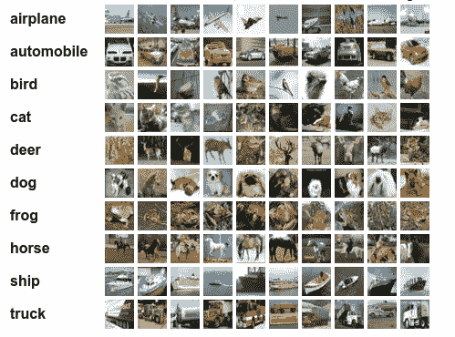

# 用 15 行代码在 CIFAR-10 上进行图像分类

> 原文：<https://medium.com/mlearning-ai/image-classification-on-cifar-10-with-15-lines-of-code-52341e7fb00c?source=collection_archive---------2----------------------->

> 在 15 行代码内训练 CIFAR-10 图像分类器的快速方法



CIFAR-10 Dataset

# 介绍

在这篇博客中，我们将使用迁移学习并在流行的深度学习框架 TensorFlow 的帮助下，在流行的 CIFAR-10 数据集上构建并训练一个图像分类器 CNN。我们的主要目的是展示用几行代码就可以在大型数据集上获得良好的准确性。通过对各种超参数进行更精细的调整，我们可以获得更好的结果。

# 导入库

我们将只导入 TensorFlow 库，因为该库足以完成从数据收集到模型选择和实现的所有任务。

```
import tensorflow as tf 
```

# **数据集**

CIFAR-10 数据集由 10 类 60000 幅 32x32 彩色图像组成，每类 6000 幅图像。有 50000 个训练图像和 10000 个测试图像。我们可以通过 tensorflow 库直接访问这个数据集。

```
dataset = tf.keras.datasets.cifar10
(x_train,y_train), (x_test , y_test) = dataset.load_data()
```

数据已经在训练和测试子集中分开。我们将使用测试数据作为我们的验证数据，并借助验证准确性对模型的性能进行评分。

# 预处理

我们现在将在拟合模型中的数据之前预处理我们的数据，以减少过度拟合的问题。这个过程被称为**数据扩充。**为此，我们将使用tensorflow 库中的 **ImageDataGenerator** 函数。

首先，我们将开始规范我们的形象。

```
x_train = x_train /255 ; x_test = x_test/255
```

然后我们将调用 **ImageDataGenerator** 函数，设置图像水平翻转、缩放、宽度和高度移动的各种参数。

```
data_generator = tf.keras.preprocessing.image.ImageDataGenerator(
horizontal_flip=True,
zoom_range=0.05,
width_shift_range=0.05 ,
height_shift_range=0.05)
```

现在，我们将使用**。流**方法来创建训练数据集。对于这项任务，我们将使用 32 的批量。批量大小是指必须通过网络才能更新权重的图像数量。

```
train_generator = data_generator.flow(x_train, y_train, batch_size=32)
```

到目前为止，我们已经加载了必要的库和数据集，并预处理了数据以适应我们的模型。所有这些都是在 5 行代码内完成的。

# CNN 模型设计

我们将在迁移学习的帮助下建立模型。为此，我们将使用 ResNet50V2 型号。我们还将使用已经训练好的 ImageNet 权重作为模型的初始化权重。

我们将首先设计一个基础模型，其中我们将使用迁移学习来导入 ResNet50V2，然后将这个基础模型添加到我们的顺序 API 中。ResNet50V2 可以从**tensor flow . applications**导入。在参数中，我们将保持 **include_top = False，**因为我们将在下一部分创建我们自己的全连接层。我们将设置 **weights="imagenet"** 并在 **input_shape** 参数中使用图像的形状。

```
base_model = tf.keras.applications.ResNet50V2(
include_top=False,
weights="imagenet",
input_shape=x_train.shape[1:])
```

接下来，我们将使用 TensorFlow 库为我们的模型创建一个顺序 API。我们将首先添加我们的**基础模型**到我们的主模型，然后是一个**展平**层。展平层将基本模型的输出传递给下一个完全连接的层。通过将输出转换为一维阵列网络，我们将添加一个具有 1024 个单元的**密集**层，然后添加一个具有 0.2 丢失率的**丢失**层。丢弃层有助于减少训练数据的过拟合，从而有助于减少高方差。最后一个密集图层将有 10 个输出单位，激活设置为 softmax，因为这是一个多类分类。

```
model= tf.keras.Sequential()
model.add(base_model) 
model.add(tf.keras.layers.Flatten())
model.add(tf.keras.layers.Dense(1024,activation=('relu'))) 
model.add(tf.keras.layers.Dropout(.2))
model.add(tf.keras.layers.Dense(10,activation=('softmax')))
```

# 编译和拟合模型

由于我们的数据已经过预处理，我们的模型也准备好了，现在是编译模型的时候了。

```
model.compile(
optimizer=tf.keras.optimizers.Adam(learning_rate = 0.0005),
loss = "sparse_categorical_crossentropy",
metrics = ["accuracy"])
```

我们将使用 Adam 优化器并设置 **learning_rate = 0.0005** 。我们将使用**loss = " sparse _ category _ cross entropy "**和准确性作为我们对结果进行评分的标准。

在成功编译我们的模型之后，我们现在将调用 fit 函数并将进度度量保存在历史中。接下来，我们使用 **train_generator** 作为我们的训练数据，并设置验证数据= **(x_test，y_test)** ，因为我们正在对我们的模型进行验证准确性评分。我们将把历元的数量设置为 **15** 并且详细度等于 1。

```
history = model.fit(train_generator , 
                    validation_data=(x_test , y_test), 
                    steps_per_epoch = x_train.shape[0]/32,
                    epochs=10 ,
                    verbose = 1 )
```

在对模型进行 15 个时期的训练后，我们在训练集上得到大约 83.3%的准确率**，在测试集上得到大约 77.85%的准确率**。****

****最后，我们将使用 **model.save** 函数保存我们的模型。****

```
**model.save("CIFAR-10.h5")**
```

# ****结论****

****我们已经成功地训练了 CIFAR-10 数据集，并且仅用 15 行代码就达到了的准确率。****

```
**import tensorflow as tf                                           #1(x_train  , y_train) , (x_test , y_test)  = tf.keras.datasets.cifar10.load_data()                             #2x_train = x_train /255 ; x_test = x_test/255                      #3data_generator = tf.keras.preprocessing.image.ImageDataGenerator(
horizontal_flip=True,
zoom_range=0.05,                                                               width_shift_range=0.05 ,                                                                 height_shift_range=0.05)                                          #4train_generator = data_generator.flow(x_train, y_train,32)        #5base_model = tf.keras.applications.ResNet50V2(
include_top=False,
weights="imagenet",
input_shape=x_train.shape[1:] ,
classes = 10)                                                     #6model= tf.keras.Sequential()                                      #7
model.add(base_model)                                             #8
model.add(tf.keras.layers.Flatten())                              #9
model.add(tf.keras.layers.Dense(1024,activation=('relu')))       #10
model.add(tf.keras.layers.Dropout(.2))                           #11 
model.add(tf.keras.layers.Dense(10,activation=('softmax')))      #12 model.compile(
optimizer=tf.keras.optimizers.Adam(learning_rate = 0.0005),
loss = "sparse_categorical_crossentropy",
metrics = ["accuracy"])                                          #13history = model.fit(train_generator , 
                    validation_data=(x_test , y_test), 
                    steps_per_epoch = x_train.shape[0]/32,
                    epochs=10 ,
                    verbose = 1 )                                #14model.save("CIFAR-10.h5")                                        #15**
```

****我希望你喜欢它。****

****这个博客的代码和训练模型可以在这里获得——[https://github.com/sanskar-hasija/CIFAR10-15LOC](https://github.com/sanskar-hasija/CIFAR10-15LOC)****

****此外，如果你想要这个分类的完整版本，有更好的超参数设置选择，你可以检查这个——[https://github.com/sanskar-hasija/CIFAR_10_ResNet](https://github.com/sanskar-hasija/CIFAR_10_ResNet)****