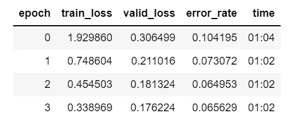
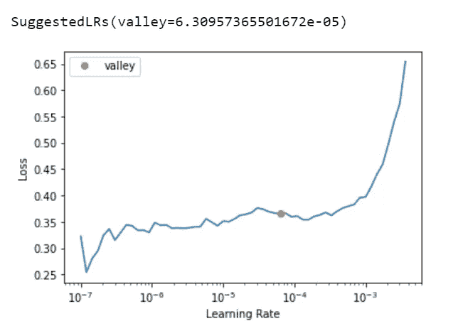
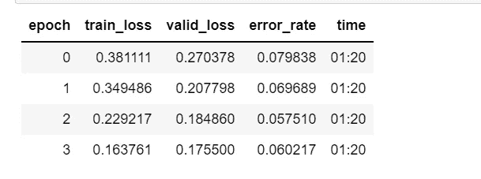
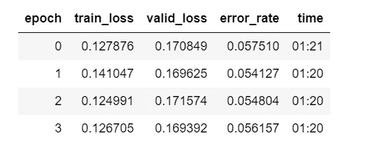
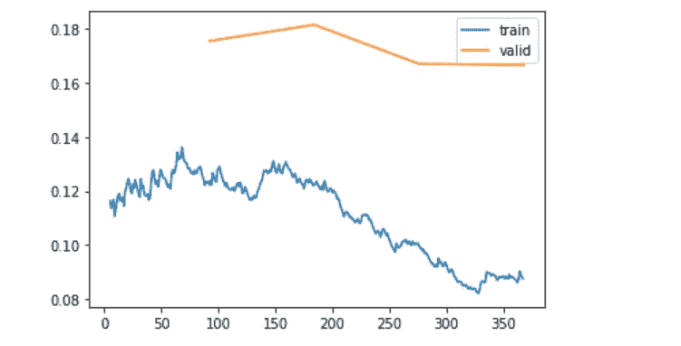
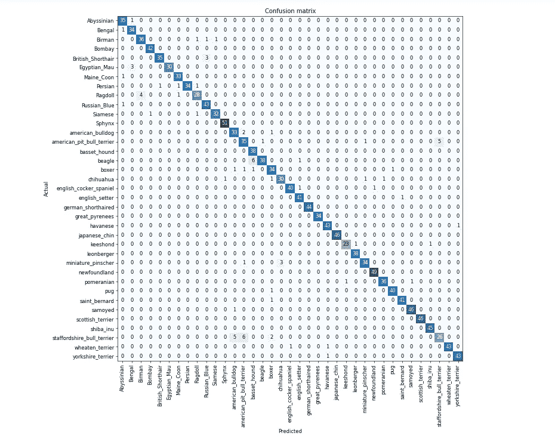
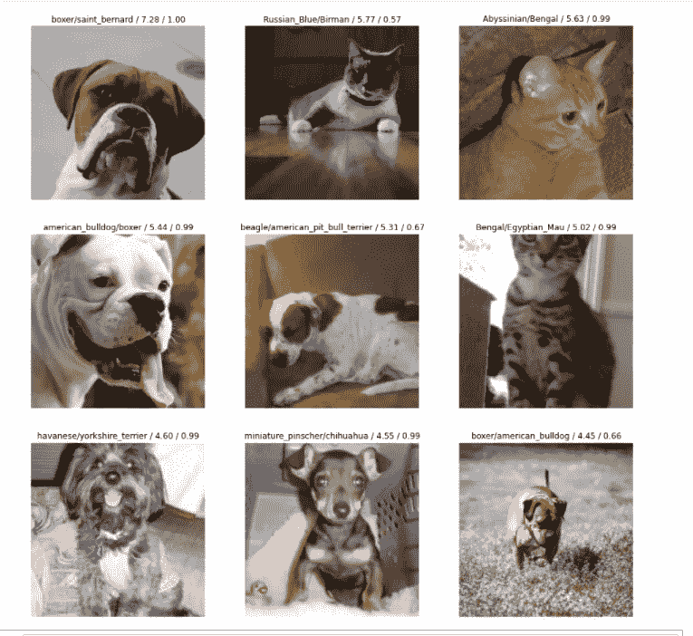

# 使用 FASTAI 的图像分类—教程 Pt。2

> 原文：<https://medium.com/mlearning-ai/image-classification-using-fastai-tutorial-pt-2-be65ff87f784?source=collection_archive---------4----------------------->

问候大家！今天，我们将学习图像分类教程的第二部分，也是最后一部分！

如果您错过了第一个教程，这里有到它的[链接](/@FastAIButMakeItSlow/image-classification-using-fastai-tutorial-pt-1-acea74cd7faa)，但是作为一个简短的回顾，我们讲述了如何将我们的 PETS 数据集传递到数据加载器，我们今天将使用它进行模型学习和微调。

下面是最后使用的代码的摘要:

```
!pip install fastai -q --upgrade
from fastai.basics import *
from fastai.vision.all import *
from fastai.callback.all import *
path = untar_data(URLs.PETS)pets = DataBlock(    
blocks = (ImageBlock, CategoryBlock),    
get_items = get_image_files,    
splitter = RandomSplitter(valid_pct = 0.2, seed= 100),    
get_y = using_attr(RegexLabeller(pat = r'^(.*)_\d+\..*$'), 'name'),    
item_tfms = Resize(460),
batch_tfms = aug_transforms(size = 224, min_scale = 0.75))
dls = pets.dataloaders(path/'images')
dls.show_batch(max_n=4, figsize = (6,9))
```

# 模型创建和改进

这是我们一直在等待的！我们希望创建一个模型，能够区分我们数据集中的不同宠物品种。我不得不承认，我花了一段时间才完全理解这一点，因为只要你符合这个模型，你就可以做出很多改进。这就是为什么人们，包括我在内，认为 ML 是一门艺术。不管怎样，我已经试着把这个过程分解成步骤。

a)建立模型

b)根据历元数，使模型符合您的数据

c)解冻其他层(最多只能修改特定层)

d)从图/函数中找到最佳学习率范围

e)使用学习率范围(切片)拟合模型

f)保存模型或重复步骤 d-e，直到没有太多改进

我们走吧。

**A)模型搭建**

FASTAI 的奇妙之处在于，我们可以构建已经预先训练好的模型，并针对我们的数据集对它们进行调整。

为什么？

训练一个模型能够完成这些深度学习任务对计算机来说是非常耗时的，已经运行了数百个时期，超过 100 万张图像，1000 个类别的参数肯定会比我们的好，至少对于计算机只是识别线条和形状的前几层来说。那么，为什么不利用现有模型的额外优势，然后对其进行微调，使其适用于我们自己的数据呢？为了做到这一点，我们使用以下代码:

```
model = cnn_learner(dls, resnet34, metrics = error_rate)
```

cnn_learner 是我们将使用自己的数据建立一个预先存在的模型的函数。那么我们在里面所说的这些论点是什么呢？

*   数据:如果您还记得的话，我们做了 DLS = pets . data loaders(path/' images ')来创建一个包含有组织数据的数据加载器。所以我们只是将 dls 传递给 cnn_learner。
*   架构:我不打算深入研究神经网络的基础，但想法是，根据结构，有几个层次和方法，通过这些层次和方法，数据将使用神经网络架构进行训练。ResNet-18 就是这些现有架构之一。ResNet 表示正在使用的架构，18 是层深度，即 18 层。还有其他像 ResNet-50，ResNet-34 等。您可能认为增加层数意味着更高的模型精度(以及增加的计算时间)，但事实并非总是如此。更多见此:[https://towardsdatascience . com/an-overview-of-resnet-and-its-variants-5281 e2f 56035](https://towardsdatascience.com/an-overview-of-resnet-and-its-variants-5281e2f56035)。对于这个模型，我们将使用 ResNet-34。
*   度量=错误率。现在，我们需要一种方法来评估我们的模型实际上做得好还是不太好。输入:度量！有如此多的指标可用于评估模型性能，但对于本教程，我们将使用 error_rate，它与 1- accuracy 相同。例如，假设我们的模型在 90%的情况下准确预测了验证数据集上的宠物品种，那么我们的错误率将是 10%,或者像通常打印的那样，是 0.1。
*   pretrained= True。我没有在代码中包含这一点，因为 pretrained 的默认值总是等于 true。我只是指出，在默认情况下，我们正在使用一个已经训练好的模型来进行图像分类，并取得了出色的结果。更多见此:[https://www . analyticsvidhya . com/blog/2021/05/training-state-of-art-deep-learning-models-with-fast-ai/](https://www.analyticsvidhya.com/blog/2021/05/training-state-of-the-art-deep-learning-models-with-fast-ai/)

现在，让我们用这个伟大的模型来拟合我们自己的数据。

**B)** **模型拟合**

```
model.fit_one_cycle(4)
```

fit_one_cycle 将我们刚刚构建的模型与我们的特定数据相匹配。它通过所谓的循环学习率来训练数据，这里有更好的解释:[https://iconof.com/1cycle-learning-rate-policy/](https://iconof.com/1cycle-learning-rate-policy/)。我将在下一节给出学习率的大致概念。

提示:通过免费的 Paperspace 帐户在 Jupyter 中运行这个比在 Google Colab 中运行要快得多



My results

哇！一个~6.5%的错误率！仅仅跑了 4 圈之后！这意味着我们有 93.5%的准确率！很神奇吧？现在，您可能想知道另外两项是什么:train_loss 和 valid_loss。

损失函数是你的电脑用来优化自身性能的方法。这是计算机判断是否更接近更好预测的一种方式。例如，假设你希望你的电脑能够预测到 2021 年 12 月你的账户中有 10 万美元，但它却预测到你有 9.9 万美元。在一个非常简单的假设损失函数中，这将是(100–99)= $ 1k 的损失。

有几种更高级(也更好)的损失函数。事实上，因为 fastai 将此识别为图像分类问题，所以它会自动使用交叉熵损失。由于我不想在这里深入理论，这里有一些链接可以帮助更好地理解损失:[https://towardsdatascience . com/importance-of-loss-function-in-machine-learning-eddaaec 69519](https://towardsdatascience.com/importance-of-loss-function-in-machine-learning-eddaaec69519)和[https://stack overflow . com/questions/48280873/what-is-the-difference-between-loss-function-and-metric-in-keras](https://stackoverflow.com/questions/48280873/what-is-the-difference-between-loss-function-and-metric-in-keras)。

但是你可能已经猜到了，目标是把你的损失降到最低。正确的预测和计算机的预测之间的差距越小越好。但是，您需要能够看到您的计算机是仅根据其训练数据进行完美预测，还是根据其保留的验证数据(它没有训练的数据)进行良好预测。这就是为什么我们有 train_loss 和 valid_loss。

如果它在训练数据集上的损失比在验证数据集上的损失小，这意味着它过度拟合，即与未知数据相比，它只擅长预测它已经看到的数据(这是我们首先创建模型的目的)。同样的事情反过来也适用。我真的很喜欢 StackOverflow 的这个快速回答，它展示了不同的细微差别。


[https://stackoverflow.com/questions/48226086/training-loss-and-validation-loss-in-deep-learning](https://stackoverflow.com/questions/48226086/training-loss-and-validation-loss-in-deep-learning)

通常，我们会看到某种程度的过度拟合，这并不是一件坏事，因为很明显，它在已经看到的基础上做得稍微好一点。我的意思是我比没见过的动物更能识别我见过的动物，那我凭什么去评判计算机:)？

现在回到我的结果，请注意，我的 train_loss 高于我的 valid_loss，这意味着我目前不适应。如果我运行它更多的时期，趋势会从欠拟合翻转到过拟合，但是你会在下一节注意到。让我们进入下一步！

c)解冻其他层

所以现在，我们要解冻所有其他层。在此之前，我们只替换了最后一层(输出层)，并使用随机权重对我们的特定类别进行训练(请记住，预训练模型有 1000 个类别，而我们只有 37 个)。我们已经离开了所有其他层(你能猜出有多少层吗？)没动过因为嗯？他们太棒了！但是现在，我们将解冻它们，所以我们可以稍微更好地训练我们的模型。如果您愿意，也可以解冻到特定的程度，但这不是我们在本例中要做的。

```
model.unfreeze()
```

> 如果您确实想试验代码并解冻某些层，您可以执行 model.unfreeze()后跟 model.freeze_to(n ),其中 n 是您希望它冻结的层数，从第一层开始。我见过的人大多把 n 保持在 5 层以下。

然而，我们确实知道，与可能区分金鱼和母鸡的其他层相比，前几层非常善于识别一般的艺术元素，如垂直线和水平线。那么，有没有一种方法来调整模型，以便更快地训练后面的层，因为那里有更多的细节需要学习？有，有！但是在我们深入讨论之前，让我重新介绍一下学习率的概念！

**学习率**

我们之前提到过损失函数，以及我们的目标是如何最小化损失，但是神经网络是如何做到的呢？它通过使用…鼓点…学习率:【https://www.jeremyjordan.me/nn-learning-rate/】T2 接近那个最小值。想象一下，你被蒙住眼睛并试图找到你的钥匙，它正好落在一个山谷的底部，也就是最低处，你如何到达那里？

你会一点一点，一步一步往下走，直到你到达底部。但是如果动物出来的时候已经快到晚上了，所以你必须迈大步而不是小步，那该怎么办呢？但是，如果使用这种策略，你在关键点上跨了一大步却错过了，那该怎么办呢？？？

所以你需要找到最佳的步进模式，这也是理想学习率的目标。你想最小化你的损失函数，你的学习率就是你到达底部的步长。这张图表说明了这一困境。


Image from [https://www.jeremyjordan.me/nn-learning-rate/](https://www.jeremyjordan.me/nn-learning-rate/)

幸运的是，fastai 库让我们看一看与损失函数相比不同的学习率，甚至告诉我们一个理想的学习率！

**D)理想学习率**

```
model.lr_find()
```


Output from model.lr_find()

如您所见，对数图在学习速率约为 1E-6 时损失最小，但在 1E-5 和 10E-3 时也是如此。如果你不熟悉或者很困惑(对我来说就是这样)，你可以在网上查找如何阅读对数刻度。)

那么这些价值观哪个更好呢？我们的目标是:我们想要一个离它爆发的地方稍微远一点的地方，而且损失也在稳步减少。图表上的红点自动显示了使用山谷算法的理想学习率(这是一个新的更新，所以我必须查找它)。

下面是来自 [fastai docs](https://docs.fast.ai/callback.schedule.html#valley) 的定义:

> `[*valley*](https://docs.fast.ai/callback.schedule.html#valley)`算法由 [ESRI](https://forums.fast.ai/t/automated-learning-rate-suggester/44199/30) 开发，采用 LR 图中最长山谷大约 2/3 的最陡斜率，也是`[*Learner.lr_find*](https://docs.fast.ai/callback.schedule.html#Learner.lr_find)`的默认算法

这样，您得到一个既陡峭又稍微远离最小值值。

你应该得到一个输出数字，显示红点的确切位置。这是我的:


我还使用他们的谷学习率和一个比 1E-6 稍低的谷学习率进行了比较，因为在我看来，那个谷学习率在技术上更陡。经过两个时期后，我的(5.95%)比推荐的(6.50%)有稍微好一点的错误率，但我不认为这是一个足够大的差异来完全选择一种方法来反对另一种方法(参见为什么 ML 是一种艺术！)

此外，当我用 4 个时期重新运行模型时，我的错误率约为 6.1%，然后在第 3 个时期增加到 6.4%，但他们的错误率从 9.3%开始，到第 4 个时期，为 5.8%(低于我的初始错误率)。

此外，如果你想一想，一个更小的学习率，也就是我的学习率，会有更小的错误率，但这需要很长的时间。因此，例如，如果我运行 20 个纪元，我宁愿选择更高的，也就是更快的，具有<1% difference in error rate which could honestly be due to just random circumstances as shown by the re-run.

Therefore, for this tutorial, I’ll be choosing their suggested learning rate.

Let me make one last note before we train all the layers. I mentioned there’s a way to adjust this learning rate for the different layers. We do this with a technique called **区别学习率**的学习率。我们将一系列学习速率传递给神经网络(在山谷周围的陡峭范围内)。目标是后面的层比前面的层有更快的学习速度(因为它学习更重要的特性)。因此，您的范围将从较小的值(第一层)到较大的值(最终层)。

**E)符合理想的学习率**

这是最后一行代码，把我们学到的都记在心里。我在这里使用了一个不同于上图的学习率，因为在我做的所有辅助测试中，我的学习率图变成了这样:



Updated Loss vs LR graph

```
model.fit_one_cycle(4, lr_max = slice (6e-5,2e-4))
```

这些是我的成果！如果您比较 train_loss 和 valid_loss，您会注意到在第三个时期它是如何从欠拟合变为稍微过拟合的。



Final results

所以，到了第二个纪元，我的模型有了 5.8%的最佳错误率，也就是 94.2%的准确率！这仅仅比我们最初的方法好一点点，所以你可以根据你的最终目标来决定是否要完成这些步骤。就像我说的，ML 是一门艺术，所以你可以不断修改参数，甚至可以追溯到数据块，看看它如何影响你的错误率。

**F)保存你的模型**

```
model.save(“perfecto”)
```

于是就有了<name_of_model>。save(" name _ you _ want _ to _ save _ it _ as ")。保存模型也会冻结所有的层，所以如果你想尝试不同的学习速率，你必须做 model.unfreeze()。此外，如果您进行了太多的更改，破坏了您的结果，并且您想回到您的初始模型，只需执行 model.load("perfecto ")，然后将其解冻。</name_of_model>

最后，您可能想知道什么时候是理想的停止时间，即足够多的纪元？当然，目标是获得很高的精度，使训练损失与验证损失大致相同(或非常接近)，并使验证损失尽可能低(顺便说一下，精度也很高)。是的，获得这些完美的结果并不容易，这就是为什么，我再说最后一遍，ML 是一种艺术，你试图修改这些参数，以获得正确的结果，正确的模型，完美的图像。

无论如何，让我们做一些绘图，看看我们的损失如何在几个时代的变化！

PS:我重复了步骤 d-e，得到了下面的值，所以我的 plot_loss 是基于那个模型的。



FINAL, final results.

```
model.recorder.plot_loss()
```

这只是调用 Recorder 类上的 plot_loss()函数，它记录了我们在训练期间的所有统计数据。所以我们把这个叫做我们的模型名“模型”。


Plot Loss function

**非常重要的是，你的情节不一定要像我的一样。你的图表通常是不同的。事实上，它们是注定的，所以不要期待完全相似的结果。**

正如你所看到的，随着历元数的增加，我的有效损失几乎达到了平稳状态，我的火车损失非常混乱，所以我真的无法从中读取太多信息。然而，大多数时候，你会看到一个不断变小的训练损失函数和一个变小的有效损失函数，然后开始达到峰值，这表明它过度拟合。这里有一个更好看的，来自于 200 年前后的不同版本的代码。



我们今天已经做了很多，所以让我们回顾一下到目前为止的代码:

```
model = cnn_learner(dls, resnet34, metrics = error rate)
model.fit_one_cycle(4)
model.unfreeze()
model.lr_find()
learn.fit(4, lr_max = slice (6e-5,2e-4)) 
#replace numbers with range around the valley in your lr_find plot
model.save(“perfecto”)
```

恭喜你！现在，在本教程的下一个也是最后一个部分，我们将解释我们的模型！

**模型解释**

ClassificationInterpretation 是一个包含解释分类模型的方法的类，当我们这样做时。从学习者(我们的模型)开始，我们围绕自己的模型来构建班级。然后，下一行代码从所有这些方法中提取混淆矩阵图。你应该定义一个数字大小，这样它会变大，因为我们有很多类别，你也可以增加每英寸的点数来提高质量( [dpi](https://www.dme.us.com/2018/12/11/what-is-dpi-and-what-are-the-requirements-for-different-industries/#:~:text=DPI%2C%20or%20dots%20per%20inch,one%20inch%2C%20or%202.54%20centimeters.) )。

```
results = ClassificationInterpretation.from_learner(model)
results.plot_confusion_matrix(figsize=(12,12), dpi=60)
```



不出所料，那可是一大堆数字和方框！混乱矩阵图基本上显示了不同类别的模型的混乱程度。对角线上的所有东西都代表它对特定宠物品种的正确预测数，其他所有东西都向您显示与实际宠物品种不匹配的模型预测。所以我们有一个 37x 37 的网格。

如你所见，最高的不匹配(6)是模型预测的是美国斗牛梗而不是斯塔福德郡斗牛梗。如果你在谷歌上搜索这些狗，你会看到一些博客在比较这两个品种。因此，如果人类很难搞清楚，我们应该表扬这个模型把美国斗牛梗搞清楚了 35 次！

我们还可以使用下面这行代码找出模型最混乱的地方。

```
results**.**most_confused(min_val=3)
```

函数名对它的功能非常直观，然后 min_val 告诉模型它应该只打印那些不匹配至少三次的函数。它将按以下顺序显示:{实际、预测、多少次出错}


Most Confused Predictions

最后，我们还可以绘制前 n 个损失，这将向您显示“实际/预测/损失/概率”，其中 n 是您定义的数字。你还应该添加一个 fig_size。这基本上突出显示了损失最高的图像(简单回忆:实际和预测之间的差异)，以及它们的概率，即模型对其预测的置信度。就像下面的例子，即使它损失了 7.28，它也 100%确信那个拳击手是圣伯纳德狗。

```
results.plot_top_losses(9, figsize= (16,16))
```



Plot top 9 losses

PS:最后两个代码输出与我最初的结果混淆矩阵不同，因为我不得不重启我的内核并重新运行所有代码，但这只是给出它们应该看起来的样子。

就这样，伙计们！

这就结束了我们的图像分类的两部分教程！下周，我将尝试重复我们在这些教程中所做的一切，但使用一个新的数据集，并可能使用更多的数据处理技术！

在那之前，保重，我的编程朋友❤

[](/mlearning-ai/mlearning-ai-submission-suggestions-b51e2b130bfb) [## Mlearning.ai 提交建议

### 如何成为 Mlearning.ai 上的作家

medium.com](/mlearning-ai/mlearning-ai-submission-suggestions-b51e2b130bfb)