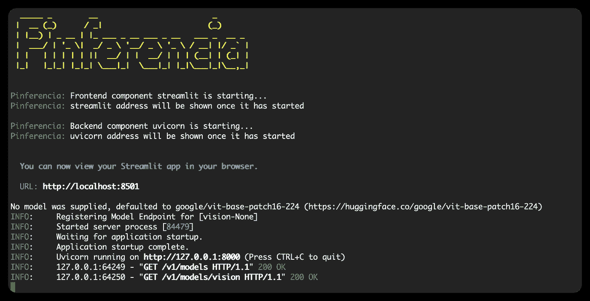
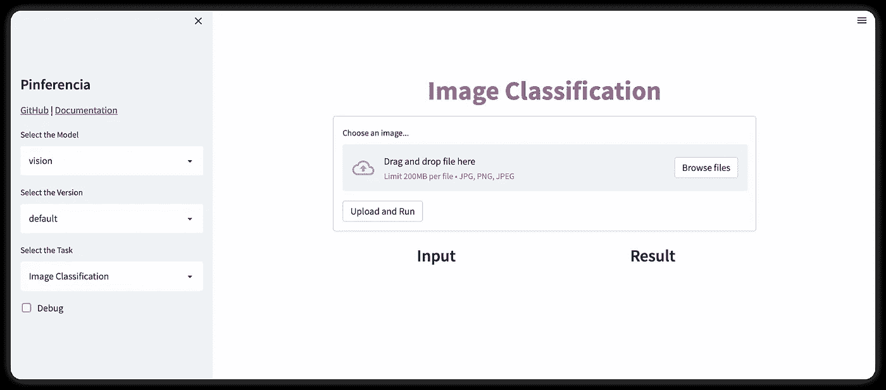
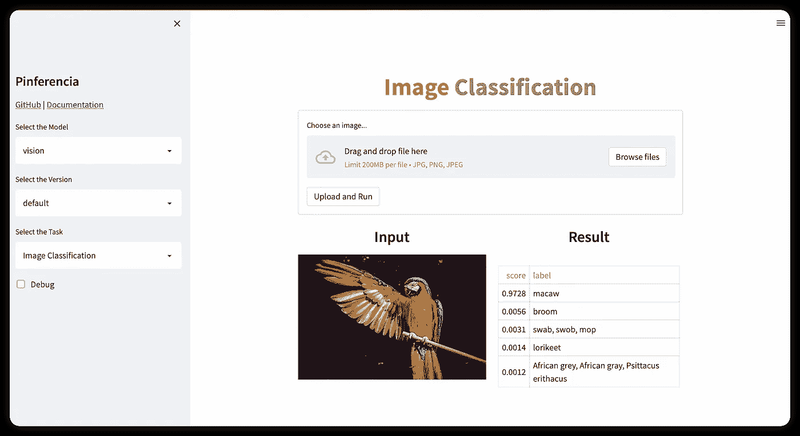
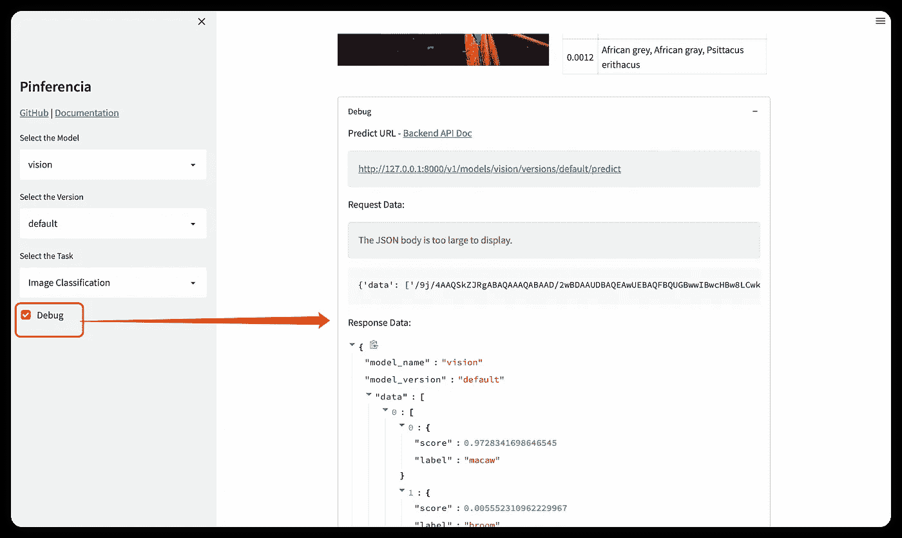
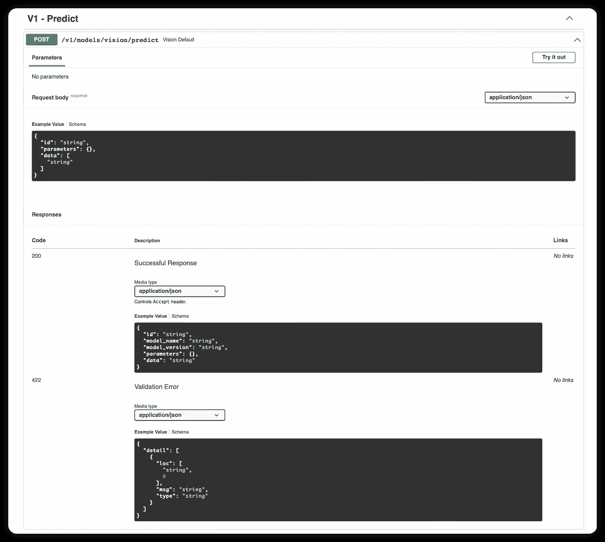
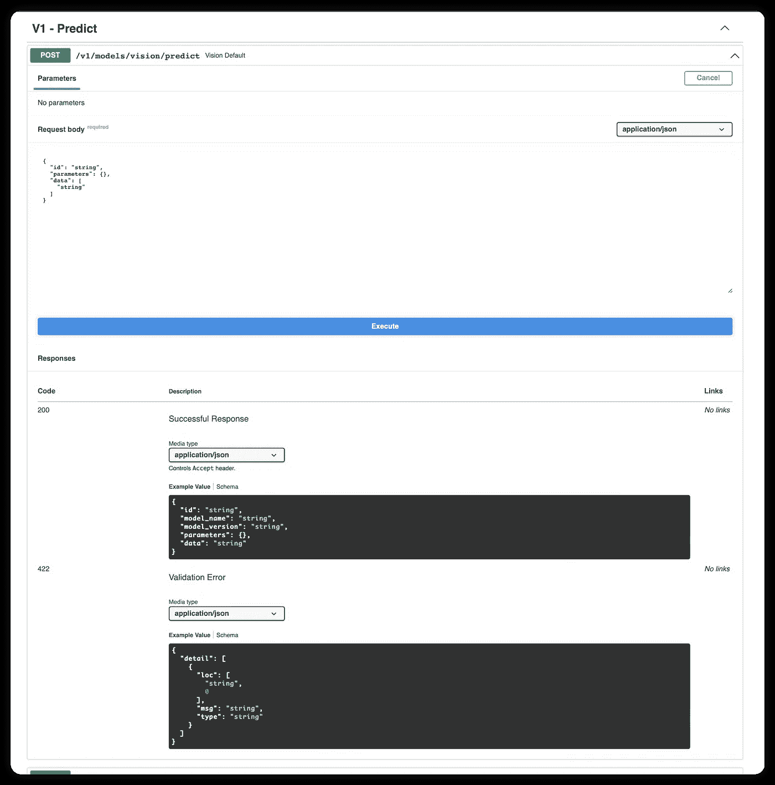

# 使用 Pinferencia 进行图像分类:内置漂亮的用户界面，更容易与模型集成

> 原文：<https://medium.com/mlearning-ai/image-classification-with-pinferencia-built-in-pretty-ui-and-much-easier-to-integrate-with-your-23ac26012bab?source=collection_archive---------4----------------------->

[**Pinferencia**](https://pinferencia.underneathall.app/) 是一个现代化的工具，它使用 REST API 和漂亮的 UI 来部署您的模型。

# 安装依赖项

# 拥抱脸

`pip install "transformers[pytorch]"`

如果不起作用，请访问[安装(huggingface.co)](https://huggingface.co/docs/transformers/installation)并检查他们的官方文件。

# 平费伦西亚

`pip install "pinferencia[streamlit]"`

如果不起作用，请访问并检查他们的官方文件。

# 定义服务

将以下代码保存到`app.py`:

# 代码解释:

**第 1–7 行**:导入依赖关系。
**第 9 行**:下载并初始化 huggingface 模型。
**第 12–14 行**:定义一个运行预测的函数。
**第 17–18 行**:初始化服务器，注册模型。

现在让我们运行服务

# 启动服务

运行:

```
pinfer app:service --reload
```

等待模型被下载。完成后，您将在控制台中看到以下内容:



console output

你的浏览器会打开前端页面，如果没有，可以访问 [http://127.0.0.1:8501](http://127.0.0.1:8501) :



UI

让我们试一试页面上的图片:



classification

您还可以打开调试模式，检查请求和响应的详细信息:



debug

您可以点击调试信息中的后端 API 文档或访问 [http://127.0.0.1:8000](http://127.0.0.1:8000:) ，您将获得详细的 API 文档，您也可以在此页面试用 API:

API 文档:


doc

API 的详细信息:



detail

试用 API:



try out

# 平费伦西亚

如果你想了解更多关于 Pinferencia 的信息，请访问:[首页](https://pinferencia.underneathall.app/) | [Github](https://github.com/underneathall/pinferencia)

[](/mlearning-ai/mlearning-ai-submission-suggestions-b51e2b130bfb) [## Mlearning.ai 提交建议

### 如何成为 Mlearning.ai 上的作家

medium.com](/mlearning-ai/mlearning-ai-submission-suggestions-b51e2b130bfb)