# 张量流图像分类

> 原文：<https://medium.com/mlearning-ai/image-classification-with-tensorflow-2-54fc601dfb6a?source=collection_archive---------1----------------------->

## 深度学习教程

## 一个如何进行图像分类的实例。


Photo by [Josh Rose](https://unsplash.com/@joshsrose?utm_source=medium&utm_medium=referral) on [Unsplash](https://unsplash.com?utm_source=medium&utm_medium=referral)

计算机视觉是机器学习的重要研究领域之一，在机器人、健康、无人机、无人驾驶汽车、体育和娱乐等领域有着广泛的应用。

在本文中，我将讨论以下主题:

*   什么是计算机视觉？
*   正在加载数据集
*   数据预处理
*   模型结构
*   评估模型
*   预测新图像

让我们开始吧！

# 什么是计算机视觉？

计算机视觉是人工智能的一个分支，研究如何让计算机从数字图像或视频中获得高层次的理解。它还涵盖了从多个图像和视频序列中重建 3D 场景的方法，在医学领域，它涵盖了器官分割、肿瘤检测和乳房 x 线照片中的微钙化检测。

让我们来看看计算机视觉应用的一些例子有:

*   产品的自动化检测
*   安全和监控
*   制造过程的优化
*   自动驾驶汽车
*   生物测定学
*   基于内容的图像检索
*   医学图像分析
*   机器人视觉。

# 正在加载数据集

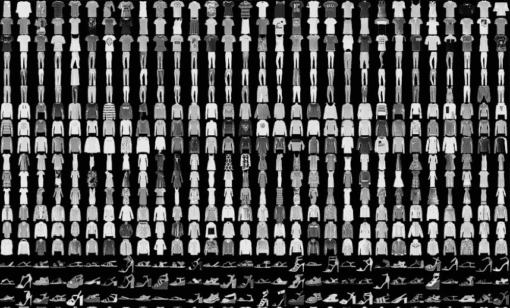

Fashion MNIST dataset

## 什么是时尚 MNIST 数据集？

我将要使用的数据集是[时尚 MNIST 数据集](https://github.com/zalandoresearch/fashion-mnist)。与经典的 MNIST 数据集不同，该数据集包含时尚物品的图像，而不是数字的图像。时尚 MNIST 数据集中的类比经典 MNIST 数据集中的类种类更多。因此，对该数据集中的影像进行分类比对经典 MNIST 数据集中的影像进行分类更加困难。

时尚 MNIST 数据集由 70，000 幅灰度图像和 10 个类别组成。60，000 幅图像用于训练网络，10，000 幅图像用于评估网络学习分类图像的准确程度。这些图片展示了尺寸为 28 x 28 像素的时尚单品。使用时尚 MNIST 数据集进行分析是计算机视觉的“Hello World”。该数据集相对较小，因此易于构建和测试计算机视觉模型。可以直接用 TensorFlow 加载这个数据集。

```
import tensorflow as tf
fashion_mnist = tf.keras.datasets.fashion_mnist
(X_train, y_train), (X_test, y_test) = fashion_mnist.load_data()
```

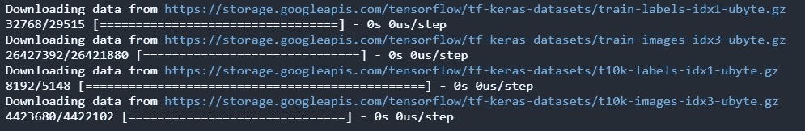

当加载数据集时，返回四个 NumPy 数组。X_train 和 y_train 数组用于训练模型。X_test 和 y_test 数组用于测试模型。图像中的像素是从 0 到 255 的整数。让我们看看训练集和测试集的形状和数据类型。

```
X_train.shape, X_test.shape
```

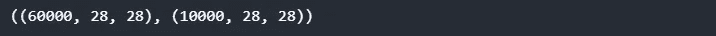

# 数据预处理

数据预处理是数据分析的重要步骤之一。在训练网络之前，必须对数据进行预处理。数据集中的标签由数字组成。我们把这些数字对应的时尚单品名称赋给一个变量。

```
class_names = ["T-shirt / top", "Trouser", "Pullover", "Dress",
        "Coat", "Sandal", "Shirt", "Sneaker", "Bag", "Ankle boot"]
```

让我们使用 matplotlib 库来查看第二个图像。

```
import matplotlib.pyplot as plt
plt.figure()
plt.imshow(X_train[1])
plt.colorbar()
plt.grid(False)
plt.show()
```

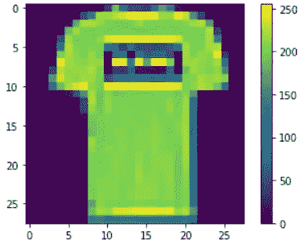

可以看到像素值在 0 到 255 之间。

## 标准化数据集

让我们缩放输入以提高模型的训练速度和性能。您可以通过将条目的像素除以 255 来实现这一点。

```
X_train = X_train / 255.0
X_test = X_test / 255.0
```

# 模型结构

要构建神经网络，必须配置模型的层，然后才能编译模型。现在让我们使用顺序 API 来调整模型的层。

神经网络的基本块是层。图层从数据中提取制图表达。你希望这些表述对你正在处理的问题有意义。大多数深度学习模型是由层的链式链接形成的。让我们开始建立模型。

```
model = tf.keras.Sequential([
   tf.keras.layers.Flatten(input_shape = (28, 28), name = "Input"),
   tf.keras.layers.Dense(128, activation='relu', name = "Hidden"),
   tf.keras.layers.Dense(10, name = "Output")
])
```

让我们一行一行地检查我写的这些代码。

**(1)** 第一行创建一个`Sequential`模型。顺序模型是 Keras 最简单的模型。在顺序模型中，各层按顺序排列。

**(2)** 在下一行，我写了`Flatten`层，添加到模型中。平面层将 28 x 28 像素的输入图像转换为一维数组(28 * 28 = 784)。这一层不带任何参数，只改变数据的格式。

**(3)** 在下一行，我给模型添加了一个隐藏的由 128 个神经元组成的`Dense`层。我在这一层使用了`ReLU`激活功能。致密层连接前一层的所有神经元。每个密集层都有其权重矩阵，该层包含输入和输出之间的所有权重。

**(4)** 最后我加了一个`Dense`层，有 10 个神经元，每个类一个神经元。最后一层返回 10 个长度的 logit 数组。每个神经元包含一个分数，表明该图像属于 10 类中的一类。`summary`方法显示了模型的所有层以及层的名称。

```
model.summary()
```

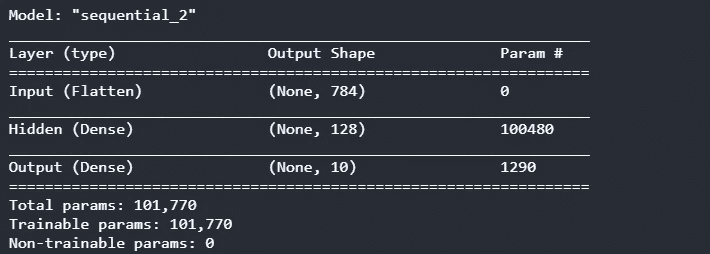

请注意，如果不命名层，层名称将由 Keras 自动生成。输出中 None 的意思是批处理大小可以是任何值。参数总数显示在总结的末尾。您可以很容易地获得带有模型索引或名称的图层列表。

```
model.layers
```

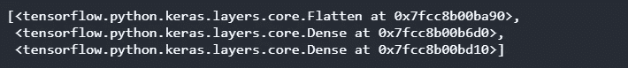

```
hidden = model.layers[1]
print(hidden.name)
```

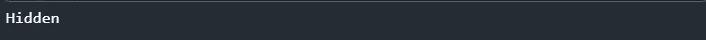

可通过`get_weights`和`set_weights`方法访问层的所有参数。让我们看看第一层的权重和偏差。

```
weights, biases = hidden.get_weights()
print(weights)
```

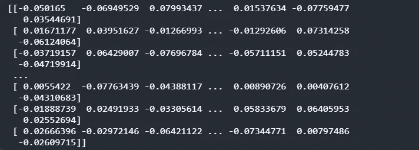

```
print (biases)
```

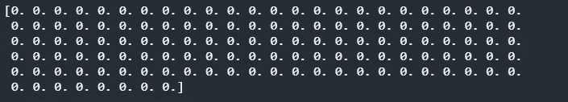

```
weights.shape, biases.shape
```

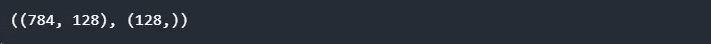

请注意，第一个密集层的权重是随机的，偏差初始化为零。还可以分别使用 kernel_initializer 和 bias_initializer 方法初始化层中的权重和偏差。关于这些方法的更多信息可以在[这里](https://keras.io/initializers/)找到。

## 编译模型

在开始模型的训练之前，需要用`compile`的方法编译模型。编译时，确定损失函数和优化器。或者，可以使用额外的指标来查看培训和评估期间的计算。

`loss`函数测量模型在训练期间预测的准确度。我们希望最小化这个函数，以便将模型引向正确的方向。`optimizer`根据损失函数和它看到的数据更新模型。`metrics` 用于监控训练和测试步骤。

```
model.compile(loss = tf.keras.losses.SparseCategoricalCrossentropy(
                         from_logits = True),
              optimizer = 'adam',
              metrics = ['accuracy'])
```

让我们检查一下这些代码。

**(1)** 我用`SparseCategoricalCrossentropy`作为损失函数，因为有从 0 到 9 的标签。如果您使用一键编码对标签进行编码，您可以使用`CategoricalCrossentropy`损失功能。

**(2)** 我用的是`adam`作为优化器，近几年流行的。

**(3)** 因为我们处理的问题是分类，所以我用`accuracy`作为度量。

## 训练模型

该模型在训练期间学习图像和标签之间的关系。现在我们可以通过调用`fit`方法来训练模型。

```
history = model.fit( X_train, y_train, 
                     epochs = 10, 
                     validation_split = 0.1)
```

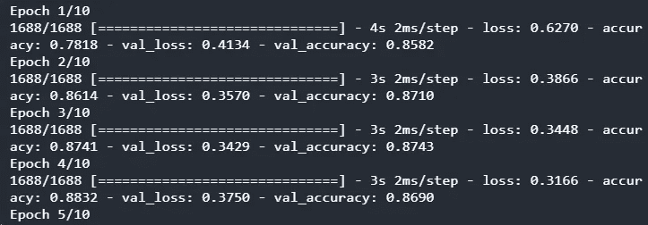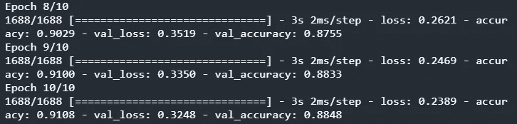

训练集在训练模型时使用。用验证数据评估模型。您可以使用`validation_split`参数分离一些数据进行验证。通过在此参数中键入 0.1，我希望 10%的训练数据用于验证。

在训练模型时，在每个时期结束时显示损失和准确性度量。监控这些指标对于查看模型的实际性能非常有用。如果训练集中模型的准确性优于验证集，则可能存在过拟合问题。

如您所见，损失值在每个时期都在减少。这意味着模型从数据中学习。10 个周期后，训练和验证的准确度被写在屏幕上。

`fit`方法返回一个包含训练参数的`History`对象。`history.history`是字典的形式。该字典包括在训练和验证集中每个时期之后测量的度量和损失。如果您将该字典结构转换为 Pandas DataFrame 结构并使用`plot`方法，您可以绘制训练曲线。

```
import pandas as pd
pd.DataFrame(history.history).plot(figsize = (8, 5))
plt.grid(True)
plt.show()
```

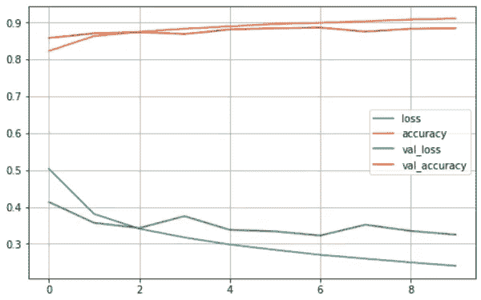

Accuracy and loss for train and validation sets

从图中可以看出，模型在训练和验证数据方面的准确性提高了，而训练和验证方面的损失减少了。

如果模型表现不佳，您可以调整超参数。你应该检查的第一个参数是学习率。如果更改这个参数不起作用，您可以选择不同的优化器。如果模型的性能仍然没有提高，那么你可以改变层的数量，每层中神经元的数量，以及隐藏层中的激活函数。您还可以将参数设置为`batch_size`，这是`fit`方法中的默认参数 32。

# 评估模型

我用训练数据建立了模型。您可能想看看模型如何预测它以前没有见过的数据。为了评估该模型，使用了在训练期间未使用的测试集。

让我们调用`evaluate`方法，通过使用测试集来评估模型。

```
test_loss, test_acc = model.evaluate (X_test, y_test, verbose = 2)
print ('\ nTest accuracy:', test_acc)
```

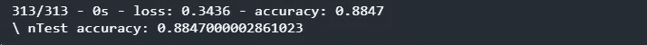

模型在测试集上的准确性略低于在训练数据上的准确性。训练精度和测试精度之间的这种差异表明了过拟合问题。这个问题说明模型在记忆。换句话说，虽然模型可以很好地预测训练数据，但它无法预测以前没有见过的数据。我在 L1、L2 或上节课中使用的正则化技术可以用来克服这个问题。

# 做一个预测

您可能希望使用您训练的模型来预测新图像。模型的线性输出是 logit。您可以通过添加 softmax 图层将逻辑转换为可能性，以便于解释。

```
probability_model = tf.keras.Sequential (
            [model, tf.keras.layers.Softmax()])
```

我们根据这个模型来估算一下测试数据。

```
predictions = probability_model.predict(X_test)
```

因此，该模型预测了测试集上每张图片的标签。我们先来做个预测。

```
predictions [0]
```

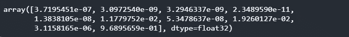

注意，返回了对应于每个时尚项目的 10 种可能性。使用 NumPy 中的`argmax`方法可以看到概率最高的标签。

```
import numpy as np
np.argmax(predictions[0])
```


该模型预测第一个图像为踝靴。让我们来看看第一张图片的实际标签。

```
y_test[0]
```


如您所见，模型做出了正确的预测。

就是这样。在博文中，我解释了使用 MNIST 数据集进行影像分类的以下主题:

*   什么是计算机视觉？
*   构建模型
*   调谐超参数
*   评估模型
*   预测新图像

我希望你喜欢这篇文章。感谢您阅读我的文章。你可以在 [GitHub](https://github.com/TirendazAcademy/DEEP-LEARNING-WITH-TENSORFLOW/) 或 [Kaggle](https://www.kaggle.com/tirendazacademy/image-classification-with-tensorflow-2-x) 页面访问我在本文中使用的笔记本。

就是这样。感谢您的阅读。我希望你喜欢它。别忘了在 YouTube 上关注我们👍

[](https://heartbeat.comet.ml/7-steps-for-a-successful-deep-learning-project-1d041b7e35d3) [## 成功深度学习项目的 7 个步骤

### 如何开发有效的深度学习项目的指南。

heartbeat.comet.ml](https://heartbeat.comet.ml/7-steps-for-a-successful-deep-learning-project-1d041b7e35d3) [](/geekculture/6-steps-to-become-a-machine-learning-expert-5a1f155f7207) [## 成为机器学习专家的 6 个步骤

### 成为机器学习专家需要知道的一切。

medium.com](/geekculture/6-steps-to-become-a-machine-learning-expert-5a1f155f7207) 

如果这篇文章有帮助，请点击拍手👏按钮几下，以示支持👇