# 图像数据增强技术

> 原文：<https://medium.com/mlearning-ai/image-data-augmentation-techniques-43d56287545?source=collection_archive---------2----------------------->

Photo by [Arseny Togulev](https://unsplash.com/@tetrakiss?utm_source=medium&utm_medium=referral) on [Unsplash](https://unsplash.com?utm_source=medium&utm_medium=referral)

机器学习或深度学习模型是为了成为“广义”模型而训练的。这表明我们的模型没有过度拟合数据的训练集，或者换句话说，我们的模型对看不见的数据有很好的了解。执行数据扩充是避免过度拟合的许多方法之一。

扩展用于训练模型的数据量的过程被称为**数据扩充**。通过用各种数据类型训练模型，我们可以获得一个更“一般化”的模型“多种数据种类”是什么意思？各种图像数据增强策略将在下面的几句话中更详细地介绍。请记住，我们将只讨论“图像”数据增强技术。此外，我们将使用 **PyTorch** 动手操作并实现图像数据或计算机视觉中主要使用的数据增强技术。

我们将使用各种数据增强技术。例如，我们将只使用一个图像。所以让我们跳到代码。

# 调整大小/重新缩放

顾名思义，这个函数用于将图像的高度和宽度调整到我们想要的特定大小。下面的代码演示了我们想要将图像的大小从原始大小调整到 224 x 224。

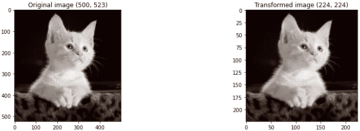

# 种植

这项技术将选中的图像的一部分应用到我们的新图像中。例如，我们将使用 CenterCrop 返回一个中间裁剪的图像。

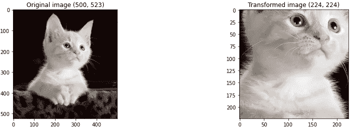

# RandomResizedCrop

这种方法同时结合了裁剪和调整大小技术。

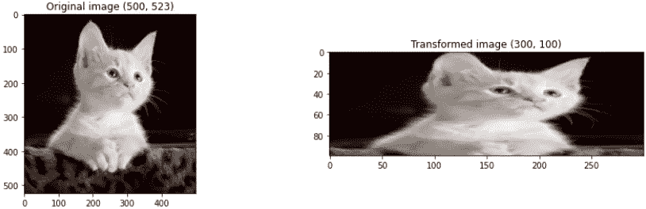

# 轻弹

翻转将根据您的意愿水平或垂直翻转图像。我们将尝试对我们的图像应用水平翻转。

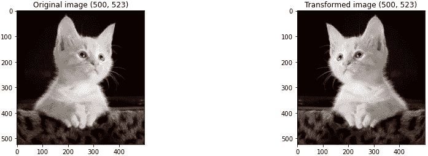

# 填料

填充包括在图像的所有边缘填充指定的量。我们将每边填充 50 个像素。

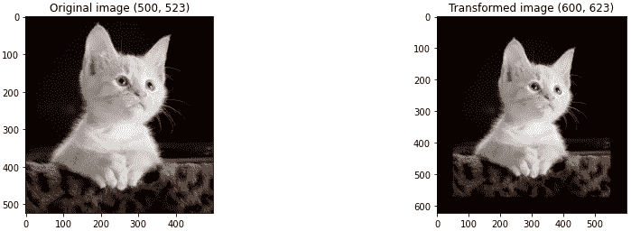

# 旋转

旋转角度随机应用于图像。在这种情况下，我们将给出 15 度的角度。

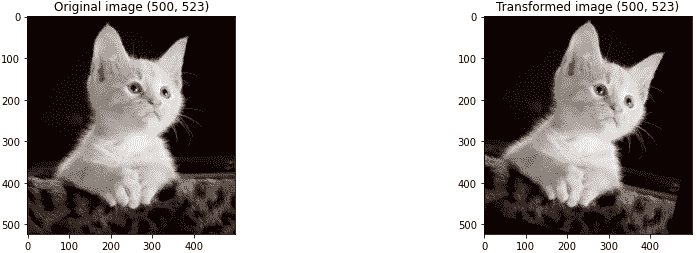

# 随机仿射

这种技术是一种保持中心不变的变换。这项技术有一些参数:

*   度数:旋转角度
*   平移:水平和垂直平移
*   缩放:缩放参数，为线段设置
*   共享:图像剪辑参数
*   fillcolor:图像外部填充的颜色

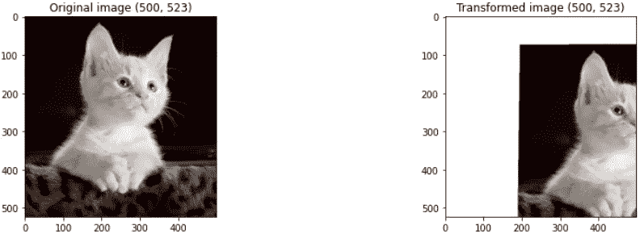

# 高斯模糊

图像将被高斯模糊所模糊。

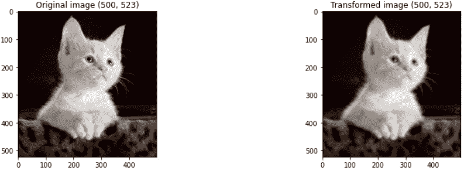

# 灰度等级

对于增强，彩色图像可以转换为灰度。

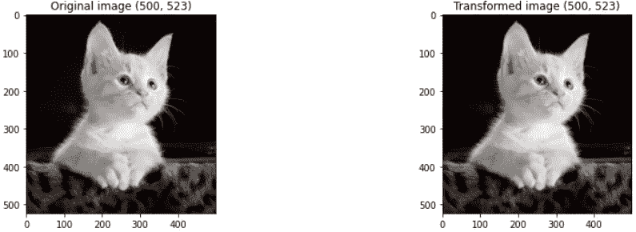

# 颜色增强

颜色增强，也称为颜色抖动，是通过更改图像的像素值来修改图像颜色属性的过程。

## 聪明

改变图像的亮度是改善图像的一种方法。与原始图像相比，生成的图像变得更暗或更亮。

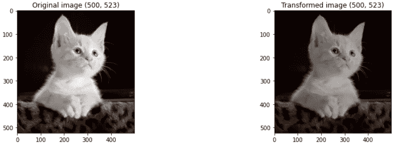

## 对比

图像最暗和最亮部分之间的区别程度称为对比度。图像的对比度也可以调整为增强。

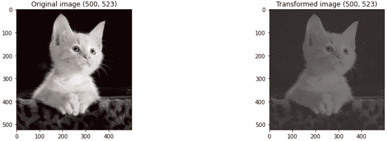

## 浸透

图片中颜色的分离被定义为饱和度。

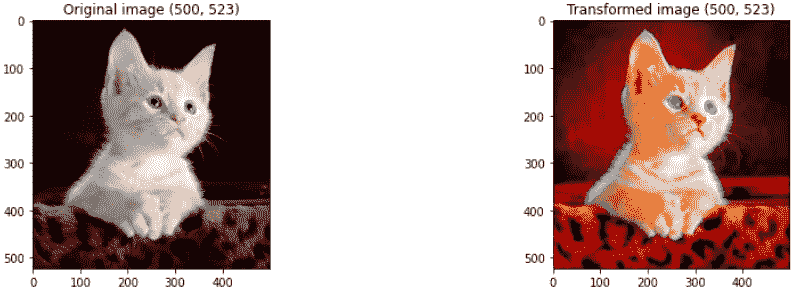

## 顺化(越南城市)

色调被定义为图片中颜色的深浅。

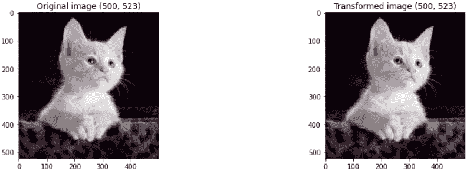

图像本身的变化将有助于模型对看不见的数据更加一般化，因此它不会过度拟合数据。

我希望这个小故事能够帮助或提醒您关于图像数据的数据扩充技术。感谢阅读！

参考资料:

 [## 转换和增强图像- Torchvision 0.13 文档

### 变换是 torchvision.transforms 模块中可用的常见图像变换。它们可以被锁住…

pytorch.org](https://pytorch.org/vision/stable/transforms.html)  [## Mlearning.ai 提交建议

### 如何成为 Mlearning.ai 上的作家

medium.com](/mlearning-ai/mlearning-ai-submission-suggestions-b51e2b130bfb)