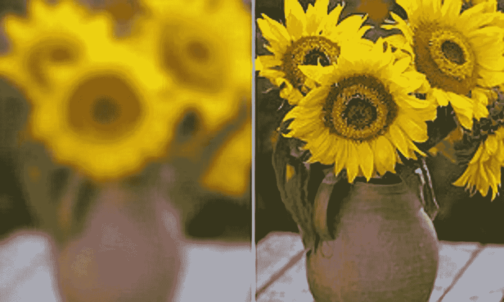
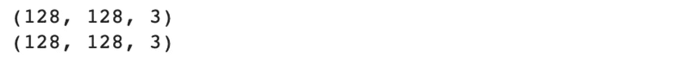
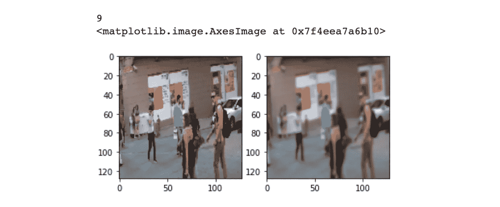
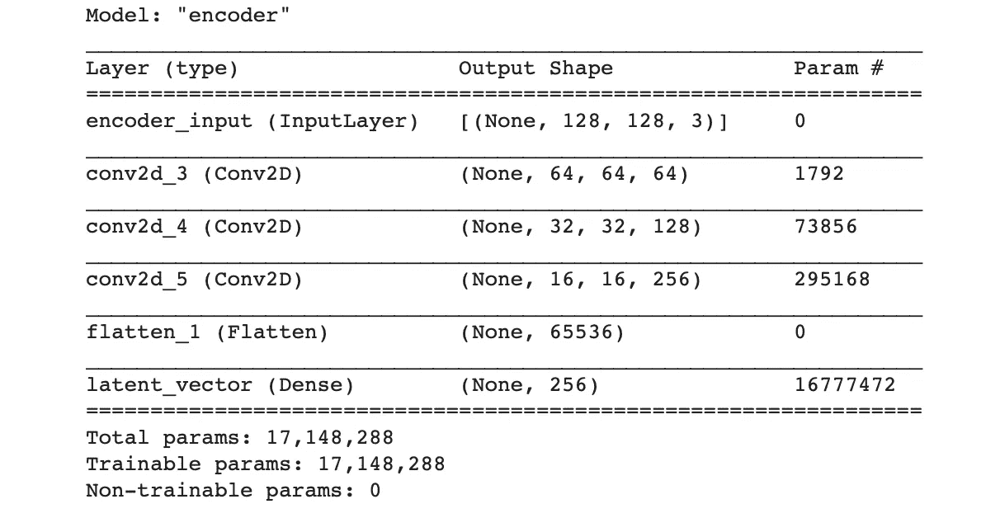
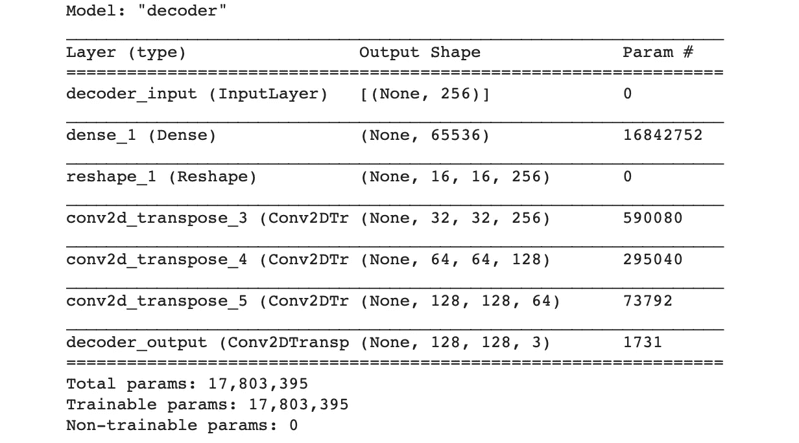
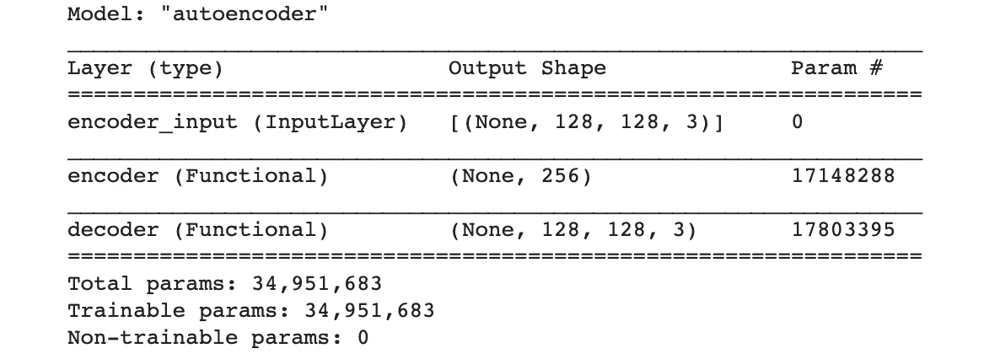
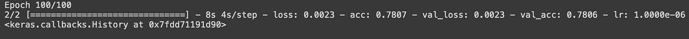
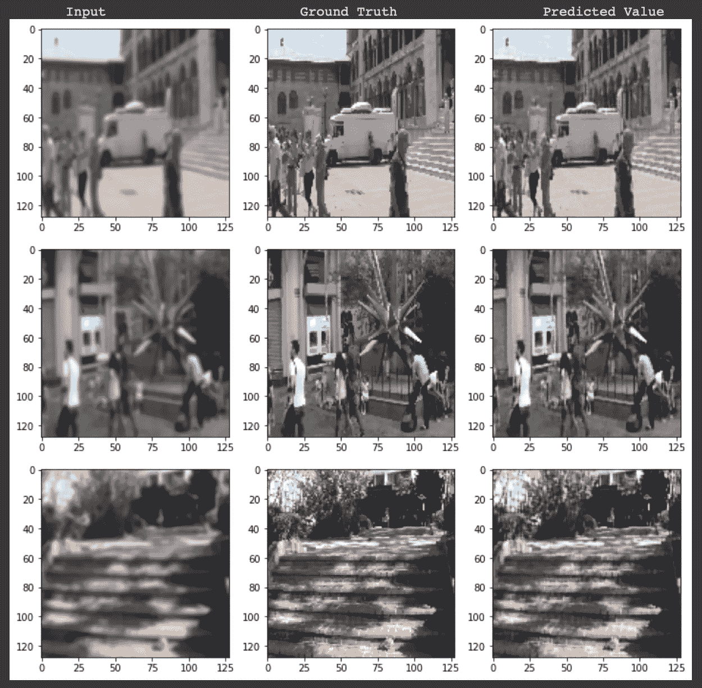
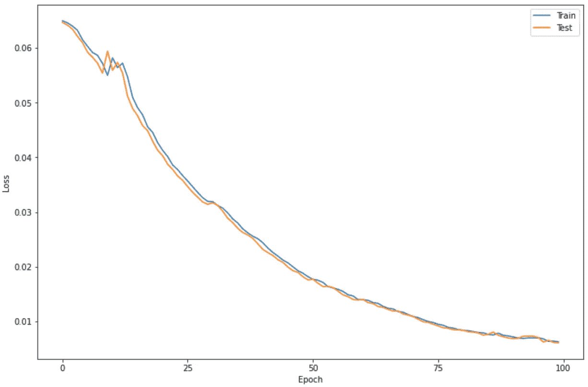
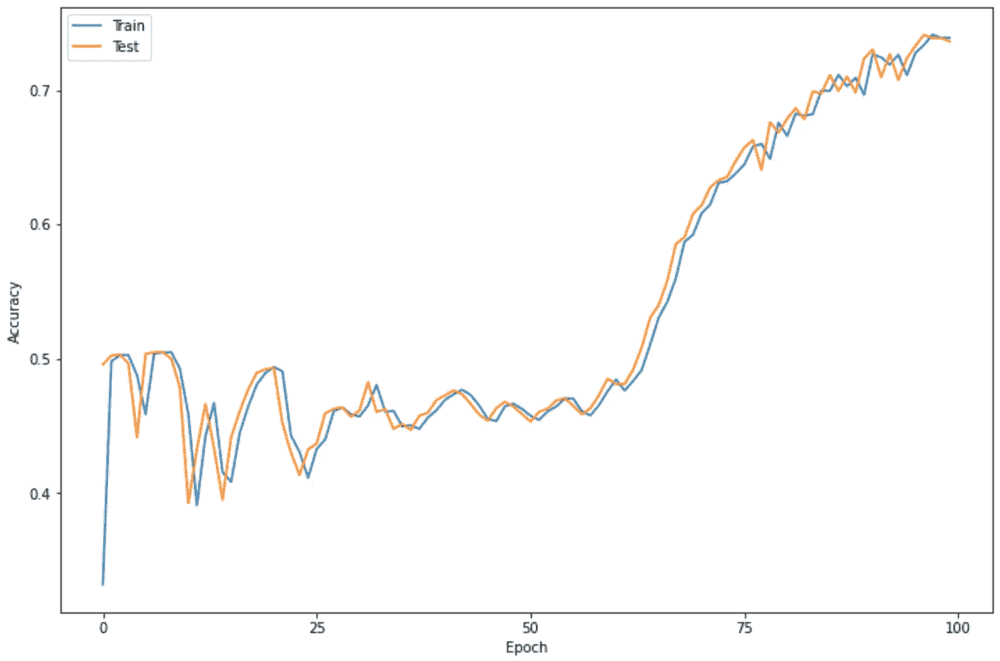

# 使用卷积自动编码器的图像去模糊(深度学习项目教程)

> 原文：<https://medium.com/mlearning-ai/image-deblurring-using-convolutional-autoencoders-deep-learning-project-tutorial-329f87a4c6ad?source=collection_archive---------0----------------------->



Source: [dailymail.uk](https://www.dailymail.co.uk/sciencetech/article-2047831/Adobe-shows-astonishing-unblur-feature-Photoshop.html)

模糊是由相机或主体移动、对焦不准确或使用景深较浅的光圈造成的模糊图像区域。这导致图像的分辨率降低，使得图像的轮廓和特征不清楚。因此，为了获得更清晰的照片，我们可以用相机镜头的首选焦点重新拍摄同一张照片，或者使用我们的深度学习知识，再现一幅去模糊的图像。由于我的专业不是摄影，我可以使用深度学习技术来帮助你消除图像模糊！

> 这是**非初学者友好教程**。在开始这个项目之前，你应该知道深度学习的基本概念，如神经网络，CNN。还要稍微熟悉一下 Keras，Tensorflow 和 OpenCV。

有各种类型的模糊-运动模糊，高斯模糊，平均模糊等。但是我们将集中在去模糊**高斯模糊**图像。在这种模糊类型中，**像素权重不相等**。**模糊在中心较高，在边缘**降低，遵循钟形曲线。


Gaussian Function (Photo from [RasterGrid](https://www.rastergrid.com/blog/2010/09/efficient-gaussian-blur-with-linear-sampling/))

# 资料组

在开始编写代码之前，我首先建议您获取一个由两组图像组成的数据集——模糊图像和清晰图像。如果您找不到任何预先存在的可用数据集，您也可以自己创建一个数据集。如果你不知道怎么做，(或者懒得自己做)，请随时给我发邮件请求数据集链接，我很乐意与你分享！

我的数据集的大小是大约 50 张图像(50 张干净和 50 张模糊)，如果你想使用更多的图像，请随意。

# 密码

现在我们已经准备好了数据集，我们可以开始编写代码了。你可以把它写在你的 Jupyter 笔记本或 Google Colab 或任何你喜欢的平台上。我在这个项目中使用了 Google Colab，因为通过将我的 Google Drive 链接到它，我可以更容易地使用数据集。

## **导入依赖关系**

```
**import** numpy **as** np
**import** pandas **as** pd
**import** matplotlib.pyplot **as** plt

**%**matplotlib inline
**import** random
**import** cv2
**import** os
**import** tensorflow **as** tf
**from** tqdm **import** tqdm
**from** google.colab **import** drive #If you're using Colab and importing the images from the drive
```

在这里，我已经导入了 **tqdm 库**来帮助我创建进度条，让我知道运行一个特定的代码块需要多长时间。

## 导入数据集

```
drive**.**mount('/content/drive', force_remount**=True**)
```

使用上述代码，您可以将 google drive 与 colab 笔记本连接起来，然后进一步复制清晰和模糊图像的路径，如下所示:

```
good_frames **=** '/content/drive/MyDrive/mini_clean'bad_frames **=** '/content/drive/MyDrive/mini_blur'
```

现在为清晰和模糊的图像分别创建 2 个列表。我们将使用 keras 预处理库来转换图像。jpg '，' jpeg '或'.将它们添加到我们新创建的列表中。我选择图像尺寸为 128x128。

```
clean_frames **=** []
**for** file **in** tqdm(sorted(os**.**listdir(good_frames))):
  **if** any(extension **in** file **for** extension **in** ['.jpg', 'jpeg', '.png']):
    image **=** tf**.**keras**.**preprocessing**.**image**.**load_img(good_frames **+** '/' **+** file, target_size**=**(128,128))
    image **=** tf**.**keras**.**preprocessing**.**image**.**img_to_array(image)**.**astype('float32') **/** 255
    clean_frames**.**append(image)

clean_frames **=** np**.**array(clean_frames)blurry_frames **=** []
**for** file **in** tqdm(sorted(os**.**listdir(bad_frames))):
  **if** any(extension **in** file **for** extension **in** ['.jpg', 'jpeg', '.png']):
    image **=** tf**.**keras**.**preprocessing**.**image**.**load_img(bad_frames **+** '/' **+** file, target_size**=**(128,128))
    image **=** tf**.**keras**.**preprocessing**.**image**.**img_to_array(image)**.**astype('float32') **/** 255
    blurry_frames**.**append(image)

blurry_frames **=** np**.**array(blurry_frames)
```

## 为模型导入库

```
**from** keras.layers **import** Dense, Input
**from** keras.layers **import** Conv2D, Flatten
**from** keras.layers **import** Reshape, Conv2DTranspose
**from** keras.models **import** Model
**from** keras.callbacks **import** ReduceLROnPlateau, ModelCheckpoint
**from** keras.utils.vis_utils **import** plot_model
**from** keras **import** backend **as** K

seed = 21
random.seed = seed
np.random.seed = seed
```

## 将数据集分为训练集和测试集

现在，我们将主数据集分成两部分，即训练数据集和测试数据集。我会把它们按 80:20 的比例分开，你也可以试试其他的。

```
x **=** clean_frames;
y **=** blurry_frames;**from** sklearn.model_selection **import** train_test_split
x_train, x_test, y_train, y_test **=** train_test_split(x, y, test_size**=**0.2, random_state**=**42)
```

检查训练和测试数据集的形状

```
print(x_train[0]**.**shape)
print(y_train[0]**.**shape)
```



Each image is 128x128 and 3 is for RGB tunnels

```
r **=** random**.**randint(0, len(clean_frames)**-**1)
print(r)
fig **=** plt**.**figure()
fig**.**subplots_adjust(hspace**=**0.1, wspace**=**0.2)
ax **=** fig**.**add_subplot(1, 2, 1)
ax**.**imshow(clean_frames[r])
ax **=** fig**.**add_subplot(1, 2, 2)
ax**.**imshow(blurry_frames[r])
```

您可以通过上面的代码检查来自训练和测试数据集的图像，输出将是:



Left image being the clean image or Ground Truth and right side image being blurred image

接下来，我们可以初始化一些参数，以便在编写模型代码时使用它们。

```
*# Network Parameters*
input_shape **=** (128, 128, 3)
batch_size **=** 32
kernel_size **=** 3
latent_dim **=** 256

*# Encoder/Decoder number of CNN layers and filters per layer*
layer_filters **=** [64, 128, 256]
```

## 构建编码器模型

如果你对 Autoencoders 了解不多，不用担心，你可以参考 [***这个链接***](https://www.youtube.com/watch?v=1icvxbAoPWc) 了解一下基本情况。

```
inputs **=** Input(shape **=** input_shape, name **=** 'encoder_input')
x **=** inputs
```

为了避免繁琐的手工计算，我们将直接使用这些库。我们将构建一个 Conv2D(64)-Conv2D(128)-Conv2D(256)堆栈。该模型将具有输入形状(128，128，3)和等于 3 的内核大小，编码器将把该形状压缩为(16，16，256)，并进一步将其展平为一维数组，该数组将成为我们解码器的输入。

```
**for** filters **in** layer_filters:
    x **=** Conv2D(filters**=**filters,
               kernel_size**=**kernel_size,
               strides**=**2,
               activation**=**'relu',
               padding**=**'same')(x)shape **=** K**.**int_shape(x)
x **=** Flatten()(x)
latent **=** Dense(latent_dim, name**=**'latent_vector')(x)
```

这里的 K.int_shape()有助于将张量转换成整数元组。

实例化编码器模型，

```
encoder **=** Model(inputs, latent, name**=**'encoder')
encoder**.**summary()
```



## 构建解码器模型

解码器模型将类似于编码器模型，但它将做相反或相反的计算。我们将首先手动将一维数组从编码器模型转换为(16，16，256)形状，然后将其发送到解码器，将其解码回(128，128，3)形状。所以这里的栈会是 conv 2d transpose(256)-conv 2d transpose(128)-conv 2d transpose(64)。

```
latent_inputs **=** Input(shape**=**(latent_dim,), name**=**'decoder_input')
x **=** Dense(shape[1]*****shape[2]*****shape[3])(latent_inputs)
x **=** Reshape((shape[1], shape[2], shape[3]))(x)**for** filters **in** layer_filters[::**-**1]:
    x **=** Conv2DTranspose(filters**=**filters,
                        kernel_size**=**kernel_size,
                        strides**=**2,
                        activation**=**'relu',
                        padding**=**'same')(x)

outputs **=** Conv2DTranspose(filters**=**3,
                          kernel_size**=**kernel_size,
                          activation**=**'sigmoid',
                          padding**=**'same',
                          name**=**'decoder_output')(x)
```

实例化解码器模型，

```
decoder **=** Model(latent_inputs, outputs, name**=**'decoder')
decoder**.**summary()
```



## 构建自动编码器模型

现在我们有了编码器和解码器模型，我们可以将它们结合起来，最终构建我们的自动编码器模型。

> **自动编码器型号=编码器型号+解码器型号**

实例化自动编码器模型，

```
autoencoder **=** Model(inputs, decoder(encoder(inputs)), name**=**'autoencoder')
autoencoder**.**summary()
```



## 最后但并非最不重要

在训练我们的模型之前，我们还需要做最后一件事，选择超参数。

```
autoencoder**.**compile(loss**=**'mse', optimizer**=**'adam',metrics**=**["acc"])
```

我选择损失函数为均方误差，优化器为 Adam，评估指标为准确性。

现在定义学习率降低器，如果度量没有改善，则降低学习率，

```
lr_reducer **=** ReduceLROnPlateau(factor**=**np**.**sqrt(0.1),
                               cooldown**=**0,
                               patience**=**5,
                               verbose**=**1,
                               min_lr**=**0.5e-6)
```

在每个时代都称之为，

```
callbacks **=** [lr_reducer]
```

## 训练模型

```
history = autoencoder**.**fit(blurry_frames,
                      clean_frames,
                      validation_data**=**(blurry_frames, clean_frames),
                      epochs**=**100,
                      batch_size**=**batch_size,
                      callbacks**=**callbacks)
```

运行此代码后，可能需要大约 5-6 分钟甚至更长时间才能看到最终输出，即第 100 个纪元。对我来说是的，



The accuracy is 78.07% which is pretty decent

## 决赛成绩

现在我们已经成功地训练了我们的模型，让我们看看我们的模型的预测，

```
print("\n       Input                        Ground Truth                  Predicted Value")**for** i **in** range(3):

    r **=** random**.**randint(0, len(clean_frames)**-**1)

    x, y **=** blurry_frames[r],clean_frames[r]
    x_inp**=**x**.**reshape(1,128,128,3)
    result **=** autoencoder**.**predict(x_inp)
    result **=** result**.**reshape(128,128,3)

    fig **=** plt**.**figure(figsize**=**(12,10))
    fig**.**subplots_adjust(hspace**=**0.1, wspace**=**0.2)

    ax **=** fig**.**add_subplot(1, 3, 1)
    ax**.**imshow(x)

    ax **=** fig**.**add_subplot(1, 3, 2)
    ax**.**imshow(y)

    ax **=** fig**.**add_subplot(1, 3, 3)
    plt**.**imshow(result)
```

其输出将会是，



因此，我们可以看到，该模型在消除图像模糊方面做得非常好，几乎能够恢复原始图像。我们可以通过超参数调整来进一步优化我们的解决方案，这可能会使我们的模型更准确。为此，我们可以绘制损失函数和精确度的图表，以便做出更好的决策。

对于损失函数，

```
plt**.**figure(figsize**=**(12,8))
plt**.**plot(history**.**history['loss'])
plt**.**plot(history**.**history['val_loss'])
plt**.**legend(['Train', 'Test'])
plt**.**xlabel('Epoch')
plt**.**ylabel('Loss')
plt**.**xticks(np**.**arange(0, 101, 25))
plt**.**show()
```



由此我们可以看出，损失在显著减少，然后从大约第 80 纪元开始停滞。

为了准确起见，

```
plt**.**figure(figsize**=**(12,8))
plt**.**plot(history**.**history['acc'])
plt**.**plot(history**.**history['val_acc'])
plt**.**legend(['Train', 'Test'])
plt**.**xlabel('Epoch')
plt**.**ylabel('Accuracy')
plt**.**xticks(np**.**arange(0, 101, 25))
plt**.**show()
```



从这里我们可以看到精确度显著增加，如果有更多的时期，它可能会进一步增加。因此，您可以尝试增加历元大小，并检查准确性是否确实提高了。

# 结论和未来工作

我们已经取得了相当不错的准确率，为 78.07%。但这并不是结束，该项目还可以通过以下方式进行改进:

*   获取更多数据以提高模型的准确性
*   超参数调谐
*   深入研究过拟合问题

谢谢你读到这里，如果你有任何反馈，请告诉我！

***参考文献***

【https://citeseerx.ist.psu.edu/viewdoc/download? doi = 10 . 1 . 1 . 303 . 227&rep = re P1&type = pdf

 [## TF . keras . utils . load _ img | tensor flow Core v 2 . 8 . 0

### 将图像加载为 PIL 格式。

www.tensorflow.org](https://www.tensorflow.org/api_docs/python/tf/keras/utils/load_img) [](https://keras.io/api/layers/convolution_layers/convolution2d/) [## Keras 文档:Conv2D 层

### 2D 卷积层(例如图像上的空间卷积)。这一层创建一个卷积核是卷积…

keras.io](https://keras.io/api/layers/convolution_layers/convolution2d/) [](https://pyimagesearch.com/2020/02/17/autoencoders-with-keras-tensorflow-and-deep-learning/) [## 具有 Keras、TensorFlow 和深度学习的自动编码器- PyImageSearch

### 在本教程中，您将学习如何使用 Keras、TensorFlow 和深度学习来实现和训练自动编码器。

pyimagesearch.com](https://pyimagesearch.com/2020/02/17/autoencoders-with-keras-tensorflow-and-deep-learning/) [](https://analyticsindiamag.com/guide-to-autoencoders-with-python-code/) [## 自动编码器指南，带 Python 代码

### 自动编码器是一种人工神经网络，用于在无监督的情况下压缩和解压缩输入数据

analyticsindiamag.com](https://analyticsindiamag.com/guide-to-autoencoders-with-python-code/) [](https://keras.io/examples/vision/autoencoder/) [## Keras 文档:用于图像去噪的卷积自动编码器

### 作者:圣地亚哥·l·瓦尔达拉马创建日期:2021/03/01 最后修改时间:2021/03/01 描述:如何训练一个深…

keras.io](https://keras.io/examples/vision/autoencoder/) [](/mlearning-ai/mlearning-ai-submission-suggestions-b51e2b130bfb) [## Mlearning.ai 提交建议

### 如何成为 Mlearning.ai 上的作家

medium.com](/mlearning-ai/mlearning-ai-submission-suggestions-b51e2b130bfb)