# 使用 VGG-19 卷积神经网络的图像检测

> 原文：<https://medium.com/mlearning-ai/image-detection-using-convolutional-neural-networks-89c9e21fffa3?source=collection_archive---------0----------------------->

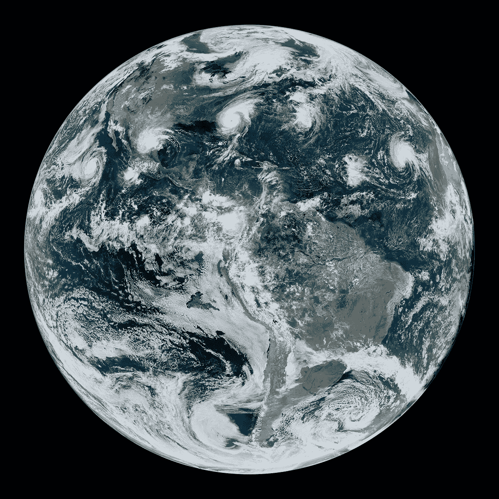

我使用 VGG-19 卷积神经网络从我的自然摄影收藏中筛选照片，并检测包含树木的图像。这是一次有趣的练习，我学到了很多关于 CNN 的幕后工作。**下面我描述了 CNN 的架构、流程和输入，并提供了我如何构建 mine** 的八步实现。

# **CNN 架构，流程&输入**

**架构:**

CNN 包含将图像转换成模型可以理解的输出的层的组合。

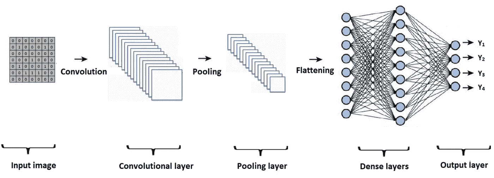

*   卷积层:通过应用一次扫描图像几个像素的过滤器来创建特征图
*   汇集层:缩小卷积层生成的信息，以有效地存储它
*   完全连接的输入层:将输出展平为单个矢量
*   完全连接的图层:对要素分析生成的输入应用权重
*   完全连接的输出层:生成最终概率以确定图像类别

**流程:**

前向和后向传播遍历网络中的所有训练样本，直到确定最佳权重，并且只有最强大和最具预测性的神经元被激活来进行预测

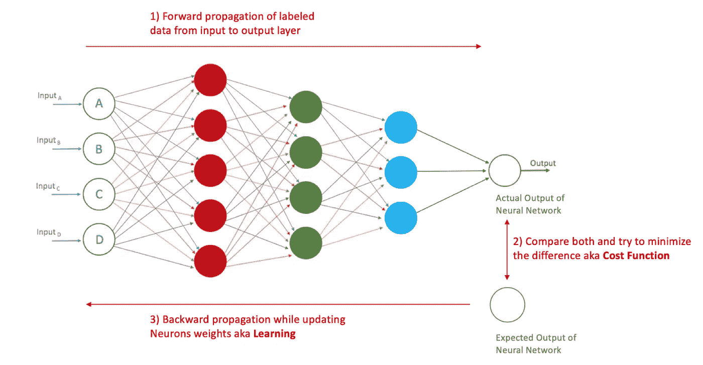

*   该模型通过每次对所有训练样本进行一次向前和一次向后的传递来贯穿许多时期进行训练
*   前向传播通过比较每个标记图像的实际目标和预测目标之间的差异来计算损失和成本函数
*   反向传播使用梯度下降来更新每个神经元的权重和偏差，将更多影响归因于具有最大预测能力的神经元，直到它到达最佳激活组合
*   随着模型看到的示例越来越多，它将学会更好地预测导致损失度量减少的目标
*   成本函数采用所有样本的平均损失来表示整体性能

**输入:**

模型输入必须是由(batch_size，height，width，depth)组成的 4D 数组

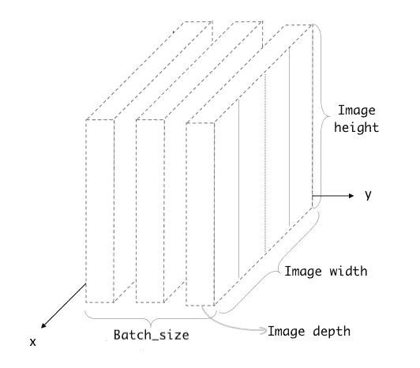

*   批量大小:一个时期内训练样本的数量(批量越大，需要的内存就越多)
*   高度和宽度:图像的像素尺寸
*   深度:红色、绿色或蓝色(3)，或黑色和白色(1)

# 我的 VGG19 型号

下面是我的性能最好的 VGG19 模型的 8 步配置。VGG19 是一种先进的 CNN，具有预先训练的层，并且在形状、颜色和结构方面对定义图像的内容有很好的理解。VGG19 非常深入，已经通过复杂的分类任务在数百万张不同的图像上进行了训练。我没有进一步训练 VGG19，只是冻结了它的图层，并在其上附加了一个浅 2 层网络来执行我的分类任务，识别有树和无树的图像。

1.加载您的模型。

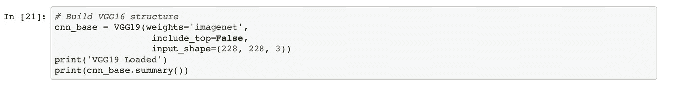

2.加载您的数据集大小。在这种情况下，指定用于训练、测试和验证的照片已经被随机地放入不同的文件夹中，并且被手动地在有树(目标= 1)和没有树(目标= 0)的照片之间进行分离。

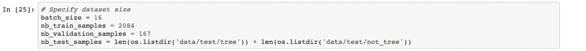

3.设置一个功能来提取和冻结 VGG-19 的初始层，这些层处理引擎盖下图像的特征和标签。这将允许模型应用迁移学习，其中它可以从网络上的数百万张照片中回忆起它的预训练。

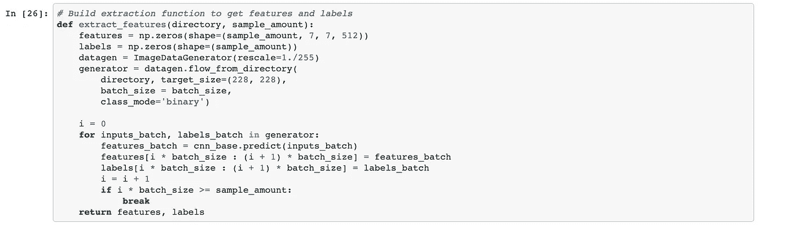

4.将该函数应用于训练、验证和测试数据集，以便从所有数据集中提取特征和标签。

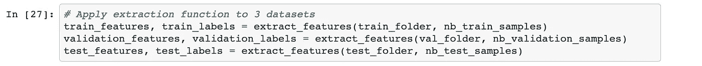

5.确保数据的形状正确，以反映数据集的维度。

6.将提取的特征和标签保存到一个“瓶颈”文件夹中，供最终的分类层参考并推断图像属于哪个二进制类别。

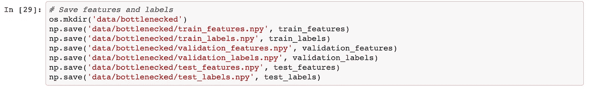

7.在 VGG-10“大脑”的顶部构建图像分类器最后一层，并将其投入使用。

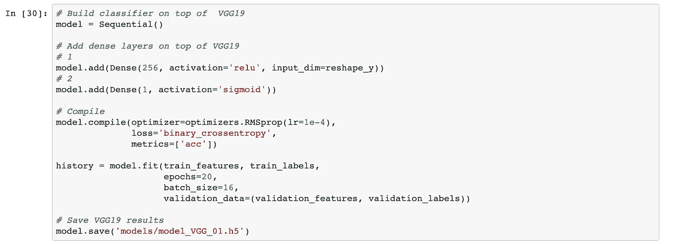

8.要使用您的准确性和损失度量来直观显示您的模型的学习情况，请打印您的培训历史。正如您所看到的，随着每个时期(或迭代)，我们的精度增加，损失减少。

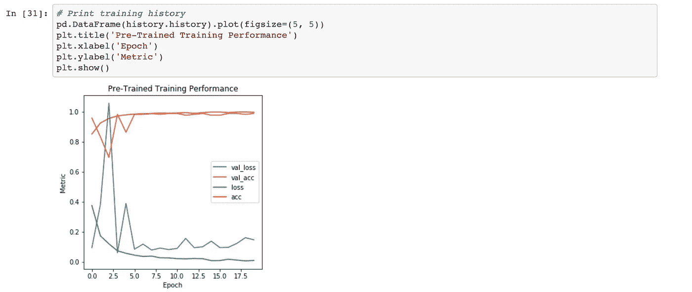

除了试验不同的模型超参数，您还可以采取以下步骤来改进您的模型:

**为了提高模型性能**，添加逆境，这样你的模型就可以学会识别你的目标，即使是在不可能的情况下:

*   翻转图像方向
*   整合与你的目标相似的图片
*   添加模糊和不清晰的版本

**提高模型效率，**降低模型负载:

*   通过压缩空间大小和参数，在层之间执行最大池化以降低图像维数
*   尝试早期停止，以防止过度拟合；如果您的模型达到了最高精度，它将在特定的历元数后停止寻找更高的精度
*   训练更少的历元以减少处理时间
*   尝试不同的激活功能，如 ReLU，它只激活某些神经元，比 sigmoid 或 tanh 更有效
*   尝试放弃，以便在训练过程中忽略随机选择的神经元，从而减少网络计算
*   避免大像素图像，因为增加图像清晰度并不能提高学习效果(224 x 224 像素是标准)

这里是 [github 库](https://github.com/melisabardhi/Project4-Image-Detection-Using-Convolutional-Neural-Networks)，包含完整的代码和一些用来训练我的模型的照片。

感谢您的阅读！

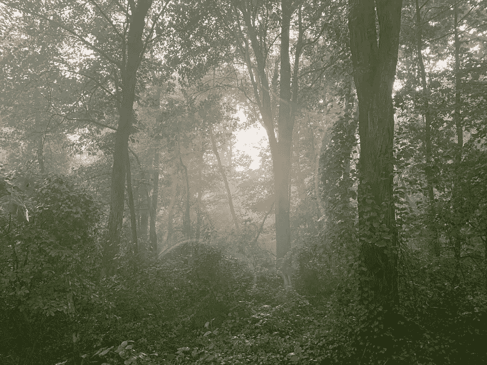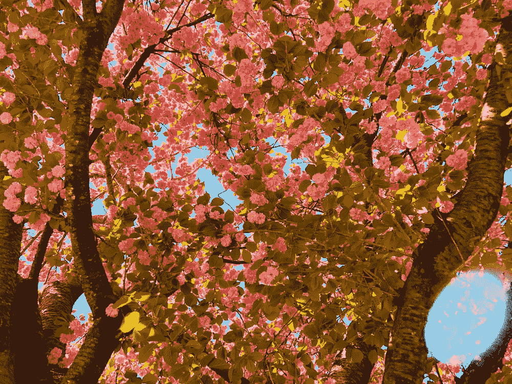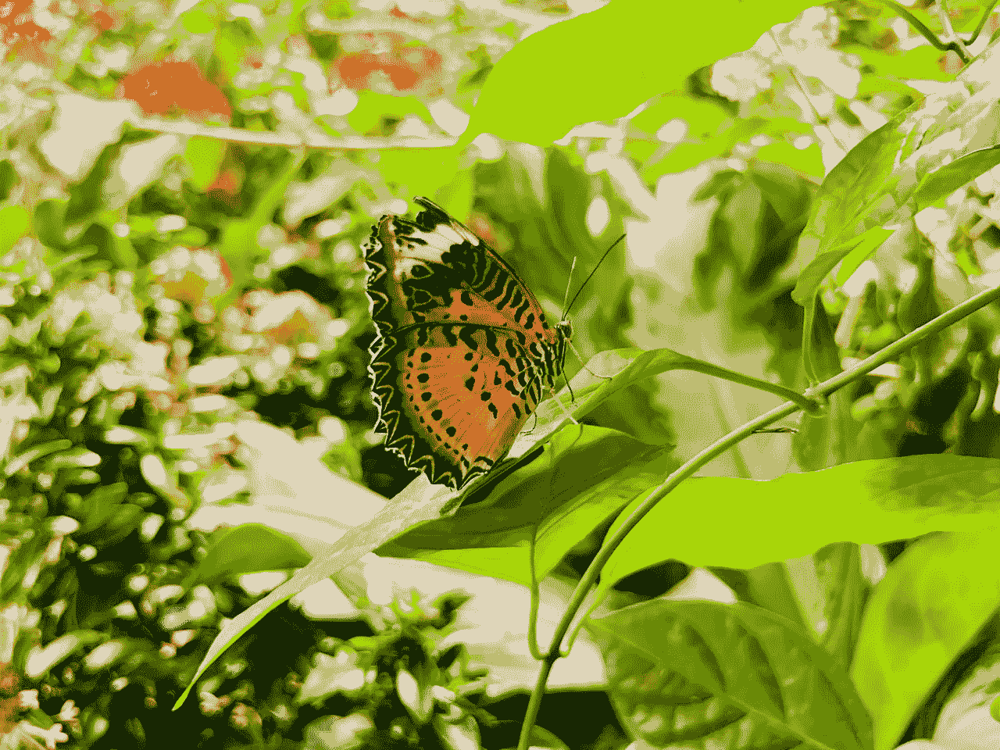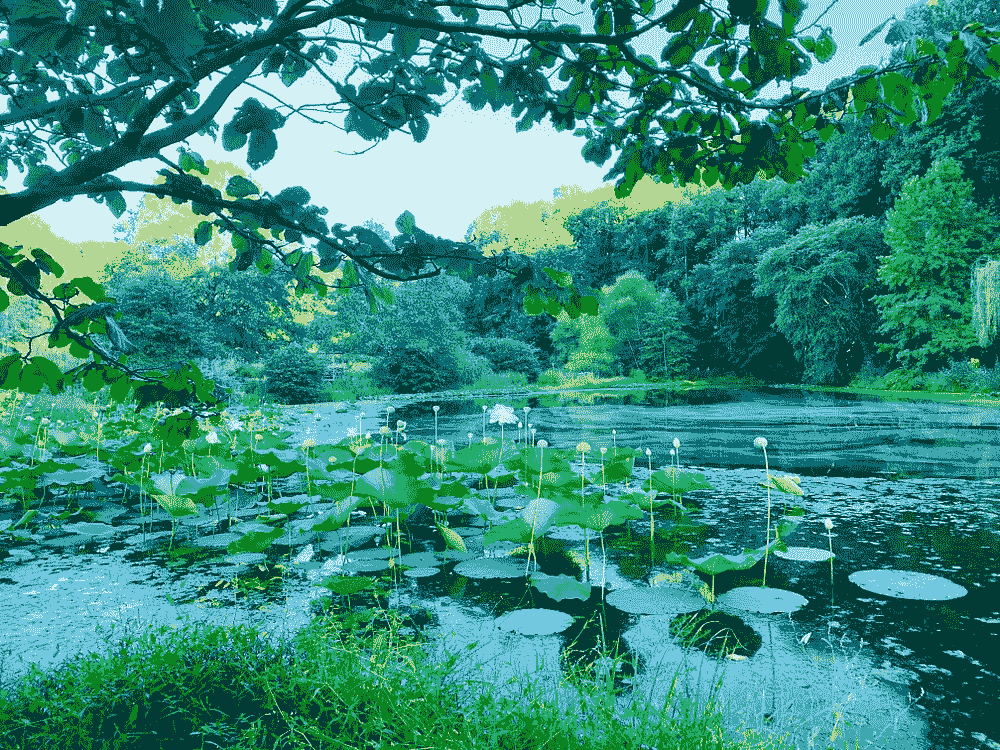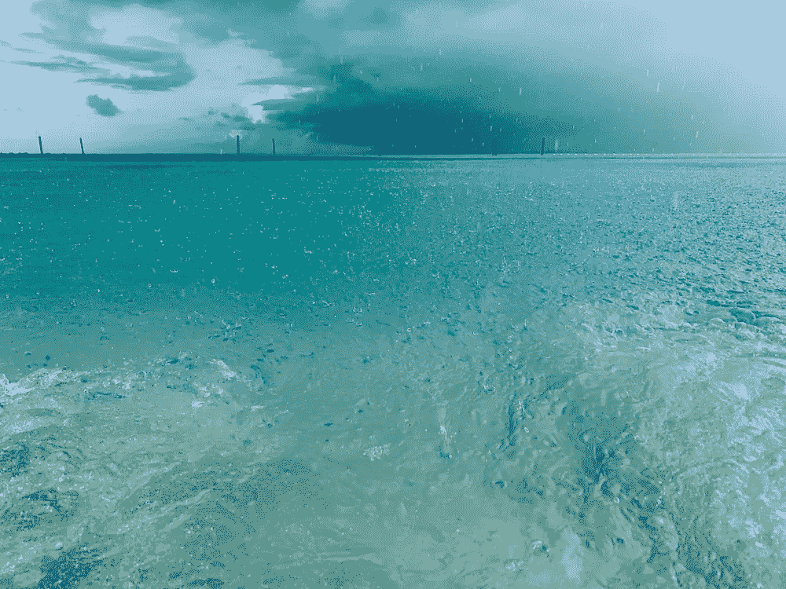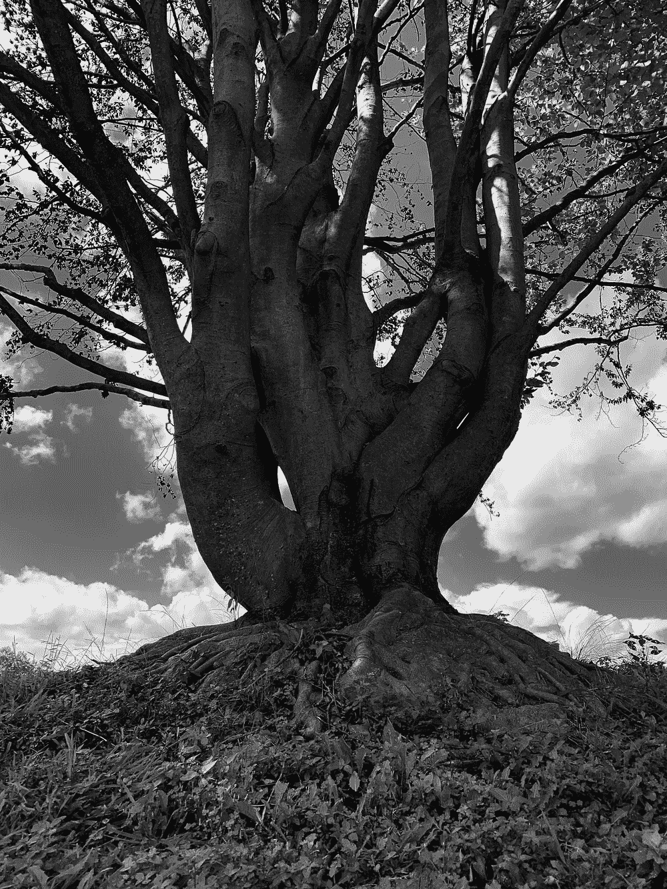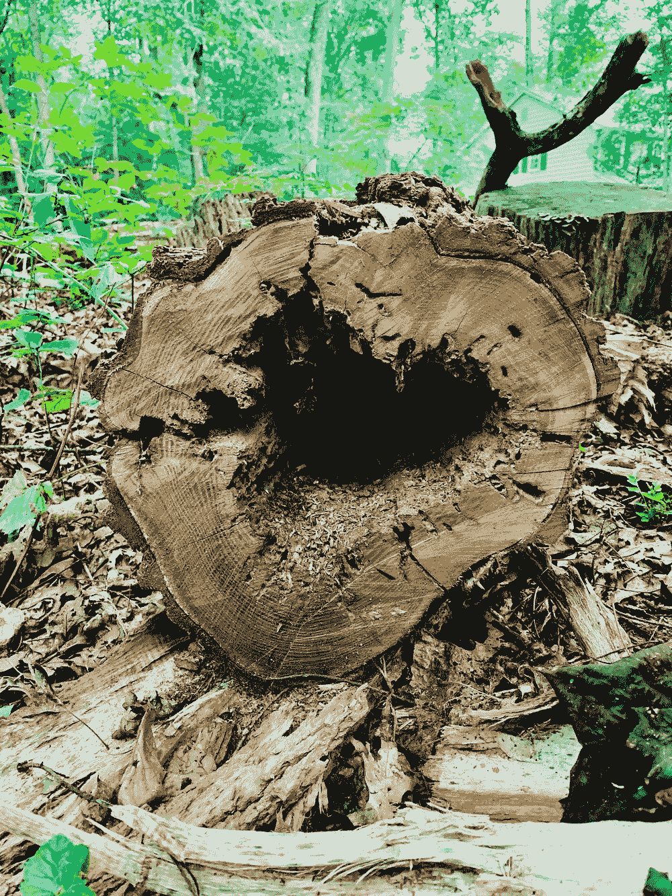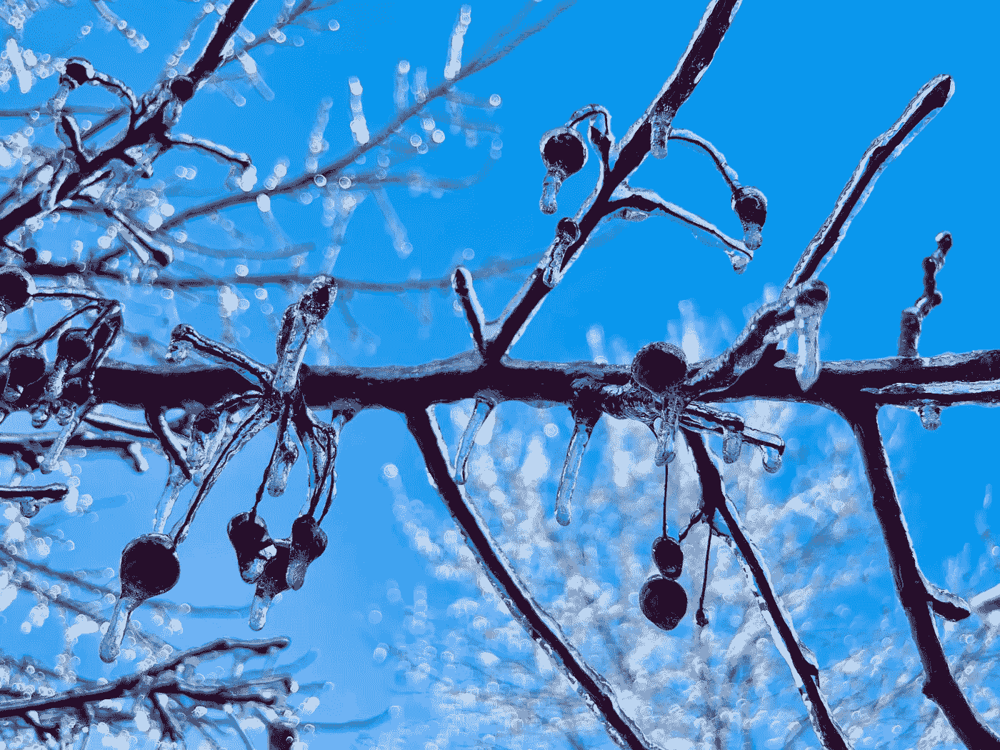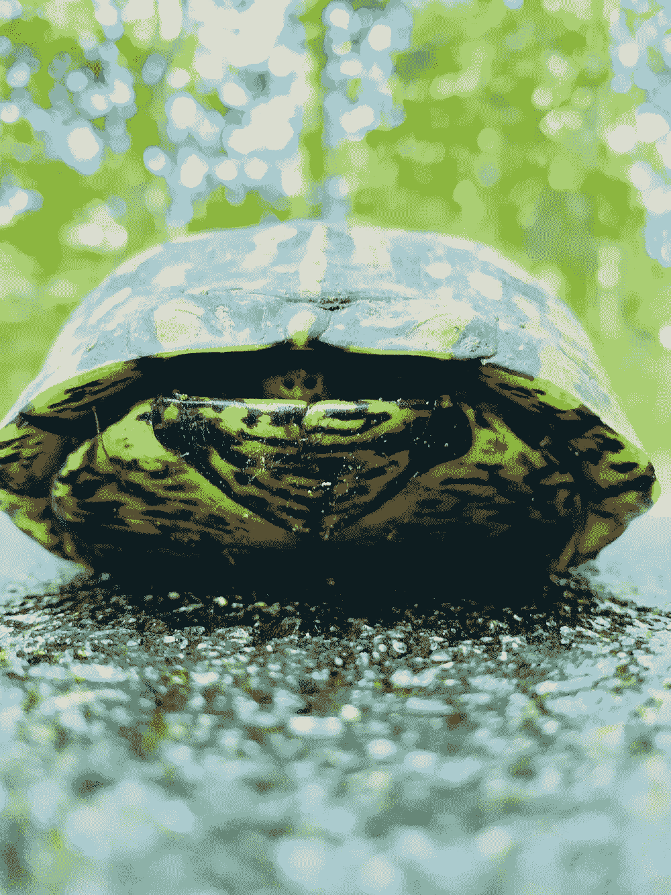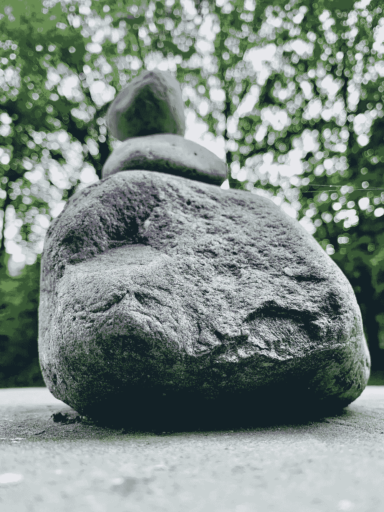