# 使用生成对抗网络的图像生成

> 原文：<https://medium.com/mlearning-ai/image-generation-using-generative-adversarial-networks-gans-cd82afd71597?source=collection_archive---------0----------------------->

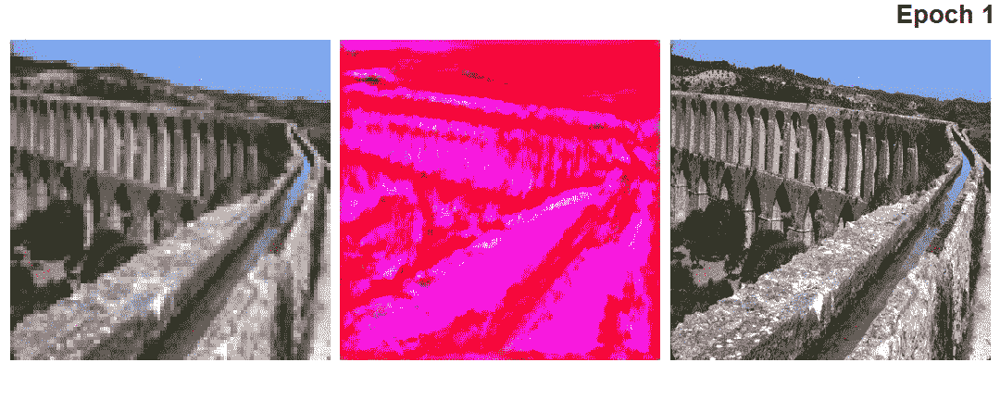

Image generation using Super Resolution GAN architecture

> **理解生成性对抗网络**

生成对抗网络，俗称 GANs，是 2014 年通过[这篇研究论文](https://arxiv.org/pdf/1406.2661.pdf)提出的一种深度学习、无监督的机器学习技术。该架构的主要模块包括:

1.  **生成器:**该块通过将噪声作为输入，试图生成与原始数据集非常相似的图像。它试图学习输入数据(X)和输出数据(Y)的连接概率；P(X|Y)。
2.  **鉴别器:**该模块试图接受两个输入，一个来自主数据集，另一个来自生成器生成的图像，并将它们分为真或假。

为了使这种生成和对抗过程简单，这两个块都由基于深度神经网络的体系结构制成，该体系结构可以通过前向和后向传播技术来训练。

自 GANs 问世以来，GANs 取得了巨大的进步。存在专门为某些任务制造 GAN 架构。

*   [使用深度卷积 GANs 生成图像。](https://arxiv.org/pdf/1511.06434.pdf)
*   [用 GANs 生成动漫角色。](https://arxiv.org/pdf/1708.05509.pdf)
*   [使用 GANs 生成草图到彩色照片。](https://arxiv.org/pdf/1611.07004.pdf)
*   [使用 CycleGANs 的不成对图像到图像翻译。](https://arxiv.org/pdf/1703.10593.pdf)
*   [使用堆叠 GAN 的文本到图像合成。](https://arxiv.org/pdf/1612.03242.pdf)
*   [使用 GANs 生成新的人类姿势。](https://arxiv.org/pdf/1705.09368.pdf)
*   [使用 GANs 的单幅图像超分辨率。](https://arxiv.org/pdf/1609.04802.pdf)
*   [基于 GAN 的照片修复。](https://arxiv.org/pdf/1607.07539.pdf)

为了深入理解这一概念，我们将通过 tensorflow-keras 实现 GAN 架构。我们将关注通过**简单 GANs** 和**深度卷积 GANs** 以及**超分辨率 GANs** 生成 MNIST 图像，并给出工作示例。

> ***【简单生成对抗网络】***

有了上面简单 gan 的架构，我们再来看看生成器模型的架构。

enerator 由四个密集层组成，其中一个 100 维的噪声数据作为输入被传递。生成器的最后一个密集层产生 784(28×28 = 784)维向量，该向量主要是对应于每个单独 MNIST 图像的平坦向量。

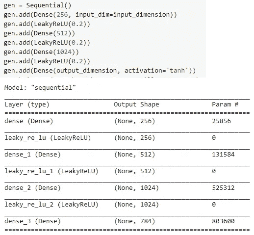

Generator of Simple GAN

对于最后一个密集层，我们使用了 *tanh* 激活单元，因为我们从[-1，+1]开始归一化每个图像。来自发生器的这个发生器向量然后被传递到下一个模块，该模块是 GANs 的鉴别器网络。

D 是一个鉴别器，它的主要任务是在预测真实或虚假数据时获得最大概率，我们将我们的 784 维生成器输出向量传递给它。该块也包括如下所示的四个致密层。

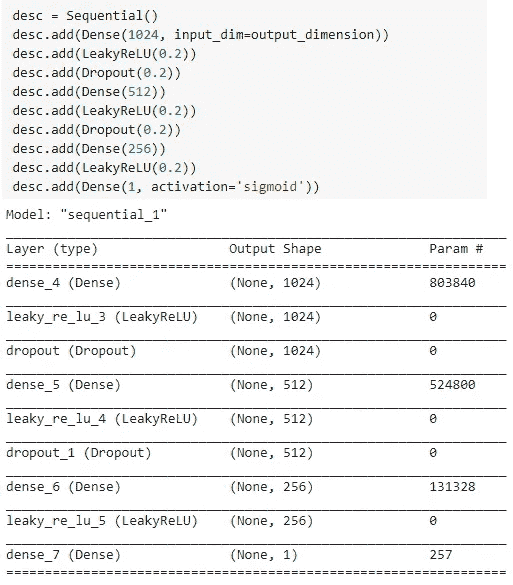

Discriminator of Simple GAN

对最后一层使用 s 形激活，这给出了输入图像是真的还是假的概率。

LeakyRelu 激活函数用于生成器和鉴别器中，这有助于模型的更快收敛。

这些生成块和判别块组合在一起如下:

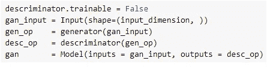

Simple GAN model

为了执行实际的训练，我们将通过初始化每个功能块来初始化生成器、鉴别器和 gan 对象。我们将为生成器生成 100 维的噪声输入。当我们在[-1，+1]之间归一化图像时，我们将从范围[-1，+1]的正态分布中得到随机噪声。

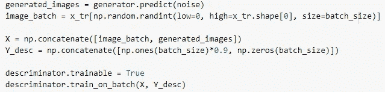

Prediction of Real and Fake images through GAN Discriminator

使用上面的代码，我们将首先通过向生成器传递随机噪声来生成样本图像。然后将这些图像与真实图像相结合，生成一批真实和伪造的图像。这一批被传递到一个鉴别器，该鉴别器预测图像是真的还是假的概率。

直到鉴别器预测的这个阶段，我们保持鉴别器是可训练的，因为预测的损失需要通过网络反向传播以更新对应于每一层的权重。

现在，通过冻结鉴频器的层，我们试图通过生成器反向传播 GAN 损耗，以更新每层的权重。

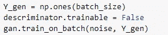

Freezing Discriminator, we backpropagate loss through Generator

下图显示了 GAN 架构的进展，通过简单的噪声输入，生成器能够创建与原始数据相似的 MNIST 图像。

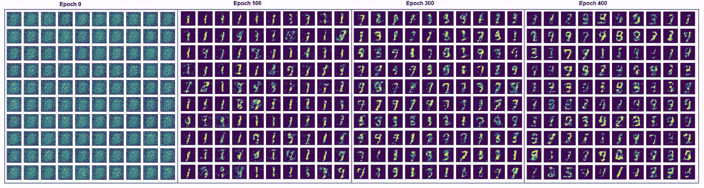

> ***深度卷积生成对抗网络(DC·甘斯)***

在深度神经网络的帮助下生成类似的 MNIST 图像非常有趣，但该模型未能实现架构中的主要深度学习算法，即卷积神经网络。

从今以后，我们将使用卷积滤波器从噪声输入中生成图像，而不是将图像展平成致密层。

DC GAN 发生器由致密层和随后的批量正火层组成。这里，我们首先将噪声作为输入，乘以 FxFxK 个元素。这个输出然后被整形为 FxFxK 形状。

卷积 2d 转置层用于 DC GANs，其主要目的是对输入图像进行上采样。完整的架构如下:

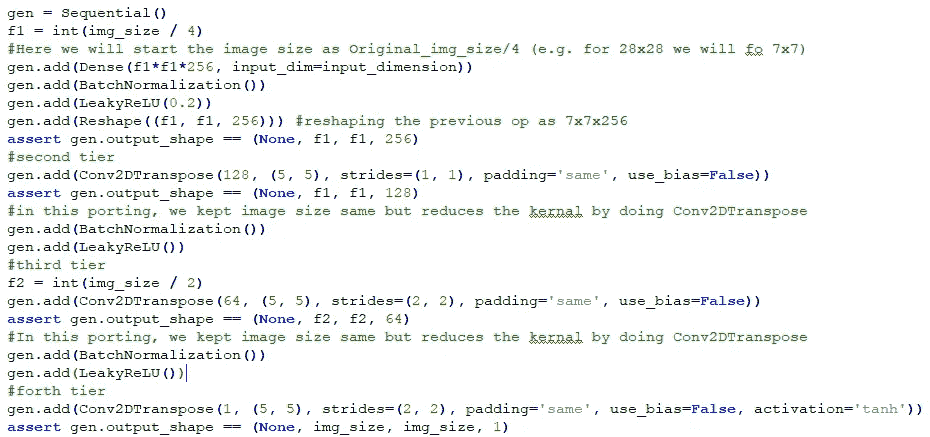

D 与前面的例子不同，DC GANs 的识别器接受图像而不是矢量格式的输入。通过发生器和原始数据生成的图像被采样，以将其传递给鉴别器。

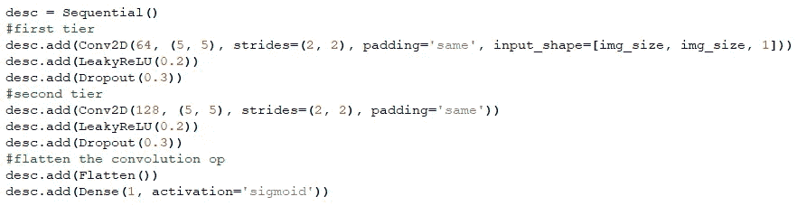

LeakyRelu 激活与 Dropout 的低值一起使用，以避免模型的过度拟合。

DC 甘斯的其余流程与简单甘斯相同，其中我们让鉴别器首先通过训练损失的反向传播来更新它的权重。鉴别器更新后，我们冻结鉴别器，并用假数据安装生成器。发电机的损耗然后通过它反向传播，以便更新权重。

下图向我们展示了 DC-GAN 在 400 个时期的 MNIST 数据上的性能进展。

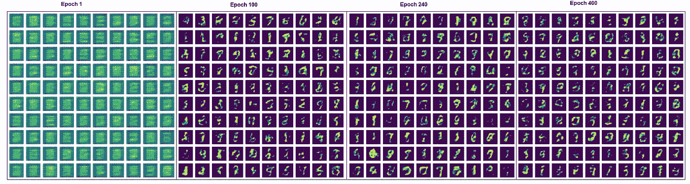

> ***超分辨率生成对抗网络***

现在，我们将研究一种称为 SR GANs 的高级 GAN 架构。这样做的主要目的是:

通过接受低分辨率图像作为输入使用生成器生成超分辨率图像。这个超分辨率图像非常类似于原始数据集的原始高分辨率图像。

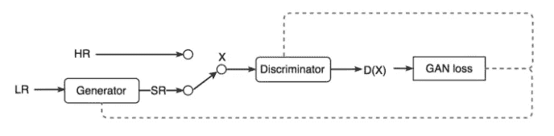

SR GANs block diagram

从上面的方框图看 SR GANs 的工作；

*   原始数据集由高分辨率(HR)图像组成，对其进行下采样以获得低分辨率(LR)图像。
*   这些 LR 图像然后被传递到 SR GAN 发生器，该发生器产生与 HR 图像的超分辨率(SR)图像接近匹配的 SR 图像。
*   这些 SR 和 HR 图像的批次然后被传递到 SR GAN 鉴别器，该鉴别器预测图像是真的还是假的。
*   SR GAN 的最终损耗然后被反向传播到发生器和鉴别器网络，用于更新权重。

既然我们理解了架构的工作原理，我们现在可以理解每个核心模块的细节；发生器和鉴别器。

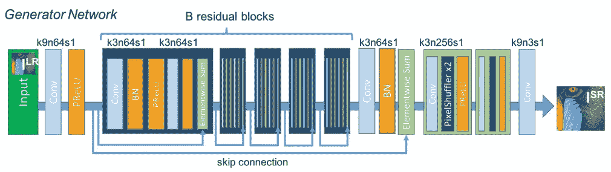

SR GAN Generator

如实际研究论文中的所述，上图为 SR GAN 发生器的框图。LR 输入图像通过卷积层，随后是参数 ReLU 激活。然后，输出被传递给 16 个剩余块的集合。来自残差块的输出然后被传递到一对卷积块，卷积块然后被传递到上采样块，上采样块将图像的分辨率提高到期望的水平。

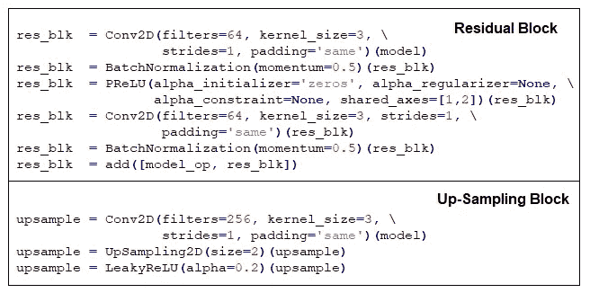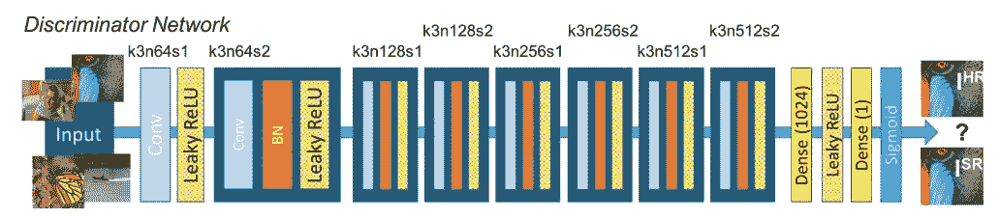

SR GAN Discriminator

与所有其他 GAN 架构一样，SR GAN 的鉴别器通过同时接受两幅图像来预测真假图像，在这里我们可以看到，与之前看到的架构相比，它实现的复杂结构很少。

鉴频器输出然后被用来寻找模型的损失。

SR GAN 中的 oss 功能可以是内容丢失和对抗性丢失的组合。这里，可以使用 HR 和 SR 图像之间的 MSE 逐像素捕获内容损失。这可以通过将输入图像通过 VGG19 网络来提取对应于每个输入图像的密集向量来计算。

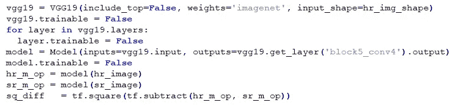

vgg19 Content Loss

在运行完整的 SR GAN 模型时，我们将初始化生成器、鉴别器和 SR-GAN 对象。

生成器对象将用 *Adam optimizer* 编译，并且只有*内容丢失*(即 VGG19 像素级 MSE)。

另一方面，鉴别器对象将使用 *binary_crossentropy* 和 *Adam optimizer* 进行编译。

我们不是训练一批混合的 HR 和 LR 图像，而是首先将 HR 图像传递给鉴别器，然后通过使用 ***生成器，用一批 LR 图像对其进行训练。***

现在，为了训练鉴别器，我们将冻结鉴别器，并用 LR 图像训练 srgan 对象，并将[HR_images，REAL_IMAGE_LABELS]作为所需的输出。

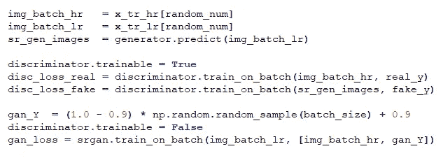

在批量大小为 64、周期数为 400 的网络上运行，我们能够从 SE GAN 架构获得显著的输出。

本文开头的 GIF 是使用 SR GAN 架构本身生成的。从下面，我们可以清楚地看到，模型能够非常清楚地预测桥梁和运河的边缘。

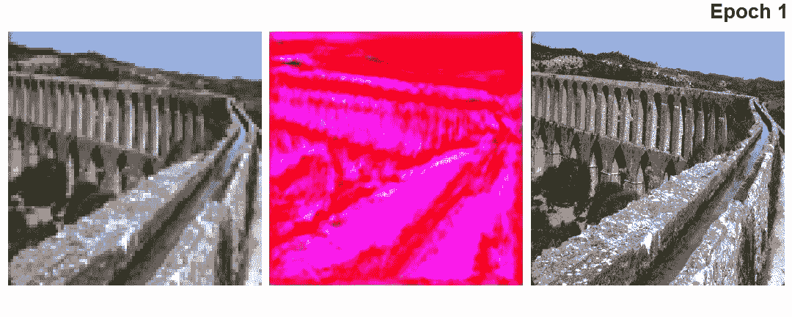

随着模型在各个时期的进展，我们可以看到从纪元 1 到纪元 200，桥梁结构非常清晰可见，clif，它的绿色植物和一些文明在 SR 图像中清晰可见(中间)。

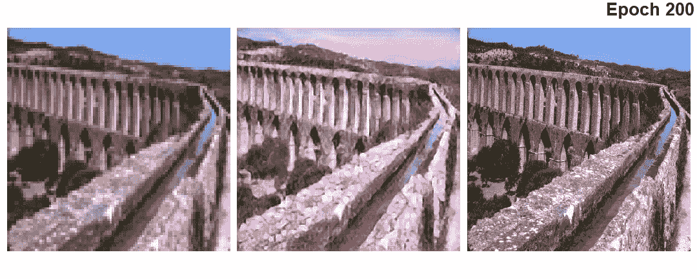

这是 Epoch400 结束时的一个结果，天空的颜色改善了很多，包括桥上的水。因此，考虑到低层次的图像，我们的眼睛可以看到小像素，模型能够重新生成具有更精细细节的图像。

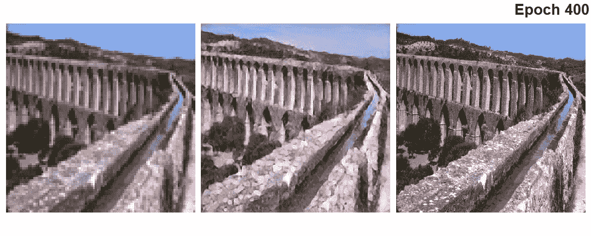

这里有一些其他的图像生成；

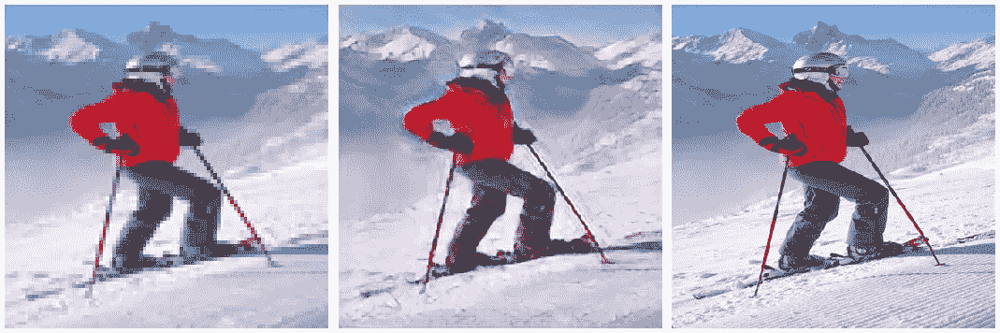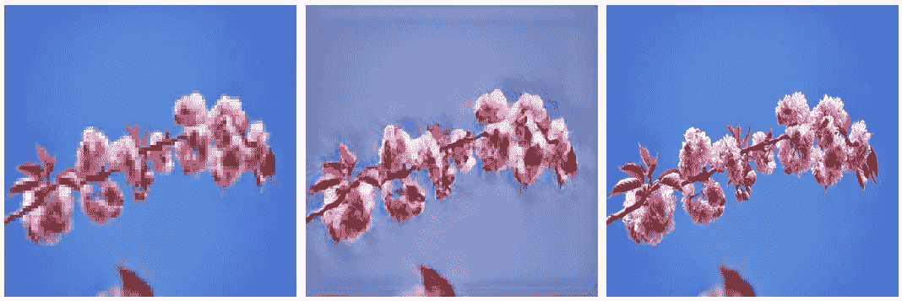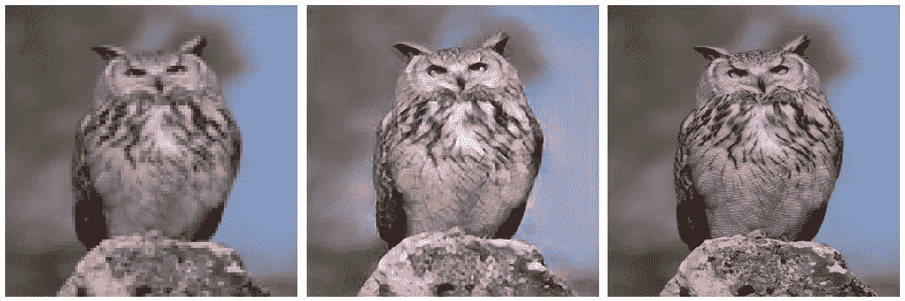

不太好，但也不太坏。哈哈…！！！！

> 结论

然而，通过简单的建模架构，我们能够通过所有三种形式的 GAN 架构重新创建不是最好而是更好的图像输出。通过提供更多的图像数据，并给予更多的时间来学习图像的特征和深入细节，模型肯定会优于原始数据。

希望你喜欢这篇文章。如果你已经走了这么远，那么一定要看看我的其他媒体故事。

快乐编码…！！！