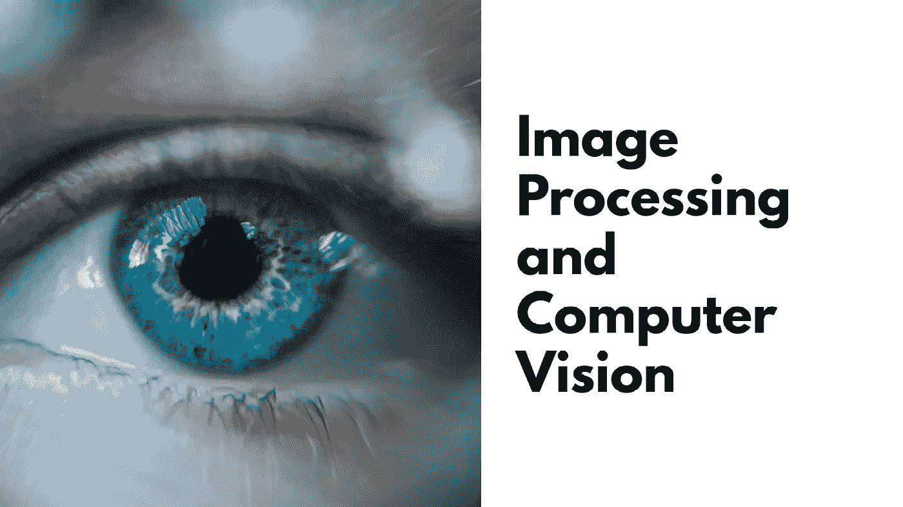
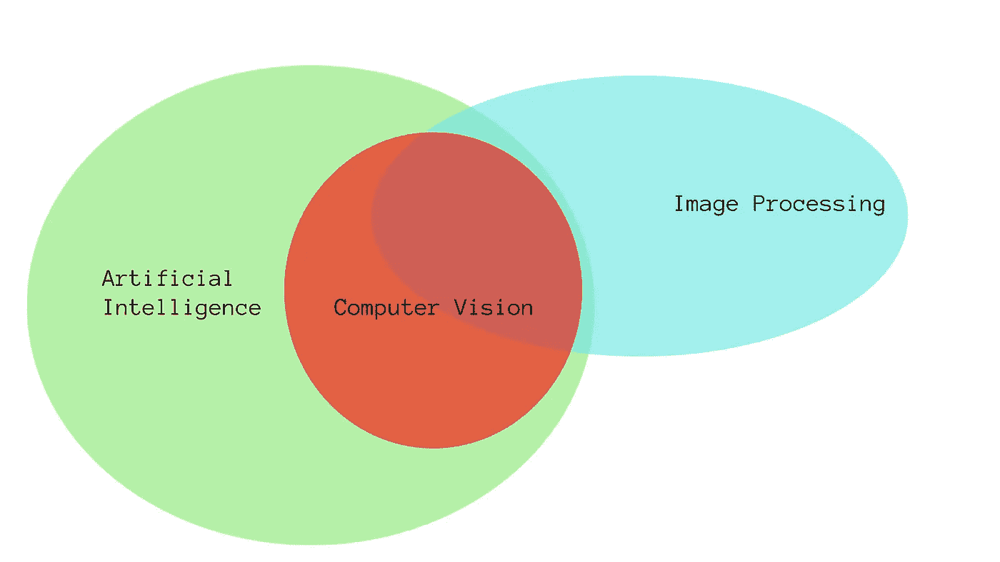

# 图像处理和计算机视觉

> 原文：<https://medium.com/mlearning-ai/image-processing-and-computer-vision-a90ee7403001?source=collection_archive---------3----------------------->

你有没有想过你的手机是如何利用面部识别来自行解锁的？或者如何使用不同的深度学习模型来检测图像中的异常？或者说，Instagram 滤镜是如何处理接收到的图像的？

在这篇文章中，我们将了解图像处理和计算机视觉是如何工作的，以及它们如何与深度学习结合使用，以便为许多日常问题创建创新和复杂的解决方案。为了更好地理解这篇文章，我推荐你阅读我关于[人工智能和机器学习](https://thinkfeed.divyesshm.com/post/artificial-intelligence-and-machine-learning)的文章。

# 介绍

顾名思义，图像处理就是应用不同的算法和技术来操作或修改图像，使其适合任务和用例。几乎我们每个人都在这样或那样的任务中使用过图像处理，例如，当我们使用肖像模式来点击自拍时，我们正在使用图像处理来模糊背景。

另一方面，计算机视觉是人工智能的应用之一，它使用算法和技术来识别图像数据中的模式。为了将它与图像处理联系起来，我们可以再次以使用肖像模式为例。而图像处理用于模糊背景，人工智能用于识别或辨认背景，两者结合开发的整个解决方案将是一个计算机视觉解决方案。

“我们的手机如何知道哪些对象应该模糊，哪些对象不应该模糊？”这个问题的答案是人工智能还是深度学习。“我们的手机如何模糊物体？”这个问题的答案就是图像处理。以及“我们的移动如何实现人像模式？”是计算机视觉。

Venn Diagram to represent correlation among AI, Image processing and Computer Vision

在对图像实施计算机视觉算法之前，图像处理通常用于预处理图像。随着人工智能应用的增长，计算机视觉和图像处理领域也在同步发展。这种性质非常直观，因为当某种东西的用例多样化时，预处理技术也变得有需求。

# 图像处理

现在，假设给你一个任务，让你创建一个 Instagram 过滤器，它可以识别用户(人类)，并使背景中的一切变得模糊，同时使图像的背景变得更暗。现在，让我们假设，我们已经有了一个从图像中检测用户并给出其坐标的人工智能模型。现在我们该如何解决这个问题呢？

## 图像结构

在开发这样的 AI 解决方案时，我们需要记住一件事，大多数时候，在使用计算机视觉时，模型不是在彩色图像上训练的，而是先转换成灰度(黑白)图像，然后再使用。这是因为彩色图像的处理要复杂得多，并且相对来说需要更多的时间来训练模型。让我们了解一下背后的原因。

在处理图像时，图像以矩阵(二维数组/向量)的形式存储。在彩色图像的情况下，该矩阵的每个元素包含 3 个数字，每个数字代表红、绿和蓝色的浓度，范围从 0 到 255。另一方面，灰度图像的每个元素仅包含范围从 0 到 225 的单个数字，其中 0 表示黑色，225 表示白色。这些元素称为像素，这些数字称为颜色通道。因此，为了处理三个颜色通道，需要更多的计算能力和时间，并且因为这可以通过使用灰度图像来容易地避免，所以目前的大多数模型仅将灰度图像作为输入。

## 图像处理算法和功能

回到我们的问题，我们的第一步是将输入图像从彩色转换成灰度。我们可以通过使用预先构建的算法/技术并将其作为输入发送到我们的人工智能模型来做到这一点。该模型将处理这个图像并返回检测到的用户的坐标，我们可以存储它们以供将来参考。现在，我们创建我们的模糊功能，以及增加黑暗的功能。

我们使用许多流行的算法来模糊我们的背景，其中最著名的一个是高斯模糊，你可以在这个[维基百科](https://en.wikipedia.org/wiki/Gaussian_blur)上了解更多。一旦我们选择了算法并创建了函数，我们就需要在图像上使用它。但是我们如何将检测到的用户排除在我们的处理之外呢？我们将使用一种叫做面具的东西。制作会覆盖或替换整个图像，并防止它被处理，一旦图像的其余部分被处理，我们就可以移除遮罩。

一旦我们有了模糊的图像，我们就将背景变暗，为此，我们将再次使用相同的蒙版，通过降低所有像素的每个颜色通道的浓度来使图像变暗。在此之后，我们可以删除制作，并输出我们的新处理的图像。

在这一部分，我们讨论的所有策略或技术都是图像处理的一部分。计算机视觉还包括人工智能，用于创建从图像中检测用户的模型本身。该模型的开发再次包括大量的图像处理和深度学习算法的使用。

# 结论

计算机视觉不仅仅限于使用图像处理和人工智能，还可以包括信号处理。在我撰写本文时，这是一个发展最快的领域，有大量的应用程序正在被实现和使用。对于创新的头脑，没有什么可以限制他们找到越来越多的应用程序的简历。尤其是现在，当应用程序在医疗保健、空间(天文)研究、犯罪控制等领域多样化时。

我希望你喜欢阅读邮报。要跟进新文章，请在 Medium 上关注我，或者在我的官方博客 [Thinkfeed](https://thinkfeed.divyesshm.com/) 上订阅我的时事通讯。

 [## Mlearning.ai 提交建议

### 如何成为 Mlearning.ai 上的作家

medium.com](/mlearning-ai/mlearning-ai-submission-suggestions-b51e2b130bfb)