# 利用 EDSR 和 WDSR 实现图像超分辨率

> 原文：<https://medium.com/mlearning-ai/image-super-resolution-using-edsr-and-wdsr-f4de0b00e039?source=collection_archive---------0----------------------->

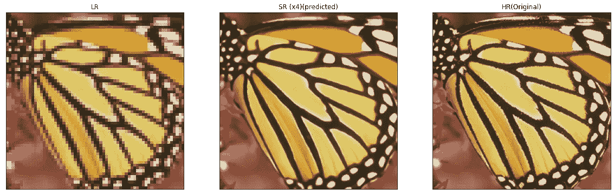

Low-Resolution — Super-Resolution(predicted) — High Resolution(Original )

# 目录

1.  介绍
2.  商业问题
3.  映射到 ML/DL 问题
4.  探索性数据分析
5.  数据扩充
6.  EDSR(用于单幅图像超分辨率的增强型深度残差网络)
7.  WDSR(高效精确图像超分辨率的宽激活)
8.  比较结果(根据性能指标)
9.  使用不同的验证集预测结果
10.  AWS EC2 上的部署
11.  工作模型
12.  改进范围(未来工作)
13.  参考

# **1。简介**

图像超分辨率问题，尤其是单幅图像超分辨率(SISR)问题，几十年来受到越来越多的关注。SISR(Single Image Super Resolution，单幅图像超分辨率)旨在从单幅低分辨率图像重建高分辨率图像。

通常，低分辨率图像和原始高分辨率图像之间的关系可以根据情况而变化。许多研究假设低分辨率图像是高分辨率图像的双三次下采样版本，但在实际应用中也可以考虑其他退化因素，如模糊、抽取或噪声。

这个项目的主要任务是从不同的降级图像中获得超分辨率图像，如双三次或尺度为 4 的未知降级图像。

在这个项目中，我们将使用深度残差网络进行单幅图像的
超分辨率(SR)。该方法直接学习低分辨率图像和高分辨率图像之间的端到端映射。该映射被表示为深度卷积神经网络(CNN ),其将低分辨率图像作为输入，并输出高分辨率图像。

在这个项目中，我们将使用一个已知的降级函数(双三次/比例为 4 的未知下采样),并遵循一种监督学习方法。

在这个项目中，我们将实现 [EDSR](https://arxiv.org/pdf/1707.02921.pdf) (用于单幅图像超分辨率的增强型深度残差网络)和 [WDSR](https://arxiv.org/pdf/1808.08718.pdf) (用于高效精确图像超分辨率的宽激活)

# **2。商业问题**

数字图像设备已经广泛应用于许多领域，包括个人识别和遥感。捕获的图像是来自潜在观察的退化图像，其中退化处理受诸如照明和噪声破坏的因素影响。具体来说，噪声是在传输和压缩过程中由未知的潜在观测值产生的。使用图像去噪技术从给定的降质图像中去除噪声并恢复潜在观测值是非常必要的。

超分辨率(SR)成像的关键目标是基于从同一场景获取的一组图像(表示为低分辨率图像)重建更高分辨率的图像，以克服图像获取过程的限制和不适定条件，从而促进更好的内容可视化和场景识别。

超分辨率图像的方法是从一组给定的较低分辨率图像中重建单个较高分辨率图像。

最近，深度神经网络在随机共振问题中在峰值信噪比(PSNR)方面提供了显著改善的性能。然而，这种网络在架构优化方面表现出局限性。

首先，神经网络模型的重建性能对微小的结构变化敏感。此外，同一模型通过不同的初始化和训练技术实现不同的性能水平。因此，精心设计的模型结构和复杂的优化方法在训练神经网络中是必不可少的。

SRResNet 成功地解决了时间和内存问题，具有良好的性能，它只是采用了来自 he 等人的 ResNet 体系结构，没有做太多的修改。然而，最初的 ResNet 是为了解决更高级别的计算机视觉问题，如图像分类和检测。因此，将 ResNet 架构直接应用于像超分辨率这样的低级视觉问题可能是次优的。

为了解决这些问题，基于 SRResNet 架构，我们首先通过分析和删除不必要的模块来优化它，以简化网络架构。

当模型复杂时，训练网络变得不简单。因此，我们用适当的损失函数(在我们的情况下是平均绝对误差)训练网络，并在训练时仔细修改模型(通过去除批量标准化)。

我们在 SET5、SET 14 等标准基准数据集和新提供的 DIV2K 数据集上评估了 EDSR 和 WDSR 模型。

在这个项目中，我们将使用缩放因子为 4 的双三次降级图像和缩放因子为 4 的未知降级图像。

在 PSNR(峰值信噪比)和 SSIM(结构相似性指数)方面，建议的 EDSR 和 WDSR 网络在 DIV2k、Set5 和 Set14 上显示了最先进的性能。

# 3.映射到 ML/DL 问题

我们将使用基于 Resnet 的架构作为 EDSR 和 WDSR 模型的基本构建模块。

尽管 Resnet 块如 EDSR 论文中所考虑的那样被修改，但我们将从基本的 ResBlock 体系结构中移除批处理规范化和最终 Relu 激活。

我使用 ***平均绝对误差*** 作为损失函数，因为我们正在处理像素，并且我们正在以监督的方式将低分辨率图像映射到高分辨率，因此在这种情况下使用 MAE 更好。

为了我们的实际目的， ***平均绝对误差(MAE)*** 允许我们比较原始图像和退化图像的“真实”像素值。MAE 表示我们的实际图像和噪声图像之间的平均绝对误差。误差是原始图像的值与降级图像的值的差异量。

作为性能指标，我用了****【PSNR】(峰值信噪比)******【SSIM】(结构相似指数)*** 。*

*这两个指标在 TensorFlow API 中都很容易获得。*

*如果我们可以证明一种算法或一组算法可以增强退化的已知图像，使其更接近原始图像，那么我们可以更准确地得出结论: ***PSNR*** 是一种更好的算法。*

*建议是， ***、*** 越高，退化图像被重建得越好以匹配原始图像，并且重建算法越好。这将会发生，因为我们希望相对于图像的最大信号值最小化图像之间的 MAE。*

***制定损失函数和性能指标***

*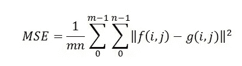*

*MSE*

*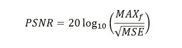*

*PSNR*

***f** —表示我们的原始图像的矩阵数据
**g** —表示我们所讨论的退化图像的矩阵数据
**m** —表示图像的像素行数，I 表示该行的索引
**n** —表示图像的像素列数，j 表示该列的索引
**Max(f) —** 是存在的最大信号值*

# *4.探索性数据分析*

## *4.1 数据概述*

*在这个项目中，我已经在 [DIV2K 数据集](https://www.tensorflow.org/datasets/catalog/div2k)上训练了该模型，该数据集包含高质量(2K 分辨率)图像和用于图像恢复任务的相应降级图像数据集。*

*DIV2K 数据集有许多降级因素，如下所述*

*双三次 x2，双三次 x3，双三次 x4，双三次 x8，未知 x2，未知 x3，未知 x4，现实温和 x4，现实困难 x4，现实狂野 x4*

*我用过双三次 _x4 和未知 _x4 进行模型训练。*

*我已经使用 [tfds](https://www.tensorflow.org/datasets/api_docs/python/tfds) TensorFlow API 收集了数据*

*load div2k data using tfds*

***4.2 DIV2K 数据集分为:***

***训练数据:**前 800 幅高清图像和对应的具有特定降级因子的低分辨率图像。*

***验证数据:** 100 张高清图像，对应低分辨率图像作为验证数据*

*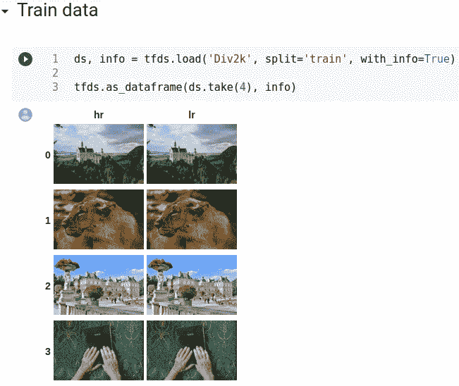*

*train data overview*

*通过观察上面的图像，我们不能区分低分辨率和高分辨率图像，但是如果我们打印 LR 和 HR 图像的形状，那么我们可以看到差异。*

*你可以在下面附的图片中看到上面图片的区别。*

*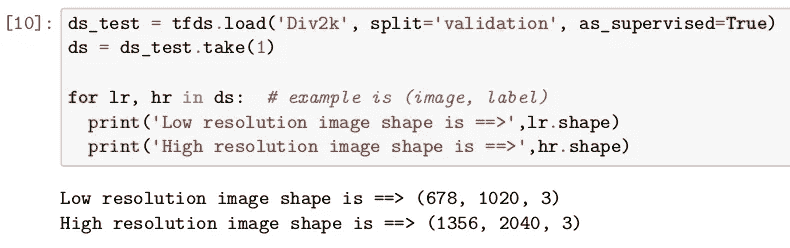*

*The shape of LR and HR images*

# ***5。数据扩充***

***5.1 什么是数据增强？？***

*数据增强是一种获得同一幅图像的不同变化的技术，如翻转图像、旋转图像、裁剪图像等。*

*这是一种获得不同种类数据的方式，尤其是当训练数据的数量非常少时，因为我们有 DIV2k 数据，它只有 800 个训练图像。*

*只有 800 张图像用于训练，这对于训练模型是非常少的，所以我们将对训练数据进行数据扩充，以获得更多种类的不同种类的图像。*

***5.2 为什么要增大？？？？***

*扩充对于从训练好的模型中获得更一般化的结果是非常重要的。因为通过对增广数据模型的训练，可以学习各种各样的特征，所以增广给出了更一般化的结果。*

***5.3 应用增强(裁剪、旋转、翻转)***

***随机裁剪:**我们将从高分辨率图像中裁剪一个尺寸为 96 X 96 的图像的随机部分，并从低分辨率图像中裁剪相应的补片。*

*如果缩放因子是 4，并且如果我们从 HR 图像中裁剪 96×96 的碎片，那么来自低分辨率图像的相应碎片大小将是 24×24(96/4 = 24。*

***随机翻转:**在此操作中，我们将翻转 LR 和 HR 图像，如果从***TF . Random . normal***生成的随机值小于 0.5，则我们进行 left_right 翻转，否则我们不翻转图像。*

***随机旋转**:在此操作中，我们将多次将 LR 和 HR 图像旋转 90 度。我们将使用***TF . random . uniform***生成一个最大值为 4 的随机数。例如，如果生成的随机值为 2，那么我们将图像旋转 90 度 2 次*

*data augmentation*

***5.4 完成数据管道，以获得训练和验证扩充数据:***

*数据管道是一种通过使用 ***tf.data*** API 以高效的方式获取已处理数据(裁剪、翻转、旋转)的方式。*

*从数据管道中，我们可以获得具有特定批量的扩充的训练数据和没有扩充的验证数据。*

*我们将执行以下步骤进行预处理*

***列车数据**:*

1.  *随机作物*
2.  *随机旋转*
3.  *随机翻转*
4.  *分配批量大小(在我们的例子中，训练数据为 16)*
5.  *重复(对于训练数据无限)*
6.  *预取(为了更快的培训过程)*

*为了获得*验证数据，我们不会做任何类型的转换，我们唯一要做的是分配批量大小并重复计数 1。**

**让我们跳到预处理数据的代码。**

**data pipeline**

**train _ 预处理包含作为训练数据低分辨率小图像补片和作为目标图像的相应高分辨率图像补片，用于端到端映射和计算损失。**

****5.5 可视化来自训练数据的预处理图像****

**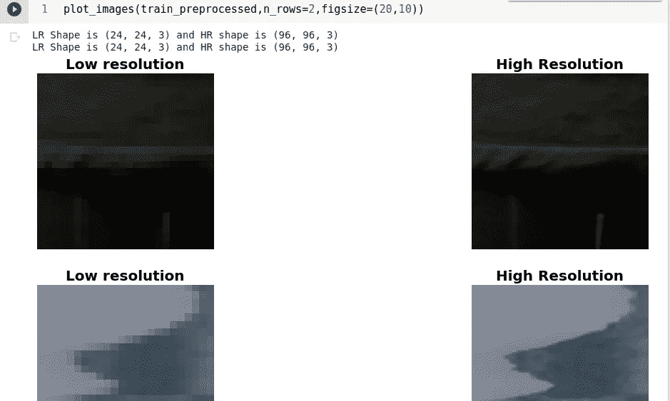**

**train_preprocessed example**

**正如我们从上面的图片中看到的，训练图片中有一个随机裁剪的部分，每次我们执行代码块时都会有所不同。**

****5.6 可视化来自验证数据的预处理图像****

**验证数据没有被扩充，因为我们想要得到整个验证图像的结果。**

**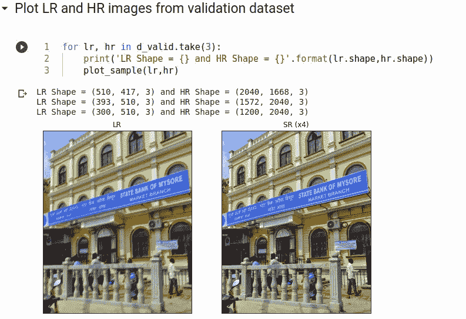**

**validation_preprocessed**

**正如我们所看到的，我们没有对验证数据集进行任何类型的扩充和预处理。我们唯一知道的是分配的批量大小。**

# **6.EDSR(用于单幅图像超分辨率的增强型深度残差网络)**

**现在是时候实施一项 [EDSR 研究论文](https://arxiv.org/pdf/1707.02921.pdf)**

**提议的 EDSR 网络的总体架构如下。**

**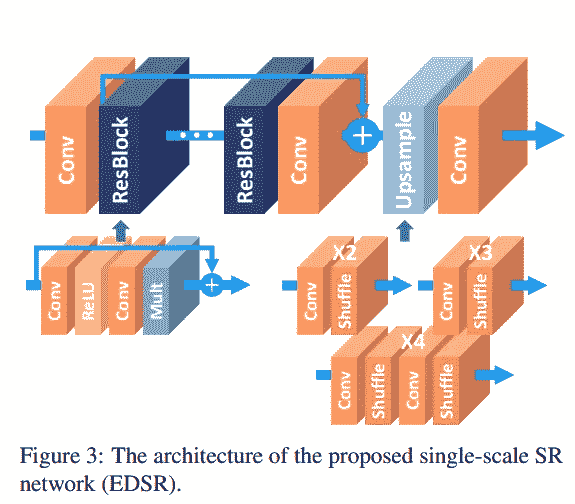**

**在 EDSR，他们提出了不同的 ResBlock 架构，以更有效地训练模型。**

**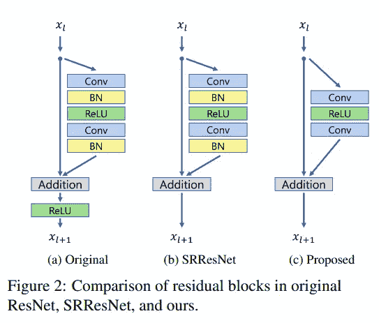**

**提议的网络。正如 Nah 等人在他们的图像去模糊工作中所提出的，我们从我们的网络中移除批量归一化层。由于批量归一化图层会对要素进行归一化，因此它们会通过对要素进行归一化来消除网络的范围灵活性，因此最好将其移除。**

**此外，由于批量标准化层消耗的内存量与前面的卷积层相同，因此 GPU 内存使用量也大大减少。与 SRResNet 相比，这种没有批处理规范化层的基线模型在训练期间节省了大约 40%的内存使用。因此，我们可以在有限的计算资源下建立一个比传统的 ResNet 结构具有更好性能的更大的模型。**

****以下是 EDSR 模型的完整架构****

1.  **通过减去 DIV2K RGB 平均值来归一化输入**
2.  **具有 64 个滤镜和内核大小=3 的 Conv2d 层**
3.  **Resblock(在我们的 8 型 RES block 中)**
4.  **Conv2d**
5.  **添加(ResBlock 输出和原始输入)**
6.  **上采样(Conv2d →像素混合)**

***现在让我们深入到编码部分***

**EDSR model**

**为了根据研究论文训练 EDSR 模型，我们必须训练 300000 步的模型，并在前 10 个验证集图像上每 1000 步评估模型，因此为了满足这一要求，我制作了一个完整的训练管道类来根据要求训练模型，并且我们可以随时恢复最新的检查点，以便我们可以随时恢复训练。**

**下面考虑的课程是完整的培训管道，以更可行的方式培训模型。**

**training pipeline**

**现在，我们已经完成了开始培训程序的所有必要步骤。**

***现在让我们开始训练***

**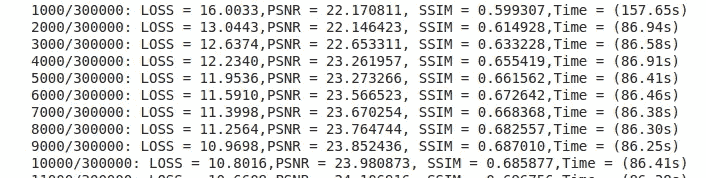**

**training started**

*****注:*** *我没有绘制 PSNR vs 纪元和损失 vs 纪元，因为我已经训练了 300000 个纪元的模型，所以有时我会暂停训练，然后恢复最新的检查点并继续训练。***

# **7.WDSR(高效精确图像超分辨率的宽激活)**

**WDSR 模型的一般架构如下。**

**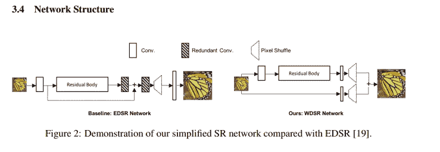**

****如下面的**所示的残差块架构**

**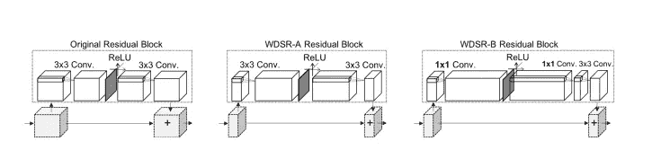**

**Resblock architecture**

**所提出的工作的直觉是，在 ReLU 之前扩展特征允许更多的信息通过，同时仍然保持深度神经网络的高度非线性。因此，来自浅层的低级 SR 特征可能更容易传播到最终层，以获得更好的密集像素值预测。**

**我们将执行以下步骤来创建 WDSR 模型:**

****WDSR 架构总共有两种变化:****

1.  **WDSR-A**
2.  **WDSR-B**

**WDSR-A 和 WDSR-B 的唯一区别是 Resblock 架构。**

****7.1 我们先来了解一下 WDSR 的总体架构:****

1.  **标准化输入**
2.  **Conv2d 权重归一化(主分支)**
3.  **RES block(WDSR-A 和 WDSR-B 不同)**
4.  **Conv2d 重量归一化(具有给定刻度)**
5.  **混洗像素(具有给定的比例)**
6.  **Conv2d 权重归一化(跳过分支)**
7.  **混洗像素(跳过给定比例的分支)**
8.  **添加主分支输出并跳过分支输出(添加步骤 5 和步骤 7)**
9.  **使用 DIV2K RGB 平均值反规格化**
10.  **输出模型**

****7.2**[**WDSR 研究**](https://arxiv.org/pdf/1808.08718.pdf) **概要如下:****

1.  **他们证明，在单个图像超分辨率的残差网络中，在相同的参数复杂度下，更宽的激活具有更好的性能。在没有额外计算开销的情况下，他们提出了网络 WDSR-A，它具有更宽的(2 倍到 4 倍)激活以获得更好的性能。**
2.  **为了进一步提高效率，他们还提出将线性低秩卷积作为构建 SR 网络 WDSR-B 的基本构建模块。它可以在不增加参数或计算的情况下实现更广泛的激活(6 倍至 9 倍),并进一步提高精度。**
3.  **他们建议批量归一化不适于训练深度 SR 网络，并引入权重归一化以获得更快的收敛和更好的精度。**
4.  **我们对提出的 WDSR-A 和 WDSR-B 进行了训练，并在大规模 DIV2K 图像超分辨率基准上取得了较好的结果。**

***现在让我们做编码部分***

**我们可以按照 EDSR 训练中讨论的相同方式训练 WDSR 模型**

**我们将使用相同的训练管道类来训练 WDSR 模型**

*****注:*** *我没有绘制 PSNR vs 纪元和损失 vs 纪元，因为我已经训练了 300000 个纪元的模型，所以有时我会暂停训练，然后恢复最新的检查点并继续训练。***

# **8.比较结果**

**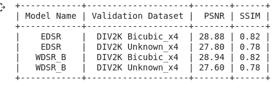**

**results**

**正如我们在表中看到的，在双三次 x4 数据集上，WDSR_B 往往比 EDSR 模型表现得更好。**

**SSIM 与 EDSR 和 WDSR 型号相同**

# **9.使用不同的验证数据集预测结果**

**首先，我们将看到 EDSR 的结果**

## **9.1 EDSR 结果**

## **9.1.1 双三次 _x4(双三次降级，缩放因子= 4)**

1.  ****DIV2k 验证集结果****

**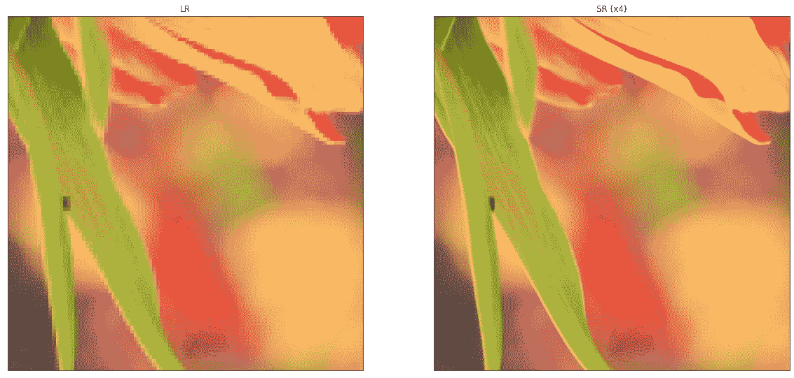**

**div2k validation set(bicubic_x4)**

****2。设置 5 双三次 _x4****

****

**set 5 bicubic_x4**

****3。设置 14 个双三次 _x4****

**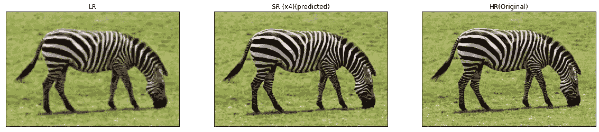**

**set 14 bicubic_x4**

## **9.1.2 Unknown_x4(比例因子= 4 的未知降级)**

1.  ****DIV2k 验证数据集****

**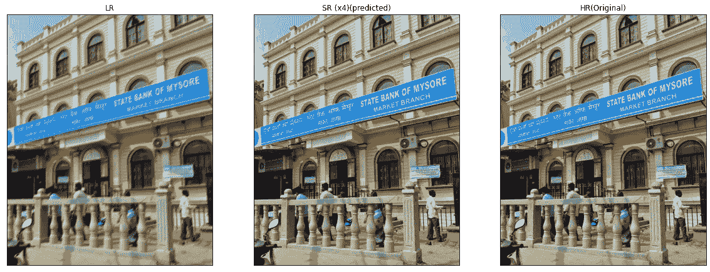**

**unknown_x4**

## **9.2 WDSR 结果**

1.  ****DIV2K 验证****

**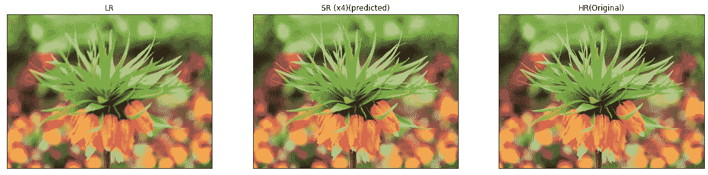**

**wdsr result**

# **10.AWS EC2 上的部署**

**我已经部署了两个 EDSR 模型。一个在 DIV2k Bicubic_x4 上训练，另一个在 DIV2K Unknon_x4 数据集上训练。**

**你可以在 这里找到 [***的部署链接***](http://ec2-52-87-152-145.compute-1.amazonaws.com:8080/)**

**您可以从 [***此处***](https://uofi.box.com/shared/static/kfahv87nfe8ax910l85dksyl2q212voc.zip) 下载 SET 5 数据集，从 [***此处***](https://uofi.box.com/shared/static/igsnfieh4lz68l926l8xbklwsnnk8we9.zip) 下载 SET 14 数据集进行测试。**

**注意:该模型不会给出实时相机图像的最佳结果，因为该模型已经在自然图像上进行了裁剪训练。**

# **11.工作模型**

****

**Working Model on AWS EC2**

*****注:*** *请勿上传图片大小超过 200 kb 或不上传任何高清图片进行测试。背后的原因是 AWS EC2 free tire 只提供 1 GB 的 Ram 和 1 个 cpu。***

# **12.改进范围(未来工作)**

1.  **到目前为止，我们仅在具有双三次 x4 和未知 x4 降级因子的 div2k 数据集上训练了 EDSR 和 WDSR 模型**
2.  **为了进一步改进，我们可以使用混合降级因子来训练模型范围内的各种数据，以便我们的模型可以预测任何真实世界的图像。**
3.  **为了得到更精确的结果，我们可以用感知损失来训练 SRGAN 模型。由于有限的计算资源和 collab 使用限制，到目前为止我还没有尝试过 SRGAN。**
4.  **我们可以肯定地改善结果使用 SRGAN 与发电机和歧视损失**

# **13.参考**

1.  **【https://arxiv.org/pdf/1707.02921.pdf **
2.  **[https://arxiv.org/pdf/1808.08718.pdf](https://arxiv.org/pdf/1808.08718.pdf)**
3.  **https://github.com/krasserm/super-resolution**
4.  **【https://www.appliedaicourse.com/ **

# **Github 简介**

** [## 超高分辨率图像

利用 github.com EDSR 和 WDSR 研究所实现图像超分辨率](https://github.com/sumittagadiya/Image-super-resolution) 

# LinkedIn 个人资料

 [## Sumit Tagadiya -印度古吉拉特邦艾哈迈达巴德|职业简介| LinkedIn

### 查看世界上最大的职业社区 LinkedIn 上 Sumit Tagadiya 的个人资料。Sumit 的教育上市于…

www.linkedin.com](https://www.linkedin.com/in/sumit-tagadiya-450397194/)**