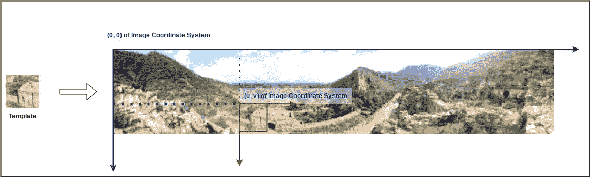
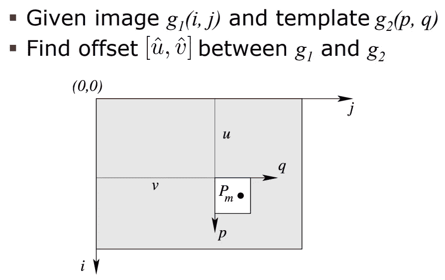
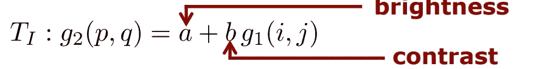
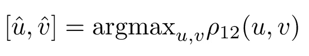
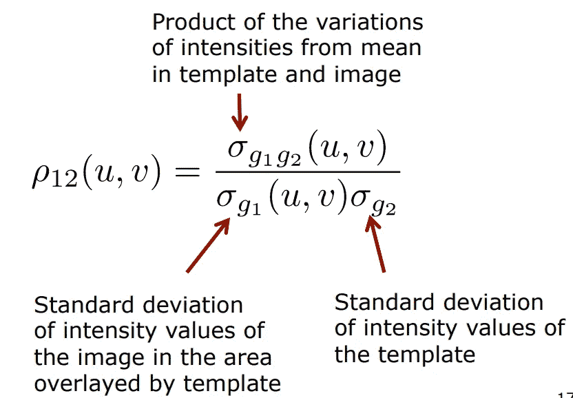
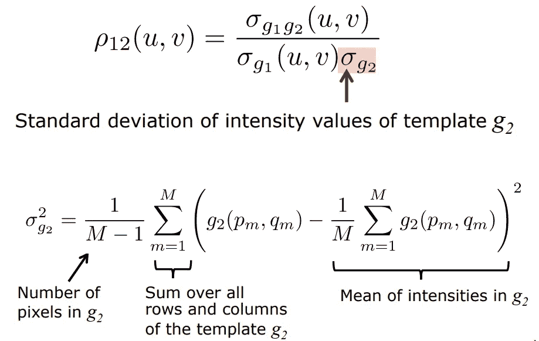
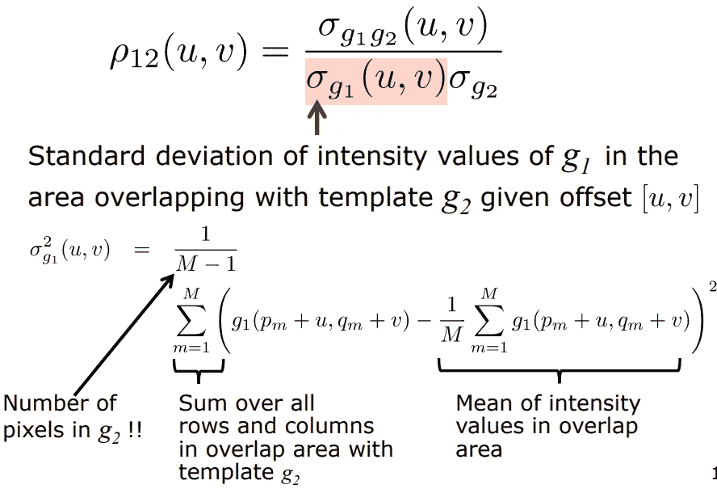
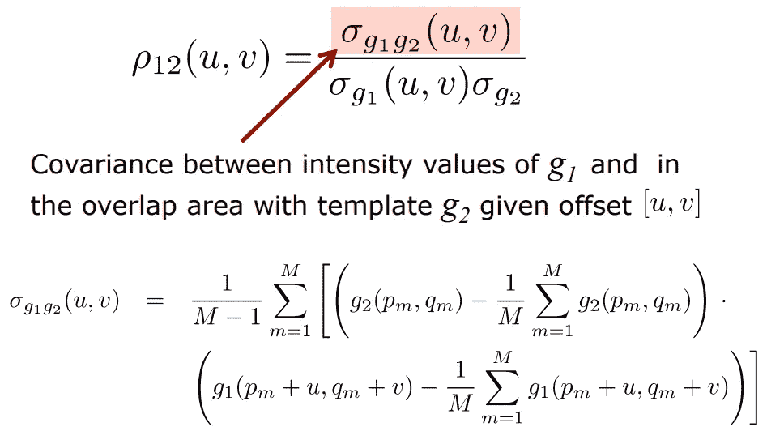

# 使用互相关的图像模板匹配

> 原文：<https://medium.com/mlearning-ai/image-template-matching-using-cross-correlation-2f2b8e59f254?source=collection_archive---------0----------------------->

一个搜索算法，但是对于图像

Photo by [Vardan Papikyan](https://unsplash.com/@varpap?utm_source=medium&utm_medium=referral) on [Unsplash](https://unsplash.com?utm_source=medium&utm_medium=referral)

图像模板匹配基本上是在大图像上找到小块的位置。

## 为什么相关？

嗯，我们需要比你想象的更频繁地进行这种匹配。最突出的例子是创建一个像下面这样的全景。

Image panorama (image by Author)

为了捕捉这样的全景，一个人慢慢地水平移动相机。各种图像被捕捉并拼接在一起，以创建一个非常广角和(如果拍摄全景的人没有颤抖的手)美丽的全景景观。

这是一个突出的例子，其他例子包括三维重建，这需要我们匹配 2 个不同相机(立体相机设置)捕捉的图像之间的各种关键点。

好了，现在我们知道模板匹配对于许多先进的计算机视觉算法来说确实是一项重要且不可或缺的任务，下一个问题是我们实际上是如何做的？我们实际上如何匹配两幅图像之间的不同点？

# 介绍...交叉相关

互相关是许多强有力的工具之一，用于:

1.  在另一个图像中查找某些图像内容
2.  确定图像中内容的确切位置

但是，存在一些互相关起作用的假设。源映像(模板)和目标映像之间的更改应限于:

1.  翻译
2.  聪明
3.  对比

互相关可以扩展到考虑旋转，但这增加了相当多的复杂性，我们很快就会发现。

好了，现在我们知道互相关是一个东西，让我们更深入地了解互相关到底是什么，以及如何实现模板匹配。

# 定义目标:模板匹配

模板匹配基本上是在较大的图像中找到小模板图像的位置。

通常，模板图像的尺寸<< size of the search image

Template matching problem (Image by Author)

So we need to find the location of a patch (template) in a bigger image. The location of the template can be defined by a set of offsets describing the translation of the template from the origin of the image coordinate system. We need to find these offsets.

Principle of template matching ([Source](https://www.ipb.uni-bonn.de/html/teaching/photo12-2021/2021-pho1-09-matching-cc.pptx.pdf))

## Assumptions

The offsets we need to estimate are expressed as **与一些假设**的几何变换有关。由于互相关假设是**在源和目的地之间仅存在平移变化**，这仍然成立，即没有旋转、仿射、相似变换等。在模板和图像之间。

Geometric Transformation ([Source](https://www.ipb.uni-bonn.de/html/teaching/photo12-2021/2021-pho1-09-matching-cc.pptx.pdf))

**辐射转换**也被考虑在内。辐射变换说明了模板和图像的亮度和对比度的变化。

在模板和图像的强度值之间可以有**有限的变化**。模板的强度值必须是一个恒定的偏移量(**亮度变化** )+图像强度值的比例因子(**对比度变化**)。

Radiometric Transformation ([Source](https://www.ipb.uni-bonn.de/html/teaching/photo12-2021/2021-pho1-09-matching-cc.pptx.pdf))

因此，模板(g2)中每个像素的强度值线性依赖于图像(g1)的强度值。这种线性关系由参数 ***a*** 和 ***b*** 定义，如上图。

> 模板匹配的目标是找到定义图像中模板位置的偏移[u，v]的两个参数，但是这些偏移必须对[a，b]不变，即即使模板和图像的亮度和对比度存在差异，位置偏移也应该相同。

# 量化模板匹配的结果

现在我们知道了模板匹配的目标，接下来我们需要弄清楚的是如何量化相似性，如何衡量一个位置比另一个位置更好的匹配？

测量相似性的典型方法有:

1.  [平方差之和](https://www.investopedia.com/terms/s/sum-of-squares.asp#:~:text=The%20sum%20of%20squares%20is%20the%20sum%20of%20the%20square,fit%20will%20minimize%20this%20value.)
2.  [绝对差值之和](https://en.wikipedia.org/wiki/Sum_of_absolute_differences#:~:text=In%20digital%20image%20processing%2C%20the,block%20being%20used%20for%20comparison.)
3.  最大差异

上述方法的问题在于，它们在亮度或对比度变化的情况下不是不变的。如果我们简单地将模板的所有强度值加 1，那么对于上述相似性度量，输出将完全不同。

但是正如我们的目标所定义的，我们希望我们的模板匹配对于模板和图像的亮度和对比度的变化是不变的。即使模板和图像补片匹配，也不能保证它们具有相同的亮度值。

因此，在互相关模板匹配方法中，不采用上述相似性匹配技术。相反， [**互相关函数**](https://en.wikipedia.org/wiki/Cross-correlation#:~:text=In%20signal%20processing%2C%20cross%2Dcorrelation,for%20a%20shorter%2C%20known%20feature.) 用于测量相似性，这就是该方法的名称。

Offset estimation quantified goal ([Source](https://www.ipb.uni-bonn.de/html/teaching/photo12-2021/2021-pho1-09-matching-cc.pptx.pdf))

我们估计在所有可能的位置上使模板和图像块之间的归一化互相关系数( ***ρ*** )最大化的偏移量[u，v]。

# 互相关系数( **ρ)**

归一化互相关系数为我们提供了当前图像块和模板之间相似性的度量，其计算方法如下图所示(直接取自讲座幻灯片)

Normalized cross-correlation calculation ([Source](https://www.ipb.uni-bonn.de/html/teaching/photo12-2021/2021-pho1-09-matching-cc.pptx.pdf))

Normalized cross-correlation calculation ([Source](https://www.ipb.uni-bonn.de/html/teaching/photo12-2021/2021-pho1-09-matching-cc.pptx.pdf))

Normalized cross-correlation calculation ([Source](https://www.ipb.uni-bonn.de/html/teaching/photo12-2021/2021-pho1-09-matching-cc.pptx.pdf))

Normalized cross-correlation calculation ([Source](https://www.ipb.uni-bonn.de/html/teaching/photo12-2021/2021-pho1-09-matching-cc.pptx.pdf))

归一化互相关系数的大值表明模板和当前图像块是匹配的。

# 搜索模板

好了，我们有了图像模板匹配的所有构件。现在的问题是从图像的哪里看？

## 穷举搜索

直截了当简单的回答是……是的，你猜对了，无处不在！

因此，我们采用模板并将其滑过整个图像，计算图像上每个可能位置的归一化互相关系数，并将具有最高归一化相关系数的位置[u，v]视为我们的匹配区域。

正如本文开头提到的，我们也可以考虑轮换。我们不只是在图像上所有可能的位置上滑动图案，还考虑每个位置上所有可能的旋转。这将极大地增加复杂性，但理论上，这也能处理旋转几何变换。

## 由粗到细的策略

穷举搜索是计算密集型的。更好的方法是使用图像金字塔来缩小搜索空间。

我们制作一个不同分辨率的图像金字塔，从最小的图像开始搜索。一旦我们得到最佳匹配区域，我们就在下一个更高分辨率的图像中搜索模板，但是只在对应于前一个图像的最佳匹配的区域中搜索。这减少了可能的搜索位置。

# 总结和结论

如果你看过完整的帖子，你就会知道

1.  图像模板匹配的问题是解决许多更大的问题如 3D 重建的基础
2.  图像模板匹配的目标是得到模板在图像中的位置
3.  图像模板匹配对于亮度和对比度的变化是不变的
4.  标准相似性匹配函数不能用于图像模板匹配
5.  归一化互相关系数用于图像-模板匹配

我鼓励读者去读一读西里尔·斯塔希尼斯的互相关讲座。

讲座包含一些实际的互相关计算的例子，将补充理解以及使用互相关亚像素估计的高级主题。

# 参考

1.  [Cyrill stach niss 摄影测量学课程讲座](https://youtu.be/5YAA7vS6kVU)
2.  [摄影测量学课程讲义](https://www.ipb.uni-bonn.de/html/teaching/photo12-2021/2021-pho1-09-matching-cc.pptx.pdf)
3.  [平方和](https://www.investopedia.com/terms/s/sum-of-squares.asp#:~:text=The%20sum%20of%20squares%20is%20the%20sum%20of%20the%20square,fit%20will%20minimize%20this%20value.)
4.  [绝对差值之和](https://en.wikipedia.org/wiki/Sum_of_absolute_differences#:~:text=In%20digital%20image%20processing%2C%20the,block%20being%20used%20for%20comparison.)
5.  [互相关函数](https://en.wikipedia.org/wiki/Cross-correlation#:~:text=In%20signal%20processing%2C%20cross%2Dcorrelation,for%20a%20shorter%2C%20known%20feature.)

 [## Mlearning.ai 提交建议

### 如何成为 Mlearning.ai 上的作家

medium.com](/mlearning-ai/mlearning-ai-submission-suggestions-b51e2b130bfb) 

🟠 [**成为作家**](/mlearning-ai/mlearning-ai-submission-suggestions-b51e2b130bfb)