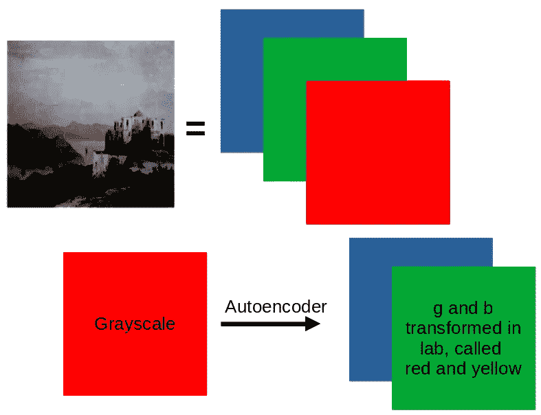
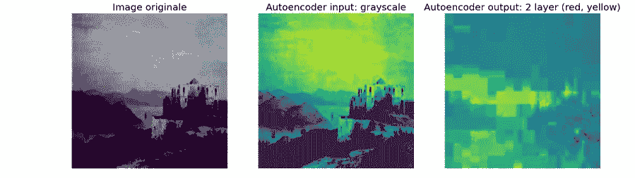
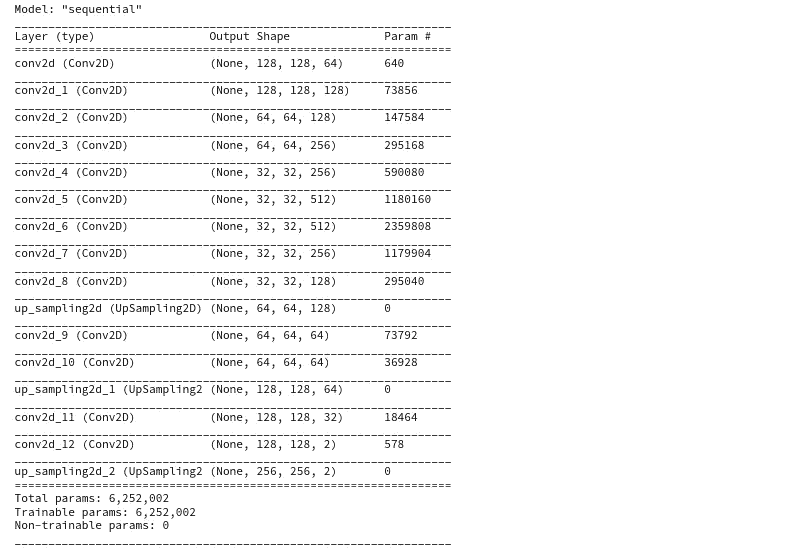
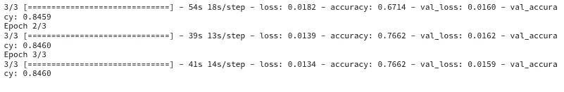
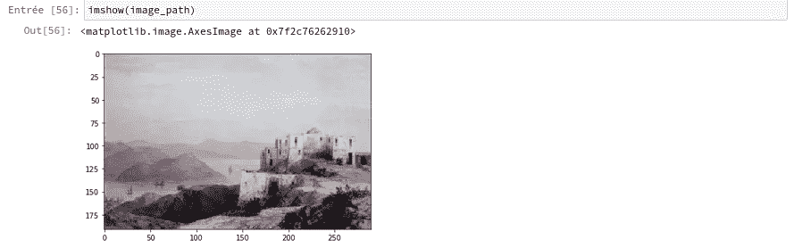
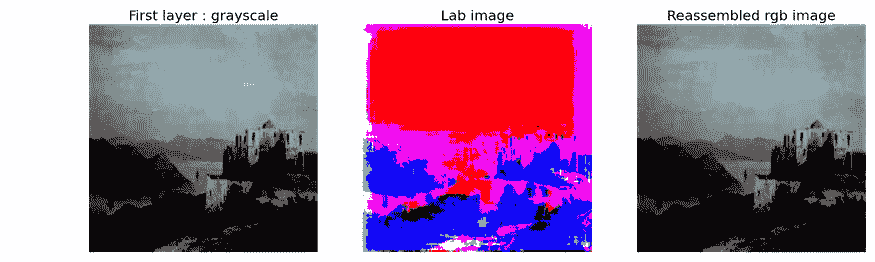
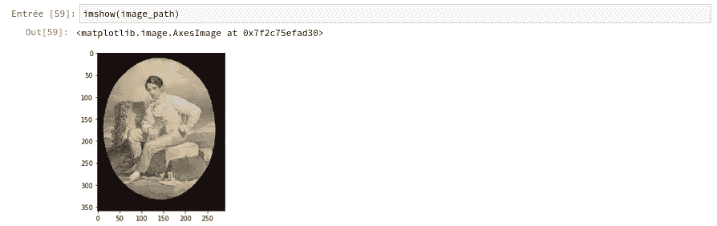
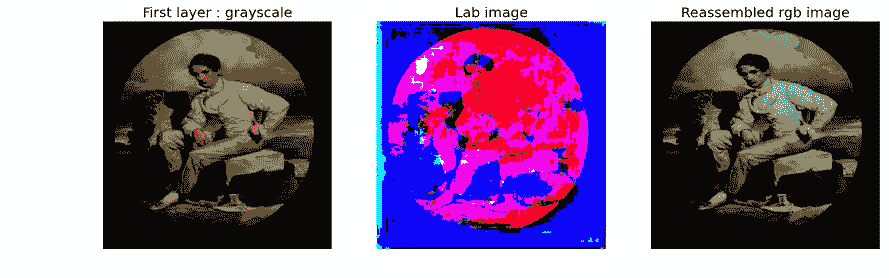

# 图片翻译！！

> 原文：<https://medium.com/mlearning-ai/image-translation-b3538f46786e?source=collection_archive---------14----------------------->

我参加了一个在线课程，在这个课程中，无监督的 kmeans 被用来对 3D 图像中的点进行聚类，以确定哪些点属于 r、g、b 层。我觉得它真的很聪明，然后不久我就发现了一个图片翻译的例子！图像转换是从一个灰度图像创建一个彩色的 r，b，g 图像，这可能是枕头中使用的东西。以下是用于执行图像转换的步骤。这些图片来自 kaggle 数据集[https://www . ka ggle . com/datasets/the down hill/art-images-drawings-painting-sculpture-engraving](https://www.kaggle.com/datasets/thedownhill/art-images-drawings-painting-sculpture-engraving)，正如我在参考文献 1 中遵循的一个例子。

# 子功能

# 加载数据

现在我们知道在绘图中有 1107 个图像，我们可以看到图像的名称，因此我们可以看到一个图像是如何转换的。我选择了第四张图片(3: '1601_mainfoto_05.jpg ')，因为它看起来很平静。

接下来，我将图像转换为自动编码器的输入 X 和输出 Y。

# 让我们绘制原始图像、输入图像和输出图像

注意灰度不是灰色的，这与矩阵以图像的形式呈现有关。另外，我用 tensorflow 图像处理代替枕头，这有所不同。**因为输入的灰度图像是彩色的，我们实际上将预测灰度输出。**

右上角是我们给自动编码器的输出，它是转换到 lab 色彩空间的图像。Lab 色彩空间图像有两层，但我只绘制了这两层中的第一层。

# 创建训练和验证数据集

# 预处理图像

# 自动编码器:构建模型

# 测试

重新绘制第一幅图像以查看原始图像:

**注意，输入灰度是彩色的，尽管我们对它进行了变换。因此，输出是实际的灰度。因为输入图像是彩色的，所以我们本质上是在做逆图像转换。**我之所以需要使用 pillow 库，只是因为混合使用 tensorflow 和 pillow 似乎会导致冲突。

# 显示转换的另一个例子

它清楚地显示了转换是反向的，因为输入是彩色的(尽管我将其转换为灰度)，因此输出是灰度的。

总之，这是一个伟大的自动编码器之间的灰度和彩色转换。

练习愉快！:)

# 参考

1.  人工神经网络与 TensorFlow 2: ANN 架构机器学习项目。普尔纳钱德拉·萨朗。压力
2.  Lab 色彩空间指南—[https://subscription . packtpub . com/book/data/9781789537147/1/ch 01 LV 1 sec 03/transforming-color-space-RGB-Lab](https://subscription.packtpub.com/book/data/9781789537147/1/ch01lvl1sec03/transforming-color-space-rgb-lab)

 [## Mlearning.ai 提交建议

### 如何成为 Mlearning.ai 上的作家

medium.com](/mlearning-ai/mlearning-ai-submission-suggestions-b51e2b130bfb)