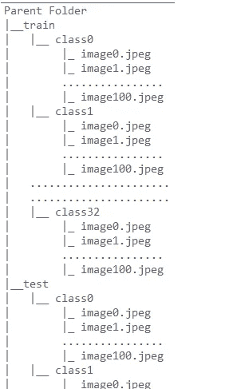
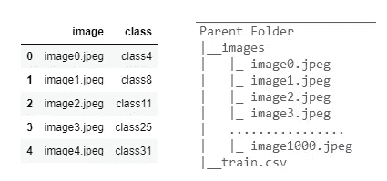

# ImageDataGenerator 是 TensorFlow 用户的福音

> 原文：<https://medium.com/mlearning-ai/imagedatagenerator-boon-to-tensorflow-users-9c555130dd67?source=collection_archive---------6----------------------->

如何处理大型数据集


[Source](https://www.google.com/search?q=lord+krishna&tbm=isch&ved=2ahUKEwj9jf780pnvAhV_zHMBHebTDR0Q2-cCegQIABAA&oq=lord+krishna&gs_lcp=CgNpbWcQAzIFCAAQsQMyBQgAELEDMgUIABCxAzIFCAAQsQMyBQgAELEDMgUIABCxAzIFCAAQsQMyAggAMgIIADICCAA6BAgjECc6CAgAELEDEIMBOgYIABAFEB46BggAEAoQGDoHCCMQ6gIQJzoECAAQQ1DmrQFYnekBYIfrAWgHcAB4AIAB0gGIAawVkgEGMC4xNy4ymAEAoAEBqgELZ3dzLXdpei1pbWewAQrAAQE&sclient=img&ei=cGZCYP2VNP-Yz7sP5qe36AE&bih=625&biw=1366#imgrc=eUYOIqrkZMO4QM)

假设您正在处理具有 100 个类的图像数据集，每个类包含 1000 个图像，如果我们将在低配置设备上训练模型，它将耗尽内存。那么问题是我们该怎么办？这里 Keras wrapper 带有一个 **ImageDataGenerator 的想法。**我们将把数据分成批次，然后将批次的图像数据输入网络，用于图像分类或各种 CNN 应用，而不是借助 ImageDataGenerator 获取整个数据集。请阅读 tensorflow 的文档，相信我，无论我要进一步解释什么，它都会给你更多的洞察力。让我们开始吧……

## 类型 I:-当我们在本地系统的目录中有数据时



Picture 1

**导入图像数据生成器**

```
from tensorflow.keras.preprocessing.image import ImageDataGenerator
```

**增强:-** 该技术用于扩展图像的大小，以便我们的卷积层可以从中提取越来越多的特征。重要的一点要记住，我们不应该在测试图像上做增强。这使得我们的模型更加一般化。

图像放大就像将图像重新缩放到一定的范围，水平翻转图像，改变图像的角度等。

```
>> train_datagen=ImageDataGenerator(rescale=1./255.,
                 validation_split=0.2,rotation_range=30,
                 width_shift_range=0.2, height_shift_range=0.2,
                 horizontal_flip=**True**, vertical_flip=**True**)                                              
>> train_images =train_datagen.flow_from_directory(directory="Parent 
                 Folder/train",target_size=(256, 256) ,**seed=1**
                 color_mode='rgb', class_mode='categorical' ,
                 batch_size=32 , shuffle=**True**, subset="training")
>> val_images =  train_datagen.flow_from_directory(directory="Parent 
                 Folder/train",target_size=(256, 256),shuffle=**False,** color_mode='rgb',class_mode='categorical',**seed=1**
                 batch_size=32, subset="validation")              
>> test_datagen =ImageDataGenerator(rescale=1./255., 
                 validation_split=0.2)
>> test_images = test_datagen.flow_from_directory(directory="Parent 
                 Folder/test",target_size=(256, 256),
                 color_mode='rgb', class_mode='categorical',
                 batch_size=32, shuffle=**False**)
```

`rescale=1./255.`因为我们知道每个像素的范围在`0–255`之间，所以我们需要将所有像素归一化到相同的比例。

`validation_split`将训练目录分为训练集和验证集，其中验证集将预测在给定训练集上训练的模型的准确性。

`flow_from_directory`访问本地目录中的数据。

`class_mode=”categorical”`最常用于多类分类。它将以一种热编码形式接收多类数据。

`target_size`图像将被调整的尺寸。默认情况下，它将被视为`(256,256)`

`seed=1`确保数据在训练集和验证集中平均分布

N 注:-我们将采用两个不同的数据元，即:- `train_datagen`在这种情况下，我们将对其应用数据扩充，而`test_datagen`我们不会对其应用数据扩充。

## 类型 II :-当我们有 csv 格式的数据时



Picture 2

当我们想从 csv 文件中访问图像数据时，我们必须使用`datagen.flow_from_dataframe()`。

csv 文件的工作方式与目录不同，因为在 csv 文件的情况下，所有影像数据都以单个要素的形式呈现，而另一个要素则代表其类别。

```
# importing necessary libraries to deal with csv image files
>> from sklearn.model_selection import train_test_split
>> import pandas as pd
```

这里，我们将数据集分为三个部分，即:-训练集、验证集和测试。

`train set:-`我们将训练我们的模型的数据，`validation set`我们将检查我们的模型有多准确(最常见的是检查模型的准确性)，而`test set`将预测未知(`test`)数据的结果。

```
df=pd.read_csv("/parent.csv",dtype=str)
df_train,df_test=train_test_split(df,test_size=0.1,random_state=1)
```

这种分割将把每类数据分成 80%的训练集和 20%的测试集。

```
train_datagen=ImageDataGenerator(rescale=1./255,validation_split=0.2
          rotation_range=30,width_shift_range=0.2,
          height_shift_range=0.2,horizontal_flip=**True**,
          vertical_flip=**True)** test_datagen=ImageDataGenerator(rescale=1/255,validation_split=0.2)
train_images=train_datagen.flow_from_dataframe(dataframe=df_train,
             directory="Parent Folder/images",x_col='image',
             y_col='class',target_size=(256, 256),color_mode='rgb',
             class_mode='categorical', batch_size=32, **shuffle=True**,
             **subset="training"**, seed=42)
val_images=train_datagen.flow_from_dataframe(dataframe=df_train,
             directory="Parent Folder/images",x_col='image',
             y_col='class',target_size=(256, 256),color_mode='rgb',
             class_mode='categorical', batch_size=32, **shuffle=True**,
             **subset="validation"**, seed=42)
test_images=train_datagen.flow_from_dataframe(dataframe=df_test,
             directory="Parent Folder/images",x_col='image',
             y_col='class',target_size=(256, 256),color_mode='rgb',
             class_mode='categorical', batch_size=32, **shuffle=False**,
            seed=42)
```

`directory`:-保存 csv 文件的路径。

`x_col,y_col` :-分别包含图像及其类别的 csv 文件的列

`shuffle` :-我们将混洗训练测试、验证集的数据，对于测试集，我们将保持原样。

注意:-无论何时你将在目录文件夹中获得自定义数据，尝试将其转换为 csv 格式，然后应用图像分类。你会从中受益匪浅。

**结论:-**

希望这篇文章能帮助你解决这么多问题。请在下面评论你想在我以后的博客中看到的任何建议和改进。不断学习，不断探索……