# 来自卷积世界的图像

> 原文：<https://medium.com/mlearning-ai/images-from-the-convolutional-world-596b4aa6cdae?source=collection_archive---------1----------------------->

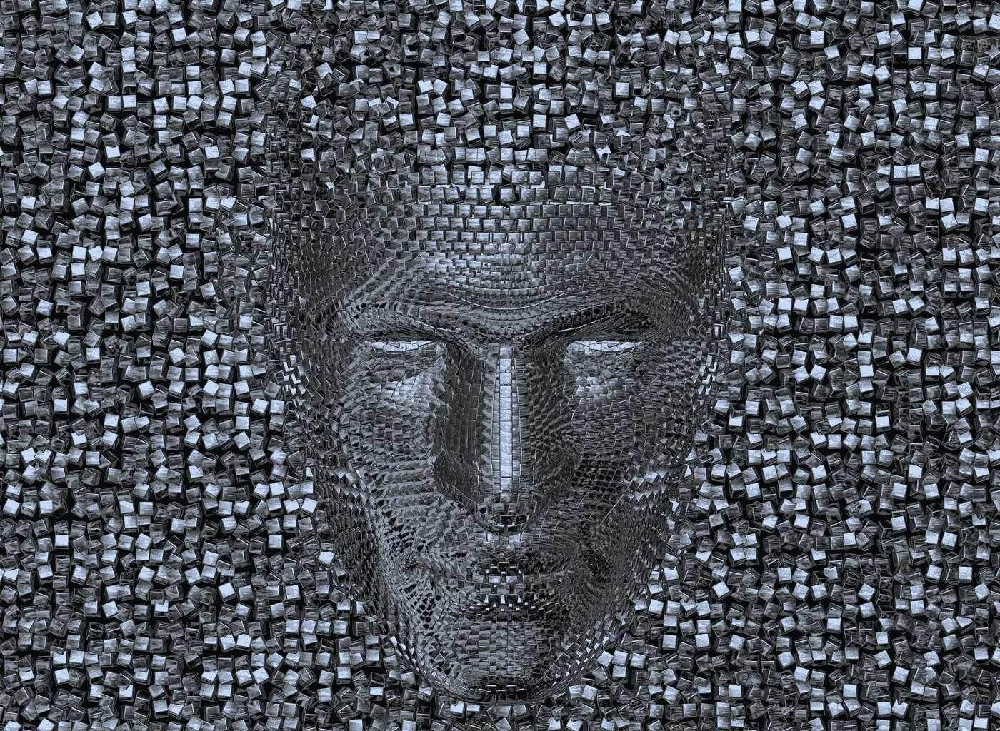

在我们的[上一篇文章](/mlearning-ai/neural-networks-from-the-beginnings-470fbeab0fc8)的基础上，我们将神经网络向前推进了一步，用一种叫做卷积的过程对图像进行分类。

**CNN** ( *卷积神经网络*)是一种人工神经网络，它模仿人眼对其各层进行处理，使其能够识别物体并“看见”。

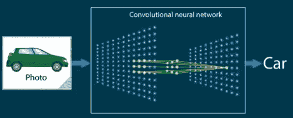

General CNN

CNN 包含几个具有层次结构的专门隐藏层，例如，第一层可以检测线条、曲线和边缘，然后进行专门处理，直到它们到达更深的层，识别复杂的形状，如面部或人体的一部分。

在这次旅行中，首先我们必须了解如何使用这种新类型的输入数据:

# 形象

数字图像有 3 个属性:以像素为单位的宽度和高度(分辨率)，以及称为通道的 RGB(红、绿、蓝)格式的颜色。

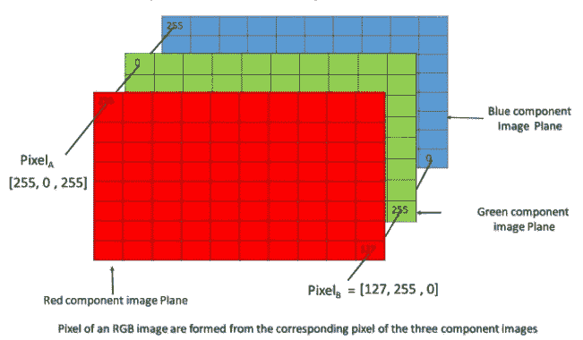

An RGB image

在我们的例子中，我们将使用一个名为 CIFAR-10 的微小图像数据集，它很好地服务于我们的学习目的。它由 60，000 个 32×32 彩色(RGB)图像组成，用一个整数标记，对应 10 类中的一类(*飞机(0)、汽车(1)、鸟(2)、猫(3)、鹿(4)、狗(5)、青蛙(6)、马(7)、船(8)和卡车(9)* )。

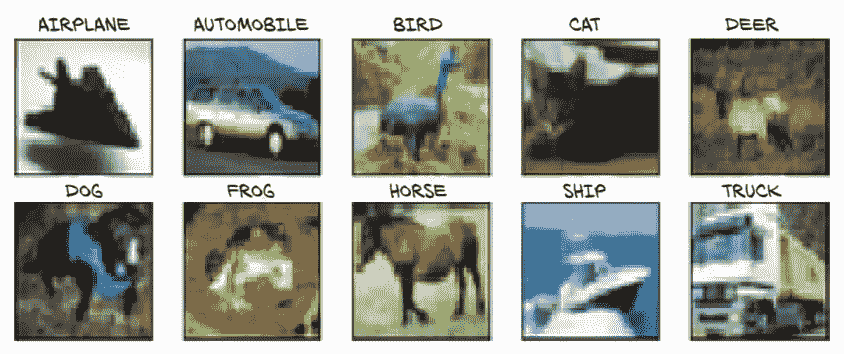

Cifar10 dataset classes

我们将继续在我们的项目中使用 Pytorch，所以我们将从您的 torchvision 库中导入这个数据集。

```
from torchvision import datasets 
data_path = './dlpytorch/' 
cifar10 = datasets.CIFAR10(data_path, train=True, download=True) cifar10_val = datasets.CIFAR10(data_path, train=False,              download=True) 
len(cifar10)
```

我们将下载参数设置为 True，表示*数据路径*，将*训练*设置为 True，表示我们对训练集感兴趣。在值的情况下，我们的*训练*将为假以获得验证数据。最后，我们验证了所获得的数据集的大小:50，000 张图像

好了，数据集的每个图像都是 RGB PIL 图像的一个实例，让我们来可视化其中的一些图像:

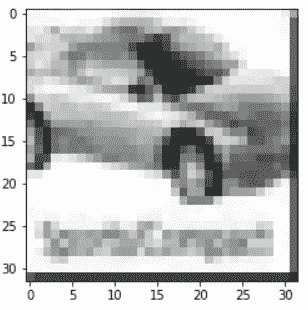

```
 # plot ex. image 
img, label = cifar10[79] 
plt.imshow(img) 
plt.show() print(f”Label:{label} — Class:{class_names[label]}”)
```

*标签:1 —类别:汽车*

现在，我们需要将我们的图像转换成张量，然后才能用 Pytorch 做任何事情

```
from torchvision import transforms
to_tensor = transforms.ToTensor()
img_t = to_tensor(img)
img_t.shape
```

*火炬。尺寸([3，32，32])*

这样，图像就变成了一个 3 ( *RGB 通道* ) × 32 × 32 的张量。好了，让我们使用数据集变换参数将所有图像数据集转移到 Pytorch 张量:

```
tensor_c10 = datasets.CIFAR10(data_path, train=True, download=False,                                                
                             transform=transforms.ToTensor())

# load the same image and view the the tensor shape and type
img_t, _ = tensor_c10[79]
img_t.shape, img_t.dtype
```

*(火炬。尺寸([3，32，32])，torch.float32)*

ToTensor 变换将数据转换为每个通道的 32 位浮点，将值从 0.0 缩小到 1.0，同时记住，我们必须改变轴的顺序，以便使用 matplotlib ( *从 RGB 通道-H-W 到 H-W-RGB 通道*)重新查看我们的图像。

```
# Permute columns and visualize image again
plt.imshow(img_t.permute(1, 2, 0))
plt.show()
```

**归一化图像数据**

这是因为通过选择在 0 加或减 1 ( *或 2* )附近线性的激活函数，我们将数据保持在相同的范围内，因此神经元更可能具有非零梯度，因此它们将更早地学习。此外，将每个信道归一化为具有相同的分布将确保信道信息可以通过使用相同学习速率的梯度下降来混合和更新。

因此，我们必须计算数据集上每个通道的*平均值*和*标准偏差，并应用以下变换:*

v _ norm[c]=(v[c]-mean[c])/stdev[c]

让我们为 CIFAR-10 训练集计算它们:

```
# Normalizing data
# 1\. stack the dataset tensors along an extra dimension
imgs = torch.stack([img_t for img_t, _ in tensor_c10], dim=3)
imgs.shape
```

*火炬。尺寸([3，32，32，50000])*

```
# 2\. compute mean per channel
imgs.view(3, -1).mean(dim=1)
```

*张量([0.4914，0.4822，0.4465])*

view(3，-1)保留 3 个通道，并将所有剩余的维度合并为一个，因此我们的 3 × 32 × 32 图像被转换为 3 × 1，024 向量，然后对每个通道的 1，024 个元素取平均值。

```
# 3\. compute std deviation
imgs.view(3, -1).std(dim=1)
```

*张量([0.2470，0.2435，0.2616])*

```
# 4 normalize the data 
normalized_c10 = datasets.CIFAR10(data_path, train=True, download=False, transform=transforms.Compose([
                       transforms.ToTensor(),
                       transforms.Normalize((0.4915, 0.4823, 0.4468),(0.2470, 0.2435, 0.2616)) ]))
```

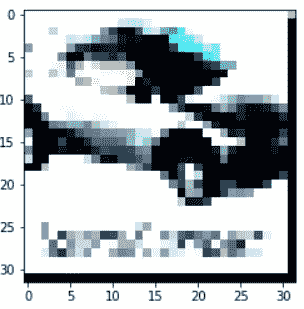

```
# view normalized image img_t, _ = normalized_c10[79] plt.imshow(img_t.permute(1, 2, 0)) plt.show()
```

# 从完全连接到卷积神经网络

假设我们要构建一个全连通的 NN ( *如* [*上一篇*](/mlearning-ai/neural-networks-from-the-beginnings-470fbeab0fc8) 中所解释的)，这次我们将使其更深，为此我们将添加一个新的隐藏层。我们的输入层将有 3072 个值( *3 * 32 * 32* )，并将为第一个隐藏层产生 1024 个值的输出，为第二个隐藏层产生 512 个值的输出。隐藏层，输出层为 128，将输出 10 个值(每个类的概率)

```
# fully connected NN
fc_model = nn.Sequential(
          nn.Linear(3072, 1024),
          nn.Tanh(),
          nn.Linear(1024, 512),
          nn.Tanh(),
          nn.Linear(512, 128),
          nn.Tanh(),
          nn.Linear(128, 10))
```

让我们看看我们的网络中会有多少参数(*只是权重，还有待添加偏差)*:

```
# how many parameters have our fully connected NN ?
param_list = [p.numel()
              for p in fc_model.parameters()]sum(param_list), param_list
```

*(3738506，[3145728，1024，524288，512，65536，128，1280，10])*

哇！！ **3.738.506** 参数，为什么这么多？

记住一个线性层计算出 **y = weight * x + bias** ，如果 x 的长度为 3072，y 的长度必须为 1024，那么权重张量的大小需要为 1024×3072，bias 的大小必须为 1024。因此，第一层有 1，024 * 3，072 + 1，024 = 3，146，752 个参数。

这告诉我们，我们的神经网络在像素方面没有很好的缩放，想象一下，如果我们有 1024x1024 RGB 图像，只有 310 万个输入值，超过 30 亿个参数，会发生什么！！

**盘旋营救**

如果我们想要**识别与物体相对应的图案**，例如一条路线上的汽车，我们可能需要查看附近的像素是如何排列的，我们对彼此远离的像素如何组合起来不太感兴趣，因此重要特征的组合往往是彼此在一起的像素。如果我们想在图像中检测我们的福特汽车，角落里是否有树或云并不重要。

为了数学地解释这一点，我们可以计算一个像素与其紧邻像素的加权和，而不是图像中所有其他像素的加权和。这将等同于构建*权重矩阵*，每个输出特征和输出像素位置一个，其中超过距中心像素一定距离的所有权重将为零。

因为这些局部模式对输出有影响，不管它们在图像中的位置如何，我们必须实现**不变平移**。

幸运的是，我们在图像转换中有一个线性的、局部的和不变的操作:

# 卷积

我们可以将 2D 图像的卷积定义为权重矩阵的点积:**内核**在输入处具有每个邻域，生成新的输出矩阵。

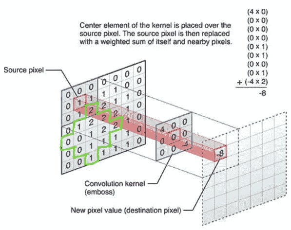

convolutional kernel

该内核将在输入图像中从左到右、从上到下移动，就好像一个**补丁**被放到图像上。

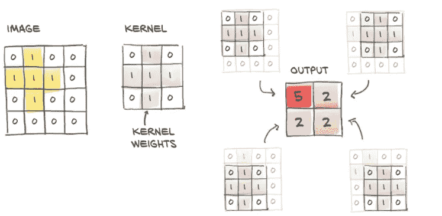

kernel moves over image

总的来说，优点是:

*   社区中的本地操作
*   翻译不变性
*   参数少得多的模型

内核(*也叫卷积矩阵*)一般都是方形的小( *3x3，5x5* )，通常用随机值初始化。当然，选择内核大小需要权衡，我们将在后面讨论。

让我们开始看一些代码，Pytorch 提供了 1，2，3 维的卷积:nn。时间序列的 Conv1d，nn。用于图像和神经网络的 Conv2d。用于体积/视频的 Conv3d。我们将为图像创建一个 2d 卷积:

```
# create Conv2d
conv = nn.Conv2d(3, 16, kernel_size=3)
conv
```

*Conv2d(3，16，kernel_size=(3，3)，stride=(1，1))*

参数:3 是输入特征的数量(*或本例中的通道*)，16 是输出通道，这是一个任意的数字，但是通道越多，网络检测不同类型特征的能力就越大，kernel_size 是 3 ( *Pytorch 假设 3x3* )。最后，默认情况下，步幅为 1，这是内核在图像中滑动时的步长。

因此，在这种情况下，我们的权重张量为:16 (out_ch) x 3 (in_ch) x 3 x 3，偏差大小为 16。验证:

```
conv.weight.shape, conv.bias.shape
```

*(火炬。大小([16，3，3，3])，火炬。尺寸([16])*

好，对我们的示例图像应用卷积:

```
# Apply convolution
output = conv(img_t.unsqueeze(0))
img_t.unsqueeze(0).shape, output.shape
```

*(火炬。大小([1，3，32，32])，火炬。尺寸([1，16，30，30])*

unsqueeze 向输出添加一个新的 dim 0，因为 Conv2d 期望一个形式为 **B(atch)** **× C × H × W** 的张量作为输入，在这种情况下，批处理只有 1 个图像。

和显示卷积图像:

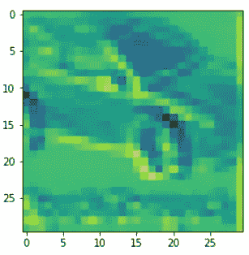

```
plt.imshow(output[0, 0].detach()) plt.show()
```

请注意，输出的形状是 30x30，而不是 32x32，因此卷积后，我们在每个维度上都丢失了两个像素。为了解决这个问题，Pytorch 为我们提供了**填充**图像的可能性，方法是在边界周围创建零值的鬼像素。

```
conv = nn.Conv2d(3, 16, kernel_size=3, padding=1)
```

现在假设我们希望我们的内核执行一个*边缘检测*。我们如何给这个新内核分配权重呢？

```
# create new conv to perform edge detection
conv = nn.Conv2d(3, 1, kernel_size=3, padding=1)# disable gradient calculation and set the weights
with torch.no_grad():
    conv.weight[:] = torch.tensor([[-1.0, 0.0, 1.0],
                                   [-1.0, 0.0, 1.0],
                                   [-1.0, 0.0, 1.0]])
    conv.bias.zero_()
```

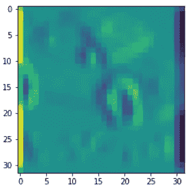

```
output = conv(img_t.unsqueeze(0)) plt.imshow(output[0, 0].detach()) plt.show()
```

通过这种方式，我们可以构建许多更精细的过滤器。CNN 的工作是在连续的层中估计一组滤波器组的核心，这些层将把一个多通道图像转换成另一个多通道图像，其中不同的通道对应于不同的特征。

我们将有一个输出通道 x 内核(像一个通道的平均，另一个通道的垂直边缘，等等。)

**内核大小权衡**

较小的内核会给你很多细节，但它会导致你过度拟合，而且计算量很大。

较大的内核会丢失很多细节，并可能导致欠拟合，但计算时间更快，内存使用更少。

所以，你应该调整你的模型，找到最佳尺寸。使用奇数内核是很常见的，最常用的是 3x3 和 5x5。

# 向下采样

下采样或汇集旨在基于某些数学运算(如平均或最大汇集)来减少图像的空间维度。结合卷积和下采样可以帮助我们识别更大的结构。

例如，将图像缩放一半相当于将 4 个相邻像素(位置)作为输入，产生一个像素作为输出。图像的这种下采样可以通过应用:

*   平均池:4 个像素的平均值，这是第一种方法，但现在已经废弃不用了
*   最大池化:取四个像素中的最大值，目前是最常见的

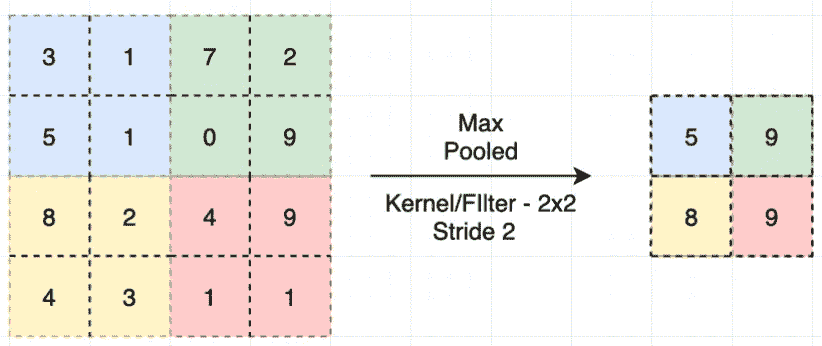

Max Pooling example

缩减像素采样有助于捕捉渲染图像的基本结构特征，而不会过分关注细节，并且通常充当噪声抑制剂。

**组合卷积和池化的优势**

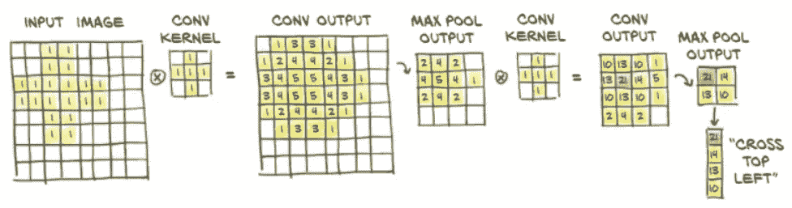

Combine convolutions and pooling

在上面的例子中，第一组核在小邻域和低级特征中操作，而第二组核有效地在较大邻域中操作，产生由先前特征组成的特征。

这种组合使 CNN 能够观看非常复杂的场景。

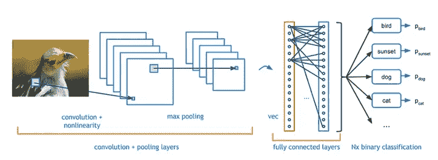

A CNN with convolution and max pooling

**特征映射**

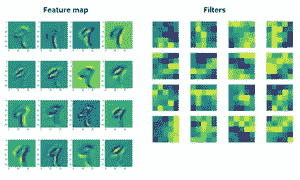

Feature mapping

特征地图是应用于前一层的一个过滤器的输出。

因此，如果我们有 16 个核的第一卷积，我们将有 16 个输出矩阵(*特征映射*)

**CNN 编码时间！**

好了，现在是时候用卷积和池来重建我们的神经网络，然后检查我们是否有一些可接受的参数，以便训练比完全连接的神经网络更快，计算成本更低。

```
# CNN combining convolutions and pooling
model = nn.Sequential(
    nn.Conv2d(3, 16, kernel_size=3, padding=1),
    nn.Tanh(),
    nn.MaxPool2d(2),
    nn.Conv2d(16, 8, kernel_size=3, padding=1),
    nn.Tanh(),
    nn.MaxPool2d(2),
    nn.Linear(8 * 8 * 8, 32),
    nn.Tanh(),
    nn.Linear(32, 10))
```

第一个卷积采用 3 个通道到 16 个通道，因此它生成 16 个独立的特征，用于区分图像的低级特征，然后我们应用 Tanh 激活函数，最后将 16 通道 32 × 32 图像汇集成 16 通道 16×16 图像( *MaxPool2d* )。

对第二卷积、Tanh 和 Pool 进行相同的处理，最后我们将 8 通道 8×8 图像传递到线性模块，并将 32 个元素输出到最终线性模块，最终线性模块输出 10 个元素( *10 个概率，Cifar10 数据集中每类图像一个*)。

现在，我们获得了该网络需要与完全连接的网络进行比较的参数数量:

```
numel_list = [p.numel() for p in model.parameters()]
sum(numel_list), numel_list
```

*(18354，[432，16，1152，8，16384，32，320，10])*

**18.354**vs***3 . 738 . 506***真是大裁员！！**

**如果我们试图将图像应用到我们的模型来进行预测，它将会给出一个错误。这是因为在最后一次卷积后，我们必须将 8 通道* 8*8 图像重新整形为 512 1D 矢量。**

**但遗憾的是，当我们使用 nn 时，我们没有任何显式的每个模块的输出可见性。Pytorch 中的 Sequential，所以我们必须子类化 nn。模块:**

```
**# The solution: make our own nn.module subclass
class Net(nn.Module):
  def __init__(self):
    super().__init__()
    self.conv1 = nn.Conv2d(3, 16, kernel_size=3, padding=1)
    self.act1 = nn.Tanh()
    self.pool1 = nn.MaxPool2d(2)
    self.conv2 = nn.Conv2d(16, 8, kernel_size=3, padding=1)
    self.act2 = nn.Tanh()
    self.pool2 = nn.MaxPool2d(2)
    self.fc1 = nn.Linear(8 * 8 * 8, 32)
    self.act3 = nn.Tanh()
    self.fc2 = nn.Linear(32, 10) # That takes the inputs to the module and returns the output
  def forward(self, x):
    out = self.pool1(self.act1(self.conv1(x)))
    out = self.pool2(self.act2(self.conv2(out)))
    out = out.view(-1, 8 * 8 * 8)  # the reshape to 1D 512 elements
    out = self.act3(self.fc1(out))
    out = self.fc2(out)
    return out**
```

**我们将做一个新的重构，因为一些模块像 nn。Tanh 和 nn。MaxPool2d 没有参数，没有必要在新的子类中注册它们。为此，Pytorch 有一个函数 API(*torch . nn . functional*)，我们将使用它来执行这个任务。**

```
**# Refactor the Net subclass to use funct. Api for Activat.funct. and Poolingimport torch.nn.functional as F
class Net(nn.Module):
    def __init__(self):
      super().__init__()
      self.conv1 = nn.Conv2d(3, 16, kernel_size=3, padding=1)
      self.conv2 = nn.Conv2d(16, 8, kernel_size=3, padding=1)
      self.fc1 = nn.Linear(8 * 8 * 8, 32)
      self.fc2 = nn.Linear(32, 10) def forward(self, x):
      out = F.max_pool2d(torch.tanh(self.conv1(x)), 2)
      out = F.max_pool2d(torch.tanh(self.conv2(out)), 2)
      out = out.view(-1, 8 * 8 * 8)
      out = torch.tanh(self.fc1(out))
      out = self.fc2(out)
      return out**
```

**将图像应用于网络模型:**

```
**# we obtain 10 probabilities, 1 per class in the Cifar10 Dataset
model = Net()
model(img_t.unsqueeze(0))**
```

***张量([[ 0.1109，0.1352，0.1018，-0.0142，-0.1172，0.0679，0.0349，0.1117，0.0222，0.1687]]，grad _ fn =<AddmmBackward>)***

****在 CNN 分类模型中使用的损失函数:Softmax 交叉熵损失****

**在我们之前关于神经网络的帖子中，我们使用 MSE 作为损失函数，但这里我们面临一个分类问题，所以我们应该使用一个函数，更好地将输出值解释为概率。也就是说，数组的每个值必须在 0-1 之间，并且每个样本的向量总和必须为 1。**

**Softmax 交叉熵通过产生比相同输入的 MSE 更陡的梯度来利用这些特性。它有两个组成部分:**

*   **a) **Softmax 函数**:相对于其他值，强烈放大最大值，迫使 NN 在它认为正确的预测上不那么中立。例如:**

**normalize(np.array([10，6，4]) ==> array([0.5，0.3，0.2])**

****softmax** (np.array([10，6，4]) == > array([0.84，0.11，0.04])**

*   **b) **交叉熵损失**:对于区间[0，1]来说，罚分比 MSE 高得多，并且当预测(p)和目标(y)之间的差接近 1 时，罚分变得更陡地接近∞。**

**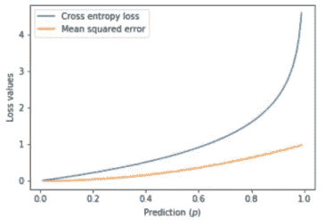**

**示例:**

**y = 0 时交叉熵损失与均方误差的关系**

# **训练卷积神经网络模型**

**好了，现在我们必须训练我们的模型，让我们开始工作。为了能够更快地执行我们的训练，我们将使用来自 Cifar10 的精简数据集，其中只有 3 个类别的图像，而不是最初的 10 个(*飞机、汽车和船只*)称为 Cifar3:)。你可以在 github repo 里看到代码。**

**我们创建了一种在 n 个时期的循环中训练网络的方法。我们将使用 Pytorch 提供的数据加载器向网络提供成批的图像(在我们的示例中是 64)。**

```
**# Training the Net CNN
import datetimedef training_net(n_epochs, optimizer, model, loss_fn, train_loader):
    for epoch in range(1, n_epochs + 1):
        loss_train = 0.0 # The DataLoader (train_loader) create batches of 64 imgs (batch_size)
        for imgs, labels in train_loader:
            outputs = model(imgs)
            # compute the loss to minimize
            loss = loss_fn(outputs, labels)
            # put 0 the grads of the last round, compute new grads and update model
            optimizer.zero_grad()
            loss.backward()
            optimizer.step()
            # sums the losses we saw over the epoch
            # item() to transform loss to a python number
            loss_train += loss.item() if epoch == 1 or epoch % 10 == 0:
            print('{} Epoch {}, Training loss {}'.format(
            datetime.datetime.now(), epoch,
            loss_train / len(train_loader)))**
```

**然后，我们将创建一个 CNN 模型的实例，一个 SGD 优化器，一个交叉熵损失，并将它们传递给训练网络。**

```
**train_loader = torch.utils.data.DataLoader(cifar3, batch_size=64,
                shuffle=True)
model = Net() 
optimizer = optim.SGD(model.parameters(), lr=1e-2) 
loss_fn = nn.CrossEntropyLoss() 
training_net(
              n_epochs = 20,
              optimizer = optimizer,
              model = model,
              loss_fn = loss_fn,
              train_loader = train_loader,
              )**
```

***2021–08–27 15:35:11.218508 第一纪元，训练损耗 1.23238880456***

***2021–08–27 15:36:10.194867 纪元 10，训练损耗 0.46648594766***

***2021–08–27 15:37:15.662480 纪元 20，训练损耗 0.3668626133877***

***2021–08–27 15:38:21.163712 第 30 纪元，训练损耗 0.3332703081618***

**…**

***2021–08–27 15:44:56.936097 纪元 90，训练损耗 0.185609463060157***

***2021–08–27 15:46:02.644376 纪元 100，训练损耗 0.16131676103206***

**现在，我们将根据验证数据来衡量模型的准确性:**

```
**# build the data loaders for train and validation
train_loader = torch.utils.data.DataLoader(cifar3,     
                     batch_size=64,shuffle=False)
val_loader = torch.utils.data.DataLoader(cifar3_val, 
                     batch_size=64,shuffle=False)# measure the accuracy using the validation dataset
def validate_net(model, train_loader, val_loader):
    for name, loader in [("train", train_loader), ("val", val_loader)]:
        correct = 0
        total = 0
        # don't want grads here
        with torch.no_grad():
          for imgs, labels in loader:
              outputs = model(imgs)
              # gives the index of the highest value of outputs
              _, predicted = torch.max(outputs, dim=1)
              # increased total with batch size
              total += labels.shape[0]
              # Comparing the predicted class that had the maximum probability with the correct label. The sum gives the number of items are agree
              correct += int((predicted == labels).sum())
        print(f"Accuracy {name}: {correct / total}")validate_net(model, train_loader, val_loader)**
```

***精度训练:0.9295***

***精度值:0.8713***

**好吧，伙计们，这个帖子里的信息太多了。在下一个视频中，我们将会谈到:**

**如何存储和检索我们的神经网络的训练参数，调整我们的网络对抗过度拟合的方法，以及在 GPU 上运行我们的训练。**

**像往常一样，github 与完整的[神经网络 jupyter nb](https://github.com/jrercoli/nn_convolutional_world) 的链接被附上，这样你就可以自己验证代码。**

**感谢您的评论。**