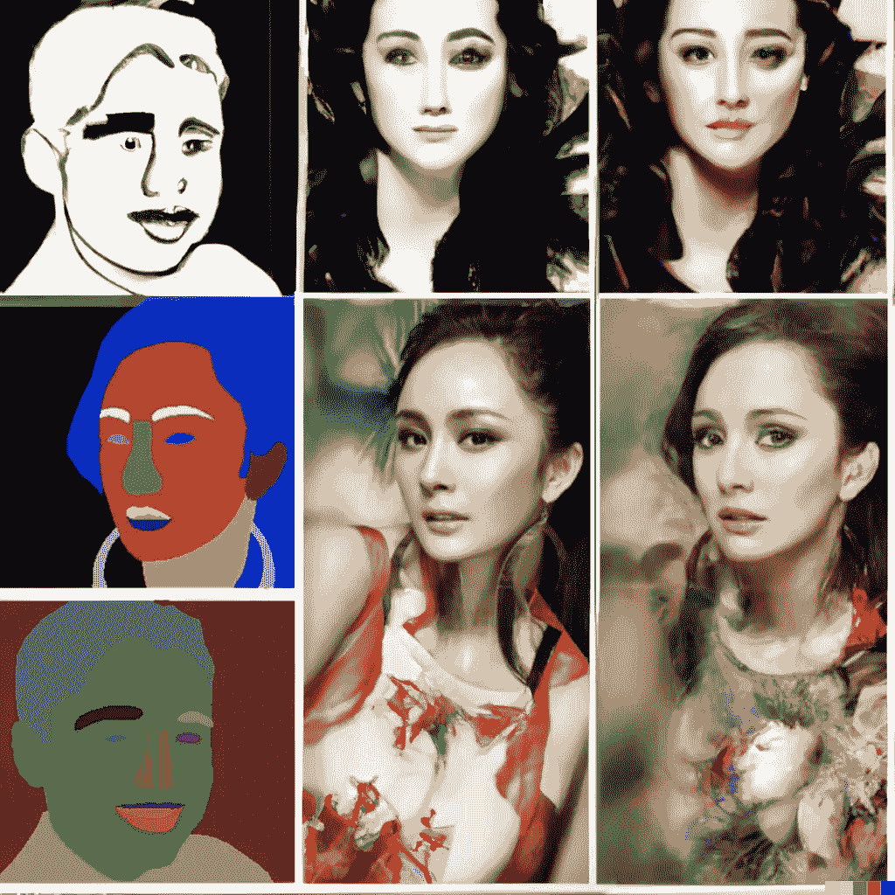

# 要阅读的图像

> 原文：<https://medium.com/mlearning-ai/images-to-read-11338cbaddb?source=collection_archive---------4----------------------->

## [机器学习艺术](https://mlearning.substack.com)

## 语义扩散模型。制作互动绘画

[https://mlearning.substack.com](https://mlearning.substack.com) — [created by AI system](https://evartology.substack.com/p/all-of-the-greatest-ai-powered-art)

这个标题无疑是自相矛盾的，因为**图像可以被阅读吗？**

人们通常认为一幅画是用来观赏的。然而，根据符号学理论，任何一种符号——包括图标符号——都是可以“阅读”的，也就是说，它们的意义是可以“解读”的