# 不平衡数据和线性回归

> 原文：<https://medium.com/mlearning-ai/imbalanced-data-and-linear-regression-e8ff1b1e2f6f?source=collection_archive---------0----------------------->

“Necessity is the mother of invention”

**线性回归(LR)用于寻找目标和一个或多个预测值之间的线性关系**。核心思想是获得最适合数据的线。最佳拟合线是总预测误差(所有数据点)尽可能小的线。误差是点到回归线的距离。在这个博客中，我们将涵盖线性回归模型和执行预测模型的各种设置超参数。

> **线性回归**假设**特征和目标向量之间的关系近似为线性**。也就是说，特征对目标向量的影响(也称为系数、权重或参数)是恒定的。在我们的解决方案中，为了便于解释，我们仅使用两个特征来训练我们的模型。

在我们实验中，我们采用了 4 组不同比例的数据，即[(100:2)，(100:20)，(100:40)，(100:80)]和 3 组超参数“C”，即[0.001，1，100]。我们将看到所有这 12 种组合的结果，并逐一进行分析。

> **设置 1** **:-数据比= (100:2)** - >(蓝色:红色)

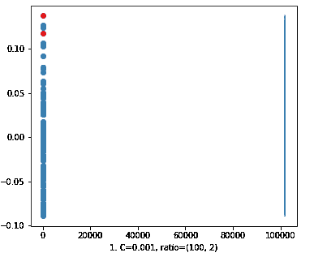

**Figure 1**

首先我们取值**‘C’= 0.001**。在结果图 1 中，决策线位于 X 轴上的 100k 处，它远未分类，因为数据在最左侧，但决策线在最右侧，即使我们有 2 个红点，也有 100 个蓝点。

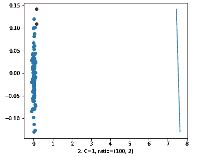

Figure 2

现在来看第二个数字，我们增加了**‘C’= 1**的值。许多人会认为图 1 和图 2 没有任何区别。但是，再看看 x 轴。在图 1 中，数据点在 0 上，决策线在 100k 上。在图 2 中，数据在 0 和 x 轴附近，而决策线已经非常接近 x 轴上的 8。所以，我们可以说‘C’对数据集有很大的影响。

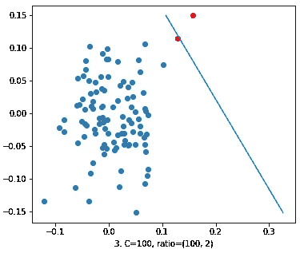

Figure 3

在第三张图中，我们将**‘C’的值增加到 100** 。这里的决策线试图将红点与蓝点区分开来。但是我们不能说这是一个好的决策函数。

> **Set 2:-数据比率= (100:20)** - >(蓝色:红色)

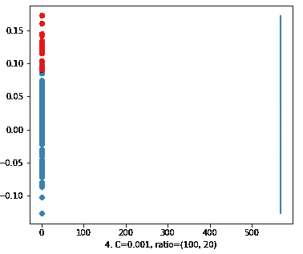

Figure 4

首先我们看一下**‘C’= 0.001**的值。比较图 1 和图 4 看起来是一样的。但是仔细观察图 1 中的 x 轴，决策线位于 100k 处。另一方面，在图 4 中，决策线在 x 轴上大约 600 处。

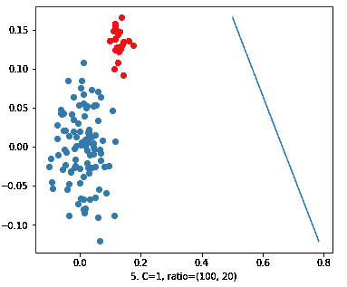

**Figure 5**

现在，我们取**‘C’= 1**的值。我们得到了一个决策线，它离数据点很近，但是没有用。因为它没有把蓝色和红色分开。

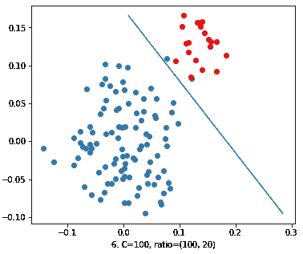

Figure 6

现在，我们将**‘C’的值增加到 100** 。我们可以看到结果图 6，其中决策行比以前的分类更好。但这仍然不是由马克决定的，因为这条线靠近红色，而两个蓝色在错误的一边。

> **Set 3:-数据比= (100:40)** - >(蓝色:红色)

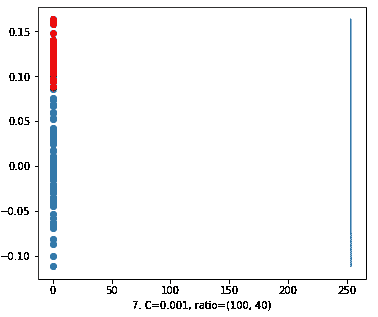

Figure 7

我们再次取值**‘C’= 0.001**。像图 4 一样，在图 7 中，决策线也移动到了 x 轴的数据点附近。但还是没用。不需要解释。

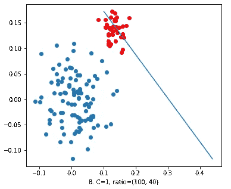

Figure 8

现在，我们取**‘C’= 1**的值。在图 8 中，我们可以看到试图对数据进行分类的决策线。但是它有很多错误，所以我们不能接受。

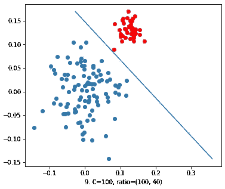

Figure 9

现在，我们增加了**‘C’= 100**的值。决策线很好的区分了红色和蓝色。我们可以接受这个决策函数。因此，我们可以得出这样的结论，随着这个比率的增加，C 的值也将使我们得到一个好的模型。

> **集合 4:-数据比= (100:80)** - >(蓝:红)(几乎平衡数据集)

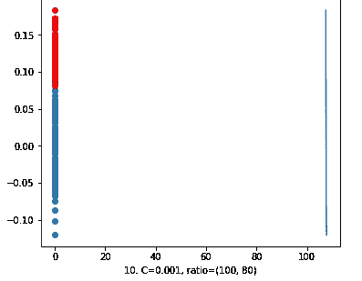

Figure 10

再次，首先我们取**‘C’= 0.001**。它优于具有相同“C”值但不同数据比率的先前模型。在这个模型中，决策线接近 120。因此，随着数据率的提高，情况会越来越好。

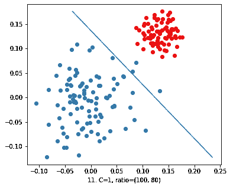

Figure 11

现在我们取值为**‘C’= 1**。在结果图中，我们可以看到决策是对数据进行分类。但是一些蓝点正在穿越它们的边界。所以这个模型还是有误差的。但是很明显情况在好转。

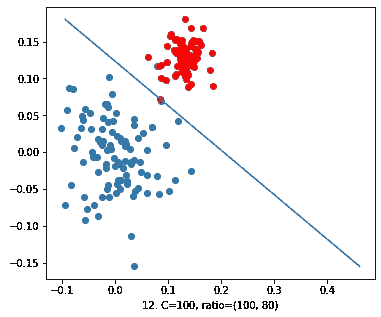

Figure 12

现在向最后一个数字移动。我们取值为**‘C’= 100**。在上图中，我们可以清楚地看到一条很好的决策线，它对数据进行了很好的分类，但有一个例外。一红一蓝点正好在线上。所以我们可以说这是一个很好的契合。

# 结论

从上面的观察中，我们可以得出两点结论。

**1。**增加数据比率将使决策线与数据更加吻合。

**2。**增加‘C’的值也会导致决策线的良好拟合。但在一定程度上，增加 it，我们的模型将过度拟合数据。

所以，明智地调整你的模型。！编码快乐！