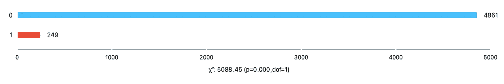
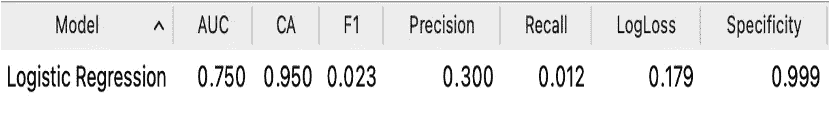
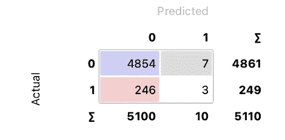
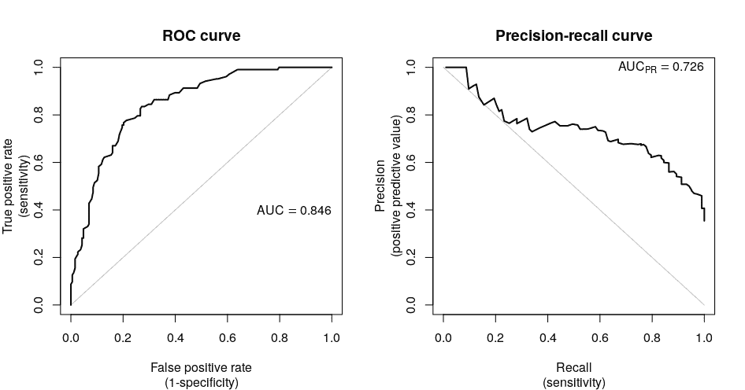
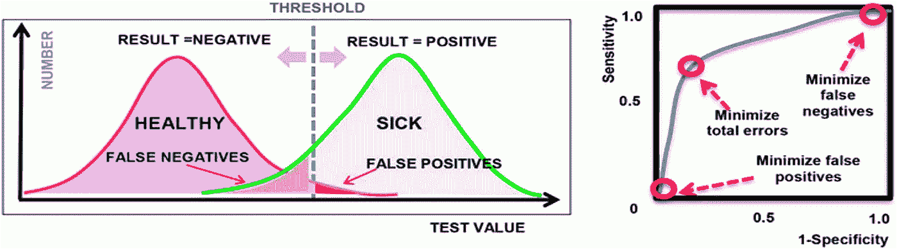
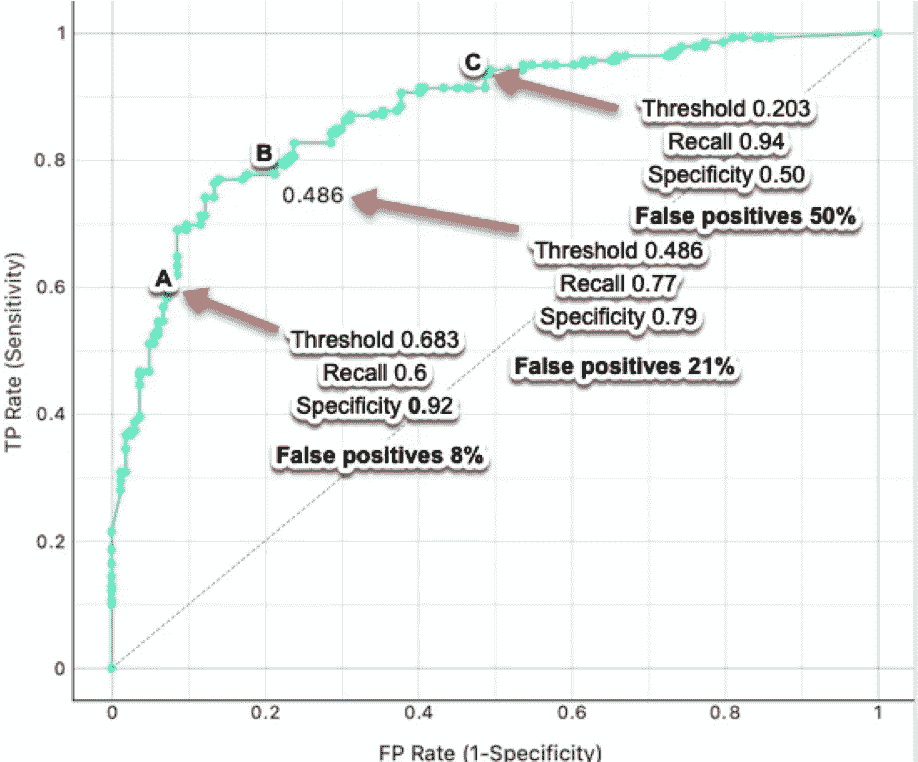
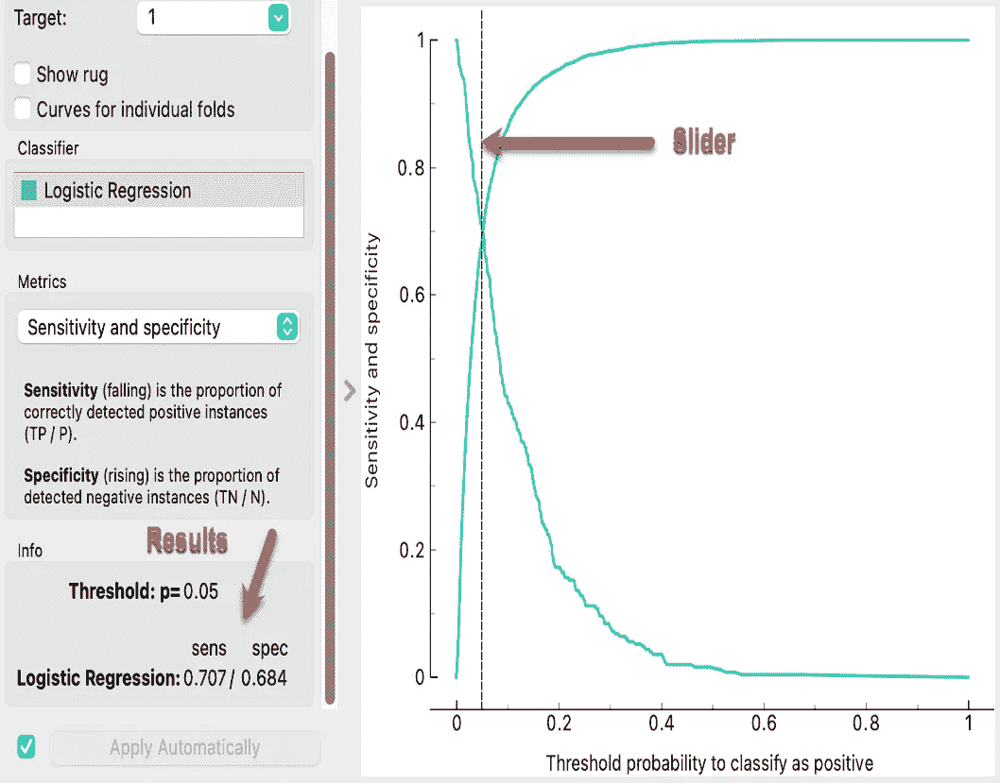
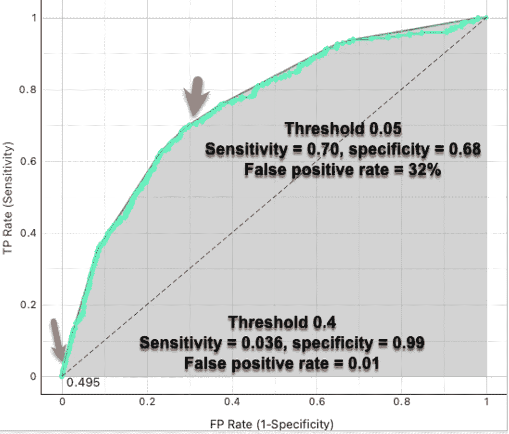
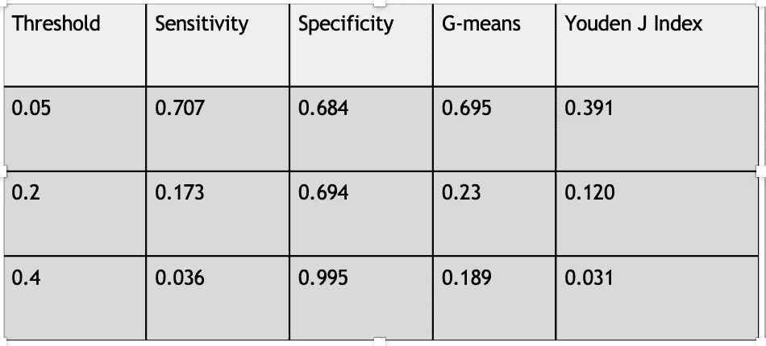
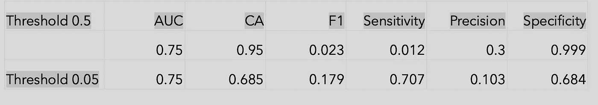

# 不平衡的数据集-可能的解决方案是什么？

> 原文：<https://medium.com/mlearning-ai/imbalanced-datasets-what-are-possible-solutions-2f7d09d63cb3?source=collection_archive---------6----------------------->

不平衡的数据集常见且具有挑战性吗？

欺诈检测和医学等几个领域的一个主要挑战是，你感兴趣的类别/类别/结果往往是一小部分。例如，金融欺诈约占调查的 3%，这意味着 97%不是欺诈。类似地，在医学上，活组织检查可能有 10%的几率显示癌症，而良性活组织检查有 90%的几率显示癌症。没有神奇的比例来定义什么时候有阶级不平衡。当少数阶级(感兴趣的阶级)为 10%或更少时，它会发生吗？没有完美的答案！

在这篇文章中，我将回顾阶级失衡的重要性，并提出切实可行的解决方案。我将使用数据科学程序 [Orange](https://orangedatamining.com/) 来演示几种解决方案。

**不平衡数据集如何影响模型性能？**

阶级不平衡的下游结果是显著的:

1.  分类准确度(CA)不再有帮助，因为模型训练并聚焦于多数类，而不是少数类。当存在类别不平衡时，期望看到良好的 AUC、优异的 CA、优异的特异性但差的召回率、精确度和 F1 分数。
2.  曲线下面积(AUC)通常是二元分类的黄金标准，但在类别不平衡的情况下并不准确，通常过于乐观。

**阶层失衡的一个例子**

让我们从一个来自 [Kaggle](https://www.kaggle.com/datasets/fedesoriano/stroke-prediction-dataset) 的不平衡数据集预测中风的例子开始。未患中风的患者与患中风的患者比例约为 20:1。以下橙色截屏显示了这种等级不平衡，5110 名患者中只有 249 名患者发生中风。

以下是尝试用逻辑回归预测谁将发展为中风的结果，随后是使用橙色的混淆矩阵。

您应该立即注意到的是分类准确性(CA)和特异性非常好，并且 AUC 是可接受的。但是其他的呢？其余的不好，因为模型是在多数类(无中风)上学习/训练，而不是在少数类(中风)上学习/训练。混淆矩阵显示，有 246 名患者被预测为没有中风，而实际上他们有中风(假阴性)。这是临床上不能接受的！

**阶层失衡的潜在解决方案有哪些？**

我们已经确定，类别不平衡会导致分类模型运行不良。在这种情况下，我们的选择是什么？应该注意的是，对于这种情况没有国家或国际准则，并且最终这种情况将由最终用户来决定他们可以接受多少假阳性或假阴性。在医学上，太多的假阳性意味着恼人的警报，太多的假阴性意味着你错过了有风险的病人。

1.  报告精确召回曲线(PRC ),而不是 ROC (AUC)。这个选项在很多数据科学程序中都有，但在 Orange 中没有。中国是 ROC 曲线的镜像，但关注的是少数利益阶层。在这组[图像](https://www.r-bloggers.com/2020/01/area-under-the-precision-recall-curve/)中，从 PRC 计算出的 AUC(0.726)比从 ROC 计算出的 AUC(0.846)差，这提出了类别不平衡的问题。

2.用[生成对抗网络(GANs)](https://www.toptal.com/machine-learning/generative-adversarial-networks#:~:text=A%20GAN%20is%20a%20type,that%20we%20need%20more%20data.) 生成新的少数民族数据，这是一种深度学习。

3.您可以对多数类进行欠采样以使这些类相等，或者对少数类进行过采样，或者两者兼而有之。有多个 Python 包可以执行欠采样和过采样，但是没有一致的方法。少数民族的合成过采样技术( [SMOTE](https://machinelearningmastery.com/smote-oversampling-for-imbalanced-classification/) )是一个流行的软件包，它使用 k 近邻来定位类似于少数民族类的数据。

4.您可以调整算法，使其向少数类添加特殊权重。通过逻辑回归在 Orange 中使用该选项，F1 分数从 0.023 增加到 0.213。在 Orange 中，逻辑回归和随机森林都有一个复选框来“平衡类别分布”

5.调整 F 分。F1 是召回率(灵敏度)和精确度(阳性预测值)的调和平均值，但是可以计算其他 F 值。如果假阴性更重要，使用 F2 分数=5*精度*召回/4*精度+召回。结果= 0.014(比 F1 差)

6.如果对预测两类都感兴趣，请使用马修斯相关系数。对于该数据集，MCC 得分= 0.05(非常差)(正常 0–1，其中 1 是完美模型)。该计算考虑了真阳性和假阳性以及真阴性和假阴性。有在线计算器[让这变得更容易。](https://www.toptal.com/machine-learning/generative-adversarial-networks#:~:text=A%20GAN%20is%20a%20type,that%20we%20need%20more%20data.)

7.受试者操作曲线(ROC)阈值偏移(移动)。受试者操作曲线显示真阳性率(TPR)(y 轴)对假阳性率(FPR)(x 轴)(FPR 也= 1-特异性)。默认阈值为 0.5。

在下图中，向左移动阈值滑块会降低阈值。(0.5 降至 0.3)。右边的一切都将映射到“生病”但是，随着阈值的降低，TPR(回忆)会增加，特异性会降低，但假阳性的数量会增加。

在橙色中，您可以将鼠标放在 ROC 曲线上，它将显示阈值(见下文)。请注意以下几点:

高于 0.50 阈值的数据值映射到一个类别(例如 1)，低于 0.50 的数据值映射到另一个类别(例如 0)

随着阈值的增加，TPR(回忆)(灵敏度)降低，特异性增加，但假阳性的数量减少。

随着阈值的降低，TPR(回忆)增加，特异性降低，但假阳性的数量增加。

Orange 有一个很好的教育工具(在 calibration widget 中),它通过滑块显示灵敏度和特异性，因此您可以更改阈值并查看结果。参见下文，并注意阈值为 0.05 的灵敏度和特异性。

这是阈值为 0.05 的 ROC 曲线

有简单的计算来确定最佳阈值，该阈值是灵敏度和特异性之间的折衷:

几何均值(G 均值)计算灵敏度 x 特异性的平方根。结果越大越好

约登 J 指数是 TPR-FPR。结果越大越好

在下表中，使用橙色校准图小部件中的灵敏度和特异性图，在中风预测数据集 ROC 曲线上计算了 G 均值和 Youden J 指数。因此，最佳阈值约为 0.05。下表是阈值转换前后的性能对比。请注意除 AUC 之外的所有参数的变化。

**结论**

类别不平衡仍然是一个挑战，特别是使用二元分类模型的医疗预测分析，这是监督学习最常见的例子

有多种潜在的解决方案，但许多都有缺点，而且没有国家指导

当阅读一篇仅公布 AUC 或 CA 且无其他绩效指标的文章时，请保持警惕。

当 AUC、CA 和特异性看起来很好，但其他指标很差时要警惕-怀疑数据集不平衡

阈值转移/移动是优化结果的一个选项，但如何权衡召回率、精确度和特异性最终取决于临床决策

注:如果你有兴趣了解更多关于 Orange 的信息，我最近发表了一个关于 Orange 的两部分系列文章[。](/mlearning-ai/maximizing-orange-for-data-science-education-part-1-1be42362634a)

 [## Mlearning.ai 提交建议

### 如何成为 Mlearning.ai 上的作家

medium.com](/mlearning-ai/mlearning-ai-submission-suggestions-b51e2b130bfb)