# Jacobian 的不朽

> 原文：<https://medium.com/mlearning-ai/immortality-of-jacobian-f1784ee4bb54?source=collection_archive---------2----------------------->

雅可比是数学的热门特征，它推动了机器学习。

在开始 Jacobian 之前，有几个先决条件可以更好地理解主题
*1。线性代数
2。矩阵变换*

# **P** 转盘 **:**

> 线性变换:线性变换的属性很少，但要考虑的一个主要问题是，当我们在平面上映射值时，我们可以想到直的等距平行线，并且在变换后应该是相同的等距平行线。

如果我们考虑多变量函数，我们可以用变量来表示任何函数:

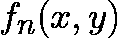

例如:假设我们有两个关于变量 *x* 和 *y* 的函数:

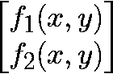

对于函数 f_{1}和 f_{2}，我们有两个可能的运动，一个在 x 方向，另一个在 y 方向。我们将运用我们的数学基础知识，任何方向的微小运动都可以用偏导数来表示。

所以对于给定的函数，可能的导数是:

在 x 方向:

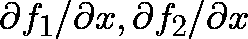

分别为 f_{1}和 f_{2}。同样，在 y 方向:

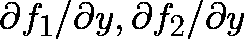

所以我们的偏导数矩阵是:

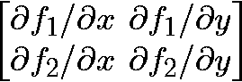

Tada！！简称为**雅可比矩阵**。这仅仅意味着它包含了函数的所有信息，每个变量都有一个小的变化。

> 如果所有其他的都失败了，不朽总是可以通过惊人的错误来保证。
> [**约翰·肯尼思·加尔布雷思**](https://www.brainyquote.com/authors/john-kenneth-galbraith-quotes)

# **ML 中 Jacobian 的不朽性**

先决条件:机器学习基础知识(向上帝学习 [Andrew NG](https://www.coursera.org/learn/machine-learning)

根据前面的知识，我们推断雅可比矩阵有助于跟踪所有函数和所有变量的所有可能的导数组合。问题是**如何在机器学习！！**

为了更好地理解，让我们举个例子:

假设我们有一个非常基本的架构:

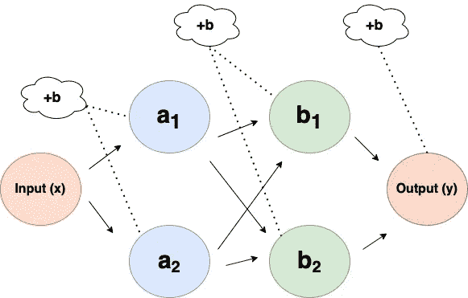

Basic Architecture

我们有一个输入 *x* 和输出 *y，a* 和 *b* 是以+b 为偏置的隐藏层。这背后的最终动机是发现输入的变化对输出的影响有多大。

1.  初始步骤:考虑 *a 的*的第 1 层。这一层完全依赖于变量输入 *x* ，变量输入将传递给两个函数 *a_1* 和 *a_2。*它的可以表示为:

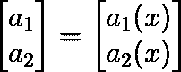

Layer 1

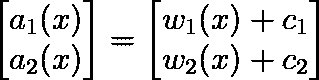

Layer 1: Weights

在上述雅可比格式中，项表示了 *x* 的变化如何影响层 *a* 的变化，并可改写为:

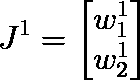

Jacobian for Layer 1

在这里，我们需要关注的是最终矩阵的形状，也就是 2 x 1。(对于单输入 *x* 我们有两个函数 *a_1* 和 *a_2* )。类似地，对于层 2，现在来自 *a_1* 的输出将去往 *b_1* 和 *b_2* ，来自 *a_2* 的输出将作为输入去往 *b_1* 和*b _ 2*:

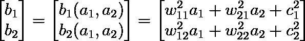

Layer 2

在上述雅可比格式中，项表示了 *a 的*的变化如何影响层 *b* 的变化，并且可以重写为:

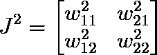

Jacobian Layer 2

正如我们可以观察到的，上面的雅可比矩阵的形状是 2×2。现在我们移动最后一层，也就是输出层。在这一层中，b 的输出作为输入到来，因此它可以表示为:

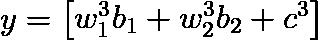

Output Layer

雅可比矩阵可以写成:

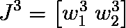

Final Layer

最终层的输出形状是 1 X 2。如果我们需要计算输出的变化，如果我们稍微改变输入，则等式为:

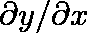

Aim

然后我们先找到了 x 中 a wrt 变化的变化.然后是 a 中 b wrt 变化的变化.最后是 y 中 wrt 变化的变化 b 中的变化，简单的把雅可比矩阵相乘就可以很容易的计算出来。

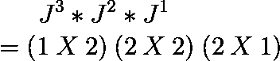

Shape of Jacobian

其通过矩阵乘法的公式给出最终形状为 1×1。

这是雅各宾派的基本介绍，可以进一步扩展。快乐学习！！

 [## Mlearning.ai 提交建议

### 如何成为 Mlearning.ai 上的作家

medium.com](/mlearning-ai/mlearning-ai-submission-suggestions-b51e2b130bfb)