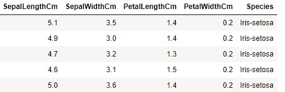
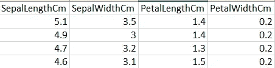
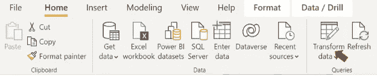
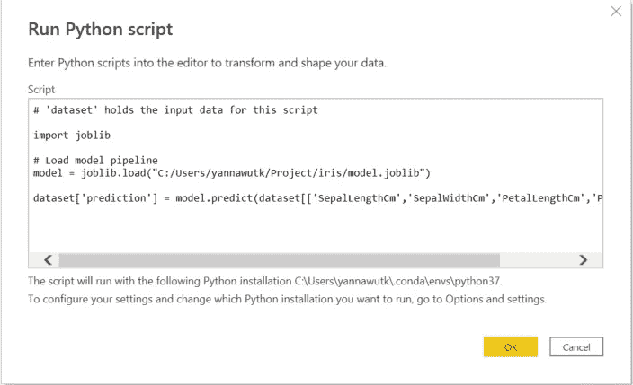
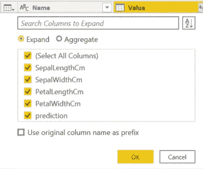
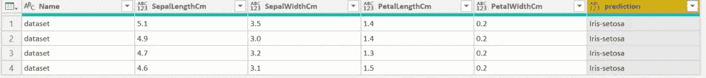
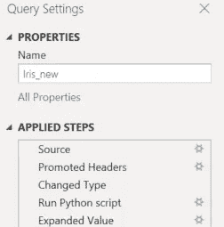
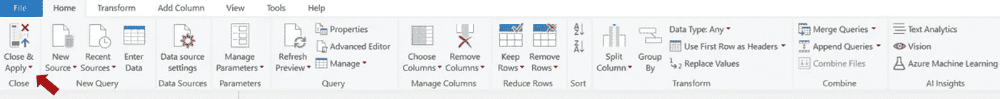

# 在 Power BI 仪表板中实现机器学习

> 原文：<https://medium.com/mlearning-ai/implement-machine-learning-in-a-power-bi-dashboard-28b4a225a5d4?source=collection_archive---------1----------------------->


Y 你已经用 Python 完成了机器学习模型训练。然后，您希望实现该模型，并在 Power BI 仪表板中使用模型预测。这篇文章将告诉你如何去做。

Azure 机器学习是在 Power BI 中集成机器学习的正式方式。但是，我将使用一种非正式的方法，通过使用 Python 来导入训练好的模型并进行预测。

# 要求

您必须在 Power BI 中完成 Python 的设置。

下面的文章将告诉你如何做。

[](/mlearning-ai/python-in-power-bi-66a80590ecc0) [## Python 在 Power BI 中的应用

### 通过集成 Python 增强 Power BI 仪表板的功能。一步一步地使用 Python 来获取、转换和…

medium.com](/mlearning-ai/python-in-power-bi-66a80590ecc0) 

在 Anaconda 环境中安装 joblib 库以加载模型文件。

```
pip install joblib
```

# 步骤摘要

1.  用 Python 训练模型
2.  在 Power BI 中加载数据
3.  在 Power BI 中实现该模型

# 1.用 Python 训练模型

这里不赘述机器学习的细节。这只是为了得到一个模型作为例子。

数据就是我们熟悉的虹膜数据集。你可以下载下面的数据集。

 [## 你的数据科学之家

### Kaggle 是世界上最大的数据科学社区，拥有强大的工具和资源来帮助您实现您的数据…

www.kaggle.com](https://www.kaggle.com/datasets/arshid/iris-flower-dataset/download) 

Iris sample data

```
import pandas as pd
from sklearn.model_selection import train_test_split
from sklearn.tree import DecisionTreeClassifier #for using Decision Tree Algoithm
import joblib# Load csv file
iris = pd.read_csv("Iris.csv")# Prepare training data
X = iris.drop('species',axis=1)
y = iris['species']
X_train, X_test, y_train, y_test = train_test_split(X,y, test_size = 0.2, random_state = 42)# Model training
model=DecisionTreeClassifier()
model.fit(X_train,y_train)# Save model
joblib.dump(model,"model.joblib")
```

在这段代码中，我加载数据，训练一个模型，并使用 joblib 库保存训练好的模型(您也可以使用 pickle 库保存模型)。

该模型将接收花的属性作为输入，并预测该花的鸢尾种类。

> 模型文件为“model.joblib”。稍后我将在 Power BI 中加载这个文件，用这个模型进行预测。

# 2.在 Power BI 中加载数据

加载您想要预测的数据以支持 BI。

确保这些列与列车数据相似。

我将假设我的新数据将在 csv 文件中。我将创建一个新文件“Iris_new.csv ”,它类似于我在步骤 1 的模型训练中使用的 IRIS.csv 文件，只是没有物种列(我想预测物种列)。



Iris_new.csv sample data

打开电源 BI。单击主页选项卡，选择获取数据，然后选择文本/CSV。

> 主页选项卡>获取数据>文本/CSV

然后，选择 Iris_new.csv 文件并加载数据。


# 3.在 Power BI 中实现该模型

让我们从 joblib 文件中加载模型，并创建一个新列来显示预测结果。

1.  单击转换数据



2.选择要转换的查询


3.在变换选项卡中，单击运行 Python 脚本


4.您将看到一个新的运行 Python 脚本窗口。在下面编写代码，然后单击“确定”。

```
# 'dataset' holds the input data for this scriptimport joblib# Load model pipeline
model = joblib.load("xxx/model.joblib")dataset['prediction'] = model.predict(dataset[['SepalLengthCm','SepalWidthCm','PetalLengthCm','PetalWidthCm']])
```



**代码解释**

*   使用 joblib 加载 model.joblib 文件。将参数更改为您的文件位置。
*   创建名为 prediction 的新 dataframe 列，并对数据集使用 model.predict 进行预测。

6.结果将是一个表格。单击以展开表格。确保未选中“使用原始列名作为前缀”。



7.您将看到一个新的预测列，这是预测的鸢尾物种和步骤被添加到应用步骤平原。



8.单击关闭并应用



现在，您可以使用预测结果来创建任何您想要的仪表板。

[](/mlearning-ai/mlearning-ai-submission-suggestions-b51e2b130bfb) [## Mlearning.ai 提交建议

### 如何成为 Mlearning.ai 上的作家

medium.com](/mlearning-ai/mlearning-ai-submission-suggestions-b51e2b130bfb)