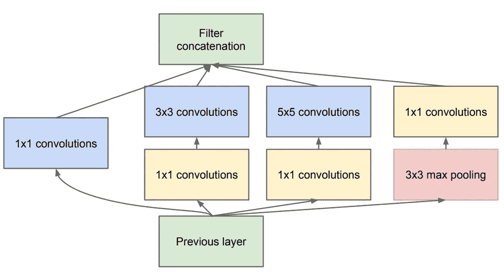
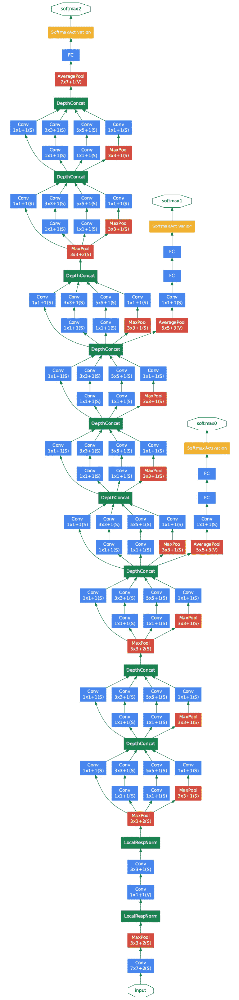

# 在 Keras 上实施 GoogLeNet

> 原文：<https://medium.com/mlearning-ai/implementation-of-googlenet-on-keras-d9873aeed83c?source=collection_archive---------0----------------------->

# 1.介绍

GoogLeNet 是由 [Szegedy 等人](https://www.cv-foundation.org/openaccess/content_cvpr_2015/html/Szegedy_Going_Deeper_With_2015_CVPR_paper.html) [1]提出的深度卷积神经网络。该网络赢得了 2014 年 ImageNet 大规模视觉识别挑战赛(ILSVRC-2014)，取得了 92.3%的分类性能。特别是，该模型是在一个特殊的体系结构中设计的，允许增加网络的深度和宽度，但保持计算资源。

VGG 模型总共有 22 层，由 9 个初始模块组成。每个先启块由四个并行路径组成，在这些路径上应用了不同内核大小的卷积层[图 1]:

*   第一条路径使用窗口大小为 1 × 1 的卷积层。
*   在第二和第三路径中，在应用两个昂贵的 3 × 3 和 5 × 5 卷积之前，使用大小为 1 × 1 的卷积层。1×1 卷积有助于减少滤波器通道的数量，从而降低模型复杂度。
*   第四条路径使用 max-pooling 层来降低输入的分辨率，其后是 1 × 1 卷积层来降低维度。

这四个路径使用适当的填充，以便输入和输出具有相同的大小。这四个路径的连接允许以不同的分辨率扫描输入。特别是，由于在每条路径中应用了 1 × 1 卷积层，模型复杂度被最小化。

Figure 1: Inception block. [Source](https://arxiv.org/abs/1409.4842)

以下是 GoogLeNet 的结构和所有的附加功能:

Figure 2: GoogLeNet architecture. [Source](https://arxiv.org/abs/1409.4842)

*   输入尺寸图像为 224 × 224。
*   在这个网络中有九个初始块。
*   在初始块之外有四个最大池层，其中两层位于块 3–4 和块 7–8 之间。这些最大池层有助于减少输入数据的大小，从而降低模型复杂性以及计算成本。
*   这个网络继承了 NiN 使用平均池层的思想，这有助于提高模型性能和减少过拟合。
*   在线性层之前使用了一个下降层(40%)。这也是减少过拟合现象的有效正则化方法。
*   输出层使用 softmax 激活函数给出 1000 个输出，这些输出对应于 ImageNet 数据集中的类别数。

此外，在侧面添加了一些额外的网络，这促进了分类器中较低阶段的区分，增加了得到反向传播的梯度信号，并提供了额外的正则化。这些网络的结构包括:

→一个平均池层，池大小为 5 × 5，跨度为 3。

→1×1 卷积层，具有 128 个用于降维的滤波器和一个整流线性激活。

→具有 1024 个单位和整流线性激活的全连接层。

→输出比率为 70%的辍学。

→使用 softmax 激活功能将对象分类为 1000 个类别之一的输出层。

Table 1: Summarization of GoogLeNet architecture. [Source](https://arxiv.org/pdf/1409.4842.pdf)

# 2.在 Keras 上实施 GoogLeNet

首先，我们需要导入一些必要的库:

创建一个先启块:

实现 GoogLeNet 模型的函数:

这个模型的总参数数是 10，532，397。请参考我的[代码](https://github.com/KhuyenLE-maths/Implementation-of-GoogLeNet-on-Keras/blob/main/Implementation_of_GoogLeNet_on_Keras.ipynb)了解该型号的详细信息。

虽然模型实现起来比较复杂，但是整个模型的参数个数并不大。密集层总是采用大部分参数。此外，全局平均池层的出现有助于显著减少参数数目，从而降低模型的计算复杂度。

**结论:**我们已经在 Keras 平台上发现了 GoogLeNet 模型的架构和实现。它由初始块组成。每个模块都有特殊的架构，通过四条并行路径同时提取输入特征。此外，在这些路径中最大限度地应用 1×1 卷积层来降低信道维数。此外，在一些启始块之间应用最大池层起到了降低分辨率的作用，从而降低了计算复杂度。总之，这个模型的参数数量比 Alexnet 模型小 6 倍，比 VGG 模型小得多。尤其是它胜过这些模型。GoogLeNet 的这种有趣的架构也是后来模型出现的灵感。

希望这篇帖子对你有帮助。

感谢阅读！

**Github 代码**:[https://Github . com/khu yenle-maths/Implementation-of-Google net-on-Keras/blob/main/Implementation _ of _ Google net _ on _ Keras . ipynb](https://github.com/KhuyenLE-maths/Implementation-of-GoogLeNet-on-Keras/blob/main/Implementation_of_GoogLeNet_on_Keras.ipynb)

____________________________________________________________

**参考文献:**

[1]塞格迪、克里斯蒂安等人，“用卷积深入研究”*IEEE 计算机视觉和模式识别会议论文集*。2015.