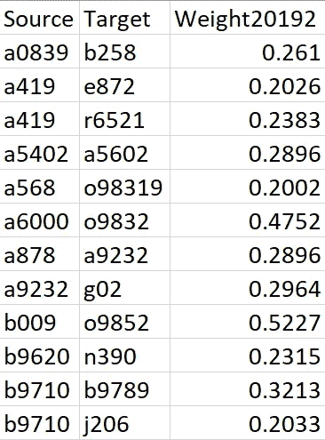
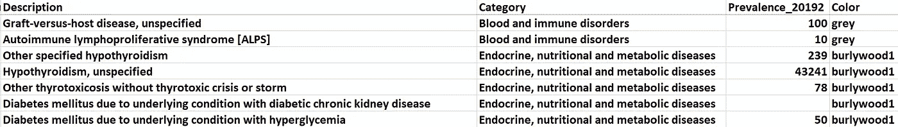
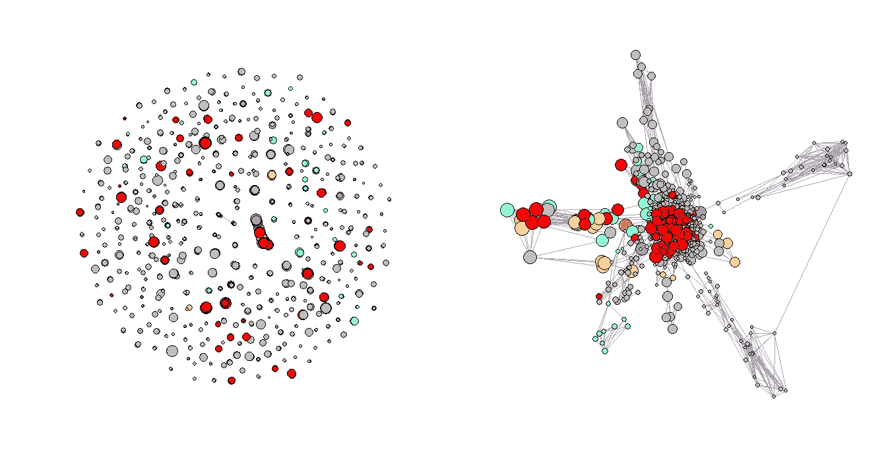
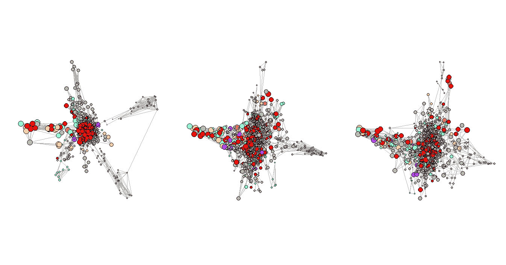

# 实现潜在网络模型并在 R 中可视化网络数据

> 原文：<https://medium.com/mlearning-ai/implementation-of-latent-network-models-visualize-network-data-in-r-b25c42f6d95a?source=collection_archive---------1----------------------->

## 实现一类统计模型的代码演示——LNMs，并用 R


Image by author

# 介绍

在《带 R 的网络数据的[统计分析》一书中，作者谈到了适用于网络数据的三类统计模型，分别是指数随机图模型(ERGMs)、网络块模型(NBMs)和潜在网络模型(LNMs)。在这篇博客中，我将演示如何在 R 中的网络数据上安装 LNMs，并使用名为“eigen model”(Hoff，2008)的库向您展示项目输出的潜在用途(可视化)。本博客中涵盖的方法、代码和发现源自我与堪萨斯大学 Srinivasan 教授合作的一个正在进行的研究项目中的一个实验项目，即 ***图形分析，用于分析美国医院就诊出院记录报告*** 中的异常模式。](https://link.springer.com/book/10.1007/978-1-4939-0983-4)

# 潜在网络模型

像在许多其他机器学习和统计建模领域一样，潜在变量的想法也已被研究并纳入潜在网络模型类的网络分析中(Kolaczyk 等人，2014)。lnm 旨在帮助人们使用在网络形成过程中起重要作用但未被观察到的变量来研究网络。要了解更多关于它的概念，请参考从第 102 页到第 108 页的书。

# 数据

本项目使用亚利桑那州卫生局公共卫生统计局(*[*AZDHS*](https://azdhs.gov/preparedness/public-health-statistics/hospital-discharge-data/index.php#data-release)*)*提供的亚利桑那州医院出院数据公共使用文件(PUF)作为部分数据源。这是我在[使用 NetworkX、Gephi 和 Node2Vec](/analytics-vidhya/analyzing-disease-co-occurrence-using-networkx-gephi-and-node2vec-53941da35a0f) 分析疾病共现时使用的类似数据集。我们还引入了 [ICD-10 数据](https://www.icd10data.com/LicenseICD10Data)作为参考表来丰富分析。*

原始输入是代表疾病共现的**加权边列表**(从电子健康记录生成)，以及包含每个诊断的患病率和类别的**节点属性数据集**。关于数据和边缘权重计算的详细描述，请参考[本文](https://papers.ssrn.com/sol3/papers.cfm?abstract_id=3877615)。

在这个项目中，我想比较三个连续时期(新冠肺炎之前、开始和高峰期)亚利桑那州医院系统的疾病网络，以监测随着时间的变化。而这三个时期分别是 2019 年下半年、2020 年上半年、2020 年下半年。

我们的数据集中有 21 种诊断。我们挑选了其中的五个(基于总患病率)进行观察，并手动为它们分配不同的颜色，未被选中的类别都被标记为‘灰色’。选定的类别及其配对颜色:(代谢疾病:burlywood1)，(精神和行为障碍:一枝黄花)，(循环系统疾病:蓝绿色)，(呼吸系统疾病:darkorchid1)，和(其他健康服务:红色)。



Figure 1: Sample data for Edgelist



Figure 2: Sample Data for Node Attributes

# 密码

## 步骤 1:读取数据并生成图表

```
#### Load Package #####
library(eigenmodel)
library(igraph)#### Load data ####
set.seed(42)
edge1 <- read.csv("edge1.csv")
icd101 <- read.csv("icd101.csv")#### Convert Graph ####
start.time <- Sys.time()
g1 <- graph_from_edgelist(as.matrix(edge1[,1:2]), directed = FALSE)
end.time <- Sys.time()
time.taken <- end.time - start.time
time.taken
```

## 步骤 2:添加必要的节点属性

这些属性将用于以后的绘图。

```
#### Add attributes ####
###### re-index the icd10 files
icd101<-icd101[match(V(g1)$name,icd101[,1]),]###### add prevalence
V(g1)$Prevalence<-icd101[,5]##### add color
V(g1)$Color<-icd101$Color
```

## 步骤 3:生成邻接矩阵

“特征模型”需要邻接矩阵作为输入。

```
A <- get.adjacency(g1, sparse = FALSE)
```

## 第四步:安装 LNMs

如需了解该型号的更多参数，请点击[查看](https://cran.r-project.org/web/packages/eigenmodel/eigenmodel.pdf)(第 4 页)。

```
model1.1 <- eigenmodel_mcmc(A, R = 2)
```

## 步骤 5:提取特征向量和其他属性

ULU_postmean 是降秩近似矩阵的后验均值，根据书中的教程，我们使用前两列数据作为绘图目的的布局。默认矩阵有 1000 个维度，我尝试了任何二维潜在空间的不同组合，结果没有一个组合能胜过彼此。

```
model1.1.lo <- eigen(model1.1$ULU_postmean)$vec[,1:2]
v.colors <- V(g1)$Color
v.size <- log(V(g1)$Prevalence)/1.3
```

## 第六步:比较原始图和有潜在变量的图

```
par(mfrow=c(1,2))
plot(simplify(simplify(g1)), vertex.color=v.colors,vertex.size = v.size, vertex.label=NA)
plot(g1, layout=model1.1.lo, vertex.color=v.colors,vertex.size = v.size, vertex.label=NA,margin=-.1)
```



Figure 3: Regular Plot vs. LNMs Plot

## 步骤 7:对其余两个周期重复步骤 1-5，并比较结果

图 3 显示了三个选定连续周期的网络图。很明显，第一张图有几个非常明显的集群。然而，随着 Convid-19 开始传播，一些集群已经消失，而在第二和第三时期形成了一些新的集群，这些图形不像第一个时期那样有组织，第一个时期代表正常时期或新冠肺炎之前的时期。对新星团形成的一种解释可能是，在那段时间里报告了更多不寻常的并发症。



Figure 4: Network Plots with Eigenvalues Over Time

# 适合度

书中提到的评价拟合优度的方法之一就是比较拟合模型的 L_postsamp 中元素的后验均值。如果其中一个特征值明显优于另一个(例如 1.04 和 0.26)，这意味着网络不能很好地用当前变量/结构来解释。另一方面，如果特征值在大小上是可比较的(例如，0.59 和 0.31)，这意味着模型拟合得很好，并且留给潜在变量捕捉的结构明显更少。

以我们的第一个模型和第三个模型为例:

```
> apply(model1.1$L_postsamp, 2, mean)
[1] 0.2227712 0.1773729> apply(model3.1$L_postsamp, 2, mean)
[1]  0.23991516 -0.01474853
```

我们可以从输出中看出，第一个模型的特征值非常接近，这对于第一个模型的拟合度来说是一个非常好的信号。然而，第三个模型(2020 年下半年的数据)的特征值不像第一个模型那样具有可比性。这种变化表明，随着新冠肺炎在亚利桑那州的加剧，有未观察到的变量对该州的整个医院系统产生影响，但原始数据集没有足够的信息供 LNMs 进行推断。

# 讨论

从潜在网络模型(lnm)的名称不难看出，模型的输出(潜在变量)很难用人类语言解释。自二十世纪五十年代(Lazarsfeld，1955)以来，潜变量的概念在统计学习领域得到了研究和发展，但在网络分析中的研究和应用较少。在这篇文章中，我在第 6.4 章“使用 R 进行网络数据的统计分析”的基础上，用 R 中的“特征模型”库演示了它的实现和一种潜在用途。这篇博客中的项目成果应该有助于您将其应用推广到类似的项目，也为您提供了研究该模型更多用途的第一步。

在我的实验中，我还发现“本征模型”也有一些局限性，我在这里对它们进行了总结。首先，由于它使用的是
马尔可夫链蒙特卡罗(MCMC)方法，采样过程将大大减慢拟合过程。第二，它很难处理大量的网络数据，有时甚至不会收敛。

# 结论

在这篇博客中，我谈到了 r 中潜在网络模型的基本概念、实现、一种潜在用途、拟合度和局限性。它可以帮助我们轻松地观察亚利桑那州医院系统的变化模式。实现这种方法有助于通过可视化向非技术人员传达有价值的见解。最后，但同样重要的是，这个项目的想法应该可以推广到其他社交网络项目。

***请随时与我联系***[***LinkedIn***](https://www.linkedin.com/in/jinhangjiang/)***。***

# 相关阅读

[使用网络分析比较新冠肺炎之前和期间亚利桑那州与怀孕和分娩相关的医院就诊情况](https://papers.ssrn.com/sol3/papers.cfm?abstract_id=3877615)

[使用 NetworkX、Gephi 和 Node2Vec 分析疾病共现](/analytics-vidhya/analyzing-disease-co-occurrence-using-networkx-gephi-and-node2vec-53941da35a0f)

[NetworkX:操纵子图的代码演示](https://towardsdatascience.com/networkx-code-demo-for-manipulating-subgraphs-e45320581d13)

[用 R |操纵网络数据进行网络分析](https://towardsdatascience.com/network-analysis-in-r-manipulating-network-data-ee388fba7215?source=user_profile---------2----------------------------)

[用 3D 360 度动画散点图可视化高维网络数据](https://towardsdatascience.com/visualize-high-dimensional-network-data-with-3d-360-degree-animated-scatter-plot-d583932d3693?source=user_profile---------0----------------------------)