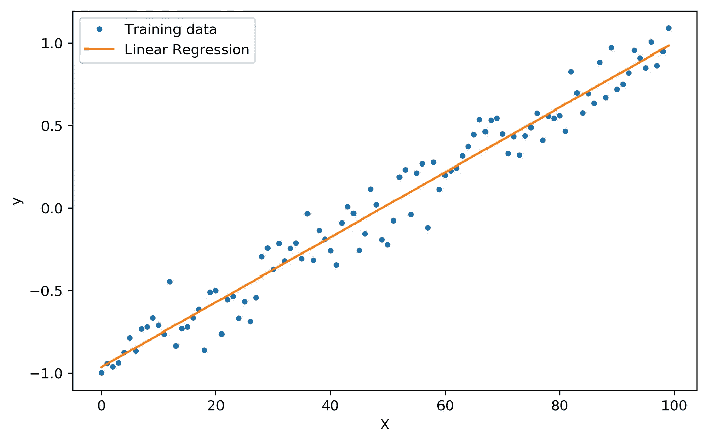
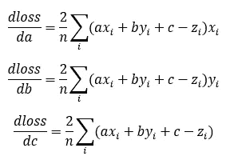

# 用 Python 从头开始实现线性回归模型

> 原文：<https://medium.com/mlearning-ai/implementing-a-linear-regression-model-from-scratch-with-python-3a0712c7bc3d?source=collection_archive---------2----------------------->

在本文中，我们将在不使用任何库的情况下，用 Python 实现一个非常简单但功能强大的机器学习模型。我们将尝试从一个人的身高和体重来预测他的身体质量指数([身体质量指数](https://en.wikipedia.org/wiki/Body_mass_index))。



# 介绍

我们将要建立的模型被称为线性回归，在我们的例子中，它实际上只不过是一个线性函数，将两个值 **x** 和 **y** 作为输入，并给出一个新值 **z** 作为输出。

> **f** (x，y)=a **x** +b **y** +c

其中 *a* 、 *b* 和 *c* 是我们的模型必须“学习”的函数的(可训练)参数。

这里的基本思想非常简单:我们的模型将以体重-身高对的形式给出一堆例子， **x** 和 **y** ，以及相应的输出 **z** ，算法将需要调整参数 a、b、c，以便在给出新的输入时做出最准确的预测。这个过程叫做*训练*。但是我们如何定义“准确”呢？我们如何调整这些参数？

# 失败

我们需要一种方法来量化我们的模型的准确性，也就是模型预测输出的好坏。一个非常简单但有效的方法是定义一个函数( *loss* )来计算真实输出 **z** 和我们的模型预测值之间的差异。

> 损耗= ∑(预测值-z) /n

这个特定的损失函数被称为*均方误差。*

# 培养

我们算法的目标基本上是最小化当真实值为 **z** 时通过预测值 **f(x，y)** 产生的误差，这意味着我们想要最小化损失函数。为此，我们将计算关于 a、b 和 c 的损失函数的*偏导数*，以便我们可以知道如何修改参数以减少损失。



例如，损失对 *a* 的偏导数告诉我们，当我们修改参数 *a* 时，损失如何变化。更准确地说，它给了我们损失函数最大上升的方向，所以我们可以反过来得到最大下降的方向。

# 密码

我想是时候进入代码了。

## 图书馆

仅有的两个库是 **pandas** 和 **numpy，**可以让我们在处理数据集和数组时更加轻松。

```
import pandas as pd
import numpy as np
```

## 资料组

数据集是用来训练我们的模型的数据集合。它通常以. csv 文件的形式给出，以列和行的形式组织，类似于电子表格。你可以在这里下载我在这个例子中使用的那个[。](https://www.kaggle.com/yersever/500-person-gender-height-weight-bodymassindex)

让我们来读一下数据集:

```
filename = "500_Person_Gender_Height_Weight_Index"
df = pd.read_csv(f"{filename}.csv", usecols=[1,2,3], header=0,          names=["height", "weight", "index"])
```

这里我指定了参数 *usecols* ，因为我只对读取第 1、2、3 列(分别是身高、体重和 bmi)感兴趣。

下一步是将数据集分成两部分，一部分用于训练，一部分用于测试我们的模型。

```
def split_train_test(df, p):
  n = int(p*len(df))
  train = df.iloc[0:n, :] 
  test = df.iloc[n:len(df), :]
  return train, testtrain_df, test_df = split_train_test(df, 0.5)
```

现在，我们从训练集中创建三个 numpy 数组，两个用于输入，一个用于输出。每个数组表示数据集的相应列。

```
x_train = np.array(train_df[“height”])
y_train = np.array(train_df[“weight”])
z_train = np.array(train_df[“index”])
```

我们对测试集做同样的事情:

```
x_test = np.array(test_df["height"])
y_test = np.array(test_df["weight"])
z_test = np.array(test_df["index"])
```

## 培养

训练基本上是寻找我们的函数(a，b，c)的参数的过程，以便它用以前看不见的输入做出准确的预测。

这里的想法是，我们迭代训练数据集很多次，每次我们改变“一点”参数，以便损失函数逐渐减少。(记住，损失函数量化了预测输出与实际输出的差异程度)。

```
*# set initial values for learnable parameters*
a = 1
b = 1
c = 0lr = 0.000005 *# learning rate*
epochs = 1000 *# number of iterations*n = len(z_train) *# number of inputs*for i in range(epochs):
  z_predicted = a*x_train + b*y_train + c *# make a prediction*
  error = z_predicted - z_train *# calculate the error*
  loss = np.sum(error**2)/n *# calculate the loss*
  *# partial derivatives*
  loss_a = 2*np.sum(error*x_train)/n 
  loss_b = 2*np.sum(error*y_train)/n
  loss_c = 2*np.sum(error)/n
  *# adjust the parameters*
  a = a - loss_a*lr 
  b = b - loss_b*lr
  c = c - loss_c*lr
  print(f"loss: {loss}  \t({i+1}/{epochs})")
```

## 测试

此时，我们的模型已经找到了最佳参数值，我们可以在测试集上测试它。为了做到这一点，我们从 *sklearn* 包中使用了一个名为 ***r2_score*** 的函数。R2 分数是一种衡量回归模型性能的指标，它返回一个介于 0 和 1 之间的值，1 表示完美，0 表示差。

```
from sklearn.metrics import r2_scorez_prediction = a*x_test + b*y_test + c *#compute predictions*
print(f"R2 Score: {r2_score(z_test, z_prediction)}")
```

我们的模型应该已经表现得很好了，R2 分数应该在 0.7 左右

## 结论

这篇文章想提出一种基本的方法，将机器学习的基本理论概念直接翻译成代码。

您可以在这里查看完整的代码:

[SFA bio 01/machine-learning-project:我正在尝试使用 Python(github.com)从头开始创建一个机器学习模型](https://github.com/sfabio01/machine-learning-project)

[](/mlearning-ai/mlearning-ai-submission-suggestions-b51e2b130bfb) [## Mlearning.ai 提交建议

### 如何成为 Mlearning.ai 上的作家

medium.com](/mlearning-ai/mlearning-ai-submission-suggestions-b51e2b130bfb)