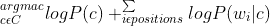
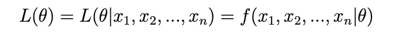
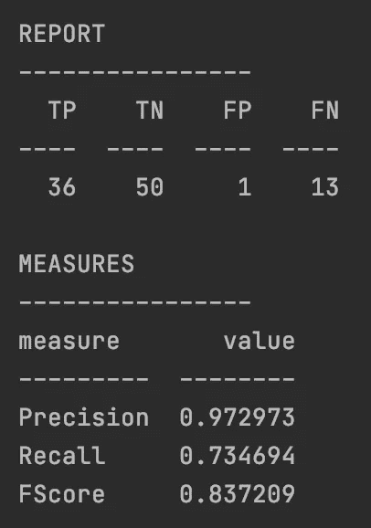

# 用 python 从头开始实现朴素贝叶斯分类器

> 原文：<https://medium.com/mlearning-ai/implementing-a-naive-bayes-classifier-from-scratch-in-python-51b6db9955ce?source=collection_archive---------4----------------------->

我在深入机器学习领域时经常遇到的一个话题是朴素贝叶斯；这个等式并不幼稚。

本文试图简化多项式朴素贝叶斯背后的数学。

本文的完整代码可以在[这里](https://github.com/cleopatra27/Naive-bayes-classifier)找到。

# 什么是朴素贝叶斯？

朴素贝叶斯是一种概率分类器，这意味着这种方法使用概率和/或频率来分类。

一个典型的例子(我们将测试)是垃圾邮件/垃圾邮件分类，分类器查看我们标记的垃圾邮件和垃圾邮件，并根据之前观察到的单词频率对它们进行分类。

在这个场景中，这个“幼稚”的分类器有点模仿我们人类；我如何知道一封电子邮件是垃圾邮件；来自之前的邮件！根据之前与该电子邮件的互动或知识，我知道来自我的人力资源的电子邮件是“hr@company.com ”,因此看到来自“hr1@company.com”的电子邮件可能会引起怀疑。

下面的等式表示朴素贝叶斯:



分解上面的等式，它表示找到先验的日志和我们的电子邮件的可能性的日志之和的 **argmax** 。

# 平滑。

现在，我们理解了朴素贝叶斯分类器是如何工作的；但是仔细观察，我们发现当我们看到这个例子时，分类器只能对新邮件起作用，但我们将来需要对电子邮件中的所有其他单词都这样做。

一种方法(我们将实现)是使用平滑，这种平滑背后的想法是为我们的电子邮件中的看不见的单词增加一个值。这是假设我们至少见过这个词一次。

## 在先的；在前的

这是在收集新数据之前事件发生的概率。我们之前的代码如下:

```
def cal_prior_prob(self):
    total_count = len(self.spam_emails) + len(self.ham_emails)
    return log(len(self.spam_emails) / total_count),    log(len(self.ham_emails) / total_count)
```

## **可能性**



顾名思义，这是电子邮件中的单词可能支持垃圾邮件或垃圾邮件的可能性。它测量数据为参数的每个可能值提供的支持。

如果我们比较两个参数点的似然函数，发现 L(θ1|x) > L(θ2|x)，那么我们实际观察到的样本在θ = θ1 时比θ = θ2 时更有可能出现。这可以解释为θ1 是比θ2 更合理的θ值。

要分解上面的公式:

```
spam_likelihood = word_frequency / (total_spam + vocabulary)
```

我们的**词汇表**将是我们电子邮件中唯一的总字数。

为了处理看不见的单词的用例，我们将添加一个 alpha 值来平滑，我们的等式变成:

```
(word_frequency + alpha) / (total_spam + alpha * vocabulary)
```

我们的可能性函数变成:

```
def find_dict_ham_likelihood(key):
    word_frequency = 0  # counter
    for word in spam_bag_words():
        word_frequency += 1
        total_spam = len(ham_word_list)
        ham_likelihood = (word_frequency + alpha) / (total_spam + alpha * vocabulary)
        dict_ham_likelihood[word.lower()] = ham_likelihood
    return dict_ham_likelihood[key]
```

## Argmax

这是一个从目标函数中寻找给出最大值的参数的操作。Argmax 在机器学习中最常用于查找预测概率最大的类。我们将使用 if 语句来实现这一点:

```
if ham_probabilty >= spam_probabilty:
    return "ham"
else:
    return "spam"
```

# 密码

让我们试着把上面的解释编写成代码。我们将把一组电子邮件分类为垃圾邮件；我们的训练集有 1000 封垃圾邮件和火腿邮件，平均分配。

我们将首先检索我们的数据，删除数字、重复项，并形成我们的**垃圾邮件和单词的火腿袋**(注意，我在本地有我的文件，您可以使用 nltk 语料库并进一步清理您的数据):

接下来，我们将计算我们的可能性:

我们计算我们的先验:

接下来，我们应用贝叶斯规则:

我们可以通过调用 Bayes 函数，用一封示例电子邮件来测试我们的代码，参见下面的示例:

```
print(bayes("Good day, awaiting your response on the budget"))
```

我们已经测试了我们的 Bayes 函数，到目前为止，它的效果和预期的一样。恭喜你，我们已经建立了一个贝叶斯朴素函数。下面的工作是你可以采取的额外步骤。

我有几封电子邮件(垃圾邮件和火腿)，想真正看看我们的功能是好是坏，我们将针对我们的服务运行 99 个新的测试电子邮件，并将计算数量:**真阳性(TP)，真阴性(TN)，假阳性(FP)假阴性(FN)**；以及以下度量:**精度、召回率、F 值**

我们的代码上面还打印了一个真值表，见下图:

