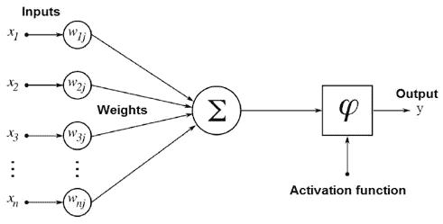
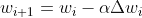

# 从头开始实现神经网络

> 原文：<https://medium.com/mlearning-ai/implementing-neural-networks-from-scratch-23d2d9b25e1d?source=collection_archive---------4----------------------->

# 人工神经网络

## 介绍

ANN 是神经网络最基本的结构。基本的人工神经网络结构被称为感知器。感知器是一个简单的带有激活函数的线性回归。线性回归用于寻找输入和输出之间的线性关系。但是大多数真实数据本质上是非线性的，所以为了使回归通用，我们使用带有激活的感知器。激活功能增加了输出的非线性，使其对非线性输入更加灵活。



Perceptron acts as a linear regressor with an activation function

## 激活功能

在我们神经上的刺激越过特定阈值之前，神经元不会激活，也不会向我们的大脑发送任何信号。类似地，只有当层的输出超过阈值时，神经元才被激活。激活函数用于激活一个神经元或一组神经元的输出。不同的激活函数激活神经元的方式不同。要获得更多关于激活功能的信息，请查看这篇[帖子](https://missinglink.ai/guides/neural-network-concepts/7-types-neural-network-activation-functions-right/)。


抱歉，如果这个理论很无聊。现在让我们快速进入实施阶段！！！！


**导入我们的库**

```
from sklearn.datasets import fetch_openml #Downloading the MNIST dataset
from keras.utils.np_utils import to_categorical #One hot encoding of labels 
import numpy as np #For linear algebra
from sklearn.model_selection import train_test_split #Spliting the dataset  
import time #For keeping track of time
```

首先，让我们快速地将数据标准化并分成测试和训练

```
x, y = fetch_openml('mnist_784', version=1, return_X_y=True) # Fetching the flattened mnist data 28x28 to 768 
x = (x/255).astype('float32')# Normalising the values
y = to_categorical(y) # One hot encoding
# Train and validation split 
x_train, x_val, y_train, y_val = train_test_split(x, y, test_size=0.15, random_state=42)
```

我们将编写一个通用的代码来创建 N 个隐藏层(因为大多数实现被限制在一定数量的隐藏层)。这可能看起来有点复杂，但不要担心，我们可以很容易地实现它。为了让我们的代码更流畅，我们需要使用一个类。这个类的名字是 Ann，它将执行这些操作

*   初始化
*   正向传播
*   反向传播
*   更新权重
*   计算验证准确度

**创建我们的 ANN 类**

```
#Creating the Ann class
class Ann():
  '''
  Input->
  sizes: list/array
  epoches: Int
  learning rate: float
  '''
  # Constructor with default epochs and learning rate
  def __init__(self,sizes,epochs=10,lr=0.001):
    self.sizes = sizes
    self.epochs = epochs
    self.lr = lr self.params = self.initialization()# initializing the parameters
```

Ann 类将把`size`、`epoch`和`lr`作为 3 个变量。size 变量将是一个包含隐藏层大小的列表或数组。`epoch`和`lr`分别代表历元数和学习率。

现在我们将初始化网络的权重。我们要把我们所有的重量保存在字典里。其中键是权重矩阵的名称，值是一个数组。

```
# Method for initializing the weight matrices
  def initialization(self):
    params = {} # Dictionary for  storing the parameters 
    for i in range(len(self.sizes)-1):
      wstr = "W"+str(i+1) # Giving names to each weight matrices as W1,W2,W3
      params[wstr]=np.random.randn(self.sizes[i+1],self.sizes[i])*np.sqrt(1./self.sizes[i+1]) #initializing the weights
    return params
```

在我们写正向传播函数之前，让我们定义我们的激活函数。我们将定义带导数和不带导数的 sigmoid。带导数的 Sigmoid 将用于我们的反向传播函数。

```
def sigmoid(self, x, derivative=False):
    if derivative:
        return (np.exp(-x))/((np.exp(-x)+1)**2)
    return 1/(1 + np.exp(-x))def softmax(self, x):
    # Numerically stable with large exponentials
    exps = np.exp(x - x.max())
    return exps / np.sum(exps, axis=0)
```

我们正在调整 softmax 的稳定性。要了解更多关于 softmax 函数 checkout 的稳定性[这个](https://eli.thegreenplace.net/2016/the-softmax-function-and-its-derivative/)

## 正向传播

我们将创建一个名为`forward_pass()`的函数来执行 FP。这是一个简单的函数，它使用所有的权重，并将它们与前一层给出的输入相乘。

```
# Forward propogation(FP)
  def forward_pass(self,x_train):
    '''
    Function which will take the input and will perform FP 
    '''
    params = self.params # Accessing the initial parameters 
    n_weights = len(params)-1 #number of loops for forward pass 
    params["A0"] = x_train.T #Input layer
    for i in range(n_weights):
      wstr="W"+str(i+1) # Weights string- W1,W2... so on
      zstr="Z"+str(i+1) # output of each layer before activation- Z1,Z2,Z3..... and so on
      astr="A"+str(i+1) # layers output after activation - A1,A2,A3
      params[zstr] = np.dot(params[wstr],params["A"+str(i)]) #dot product of weights and layers
      params[astr] = self.sigmoid(params[zstr]) # Applyng the activation function
        # Last layer with softmax activation
    params["Z"+str(i+2)] = np.dot(params["W"+str(i+2)],params["A"+str(i+1)]) 
    params["A"+str(i+2)]= self.softmax(params["Z"+str(i+2)]) return params["A"+str(i+2)]
```

## 反向传播

`backward_pass`将执行反向传播，并将发现权重的变化。我们正在分别寻找最后一层的导数，因为最后一层使用了 softmax 激活函数。其余层使用 sigmoid 激活函数。

```
# Backward propogation(BP)
  def backward_pass(self,y_train,output):
    ''' 
    Function for BP which will be used for updating the parameters. 
    It will update the last weight matrix first and so on.
    '''
    assert output.shape==y_train.shape, f"Output shape doesnt match: output shape{output.shape} and y_train{y_train.shape}"
    output=output
    params = self.params
    change_w = {} #Dictionary for storing the change in weights
    n = len(self.sizes)-1
    # computing update for Wn i.e the last weight matrix
    error = 2 * (output - y_train) / output.shape[0] * self.softmax(params['Z'+str(n)])
    change_w['W'+str(n)] = np.outer(error, params['A'+str(n-1)])
    # Loop for updating the remaining weights
    for i in range(n):
      error = np.dot(params['W'+str(n-i)].T, error) * self.sigmoid(params['Z'+str(n-1-i)], derivative=True)
      change_w['W'+str(n-1-i)] = np.outer(error, params['A'+str(n-2-    i)])
    return change_w
```

## 更新参数

在这一步中，我们将使用 BP 提供的导数值来更新我们的权重。我们将使用随机梯度下降(SGD)方法更新权重。用于更新权重的表达式。



*w* 是权重矩阵，α是学习率。

```
#updating the parameters
  def parameter_update(self,change_w):
    '''
    function for updating parameters using stocastich gradient descent
    takes the change_w dictionary created by BP and returns the updated parameters
    '''
    for key, value in change_w.items():# accessing the change in weights 
        for w_arr in self.params[key]:
            w_arr -= self.l_rate * value #updating the weights using SGD
```

计算训练准确度

跟踪验证准确性的功能。我们还可以计算训练精度，但是验证精度是我们用来判断模型性能的。

```
# Function for computing the accuracy on validation set
  def compute_accuracy(x_val,y_val):
    '''
      Function for computing the validation accuracy
    '''
    predictions=[]
    for x,y in zip(x_val,y_val):
      predict = self.forard_pass(xval) #prediction using the ANN
      predictions.append(y_val==predict) #comparing the prediction with the real value
    return np.mean(predictions)
```

## 训练模型

最后也是最重要的一步

```
# the traning function
  def train(self,x_train,y_train,x_val,y_val):
    '''
    Function for training the network using all the methods created above
    does the FP
    does the BP
    updates the parameters
    checks for the accuracy
    '''
    start_time = time.time() #for computing the amount of time taken to do the whole task
    for iterations in range(self.epochs): #Runnig loop for number of epochs
      for x,y in zip(x_train,y_train): 
        out = self.forward_pass(x_train) # FP
        change_w = self.backward_pass(y_train,out) #BP
        self.parameter_update(change_w) #updation of weights accuracy = self.compute_accuracy # Computing the accuracy
    print(f"Epochs: {iteration+1} , validation Accuracy: {accuracy} , duration: {time.time() - start.time()}")
```

`train`功能将使用`forward_pass`、`backward_pass`和`parameter_update`功能训练模型。FP 将给出模型的输出。基于实际产量和预测产量之间的差异，BP 将计算权重的变化。使用 BP 提供的导数值来更新权重。

就是这样。现在把所有东西放在一起然后跑。

```
# Creating a class instance
NN=Ann(sizes=[784, 8, 8, 10],epochs=1)
# Training the model
NN.train(xtrain,ytrain,xval,yval)
```


# 可能的问题和修复

从头开始创建人工神经网络的目的是了解整体结构是如何工作的。尤其是 FP 和 BP 的直觉。并且真正体会到现有的软件包是多么有用。所以，这不是实现神经网络的最佳方式。根据隐藏层的数量和长度，可能会有一些内存问题。最好的方法是开始使用较少的隐藏层。

有很多功能在同时工作。对于调试，尝试单独运行这些函数，然后将它们放回到主类中。别指望这整件事会像魔法一样管用。如果你发现任何问题，请联系我，也想提出一些改进意见，随时准备改变。

# 感谢阅读！！！❤

# 参考

[https://mlfromscratch.com/neural-network-tutorial/#/](https://mlfromscratch.com/neural-network-tutorial/#/)

[https://Eli . the green place . net/2016/the-soft max-function-and-derivative/](https://eli.thegreenplace.net/2016/the-softmax-function-and-its-derivative/)

[https://brilliant . org/wiki/back propagation/#:~:text = back propagation % 2C % 20 short % 20 for % 20% 22 backward % 20 propagation，to % 20% 20 eural % 20 network % 20 weights](https://brilliant.org/wiki/backpropagation/#:~:text=Backpropagation%2C%20short%20for%20%22backward%20propagation,to%20the%20neural%20network's%20weights)。