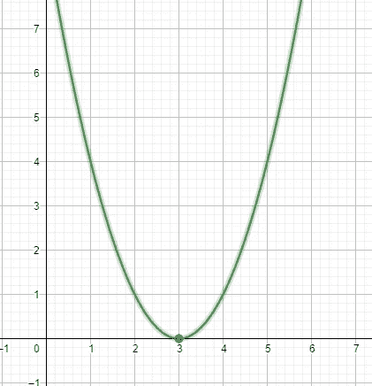
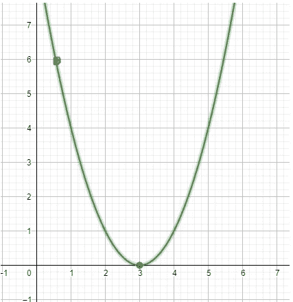
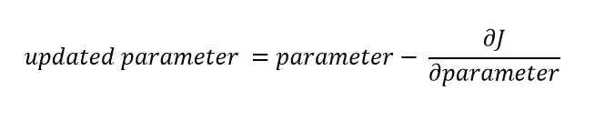
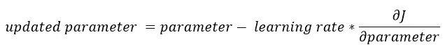

# 用 Python 从头实现神经网络:理解梯度下降

> 原文：<https://medium.com/mlearning-ai/implementing-neural-networks-from-scratch-in-python-understanding-gradient-descent-9bfe59ca54bc?source=collection_archive---------2----------------------->

在训练机器学习模型时，目标是最小化模型的[成本](/mlearning-ai/implementing-neural-networks-from-scratch-in-python-what-is-cost-c5e1e6d349db)，为此，使用优化算法。

目前使用了几种不同的优化算法，其中一种叫做“梯度下降”。

在这篇文章中，我们将学习梯度下降是如何工作的，这也将使我们获得一个关于优化算法的直觉。

到现在为止，我希望你能理解什么是“成本”。如果没有，请务必先阅读[这篇](/mlearning-ai/implementing-neural-networks-from-scratch-in-python-what-is-cost-c5e1e6d349db)文章。

现在我们知道，成本函数需要有一个全局最小值，即模型成本最低的参数点或值，这是被训练的模型试图达到的点。但是我们如何定位这些参数的值呢？

想象你站在山顶上，你想下山。现在想象你自己在四处寻找落脚的地方，一步一个脚印，你最终会到达山脚。

我们知道，当成本函数相对于其参数(权重和偏差)绘制时，它看起来像这样:

Cost Function plot

假设我们有一些权重和偏差的特定值(水平轴上的权重和垂直轴上的偏差)，它们位于成本函数图中的红色标记处，如下所示。

然后，优化算法将告诉我们，权重和偏差的值应该如何改变，以及改变多少，以使红点向全局最小值(山脚)迈出一步。这到底是怎么发生的？让我们深入研究一下梯度下降算法。

如前所述，梯度下降算法的目标是定位全局最小值，并采取步骤(更新参数值)以达到全局最小值(山脚)。这项任务分两部分执行。

1.  计算图中初始点的斜率(红色标记)。
2.  更新参数。

计算斜率，告诉梯度下降算法采取步骤的方向(增加或减少参数值)。如果你对基础微积分有所了解，你会知道一个图形在某一点的斜率等于在该点绘制的函数导数(如果你不知道，现在你知道了)。斜率要么是正的，要么是负的。

根据斜率的值，将执行算法的下一部分。例如，如果在水平轴上绘制权重(如果我们从左到右移动，值增加)并且在垂直轴上绘制偏差(如果我们从下到上移动，值增加)，那么在红色标记处关于权重的斜率(导数)将是负的，在这种情况下，梯度下降算法将增加权重的值，迫使红色标记向全局最小值移动。但是算法怎么知道什么时候加，什么时候减呢？为了解决这个问题，让我们来看看梯度下降的公式。

Formula for gradient descent

根据公式，如果斜率是负的，那么一些值将被加到参数的初始值上，如果是正的，那么一些值将被减去，这正是我们想要的。

公式中还有一个变量是学习率，

学习率的值影响参数值更新的幅度。高学习率将使我们能够更快地达到全局最小值，但是将存在跳过全局最小值的风险，而低学习率将使得更有可能达到成本函数的全局最小值，但是将花费更长的时间。

如果你觉得这篇文章很有价值，考虑把我加入你的邮件列表，这样你就不会错过任何一篇文章。在 [LinkedIn](https://www.linkedin.com/in/zain-ehtesham-24086b19b/) 上与我联系，并在 [github](https://github.com/MuhammadZainEhtesham) 上查看我关于机器学习的项目。

 [## Mlearning.ai 提交建议

### 如何成为 Mlearning.ai 上的作家

medium.com](/mlearning-ai/mlearning-ai-submission-suggestions-b51e2b130bfb)