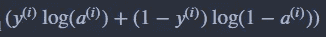
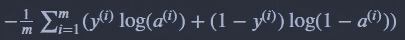

# 用 Python 从零开始实现神经网络:代价是什么？

> 原文：<https://medium.com/mlearning-ai/implementing-neural-networks-from-scratch-in-python-what-is-cost-c5e1e6d349db?source=collection_archive---------4----------------------->

神经网络或机器学习模型使用称为训练数据的数据集来训练自己，该数据集包含几个训练示例。每个训练示例都由要素和标签组成。模型自我训练的方式是，对于每个训练示例，它预测一个值(或标签)，然后将其与该训练示例的真实标签进行比较。在此过程中，模型会计算一个数值，该数值会量化训练示例的预测标签和实际标签之间的误差。这个误差值对于每个训练示例是不同的，并且被称为“损失”。

如果我们要在整个训练数据集上计算这个损失的平均值，那么这个平均值将被称为“成本”。记住，成本越低，模型越好。

可能有几个数学表达式可以计算该误差，但是成本函数(计算模型成本的数学表达式)的最重要的属性是它具有全局最小值。

为了理解什么是全局最小值，请看下图，


Global minima of a mathematical function

该图显示了水平轴(+3)上函数值最小的点，该点被称为所绘制的数学函数的全局最小值。

因为我们需要最小化成本函数，所以它必须由一个全局最小值(或极小值)组成，其中成本的值是最小的。全局最小值是通过优化算法找到的，比如梯度下降，但是这些算法超出了本文的范围。

不同类型的成本函数满足前述标准，并且它们的使用取决于被训练的深度学习模型的类型。这里我们将实现二元分类中使用的代价函数(因为这是大多数初学者的起点)。

对于二元分类，每个训练示例的损失可以计算为:



Loss for ith training example

其中“y”和“a”是第 I 个训练示例的真实和预测标签。

可以通过对整个训练数据集的损失进行平均来计算成本:



cost for the entire training set

其中“m”是训练集中的样本数。

在 python 的矢量化形式中，上述数学表达式可以轻松实现如下:

```
import numpy as npdef cost(A,Y):
    cost = -1/m * np.sum(Y*np.log(A) + (1-Y)*np.log(1-A))
    return cost
```

这里‘Y’是整个训练集的标签向量，而‘A’是包含与‘Y’维数相同的预测标签的向量。

矢量化实现使我们能够在平均整个训练集的损失的同时，摆脱我们本来会使用的 for 循环。

如果这篇文章对你有帮助，可以考虑关注我更多的内容( [Linkedin](http://www.linkedin.com/in/zain-ehtesham-24086b19b) ， [Github](https://github.com/MuhammadZainEhtesham)

[](/mlearning-ai/mlearning-ai-submission-suggestions-b51e2b130bfb) [## Mlearning.ai 提交建议

### 如何成为 Mlearning.ai 上的作家

medium.com](/mlearning-ai/mlearning-ai-submission-suggestions-b51e2b130bfb)