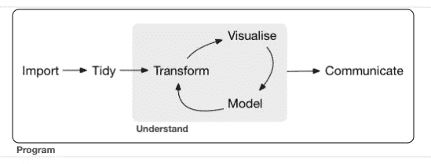

# 在 R-Part 1/2 中导入数据文件

> 原文：<https://medium.com/mlearning-ai/import-data-files-in-r-part-1-2-afa15c087b1a?source=collection_archive---------6----------------------->

## 在 R 中导入文本、CSV、TSV、JSON 和 XML 文件

Photo by [Christina Rumpf](https://unsplash.com/@rumpf?utm_source=medium&utm_medium=referral) on [Unsplash](https://unsplash.com?utm_source=medium&utm_medium=referral)

从不同的文件格式导入数据是构建机器学习模型或数据可视化的第一步。导入数据集后，我们整理和清理数据，然后整理和转换数据，以便我们可以从模型中获得最佳结果，并正确传达数据可视化的信息。

**R for Data Science by** [Hadley Wickham](https://hadley.nz/)

在本文中，我们将把数据集从不同类型的文件格式(比如 TXT、CSV、TSV、JSON 和 XML)导入到 R 编程语言的数据框架中

# 导入文本文件

*   `read.table(file, header = FALSE, sep = '', stringAsFactor = FALSE, ...)`用于读取文本文件
*   在 r-studio 控制台上键入`?read.table`查看`read.table()`功能的完整文档

## 将第一行作为数据框的标题

*   使用参数`header = TRUE`

**将所有列从字符数据类型转换为因子数据类型**

*   使用`read.table(..., stringAsFactor = TRUE, ...)`中的参数`stringAsFactor = FALSE`将所有列从因子数据类型转换为字符数据类型。
*   使用`str(df)`检查数据框列的数据类型

**将所有列从因子数据类型转换为字符数据类型**

*   使用`read.table(..., stringAsFactor = FALSE, ...)`中的参数`stringAsFactor = FALSE`将所有列从因子数据类型转换为字符数据类型。
*   使用`str(df)`检查数据框列的数据类型

## 跳过行

*   使用`read.table(..., skip= n, ...)`中的参数`skip = n`排除前`n`行数据

## 读取斜线分隔的文件

*   使用`read.table(..., sep = ‘/ ’, ...)`函数中的参数`sep = ‘/’`读取斜线分隔的文件

## 不带`sep=’/’`属性

**具有** `**sep=’/’**` **和** `**header = TRUE**` **属性**

**读取某些数据行**

*   `header = FALSE`表示数据集没有表头
*   `col.names = c(“roll_number”, “name”, “major”, “cgpa”)`用于命名列
*   从顶部删除两行
*   从顶部跳过 2 行后，读取 3 行

# 导入 CSV 文件

*   `read.csv(file, ...)`用于读取 CSV 文件
*   `str(df)`用于返回 R 的数据帧的数据结构

R

*   `colClasses = c(“integer”, “character”, “factor”, “numeric”)`用于定义数据框中各列的具体数据类型

*   `colClasses = c(“NULL”, “character”, “factor”, “NULL”)`用于跳过`NULL`列

## 读取带有由(`X, none, empty`等)表示的缺失值的数据集

*   通过使用`na.strings = c(“X”, “none”, “empty”)`参数，用`NA`替换缺失值。

# 导入 TSV 文件

*   `read.delim(file,…)`用于读取 TSV 文件
*   `which.max(data_frame$column)`返回 data_frame 的最大列值的索引
*   `which.min(data_frame$column)`返回 data_frame 的最小列值的索引

# 导入 JSON 文件

*   `fromJSON(file = ...)`用于从指定的 URL 读取 JSON 文件
*   `do.call(rbind, df)`以表格形式排列数据
*   `as.data.frame()`功能用于将表格结构转换成数据框架

# 导入 XML 文件

*   `getURL()`用于从`RCurl`获取在线 XML 文件
*   `xmlToDataFrame()`用于将`XML` 格式转换为数据帧格式

# 结论

在本文中，我们将数据从不同类型的文件格式(如文本、CSV、TSV、JSON 和 XML)导入到 R 编程语言的数据框架中。

 [## Mlearning.ai 提交建议

### 如何成为 Mlearning.ai 上的作家

medium.com](/mlearning-ai/mlearning-ai-submission-suggestions-b51e2b130bfb)