# 结构化查询语言(SQL)在您的数据科学职业路线图中的重要性

> 原文：<https://medium.com/mlearning-ai/importance-of-structured-query-language-sql-in-your-data-science-career-roadmap-6e7fd7bf1769?source=collection_archive---------4----------------------->

## SQL 基础知识、实践练习、真实行业用例场景、数据分析和 SQL 与 Python 示例

亲爱的朋友们:

这一次，我想写一些东西，通过分享我自己的经验，对数据科学社区的读者真正有所帮助，这些经验在我的脑海中拖了很长时间，只是由于我的日程安排而暂时搁置。最后，我设法以某种体面的方式将事情整合在一起，以便读者能够理解🙂通过这篇博客，我想借此机会与你分享我的行业工作经验，这可以帮助任何初露头角的有志之士获得现实世界问题的全景&商业场景。首先，我将带您了解一些**结构化查询语言(SQL)** 的基础知识，然后是一些有趣的**练习题**，讨论来自电信和零售商店领域的不同**用例**。我们还将看到如何使用 Python 运行 SQL 查询。最后，我们将以一个**开放式问题示例**结束本教程，供读者思考。这篇博文的所有代码都可以在[这里](https://github.com/ajayarunachalam/SQL_TUTORIAL)找到。此外，一定要看看我的其他博客/贡献，来自我的 [Github Repo](https://github.com/ajayarunachalam)

**请注意** :- *出于完整性、数据隐私&和数据安全的原因，这里分享的内容在很大程度上被掩盖了&我的作品组合中的大部分修改版本，但结构在实践中非常类似，可以被读者直接理解&，如本教程所示。*

# 重温 SQL

当我开始我的旅程时，像任何有抱负的数据科学家一样，我的日常任务隐含地涉及从不同的数据源提取原始数据。让我们非常清楚地了解一件事，在我们谈论人工智能或实际上任何机器学习东西之前，数据提取、预处理和数据分析在整个数据科学工作流程中起着非常重要的作用。事实上，它消耗了整个管道中的大部分时间。探索性数据分析(EDA)是工作流的初始和重要阶段。它有助于初步了解数据，并有助于生成相关假设和进一步决定下一步措施。然而，EDA 过程在大多数时候可能是一个麻烦。从异构/同构数据源获取/准备数据是管道中的第一件关键事情。我们将从回顾大多数基本 SQL 命令开始，例如，从两个表中选择数据，连接两个表，等等。下面提供的备忘单详细说明了这些内容。

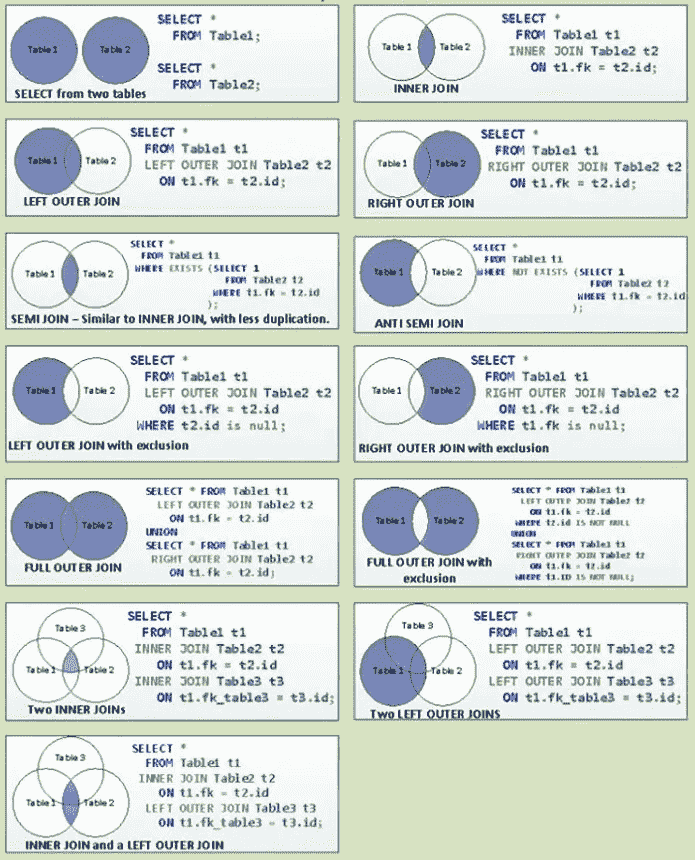

Concept by Steve Stedman; Copyright & Adapted from [https://stevestedman.com/](https://stevestedman.com/)

# SQL 脑筋急转弯示例

在本节中，我们将看到一些示例，这些示例将是理解如何使用 SQL 来提取洞察力的良好起点。

假设，我们有下面的**模式，有两个表**:分别以‘ad _ id’&‘event _ id’为关键字的‘Ads’和‘Events’。

*   **广告**(广告标识，活动标识，*状态*:活动或不活动)
*   **事件** (event_id，ad_id，source， *event_type* :印象，点击，转化，日期，小时)

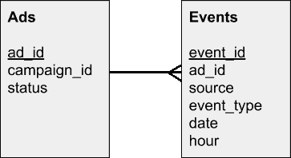

Image by author: Tables with their fields

编写 SQL 查询以提取以下信息:-

1)活跃广告的数量。

2)所有正在进行的活动。注意:-如果至少有**个** **活动广告**，则活动处于活动状态。

3)有效活动的数量。

4)每个广告的事件数量—按事件类型细分。

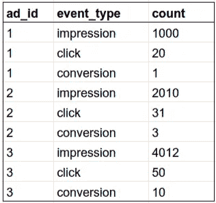

Image by Author: Example Query Output

5)每个活动广告在过去一周的事件数量—按事件类型和日期细分(最近的在前)。

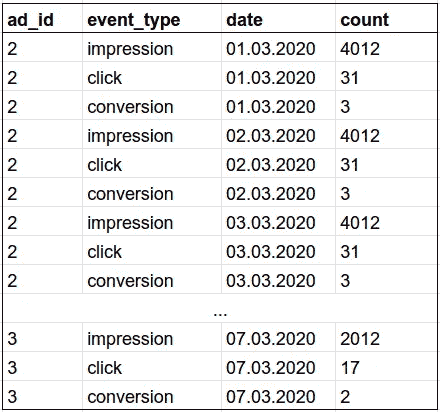

Image by Author: Example Query Output

6)每个活动的活动数量—按活动类型。

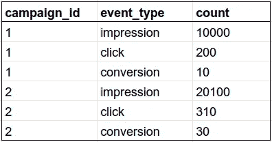

Image by Author: Example Query Output

7)上周每个活动和事件类型的事件数量—按日期细分(最近的在前)。

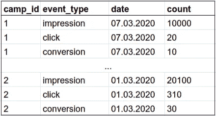

Image by Author: Example Query Result

8)每个“广告”的点击率。注意:- CTR =点击次数/展示次数。

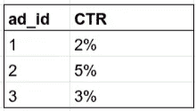

Image by Author: Example Query Result

9)每个“广告”的 CVR(转换率)。注:- CVR =转换次数/点击次数。

Image by Author: Example Query Output

10)按日和小时细分的每个“广告”的 CTR 和 CVR(最近的在前)。

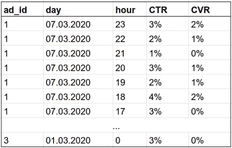

Image by Author: Example Query Output

# 行业用例—电信数据

这里，让我们从电信部门的角度来考虑**大数据。不同的数据集包括关于“**CDR-呼叫每日记录**”、“**用户简档**”、“**使用历史**”、“**计费详细信息**”、“**网络日志**”、“**小区站点信息**”、“**价格计划详细信息**、“**服务订单**”等的信息。比方说，给定表&的模式，您必须分析数据以提取以下信息，如以下场景所述。注意:-所有实际的架构名称都被屏蔽为“xxxx”。对于预付费/后付费客户，只需将标签“PREP”替换为“POST ”,其余结构保持不变。**

***用例-1:-*** 获取电信**预付费**或**后付费**移动用户的**浏览历史**。在 2021 年 6 月
**至 12 月**期间，将他们分成不同的**类别**。

[https://gist.github.com/ajayarunachalam/d37d7595ea4751b6bb4a95f7126210c0](https://gist.github.com/ajayarunachalam/d37d7595ea4751b6bb4a95f7126210c0)

***用例-2:-*** 从**预付费**或**后付费**移动用户的**计费历史**中获取其**每用户平均收入(ARPU)** 。我们将 **ARPU** 计算为**cur _ RC _ AMT+discount _ AMT+cur _ UC _ AMT+cur _ oc _ AMT**之和。平均 ARPU 计算为活跃用户总数的 ARPU。

***使用案例-3:-*** 获取 2021 年 3 月至 6 月期间，通过呼叫竞争对手的呼叫中心获得其宽带热线号码的客户信息。此外，获取 2021 年 3 月至 6 月期间通过访问宽带竞争对手的网站访问其信息的客户的信息。

***用例-4:-*** 计算 avg。**体验质量(QOE)**2021 年 3 月宽带用户评估。

***用例-5:-*** 获得所有**活跃移动用户**(预付费/后付费)直到 2021 年 6 月。

***用例-6:-*** 获取**客户投诉报告**，其中包含分类为客户投诉原因的详细信息。比方说，让我们得到 2020 年 12 月至 2021 年 6 月期间的报告。也就是说对于任何特定的查询月份。

***用例-7:-*** 获取 2021 年 6 月份被搅动客户(预付费/后付费)的**通话质量信息**。

***用例-8:-*** 获取客户的**使用历史**，以及 2021 年 6 月期间基于州/地区/地区等的客户的**最多使用历史**。

***用例-9:-*** 获取 2021 年 6 月份用户(预付费/后付费)的**账单明细**。

***用例-10:-*** 分析以下目标的数据
a) **不当行为分析**
b) **故障投诉分析**
及其 2021 年 6 月的地理历史(纬度/经度)。

# 行业用例—零售店数据

让我们考虑一个零售商店的例子。我们从数据仓库中提取了以下数据。假设我们有以下两个表的模式: ***dim_customer*** 和 ***tr_product*** ，关键字为“客户”字段。

*   **dim_customer** ( *客户*，*邮件*)
*   **tr_product** ( *客户*，*产品*)

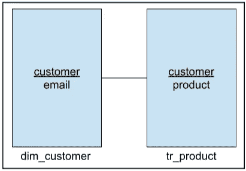

Image by author: Tables with their fields

假设您必须分析数据来回答以下业务问题。

a)有多少顾客已经购买，多少顾客从未购买？

b)购买最多的商品？

## 通过 Python 的 SQL 示例

在本节中，我们将看到如何在 Python 环境的上下文中使用 SQL 提取信息。 [**SQLAlchemy**](https://www.sqlalchemy.org/) 是 **Python SQL 工具包**，为应用程序开发人员提供了使用 Python 语言的 SQL 的全部能力和灵活性。让我们看一个例子，看看如何从 python 环境中创建的虚拟数据创建 SQL 表。下面的代码片段演示了上面提到的场景。

我们首先导入' pandas '和' random' python 库来帮助处理假数据和创建数据帧，然后导入**' Py _ Sql _ Alchemy _ Class**' python 模块，这样我们就可以使用' **DB_Table_Ops** '类。if 块中的操作只需要做一次，所以我们有一个可以改变的设置布尔值。我们还将“ **DB_Table_Ops** ”类实例化为“ **dbto** ”。数据字典' **d** '由放入熊猫数据帧中的方便的假数据组成。然后，我们创建一个表模式，并确保从我们的 SQL 数据库中删除了任何旧版本的' **table_one** '，即，我们确保该表已被删除，我们创建它，重新检查以确保它已被创建&它存在，然后最终将数据帧推入表中。

现在，让我们针对以下场景做一个简单的测试查询

1.  从' **table_one** '中选择**数据**，即我们需要的输出如下所示。

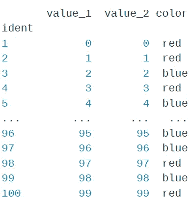

Query result output: Image by Author

2.从**查询**中选择**数据**到“ **table_one** ”，即我们需要的输出如下所示。

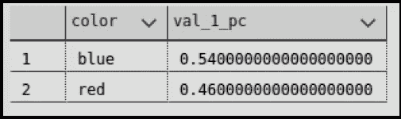

Query result output: Image by Author

## 使用 SQL 进行数据分析—示例

这里，让我们考虑如下场景。给你一个提供考试信息的数据。还提供了参加考试的考生的**性别** **。还向我们提供了**候选人**是否正确回答了与“**足球**相关的问题。此外，还提供了候选人获得的**最终总分**。假设，我们有以下带有表的模式:'**投诉【T33'****

*   **投诉** ( *性别* ( **男/女**)，*足球 _ 分数 _ 问题* ( **1 —正确/0 —不正确**)，*总分 _ 考试 _ 分数*)

“投诉”表的示例片段如下

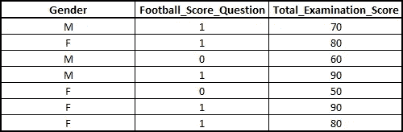

Image by Author: Sample data

写一个 **SQL 查询**进行检查，如果**足球题**有任何**性别偏见*性别偏见*性别偏见**。

我把这个分析留给读者去思考和解读。

## 结论

用于数据科学的 SQL**是使用数据库时最广泛使用的**语言。它用于**与数据库**通信。我们使用 SQL 语句创建数据集，从数据中获得关键见解，从提取/处理的数据中创建报告&仪表板等。**通过这篇博文，我们复习了 SQL 的基础知识，完成了 SQL 技术练习，学习了不同真实行业用例的实践示例，通过 Python 看到了一个 SQL 示例，并通过数据分析从原始数据中获得了深刻见解。**最后，期待大家对评论区的开放式问题的回答。****

**如果你喜欢这篇博文，请用掌声鼓励我发表更多内容👏**

**不断学习...干杯:)本教程的所有代码都可以在[这里](https://github.com/ajayarunachalam/SQL_TUTORIAL)找到。**

# **让我们连接起来**

**你可以在 ajay.arunachalam08@gmail.com 找到我；通过 [Linkedin](https://www.linkedin.com/in/ajay-arunachalam-4744581a/) 联系；从我的 [Github 回购](https://github.com/ajayarunachalam)中查看我的其他作品**

****关于作者****

**我是持有 **Scrum Master 认证**的*数据科学经理*。还有， **AWS 认证的机器学习专家& AWS 认证的云解决方案架构师**。我在**电信**、**零售**、**银行**和**医疗**部门工作过。根据我处理现实世界商业问题的经验，我完全承认，找到良好的表示是设计系统的关键，该系统可以解决有趣的挑战性现实世界问题，超越人类水平的智能，并最终为我们解释我们不理解的复杂数据。为了实现这一点，我总是设想学习算法可以从未标记和标记的数据中学习特征表示，在有和/或没有人类交互的情况下被引导，并且在不同的抽象级别上，以便弥合低级数据和高级抽象概念之间的差距。我也确实相信人工智能系统的不透明性是当前的需要。考虑到这一点，我一直努力使人工智能民主化，并且更倾向于建立可解释的模型。我的兴趣是建立实时人工智能驱动的解决方案，大规模的机器学习/深度学习，生产可解释的模型，深度强化学习，计算机视觉和自然语言处理，特别是学习良好的表示。**

****参考文献****

** [## 史蒂夫·斯特德曼

### 自由职业 SQL Server 顾问

stevestedman.com](https://stevestedman.com/) 

[https://searchdatamanagement.techtarget.com/definition/SQ](https://searchdatamanagement.techtarget.com/definition/SQL)

 [## SQL -维基百科

### SQL ( S-Q-L，“续集”)；结构化查询语言)是一种特定于领域的语言，用于编程和设计…

en.wikipedia.org](https://en.wikipedia.org/wiki/SQL)  [## 爱立信-帮助塑造一个交流的世界

### Viaero Wireless 是一家地区性电信公司，为美国中西部和西部的部分地区提供服务，以获得更多…

www.ericsson.com](https://www.ericsson.com/en)  [## HDFS 建筑指南

### Hadoop 分布式文件系统(HDFS)是一个分布式文件系统，旨在运行在商用硬件上。它有…

hadoop.apache.org](https://hadoop.apache.org/docs/r1.2.1/hdfs_design.html)  [## Apache Hadoop -维基百科

### Apache Hadoop()是一个开源软件实用程序的集合，它有助于使用由许多计算机组成的网络…

en.wikipedia.org](https://en.wikipedia.org/wiki/Apache_Hadoop)  [## 数据-科学-面试 alexeygrigorev 硕士的技术博士/数据-科学-面试

### 这里的答案都是社区给的。在使用答案之前，要小心并仔细检查。

github.com](https://github.com/alexeygrigorev/data-science-interviews/blob/master/technical.md#sql)  [## 数据-科学-面试 alexeygrigorev 硕士的技术博士/数据-科学-面试

### ⚠️:这里的答案是由社区给出的。在使用答案之前，要小心并仔细检查。

github.com](https://github.com/alexeygrigorev/data-science-interviews/blob/master/technical.md#sql)  [## 面向数据科学家的 Python 中的 SQL 介绍

### 在 Python 环境中使用 SQL 的数据科学家指南。

towardsdatascience.com](https://towardsdatascience.com/sql-in-python-for-beginners-b9a4f9293ecf)  [## 使用 Python 的 SQL-GeeksforGeeks

### 在本文中，将讨论 SQLite3 与 Python 的集成。在这里，我们将讨论所有的 CRUD 操作…

www.geeksforgeeks.org](https://www.geeksforgeeks.org/sql-using-python/)  [## SQLAlchemy

### Python SQL 工具包和对象关系映射器 SQLAlchemy 是 Python SQL 工具包和对象关系映射器…

pypi.org](https://pypi.org/project/SQLAlchemy/)  [## Mlearning.ai 提交建议

### 如何成为 Mlearning.ai 上的作家

medium.com](/mlearning-ai/mlearning-ai-submission-suggestions-b51e2b130bfb)**